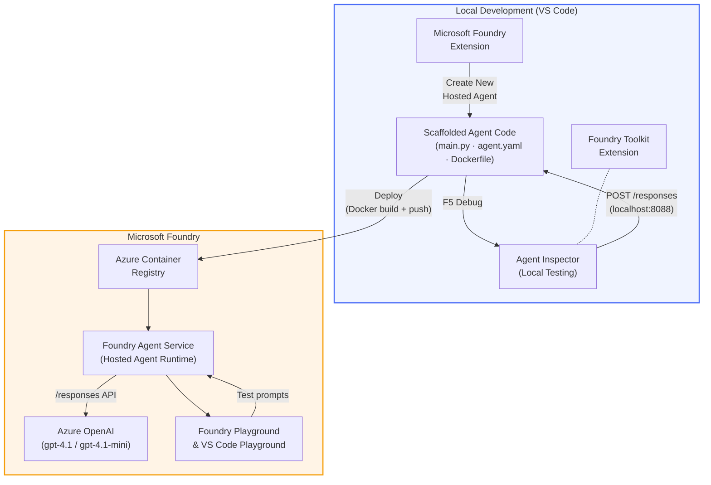

# Foundry Toolkit + Foundry Hosted Agents Workshop

[](https://www.python.org/)
[](https://github.com/microsoft/agents)
[](https://learn.microsoft.com/azure/ai-foundry/agents/concepts/hosted-agents/)
[](https://ai.azure.com/)
[](https://learn.microsoft.com/azure/ai-services/openai/)
[](https://learn.microsoft.com/cli/azure/install-azure-cli)
[](https://learn.microsoft.com/azure/developer/azure-developer-cli/install-azd)
[](https://www.docker.com/)
[](https://marketplace.visualstudio.com/items?itemName=ms-windows-ai-studio.windows-ai-studio)
[](LICENSE)

Build, test, and deploy AI agents to **Microsoft Foundry Agent Service** as **Hosted Agents** - entirely from VS Code using the **Microsoft Foundry extension** and **Foundry Toolkit**.

> **Hosted Agents are currently in preview.** Supported regions are limited - see [region availability](https://learn.microsoft.com/azure/foundry/agents/concepts/hosted-agents#region-availability).

> The `agent/` folder inside each lab is **automatically scaffolded** by the Foundry extension - you then customize the code, test locally, and deploy.

---

## Architecture



**Flow:** Foundry extension scaffolds the agent → you customize code & instructions → test locally with Agent Inspector → deploy to Foundry (Docker image pushed to ACR) → verify in Playground.

---

## What you will build

| Lab | Description | Status |
|-----|-------------|--------|
| **Lab 01 - Single Agent** | Build the **"Explain Like I'm an Executive" Agent**, test it locally, and deploy to Foundry | ✅ Available |
| **Lab 02 - Multi-Agent Workflow** | Build the **"Resume → Job Fit Evaluator"** - 4 agents collaborate to score resume fit and generate a learning roadmap | ✅ Available |

---

## Meet the Executive Agent

In this workshop you will build the **"Explain Like I'm an Executive" Agent** - an AI agent that takes gnarly technical jargon and translates it into calm, boardroom-ready summaries. Because let's be honest, nobody in the C-suite wants to hear about "thread pool exhaustion caused by synchronous calls introduced in v3.2."

I built this agent after one too many incidents where my perfectly crafted post-mortem got the response: *"So... is the website down or not?"*

### How it works

You feed it a technical update. It spits back an executive summary - three bullet points, no jargon, no stack traces, no existential dread. Just **what happened**, **business impact**, and **next step**.

### See it in action

**You say:**
> "The API latency increased due to thread pool exhaustion caused by synchronous calls introduced in v3.2."

**The agent replies:**

> **Executive Summary:**
> - **What happened:** After the latest release, the system slowed down.
> - **Business impact:** Some users experienced delays while using the service.
> - **Next step:** The change has been rolled back and a fix is being prepared before redeployment.

### Why this agent?

It is a dead-simple, single-purpose agent - perfect for learning the hosted agent workflow end to end without getting bogged down in complex tool chains. And honestly? Every engineering team could use one of these.

---

## Workshop structure

```
📂 Foundry_Toolkit_for_VSCode_Lab/
├── 📄 README.md                      ← You are here
├── 📂 ExecutiveAgent/                ← Standalone hosted agent project
│   ├── agent.yaml
│   ├── Dockerfile
│   ├── main.py
│   └── requirements.txt
└── 📂 workshop/
    ├── 📂 lab01-single-agent/        ← Full lab: docs + agent code
    │   ├── README.md                 ← Hands-on lab instructions
    │   ├── 📂 docs/                  ← Step-by-step tutorial modules
    │   │   ├── 00-prerequisites.md
    │   │   ├── 01-install-foundry-toolkit.md
    │   │   ├── 02-create-foundry-project.md
    │   │   ├── 03-create-hosted-agent.md
    │   │   ├── 04-configure-and-code.md
    │   │   ├── 05-test-locally.md
    │   │   ├── 06-deploy-to-foundry.md
    │   │   ├── 07-verify-in-playground.md
    │   │   └── 08-troubleshooting.md
    │   └── 📂 agent/                 ← Reference solution (auto-scaffolded by Foundry extension)
    │       ├── agent.yaml
    │       ├── Dockerfile
    │       ├── main.py
    │       └── requirements.txt
    └── 📂 lab02-multi-agent/         ← Resume → Job Fit Evaluator
        ├── README.md                 ← Hands-on lab instructions (end-to-end)
        ├── 📂 docs/                  ← Step-by-step tutorial modules
        │   ├── 00-prerequisites.md
        │   ├── 01-understand-multi-agent.md
        │   ├── 02-scaffold-multi-agent.md
        │   ├── 03-configure-agents.md
        │   ├── 04-orchestration-patterns.md
        │   ├── 05-test-locally.md
        │   ├── 06-deploy-to-foundry.md
        │   ├── 07-verify-in-playground.md
        │   └── 08-troubleshooting.md
        └── 📂 PersonalCareerCopilot/ ← Reference solution (multi-agent workflow)
            ├── agent.yaml
            ├── Dockerfile
            ├── main.py
            └── requirements.txt
```

> **Note:** The `agent/` folder inside each lab is what the **Microsoft Foundry extension** generates when you run `Microsoft Foundry: Create a New Hosted Agent` from the Command Palette. The files are then customized with your agent's instructions, tools, and configuration. Lab 01 walks you through recreating this from scratch.

---

## Getting started

### 1. Clone the repository

```bash
git clone https://github.com/microsoft-foundry/Foundry_Toolkit_for_VSCode_Lab.git
cd Foundry_Toolkit_for_VSCode_Lab
```

### 2. Set up a Python virtual environment

```bash
python -m venv venv
```

Activate it:

- **Windows (PowerShell):**
  ```powershell
  .\venv\Scripts\Activate.ps1
  ```
- **macOS / Linux:**
  ```bash
  source venv/bin/activate
  ```

### 3. Install dependencies

```bash
pip install -r workshop/lab01-single-agent/agent/requirements.txt
```

### 4. Configure environment variables

Copy the example `.env` file inside the agent folder and fill in your values:

```bash
cp workshop/lab01-single-agent/agent/.env.example workshop/lab01-single-agent/agent/.env
```

Edit `workshop/lab01-single-agent/agent/.env`:

```env
AZURE_AI_PROJECT_ENDPOINT=https://<your-account>.services.ai.azure.com/api/projects/<your-project>
MODEL_DEPLOYMENT_NAME=<your-model-deployment-name>
```

### 5. Follow the workshop labs

Each lab is self-contained with its own modules. Start with **Lab 01** to learn the fundamentals, then move on to **Lab 02** for multi-agent workflows.

#### Lab 01 - Single Agent ([full instructions](workshop/lab01-single-agent/README.md))

| # | Module | Link |
|---|--------|------|
| 1 | Read the prerequisites | [00-prerequisites.md](workshop/lab01-single-agent/docs/00-prerequisites.md) |
| 2 | Install Foundry Toolkit & Foundry extension | [01-install-foundry-toolkit.md](workshop/lab01-single-agent/docs/01-install-foundry-toolkit.md) |
| 3 | Create a Foundry project | [02-create-foundry-project.md](workshop/lab01-single-agent/docs/02-create-foundry-project.md) |
| 4 | Create a hosted agent | [03-create-hosted-agent.md](workshop/lab01-single-agent/docs/03-create-hosted-agent.md) |
| 5 | Configure instructions & environment | [04-configure-and-code.md](workshop/lab01-single-agent/docs/04-configure-and-code.md) |
| 6 | Test locally | [05-test-locally.md](workshop/lab01-single-agent/docs/05-test-locally.md) |
| 7 | Deploy to Foundry | [06-deploy-to-foundry.md](workshop/lab01-single-agent/docs/06-deploy-to-foundry.md) |
| 8 | Verify in playground | [07-verify-in-playground.md](workshop/lab01-single-agent/docs/07-verify-in-playground.md) |
| 9 | Troubleshooting | [08-troubleshooting.md](workshop/lab01-single-agent/docs/08-troubleshooting.md) |

#### Lab 02 - Multi-Agent Workflow ([full instructions](workshop/lab02-multi-agent/README.md))

| # | Module | Link |
|---|--------|------|
| 1 | Prerequisites (Lab 02) | [00-prerequisites.md](workshop/lab02-multi-agent/docs/00-prerequisites.md) |
| 2 | Understand multi-agent architecture | [01-understand-multi-agent.md](workshop/lab02-multi-agent/docs/01-understand-multi-agent.md) |
| 3 | Scaffold the multi-agent project | [02-scaffold-multi-agent.md](workshop/lab02-multi-agent/docs/02-scaffold-multi-agent.md) |
| 4 | Configure agents & environment | [03-configure-agents.md](workshop/lab02-multi-agent/docs/03-configure-agents.md) |
| 5 | Orchestration patterns | [04-orchestration-patterns.md](workshop/lab02-multi-agent/docs/04-orchestration-patterns.md) |
| 6 | Test locally (multi-agent) | [05-test-locally.md](workshop/lab02-multi-agent/docs/05-test-locally.md) |
| 7 | Deploy to Foundry | [06-deploy-to-foundry.md](workshop/lab02-multi-agent/docs/06-deploy-to-foundry.md) |
| 8 | Verify in playground | [07-verify-in-playground.md](workshop/lab02-multi-agent/docs/07-verify-in-playground.md) |
| 9 | Troubleshooting (multi-agent) | [08-troubleshooting.md](workshop/lab02-multi-agent/docs/08-troubleshooting.md) |

---

## Maintainer

<table>
<tr>
    <td align="center"><a href="https://github.com/ShivamGoyal03">
        <br />
        <sub><b>Shivam Goyal</b></sub>
    </a><br />
    </td>
</tr>
</table>

---

## Required permissions (quick reference)

| Scenario | Required roles |
|----------|---------------|
| Create new Foundry project | **Azure AI Owner** on Foundry resource |
| Deploy to existing project (new resources) | **Azure AI Owner** + **Contributor** on subscription |
| Deploy to fully configured project | **Reader** on account + **Azure AI User** on project |

> **Important:** Azure `Owner` and `Contributor` roles only include *management* permissions, not *development* (data action) permissions. You need **Azure AI User** or **Azure AI Owner** to build and deploy agents.

---

## References

- [Quickstart: Deploy your first hosted agent (VS Code)](https://learn.microsoft.com/azure/foundry/agents/quickstarts/quickstart-hosted-agent)
- [What are hosted agents?](https://learn.microsoft.com/azure/foundry/agents/concepts/hosted-agents)
- [Create hosted agent workflows in VS Code](https://learn.microsoft.com/azure/foundry/agents/how-to/vs-code-agents-workflow-pro-code)
- [Deploy a hosted agent](https://learn.microsoft.com/azure/foundry/agents/how-to/deploy-hosted-agent)
- [RBAC for Microsoft Foundry](https://learn.microsoft.com/azure/foundry/concepts/rbac-foundry)
- [Architecture Review Agent Sample](https://github.com/Azure-Samples/agent-architecture-review-sample) - Real-world hosted agent with MCP tools, Excalidraw diagrams, and dual deployment

---


## License

[MIT](LICENSE)

