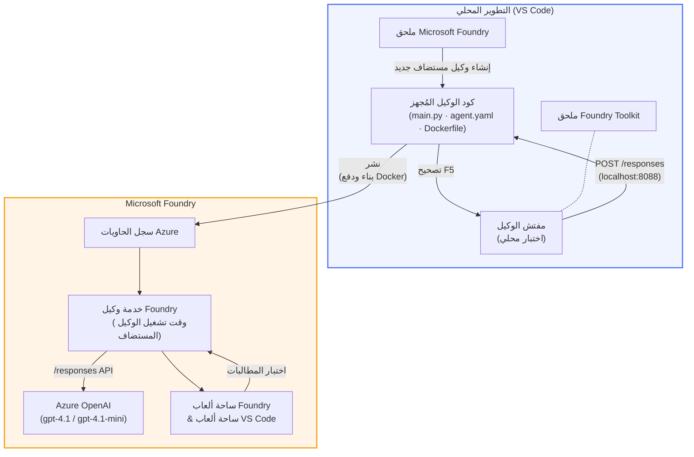

# ورشة عمل Foundry Toolkit + وكلاء Foundry المستضافين

[](https://www.python.org/)
[](https://github.com/microsoft/agents)
[](https://learn.microsoft.com/azure/ai-foundry/agents/concepts/hosted-agents/)
[](https://ai.azure.com/)
[](https://learn.microsoft.com/azure/ai-services/openai/)
[](https://learn.microsoft.com/cli/azure/install-azure-cli)
[](https://learn.microsoft.com/azure/developer/azure-developer-cli/install-azd)
[](https://www.docker.com/)
[](https://marketplace.visualstudio.com/items?itemName=ms-windows-ai-studio.windows-ai-studio)
[](LICENSE)

قم ببناء واختبار ونشر وكلاء الذكاء الاصطناعي إلى **خدمة وكلاء Microsoft Foundry** بصفتهم **وكلاء مستضافين** - كليًا من VS Code باستخدام **امتداد Microsoft Foundry** و **Foundry Toolkit**.

> **الوكلاء المستضافون في مرحلة المعاينة حاليًا.** المناطق المدعومة محدودة - راجع [توفر المناطق](https://learn.microsoft.com/azure/foundry/agents/concepts/hosted-agents#region-availability).

> يتم **إنشاء مجلد `agent/` تلقائيًا** بواسطة امتداد Foundry داخل كل مختبر - بعد ذلك تقوم بتخصيص الكود، واختباره محليًا، ونشره.

<!-- CO-OP TRANSLATOR LANGUAGES TABLE START -->
[Arabic](./README.md) | [Bengali](../bn/README.md) | [Bulgarian](../bg/README.md) | [Burmese (Myanmar)](../my/README.md) | [Chinese (Simplified)](../zh-CN/README.md) | [Chinese (Traditional, Hong Kong)](../zh-HK/README.md) | [Chinese (Traditional, Macau)](../zh-MO/README.md) | [Chinese (Traditional, Taiwan)](../zh-TW/README.md) | [Croatian](../hr/README.md) | [Czech](../cs/README.md) | [Danish](../da/README.md) | [Dutch](../nl/README.md) | [Estonian](../et/README.md) | [Finnish](../fi/README.md) | [French](../fr/README.md) | [German](../de/README.md) | [Greek](../el/README.md) | [Hebrew](../he/README.md) | [Hindi](../hi/README.md) | [Hungarian](../hu/README.md) | [Indonesian](../id/README.md) | [Italian](../it/README.md) | [Japanese](../ja/README.md) | [Kannada](../kn/README.md) | [Khmer](../km/README.md) | [Korean](../ko/README.md) | [Lithuanian](../lt/README.md) | [Malay](../ms/README.md) | [Malayalam](../ml/README.md) | [Marathi](../mr/README.md) | [Nepali](../ne/README.md) | [Nigerian Pidgin](../pcm/README.md) | [Norwegian](../no/README.md) | [Persian (Farsi)](../fa/README.md) | [Polish](../pl/README.md) | [Portuguese (Brazil)](../pt-BR/README.md) | [Portuguese (Portugal)](../pt-PT/README.md) | [Punjabi (Gurmukhi)](../pa/README.md) | [Romanian](../ro/README.md) | [Russian](../ru/README.md) | [Serbian (Cyrillic)](../sr/README.md) | [Slovak](../sk/README.md) | [Slovenian](../sl/README.md) | [Spanish](../es/README.md) | [Swahili](../sw/README.md) | [Swedish](../sv/README.md) | [Tagalog (Filipino)](../tl/README.md) | [Tamil](../ta/README.md) | [Telugu](../te/README.md) | [Thai](../th/README.md) | [Turkish](../tr/README.md) | [Ukrainian](../uk/README.md) | [Urdu](../ur/README.md) | [Vietnamese](../vi/README.md)

> **هل تفضل الاستنساخ محليًا؟**
>
> يحتوي هذا المستودع على أكثر من 50 ترجمة للغات مما يزيد من حجم التنزيل بشكل كبير. للاستنساخ بدون الترجمات، استخدم العلم الجزئي:
>
> **Bash / macOS / Linux:**
> ```bash
> git clone --filter=blob:none --sparse https://github.com/microsoft-foundry/Foundry_Toolkit_for_VSCode_Lab.git
> cd Foundry_Toolkit_for_VSCode_Lab
> git sparse-checkout set --no-cone '/*' '!translations' '!translated_images'
> ```
>
> **CMD (Windows):**
> ```cmd
> git clone --filter=blob:none --sparse https://github.com/microsoft-foundry/Foundry_Toolkit_for_VSCode_Lab.git
> cd Foundry_Toolkit_for_VSCode_Lab
> git sparse-checkout set --no-cone "/*" "!translations" "!translated_images"
> ```
>
> هذا يمنحك كل ما تحتاجه لإكمال الدورة بتنزيل أسرع بكثير.
<!-- CO-OP TRANSLATOR LANGUAGES TABLE END -->

---

## البنية


**التدفق:** يقوم امتداد Foundry بإنشاء هيكل الوكيل → تقوم بتخصيص الكود والتعليمات → تختبر محليًا باستخدام Agent Inspector → تنشر إلى Foundry (يتم دفع صورة Docker إلى ACR) → تحقق في Playground.

---

## ما ستبنيه

| المختبر | الوصف | الحالة |
|-----|-------------|--------|
| **المختبر 01 - وكيل واحد** | بناء **وكيل "شرح كأنني مسؤول تنفيذي"**، اختباره محليًا، ونشره إلى Foundry | ✅ متاح |
| **المختبر 02 - سير عمل متعدد الوكلاء** | بناء **"المُقيم للسيرة الذاتية وملاءمة الوظائف"** - يتعاون 4 وكلاء لتقييم ملاءمة السيرة الذاتية وإنتاج خارطة طريق تعليمية | ✅ متاح |

---

## تعرف على الوكيل التنفيذي

في هذه الورشة ستبني **وكيل "شرح كأنني مسؤول تنفيذي"** - وكيل ذكاء اصطناعي يأخذ المصطلحات التقنية المعقدة ويترجمها إلى ملخصات هادئة جاهزة لاجتماعات مجلس الإدارة. لأن لنكن صادقين، لا أحد في الإدارة العليا يريد سماع "نفاد مجمع الخيوط بسبب المكالمات التزامنية التي تم إدخالها في الإصدار 3.2."

بنيت هذا الوكيل بعد العديد من الحوادث التي تلقيت فيها تقرير ما بعد الحدث المثالي ورد الفعل التالي: *"هل... الموقع معطل أم لا؟"*

### كيف يعمل

تزوده بتحديث تقني. يعيد لك ملخصًا تنفيذيًا - ثلاث نقاط رئيسية، بدون مصطلحات معقدة، بدون تتبع الأخطاء، بدون قلق وجودي. فقط **ما حدث**، **تأثير الأعمال**، و **الخطوة التالية**.

### شاهده يعمل

**أنت تقول:**
> "ارتفعت زمن الاستجابة في واجهة برمجة التطبيقات بسبب نفاد مجمع الخيوط الناتج عن المكالمات التزامنية التي أدخلت في الإصدار 3.2."

**يرد الوكيل:**

> **الملخص التنفيذي:**
> - **ما حدث:** بعد الإصدار الأخير، تباطأ النظام.
> - **تأثير الأعمال:** عانى بعض المستخدمين من تأخيرات أثناء استخدام الخدمة.
> - **الخطوة التالية:** تم التراجع عن التغيير ويتم تجهيز إصلاح قبل إعادة النشر.

### لماذا هذا الوكيل؟

إنه وكيل بسيط للغاية، ذو غرض واحد - مثالي لتعلم سير عمل الوكيل المستضاف من البداية للنهاية دون التعقيد في سلاسل الأدوات المعقدة. وبصراحة؟ يمكن لكل فريق هندسي الاستفادة من واحد مثل هذا.

---

## هيكل الورشة

```
📂 Foundry_Toolkit_for_VSCode_Lab/
├── 📄 README.md                      ← You are here
├── 📂 ExecutiveAgent/                ← Standalone hosted agent project
│   ├── agent.yaml
│   ├── Dockerfile
│   ├── main.py
│   └── requirements.txt
└── 📂 workshop/
    ├── 📂 lab01-single-agent/        ← Full lab: docs + agent code
    │   ├── README.md                 ← Hands-on lab instructions
    │   ├── 📂 docs/                  ← Step-by-step tutorial modules
    │   │   ├── 00-prerequisites.md
    │   │   ├── 01-install-foundry-toolkit.md
    │   │   ├── 02-create-foundry-project.md
    │   │   ├── 03-create-hosted-agent.md
    │   │   ├── 04-configure-and-code.md
    │   │   ├── 05-test-locally.md
    │   │   ├── 06-deploy-to-foundry.md
    │   │   ├── 07-verify-in-playground.md
    │   │   └── 08-troubleshooting.md
    │   └── 📂 agent/                 ← Reference solution (auto-scaffolded by Foundry extension)
    │       ├── agent.yaml
    │       ├── Dockerfile
    │       ├── main.py
    │       └── requirements.txt
    └── 📂 lab02-multi-agent/         ← Resume → Job Fit Evaluator
        ├── README.md                 ← Hands-on lab instructions (end-to-end)
        ├── 📂 docs/                  ← Step-by-step tutorial modules
        │   ├── 00-prerequisites.md
        │   ├── 01-understand-multi-agent.md
        │   ├── 02-scaffold-multi-agent.md
        │   ├── 03-configure-agents.md
        │   ├── 04-orchestration-patterns.md
        │   ├── 05-test-locally.md
        │   ├── 06-deploy-to-foundry.md
        │   ├── 07-verify-in-playground.md
        │   └── 08-troubleshooting.md
        └── 📂 PersonalCareerCopilot/ ← Reference solution (multi-agent workflow)
            ├── agent.yaml
            ├── Dockerfile
            ├── main.py
            └── requirements.txt
```

> **ملاحظة:** مجلد `agent/` داخل كل مختبر هو ما يولده **امتداد Microsoft Foundry** عند تشغيل الأمر `Microsoft Foundry: Create a New Hosted Agent` من لوحة الأوامر. ثم يتم تخصيص الملفات مع تعليمات وكيلك، وأدواته، وإعداده. يوجهك المختبر 01 إلى إعادة إنشاء هذا من الصفر.

---

## البدء

### 1. استنساخ المستودع

```bash
git clone https://github.com/microsoft-foundry/Foundry_Toolkit_for_VSCode_Lab.git
cd Foundry_Toolkit_for_VSCode_Lab
```

### 2. إعداد بيئة افتراضية للبايثون

```bash
python -m venv venv
```

قم بتفعيلها:

- **ويندوز (PowerShell):**
  ```powershell
  .\venv\Scripts\Activate.ps1
  ```
- **macOS / لينكس:**
  ```bash
  source venv/bin/activate
  ```

### 3. تثبيت الاعتمادات

```bash
pip install -r workshop/lab01-single-agent/agent/requirements.txt
```

### 4. تكوين متغيرات البيئة

انسخ ملف `.env` النموذجي داخل مجلد الوكيل واملأ القيم الخاصة بك:

```bash
cp workshop/lab01-single-agent/agent/.env.example workshop/lab01-single-agent/agent/.env
```

حرر `workshop/lab01-single-agent/agent/.env`:

```env
AZURE_AI_PROJECT_ENDPOINT=https://<your-account>.services.ai.azure.com/api/projects/<your-project>
MODEL_DEPLOYMENT_NAME=<your-model-deployment-name>
```

### 5. اتبع مختبرات الورشة

كل مختبر مستقل مع مواده الخاصة. ابدأ بالمختبر 01 لتعلم الأساسيات، ثم انتقل إلى المختبر 02 لسير عمل متعدد الوكلاء.

#### المختبر 01 - وكيل واحد ([التعليمات كاملة](workshop/lab01-single-agent/README.md))

| # | الوحدة | الرابط |
|---|--------|------|
| 1 | اقرأ المتطلبات الأساسية | [00-prerequisites.md](workshop/lab01-single-agent/docs/00-prerequisites.md) |
| 2 | تثبيت Foundry Toolkit وامتداد Foundry | [01-install-foundry-toolkit.md](workshop/lab01-single-agent/docs/01-install-foundry-toolkit.md) |
| 3 | إنشاء مشروع Foundry | [02-create-foundry-project.md](workshop/lab01-single-agent/docs/02-create-foundry-project.md) |
| 4 | إنشاء وكيل مستضاف | [03-create-hosted-agent.md](workshop/lab01-single-agent/docs/03-create-hosted-agent.md) |
| 5 | تكوين التعليمات والبيئة | [04-configure-and-code.md](workshop/lab01-single-agent/docs/04-configure-and-code.md) |
| 6 | اختبار محلي | [05-test-locally.md](workshop/lab01-single-agent/docs/05-test-locally.md) |
| 7 | النشر إلى Foundry | [06-deploy-to-foundry.md](workshop/lab01-single-agent/docs/06-deploy-to-foundry.md) |
| 8 | التحقق في الملعب | [07-verify-in-playground.md](workshop/lab01-single-agent/docs/07-verify-in-playground.md) |
| 9 | استكشاف الأخطاء وإصلاحها | [08-troubleshooting.md](workshop/lab01-single-agent/docs/08-troubleshooting.md) |

#### المختبر 02 - سير عمل متعدد الوكلاء ([التعليمات كاملة](workshop/lab02-multi-agent/README.md))

| # | الوحدة | الرابط |
|---|--------|------|
| 1 | المتطلبات الأساسية (مختبر 02) | [00-prerequisites.md](workshop/lab02-multi-agent/docs/00-prerequisites.md) |
| 2 | فهم بنية تعدد الوكلاء | [01-understand-multi-agent.md](workshop/lab02-multi-agent/docs/01-understand-multi-agent.md) |
| 3 | إنشاء هيكل مشروع متعدد الوكلاء | [02-scaffold-multi-agent.md](workshop/lab02-multi-agent/docs/02-scaffold-multi-agent.md) |
| 4 | تكوين الوكلاء والبيئة | [03-configure-agents.md](workshop/lab02-multi-agent/docs/03-configure-agents.md) |
| 5 | أنماط التنسيق | [04-orchestration-patterns.md](workshop/lab02-multi-agent/docs/04-orchestration-patterns.md) |
| 6 | اختبار محلي (متعدد الوكلاء) | [05-test-locally.md](workshop/lab02-multi-agent/docs/05-test-locally.md) |
| 7 | النشر إلى Foundry | [06-deploy-to-foundry.md](workshop/lab02-multi-agent/docs/06-deploy-to-foundry.md) |
| 8 | التحقق في الملعب | [07-verify-in-playground.md](workshop/lab02-multi-agent/docs/07-verify-in-playground.md) |
| 9 | استكشاف الأخطاء وإصلاحها (متعدد الوكلاء) | [08-troubleshooting.md](workshop/lab02-multi-agent/docs/08-troubleshooting.md) |

---

## المسؤول عن الصيانة

<table>
<tr>
    <td align="center"><a href="https://github.com/ShivamGoyal03">
        <br />
        <sub><b>شيفام جويال</b></sub>
    </a><br />
    </td>
</tr>
</table>

---

## الأذونات المطلوبة (مرجع سريع)

| السيناريو | الأدوار المطلوبة |
|----------|---------------|
| إنشاء مشروع Foundry جديد | **مالك Azure AI** على مورد Foundry |
| النشر إلى مشروع موجود (موارد جديدة) | **مالك Azure AI** + **مساهم** على الاشتراك |
| النشر إلى مشروع مهيأ بالكامل | **قارئ** على الحساب + **مستخدم Azure AI** على المشروع |

> **مهم:** أدوار Azure `مالك` و`مساهم` تشمل فقط أذونات *الإدارة*، وليست أذونات *التطوير* (إجراءات البيانات). تحتاج إلى **مستخدم Azure AI** أو **مالك Azure AI** لبناء ونشر الوكلاء.

---

## المراجع

- [البدء السريع: نشر وكيل مستضافك الأول (VS Code)](https://learn.microsoft.com/azure/foundry/agents/quickstarts/quickstart-hosted-agent)
- [ما هي الوكلاء المستضافة؟](https://learn.microsoft.com/azure/foundry/agents/concepts/hosted-agents)
- [إنشاء سير عمل للوكلاء المستضافين في VS Code](https://learn.microsoft.com/azure/foundry/agents/how-to/vs-code-agents-workflow-pro-code)
- [نشر وكيل مستضاف](https://learn.microsoft.com/azure/foundry/agents/how-to/deploy-hosted-agent)
- [التحكم في الوصول بناءً على الدور لـ Microsoft Foundry](https://learn.microsoft.com/azure/foundry/concepts/rbac-foundry)
- [عينة وكيل مراجعة المعمارية](https://github.com/Azure-Samples/agent-architecture-review-sample) - وكيل مستضاف من العالم الحقيقي مع أدوات MCP، ورسوم توضيحية Excalidraw، ونشر مزدوج

---

## الترخيص

[MIT](../../LICENSE)

---

<!-- CO-OP TRANSLATOR DISCLAIMER START -->
**إخلاء المسؤولية**:
تمت ترجمة هذا الوثيقة باستخدام خدمة الترجمة الآلية [Co-op Translator](https://github.com/Azure/co-op-translator). بينما نسعى لتحقيق الدقة، يرجى العلم أن الترجمات الآلية قد تحتوي على أخطاء أو عدم دقة. يجب اعتبار الوثيقة الأصلية بلغتها الأصلية المصدر الرسمي والمعتمد. للمعلومات الحرجة، يُنصح بالترجمة الاحترافية البشرية. لسنا مسؤولين عن أي سوء فهم أو تفسيرات خاطئة ناتجة عن استخدام هذه الترجمة.
<!-- CO-OP TRANSLATOR DISCLAIMER END -->