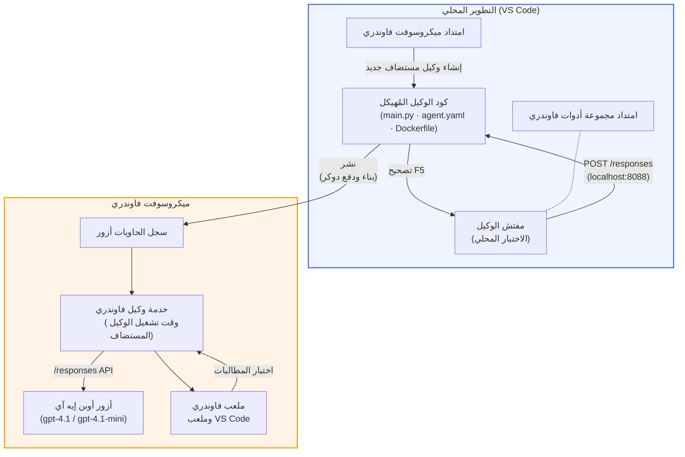

# ورشة عمل Foundry Toolkit + وكلاء Foundry المستضافين

[](https://www.python.org/)
[](https://github.com/microsoft/agents)
[](https://learn.microsoft.com/azure/ai-foundry/agents/concepts/hosted-agents/)
[](https://ai.azure.com/)
[](https://learn.microsoft.com/azure/ai-services/openai/)
[](https://learn.microsoft.com/cli/azure/install-azure-cli)
[](https://learn.microsoft.com/azure/developer/azure-developer-cli/install-azd)
[](https://www.docker.com/)
[](https://marketplace.visualstudio.com/items?itemName=ms-windows-ai-studio.windows-ai-studio)
[](LICENSE)

قم ببناء، اختبار، ونشر وكلاء الذكاء الاصطناعي إلى **خدمة وكلاء Microsoft Foundry** كـ **وكلاء مستضافين** - كل ذلك من خلال VS Code باستخدام **امتداد Microsoft Foundry** و**Foundry Toolkit**.

> **الوكلاء المستضافين حالياً في المرحلة التجريبية.** المناطق المدعومة محدودة - انظر [توفر المنطقة](https://learn.microsoft.com/azure/foundry/agents/concepts/hosted-agents#region-availability).

> مجلد `agent/` داخل كل مختبر يتم **إنشاؤه تلقائياً** بواسطة امتداد Foundry - ثم تقوم بتخصيص الكود، اختبار محليًا، ونشره.

### 🌐 دعم متعدد اللغات

#### مدعوم عبر GitHub Action (آلي ودائم التحديث)

<!-- CO-OP TRANSLATOR LANGUAGES TABLE START -->
[العربية](./README.md) | [البنغالية](../bn/README.md) | [البلغارية](../bg/README.md) | [البورمية (ميانمار)](../my/README.md) | [الصينية (المبسطة)](../zh-CN/README.md) | [الصينية (التقليدية، هونغ كونغ)](../zh-HK/README.md) | [الصينية (التقليدية، ماكاو)](../zh-MO/README.md) | [الصينية (التقليدية، تايوان)](../zh-TW/README.md) | [الكرواتية](../hr/README.md) | [التشيكية](../cs/README.md) | [الدنماركية](../da/README.md) | [الهولندية](../nl/README.md) | [الإستونية](../et/README.md) | [الفنلندية](../fi/README.md) | [الفرنسية](../fr/README.md) | [الألمانية](../de/README.md) | [اليونانية](../el/README.md) | [العبرية](../he/README.md) | [الهندية](../hi/README.md) | [الهنغارية](../hu/README.md) | [الإندونيسية](../id/README.md) | [الإيطالية](../it/README.md) | [اليابانية](../ja/README.md) | [الكانادية](../kn/README.md) | [الخميرية](../km/README.md) | [الكورية](../ko/README.md) | [الليتوانية](../lt/README.md) | [الماليزية](../ms/README.md) | [المليالمية](../ml/README.md) | [الماراثية](../mr/README.md) | [النيبالية](../ne/README.md) | [البيجن النيجيرية](../pcm/README.md) | [النرويجية](../no/README.md) | [الفارسية (الفرسية)](../fa/README.md) | [البولندية](../pl/README.md) | [البرتغالية (البرازيل)](../pt-BR/README.md) | [البرتغالية (البرتغال)](../pt-PT/README.md) | [البنجابية (غيرموخي)](../pa/README.md) | [الرومانية](../ro/README.md) | [الروسية](../ru/README.md) | [الصربية (السيريلية)](../sr/README.md) | [السلوفاكية](../sk/README.md) | [السلوفينية](../sl/README.md) | [الإسبانية](../es/README.md) | [السواحيلية](../sw/README.md) | [السويدية](../sv/README.md) | [التاغالوغية (الفلبينية)](../tl/README.md) | [التاميلية](../ta/README.md) | [التيلجو](../te/README.md) | [التايلاندية](../th/README.md) | [التركية](../tr/README.md) | [الأوكرانية](../uk/README.md) | [الأردية](../ur/README.md) | [الفيتنامية](../vi/README.md)

> **تفضل الاستنساخ محليًا؟**
>
> يشمل هذا المستودع ترجمات بأكثر من 50 لغة مما يزيد بشكل كبير من حجم التنزيل. للاستنساخ بدون الترجمات، استخدم السحب الجزئي:
>
> **Bash / macOS / Linux:**
> ```bash
> git clone --filter=blob:none --sparse https://github.com/microsoft-foundry/Foundry_Toolkit_for_VSCode_Lab.git
> cd Foundry_Toolkit_for_VSCode_Lab
> git sparse-checkout set --no-cone '/*' '!translations' '!translated_images'
> ```
>
> **CMD (ويندوز):**
> ```cmd
> git clone --filter=blob:none --sparse https://github.com/microsoft-foundry/Foundry_Toolkit_for_VSCode_Lab.git
> cd Foundry_Toolkit_for_VSCode_Lab
> git sparse-checkout set --no-cone "/*" "!translations" "!translated_images"
> ```
>
> هذا يمنحك كل ما تحتاجه لإكمال الدورة مع تنزيل أسرع بكثير.
<!-- CO-OP TRANSLATOR LANGUAGES TABLE END -->

---

## الهندسة المعمارية


**التدفق:** امتداد Foundry ينشئ هيكل الوكيل → تقوم بتخصيص الكود والتعليمات → تختبر محليًا باستخدام Agent Inspector → تنشر إلى Foundry (يتم دفع صورة Docker إلى ACR) → تتحقق في Playground.

---

## ما الذي ستبنيه

| المختبر | الوصف | الحالة |
|-----|-------------|--------|
| **المختبر 01 - وكيل فردي** | بناء **وكيل "اشرحه كأنني مسؤول تنفيذي"**، اختبره محليًا، وانشره إلى Foundry | ✅ متاح |
| **المختبر 02 - سير العمل متعدد الوكلاء** | بناء **"المُقيّم لسيرة ذاتية → ملاءمة الوظيفة"** - 4 وكلاء يتعاونون لتقييم ملاءمة السيرة الذاتية وتوليد خارطة طريق تعليمية | ✅ متاح |

---

## تعرف على الوكيل التنفيذي

في هذه الورشة ستبني **وكيل "اشرحه كأنني مسؤول تنفيذي"** - وكيل ذكاء اصطناعي يحول المصطلحات التقنية المعقدة إلى ملخصات هادئة وجاهزة لمجلس الإدارة. لأنه بصراحة، لا أحد في المستوى التنفيذي يريد سماع "نفاد مجموعة الخيوط بسبب المكالمات المتزامنة التي أُدخلت في الإصدار 3.2."

بنيت هذا الوكيل بعد العديد من الحوادث التي تلقى فيها تقرير التحليل التفصيلي الرد: *"هل الموقع متوقف أم لا؟"*

### كيف يعمل

تعطيه تحديثًا تقنيًا. يعيد لك ملخصًا تنفيذيًا - ثلاث نقاط، بدون مصطلحات فنية معقدة، لا تتبع الأخطاء، أو قلق وجودي. فقط **ما حدث**، **تأثير العمل**، و**الخطوة التالية**.

### شاهد ذلك قيد العمل

**أنت تقول:**
> "زادت كمون واجهة برمجة التطبيقات بسبب نفاد مجموعة الخيوط الناتج عن المكالمات المتزامنة التي أُدخلت في الإصدار 3.2."

**يرد الوكيل:**

> **الملخص التنفيذي:**
> - **ما حدث:** بعد الإصدار الأخير، تباطأ النظام.
> - **تأثير العمل:** واجه بعض المستخدمين تأخيرات أثناء استخدام الخدمة.
> - **الخطوة التالية:** تم التراجع عن التغيير وجاري إعداد إصلاح قبل إعادة النشر.

### لماذا هذا الوكيل؟

هو وكيل بسيط للغاية، ذو غرض واحد - مثالي لتعلم سير عمل الوكيل المستضاف من البداية للنهاية دون الانشغال بسلاسل أدوات معقدة. وبصراحة؟ كل فريق هندسي يمكنه الاستفادة من واحد منهم.

---

## هيكل الورشة

```
📂 Foundry_Toolkit_for_VSCode_Lab/
├── 📄 README.md                      ← You are here
├── 📂 ExecutiveAgent/                ← Standalone hosted agent project
│   ├── agent.yaml
│   ├── Dockerfile
│   ├── main.py
│   └── requirements.txt
└── 📂 workshop/
    ├── 📂 lab01-single-agent/        ← Full lab: docs + agent code
    │   ├── README.md                 ← Hands-on lab instructions
    │   ├── 📂 docs/                  ← Step-by-step tutorial modules
    │   │   ├── 00-prerequisites.md
    │   │   ├── 01-install-foundry-toolkit.md
    │   │   ├── 02-create-foundry-project.md
    │   │   ├── 03-create-hosted-agent.md
    │   │   ├── 04-configure-and-code.md
    │   │   ├── 05-test-locally.md
    │   │   ├── 06-deploy-to-foundry.md
    │   │   ├── 07-verify-in-playground.md
    │   │   └── 08-troubleshooting.md
    │   └── 📂 agent/                 ← Reference solution (auto-scaffolded by Foundry extension)
    │       ├── agent.yaml
    │       ├── Dockerfile
    │       ├── main.py
    │       └── requirements.txt
    └── 📂 lab02-multi-agent/         ← Resume → Job Fit Evaluator
        ├── README.md                 ← Hands-on lab instructions (end-to-end)
        ├── 📂 docs/                  ← Step-by-step tutorial modules
        │   ├── 00-prerequisites.md
        │   ├── 01-understand-multi-agent.md
        │   ├── 02-scaffold-multi-agent.md
        │   ├── 03-configure-agents.md
        │   ├── 04-orchestration-patterns.md
        │   ├── 05-test-locally.md
        │   ├── 06-deploy-to-foundry.md
        │   ├── 07-verify-in-playground.md
        │   └── 08-troubleshooting.md
        └── 📂 PersonalCareerCopilot/ ← Reference solution (multi-agent workflow)
            ├── agent.yaml
            ├── Dockerfile
            ├── main.py
            └── requirements.txt
```

> **ملاحظة:** مجلد `agent/` داخل كل مختبر هو ما ينشئه **امتداد Microsoft Foundry** عند تشغيل `Microsoft Foundry: Create a New Hosted Agent` من لوحة الأوامر. تُخصّص الملفات بعد ذلك بتعليمات وكيلك، الأدوات، والتكوين. المختبر 01 يرشدك خلال إعادة إنشاء هذا من الصفر.

---

## كيف تبدأ

### 1. استنساخ المستودع

```bash
git clone https://github.com/microsoft-foundry/Foundry_Toolkit_for_VSCode_Lab.git
cd Foundry_Toolkit_for_VSCode_Lab
```

### 2. إعداد بيئة بايثون الافتراضية

```bash
python -m venv venv
```

فعّلها:

- **ويندوز (PowerShell):**
  ```powershell
  .\venv\Scripts\Activate.ps1
  ```
- **macOS / لينكس:**
  ```bash
  source venv/bin/activate
  ```

### 3. تثبيت التبعيات

```bash
pip install -r workshop/lab01-single-agent/agent/requirements.txt
```

### 4. تكوين متغيرات البيئة

انسخ ملف `.env` النموذجي داخل مجلد الوكيل واملأه بالقيم الخاصة بك:

```bash
cp workshop/lab01-single-agent/agent/.env.example workshop/lab01-single-agent/agent/.env
```

حرر `workshop/lab01-single-agent/agent/.env`:

```env
AZURE_AI_PROJECT_ENDPOINT=https://<your-account>.services.ai.azure.com/api/projects/<your-project>
MODEL_DEPLOYMENT_NAME=<your-model-deployment-name>
```

### 5. اتبع مختبرات الورشة

كل مختبر مستقل لوحده مع وحداته الخاصة. ابدأ بـ **المختبر 01** لتعلّم الأساسيات، ثم انتقل إلى **المختبر 02** لسير عمل متعدد الوكلاء.

#### المختبر 01 - وكيل فردي ([تعليمات كاملة](workshop/lab01-single-agent/README.md))

| # | الوحدة | الرابط |
|---|--------|------|
| 1 | قراءة المتطلبات الأساسية | [00-prerequisites.md](workshop/lab01-single-agent/docs/00-prerequisites.md) |
| 2 | تثبيت Foundry Toolkit وامتداد Foundry | [01-install-foundry-toolkit.md](workshop/lab01-single-agent/docs/01-install-foundry-toolkit.md) |
| 3 | إنشاء مشروع Foundry | [02-create-foundry-project.md](workshop/lab01-single-agent/docs/02-create-foundry-project.md) |
| 4 | إنشاء وكيل مستضاف | [03-create-hosted-agent.md](workshop/lab01-single-agent/docs/03-create-hosted-agent.md) |
| 5 | تكوين التعليمات والبيئة | [04-configure-and-code.md](workshop/lab01-single-agent/docs/04-configure-and-code.md) |
| 6 | اختبار محلي | [05-test-locally.md](workshop/lab01-single-agent/docs/05-test-locally.md) |
| 7 | النشر إلى Foundry | [06-deploy-to-foundry.md](workshop/lab01-single-agent/docs/06-deploy-to-foundry.md) |
| 8 | التحقق في الملعب | [07-verify-in-playground.md](workshop/lab01-single-agent/docs/07-verify-in-playground.md) |
| 9 | استكشاف الأخطاء وإصلاحها | [08-troubleshooting.md](workshop/lab01-single-agent/docs/08-troubleshooting.md) |

#### المختبر 02 - سير عمل متعدد الوكلاء ([تعليمات كاملة](workshop/lab02-multi-agent/README.md))

| # | الوحدة | الرابط |
|---|--------|------|
| 1 | المتطلبات الأساسية (المختبر 02) | [00-prerequisites.md](workshop/lab02-multi-agent/docs/00-prerequisites.md) |
| 2 | فهم هندسة الوكلاء المتعددين | [01-understand-multi-agent.md](workshop/lab02-multi-agent/docs/01-understand-multi-agent.md) |
| 3 | إنشاء هيكل المشروع متعدد الوكلاء | [02-scaffold-multi-agent.md](workshop/lab02-multi-agent/docs/02-scaffold-multi-agent.md) |
| 4 | تكوين الوكلاء والبيئة | [03-configure-agents.md](workshop/lab02-multi-agent/docs/03-configure-agents.md) |
| 5 | أنماط التنسيق | [04-orchestration-patterns.md](workshop/lab02-multi-agent/docs/04-orchestration-patterns.md) |
| 6 | الاختبار محليًا (متعدد الوكلاء) | [05-test-locally.md](workshop/lab02-multi-agent/docs/05-test-locally.md) |
| 7 | النشر إلى Foundry | [06-deploy-to-foundry.md](workshop/lab02-multi-agent/docs/06-deploy-to-foundry.md) |
| 8 | التحقق في الملعب التجريبي | [07-verify-in-playground.md](workshop/lab02-multi-agent/docs/07-verify-in-playground.md) |
| 9 | استكشاف الأخطاء وإصلاحها (متعدد الوكلاء) | [08-troubleshooting.md](workshop/lab02-multi-agent/docs/08-troubleshooting.md) |

---

## المسؤول

<table>
<tr>
    <td align="center"><a href="https://github.com/ShivamGoyal03">
        <br />
        <sub><b>شيفام جويل</b></sub>
    </a><br />
    </td>
</tr>
</table>

---

## الأذونات المطلوبة (مرجع سريع)

| السيناريو | الأدوار المطلوبة |
|----------|---------------|
| إنشاء مشروع Foundry جديد | **مالك Azure AI** على مورد Foundry |
| النشر في مشروع قائم (موارد جديدة) | **مالك Azure AI** + **مساهم** على الاشتراك |
| النشر في مشروع مهيأ بالكامل | **قارئ** على الحساب + **مستخدم Azure AI** على المشروع |

> **مهم:** أدوار Azure `مالك` و `مساهم` تشمل فقط أذونات *الإدارة*، وليس أذونات *التطوير* (إجراءات البيانات). تحتاج إلى **مستخدم Azure AI** أو **مالك Azure AI** لبناء ونشر الوكلاء.

---

## المراجع

- [البدء السريع: نشر وكيل مستضاف أول لك (VS Code)](https://learn.microsoft.com/azure/foundry/agents/quickstarts/quickstart-hosted-agent)
- [ما هي الوكلاء المستضافة؟](https://learn.microsoft.com/azure/foundry/agents/concepts/hosted-agents)
- [إنشاء سير عمل وكيل مستضاف في VS Code](https://learn.microsoft.com/azure/foundry/agents/how-to/vs-code-agents-workflow-pro-code)
- [نشر وكيل مستضاف](https://learn.microsoft.com/azure/foundry/agents/how-to/deploy-hosted-agent)
- [إدارة الوصول القائمة على الأدوار في Microsoft Foundry](https://learn.microsoft.com/azure/foundry/concepts/rbac-foundry)
- [مثال وكيل مراجعة العمارة](https://github.com/Azure-Samples/agent-architecture-review-sample) - وكيل مستضاف واقعي مع أدوات MCP، ومخططات Excalidraw، ونشر مزدوج

---

## الترخيص

[MIT](../../LICENSE)

---

<!-- CO-OP TRANSLATOR DISCLAIMER START -->
**إخلاء المسؤولية**:  
تمت ترجمة هذا المستند باستخدام خدمة الترجمة الآلية [Co-op Translator](https://github.com/Azure/co-op-translator). بينما نسعى لتحقيق الدقة، يرجى العلم أن الترجمات الآلية قد تحتوي على أخطاء أو عدم دقة. يجب اعتبار المستند الأصلي بلغته الأصلية المصدر الموثوق به. للمعلومات الهامة، يُنصح بالاعتماد على الترجمة البشرية المهنية. نحن غير مسؤولين عن أي سوء فهم أو تفسيرات خاطئة تنشأ عن استخدام هذه الترجمة.
<!-- CO-OP TRANSLATOR DISCLAIMER END -->