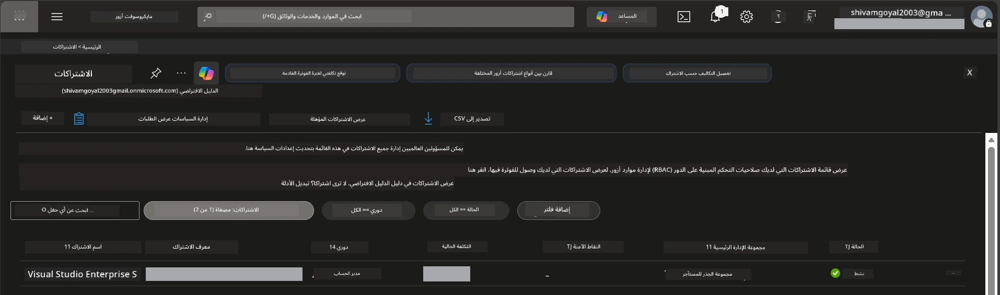

# الوحدة 0 - المتطلبات الأساسية

قبل بدء ورشة العمل، تأكد من توفر الأدوات، الوصول، والبيئة التالية. اتبع كل خطوة أدناه - لا تتخطى أي خطوة.

---

## 1. حساب Azure والاشتراك

### 1.1 إنشاء أو التحقق من اشتراك Azure الخاص بك

1. افتح متصفحًا وانتقل إلى [https://azure.microsoft.com/free/](https://azure.microsoft.com/free/).
2. إذا لم يكن لديك حساب Azure، انقر على **ابدأ مجانًا** واتبع خطوات التسجيل. ستحتاج إلى حساب Microsoft (أو إنشاء واحد) وبطاقة ائتمان للتحقق من الهوية.
3. إذا كان لديك حساب بالفعل، قم بتسجيل الدخول على [https://portal.azure.com](https://portal.azure.com).
4. في البوابة، انقر على لوحة **الاشتراكات** في التنقل الأيسر (أو ابحث عن "الاشتراكات" في شريط البحث العلوي).
5. تحقق من رؤية اشتراك واحد على الأقل يحمل حالة **نشط**. دون رقم **معرف الاشتراك** - ستحتاجه لاحقًا.



### 1.2 فهم أدوار RBAC المطلوبة

يتطلب نشر [Hosted Agent](https://learn.microsoft.com/azure/foundry/agents/concepts/hosted-agents) أذونات **إجراءات البيانات** التي لا تتوفر في أدوار Azure `Owner` و `Contributor` القياسية. ستحتاج إلى إحدى هذه [تركيبات الأدوار](https://learn.microsoft.com/azure/foundry/concepts/rbac-foundry#built-in-roles):

| السيناريو | الأدوار المطلوبة | مكان التعيين |
|----------|-----------------|---------------|
| إنشاء مشروع Foundry جديد | **مالك Azure AI** على مورد Foundry | مورد Foundry في بوابة Azure |
| النشر على مشروع قائم (موارد جديدة) | **مالك Azure AI** + **مساهم** على الاشتراك | الاشتراك + مورد Foundry |
| النشر على مشروع مهيأ بالكامل | **قارئ** على الحساب + **مستخدم Azure AI** على المشروع | الحساب + المشروع في بوابة Azure |

> **نقطة أساسية:** أدوار Azure `Owner` و `Contributor` تغطي أذونات *الإدارة* فقط (عمليات ARM). تحتاج إلى [**مستخدم Azure AI**](https://learn.microsoft.com/azure/foundry/concepts/rbac-foundry#built-in-roles) (أو أعلى) لـ *إجراءات البيانات* مثل `agents/write` المطلوبة لإنشاء ونشر الوكلاء. ستقوم بتعيين هذه الأدوار في [الوحدة 2](02-create-foundry-project.md).

---

## 2. تثبيت الأدوات المحلية

قم بتثبيت كل أداة أدناه. بعد التثبيت، تحقق من عملها عن طريق تشغيل أمر الفحص.

### 2.1 Visual Studio Code

1. اذهب إلى [https://code.visualstudio.com/](https://code.visualstudio.com/).
2. قم بتنزيل المثبت لنظام التشغيل الخاص بك (Windows/macOS/Linux).
3. شغّل المثبت بالإعدادات الافتراضية.
4. افتح VS Code للتحقق من تشغيله.

### 2.2 Python 3.10+

1. اذهب إلى [https://www.python.org/downloads/](https://www.python.org/downloads/).
2. قم بتنزيل Python 3.10 أو لاحقاً (يوصى بالإصدار 3.12+).
3. **ويندوز:** أثناء التثبيت، تحقق من تحديد **"أضف Python إلى PATH"** في الشاشة الأولى.
4. افتح الطرفية وتحقق:

   ```powershell
   python --version
   ```

   الناتج المتوقع: `Python 3.10.x` أو أعلى.

### 2.3 Azure CLI

1. اذهب إلى [https://learn.microsoft.com/cli/azure/install-azure-cli](https://learn.microsoft.com/cli/azure/install-azure-cli).
2. اتبع تعليمات التثبيت لنظام التشغيل الخاص بك.
3. تحقق:

   ```powershell
   az --version
   ```

   المتوقع: `azure-cli 2.80.0` أو أعلى.

4. قم بتسجيل الدخول:

   ```powershell
   az login
   ```

### 2.4 Azure Developer CLI (azd)

1. اذهب إلى [https://learn.microsoft.com/azure/developer/azure-developer-cli/install-azd](https://learn.microsoft.com/azure/developer/azure-developer-cli/install-azd).
2. اتبع تعليمات التثبيت لنظام التشغيل الخاص بك. على ويندوز:

   ```powershell
   winget install microsoft.azd
   ```

3. تحقق:

   ```powershell
   azd version
   ```

   المتوقع: `azd version 1.x.x` أو أعلى.

4. قم بتسجيل الدخول:

   ```powershell
   azd auth login
   ```

### 2.5 Docker Desktop (اختياري)

Docker مطلوب فقط إذا كنت تريد بناء واختبار صورة الحاوية محليًا قبل النشر. إضافة Foundry تدير بناء الحاويات تلقائيًا أثناء النشر.

1. اذهب إلى [https://docs.docker.com/get-docker/](https://docs.docker.com/get-docker/).
2. قم بتنزيل وتثبيت Docker Desktop لنظام التشغيل الخاص بك.
3. **ويندوز:** تأكد من اختيار WSL 2 كخلفية أثناء التثبيت.
4. ابدأ Docker Desktop وانتظر حتى تظهر أيقونة في شريط النظام تحمل رسالة **"Docker Desktop is running"**.
5. افتح طرفية وتحقق:

   ```powershell
   docker info
   ```

   يجب أن يظهر هذا معلومات نظام Docker بدون أخطاء. إذا رأيت `Cannot connect to the Docker daemon`، انتظر بضع ثوانٍ إضافية لبدء Docker بالكامل.

---

## 3. تثبيت إضافات VS Code

تحتاج إلى ثلاثة امتدادات. قم بتثبيتها **قبل** بدء ورشة العمل.

### 3.1 Microsoft Foundry لـ VS Code

1. افتح VS Code.
2. اضغط `Ctrl+Shift+X` لفتح لوحة الإضافات.
3. في حقل البحث، اكتب **"Microsoft Foundry"**.
4. ابحث عن **Microsoft Foundry for Visual Studio Code** (الناشر: Microsoft، المعرف: `TeamsDevApp.vscode-ai-foundry`).
5. انقر **تثبيت**.
6. بعد التثبيت، يجب أن يظهر رمز **Microsoft Foundry** في شريط النشاط (الشريط الجانبي الأيسر).

### 3.2 Foundry Toolkit

1. في لوحة الإضافات (`Ctrl+Shift+X`)، ابحث عن **"Foundry Toolkit"**.
2. ابحث عن **Foundry Toolkit** (الناشر: Microsoft، المعرف: `ms-windows-ai-studio.windows-ai-studio`).
3. انقر **تثبيت**.
4. يجب أن يظهر رمز **Foundry Toolkit** في شريط النشاط.

### 3.3 Python

1. في لوحة الإضافات، ابحث عن **"Python"**.
2. ابحث عن **Python** (الناشر: Microsoft، المعرف: `ms-python.python`).
3. انقر **تثبيت**.

---

## 4. تسجيل الدخول إلى Azure من VS Code

يستخدم [Microsoft Agent Framework](https://learn.microsoft.com/agent-framework/overview/) [`DefaultAzureCredential`](https://learn.microsoft.com/azure/developer/python/sdk/authentication/credential-chains#defaultazurecredential-overview) للمصادقة. تحتاج إلى تسجيل الدخول إلى Azure في VS Code.

### 4.1 تسجيل الدخول عبر VS Code

1. انظر إلى الزاوية السفلى اليسرى من VS Code وانقر على أيقونة **الحسابات** (شكل الشخص).
2. انقر على **تسجيل الدخول لاستخدام Microsoft Foundry** (أو **تسجيل الدخول مع Azure**).
3. سيفتح متصفح - سجل الدخول بحساب Azure الذي لديه الوصول إلى اشتراكك.
4. عد إلى VS Code. يجب أن ترى اسم حسابك في الزاوية السفلى اليسرى.

### 4.2 (اختياري) تسجيل الدخول عبر Azure CLI

إذا قمت بتثبيت Azure CLI وتفضل المصادقة عبر CLI:

```powershell
az login
```

يفتح هذا نافذة متصفح لتسجيل الدخول. بعد تسجيل الدخول، عيّن الاشتراك الصحيح:

```powershell
az account set --subscription "<your-subscription-id>"
```

تحقق:

```powershell
az account show --query "{name:name, id:id, state:state}" --output table
```

يجب أن ترى اسم اشتراكك، المعرف، والحالة = `Enabled`.

### 4.3 (بديل) مصادقة Service principal

لبيئات CI/CD أو البيئات المشتركة، قم بتعيين متغيرات البيئة هذه بدلاً من ذلك:

```powershell
$env:AZURE_TENANT_ID = "<your-tenant-id>"
$env:AZURE_CLIENT_ID = "<your-client-id>"
$env:AZURE_CLIENT_SECRET = "<your-client-secret>"
```

---

## 5. قيود المعاينة

قبل المتابعة، كن على علم بالقيود الحالية:

- [**العملاء المستضافين**](https://learn.microsoft.com/azure/foundry/agents/concepts/hosted-agents) في معاينة عامة حالياً - غير موصى بها لأحمال العمل الإنتاجية.
- **المناطق المدعومة محدودة** - تحقق من [توفر المناطق](https://learn.microsoft.com/azure/foundry/agents/concepts/hosted-agents#region-availability) قبل إنشاء الموارد. إذا اخترت منطقة غير مدعومة، سيفشل النشر.
- حزمة `azure-ai-agentserver-agentframework` في إصدار ما قبل الإطلاق (`1.0.0b16`) - قد تتغير واجهات البرمجة.
- حدود التوسيع: العملاء المستضافين يدعمون 0-5 نسخ متماثلة (بما في ذلك التوسيع للصفر).

---

## 6. قائمة التحقق قبل الإقلاع

راجع كل عنصر أدناه. إذا فشلت أي خطوة، عد وأصلحها قبل المتابعة.

- [ ] فتح VS Code بدون أخطاء
- [ ] Python 3.10+ موجود في PATH (`python --version` يعرض `3.10.x` أو أعلى)
- [ ] Azure CLI مثبت (`az --version` يعرض `2.80.0` أو أعلى)
- [ ] Azure Developer CLI مثبت (`azd version` يعرض معلومات الإصدار)
- [ ] امتداد Microsoft Foundry مثبت (الأيقونة مرئية في شريط النشاط)
- [ ] امتداد Foundry Toolkit مثبت (الأيقونة مرئية في شريط النشاط)
- [ ] امتداد Python مثبت
- [ ] مسجل الدخول إلى Azure في VS Code (تحقق من أيقونة الحسابات، الزاوية السفلى اليسرى)
- [ ] `az account show` يعرض اشتراكك
- [ ] (اختياري) Docker Desktop يعمل (`docker info` يعرض معلومات النظام بدون أخطاء)

### نقطة التحقق

افتح شريط النشاط في VS Code وتأكد من رؤية كل من العرض الجانبي **Foundry Toolkit** و **Microsoft Foundry**. انقر على كل منهما للتحقق من تحميلهما بدون أخطاء.

---

**التالي:** [01 - تثبيت Foundry Toolkit وملحق Foundry →](01-install-foundry-toolkit.md)

---

<!-- CO-OP TRANSLATOR DISCLAIMER START -->
**إخلاء المسؤولية**:  
تمت ترجمة هذا المستند باستخدام خدمة الترجمة الآلية [Co-op Translator](https://github.com/Azure/co-op-translator). بينما نسعى لتحقيق الدقة، يرجى العلم أن الترجمات الآلية قد تحتوي على أخطاء أو عدم دقة. يجب اعتبار المستند الأصلي بلغته الأصلية المصدر الموثوق. للمعلومات الحرجة، يُنصح بالاستعانة بترجمة بشرية محترفة. نحن لسنا مسؤولين عن أي سوء فهم أو تفسيرات خاطئة تنتج عن استخدام هذه الترجمة.
<!-- CO-OP TRANSLATOR DISCLAIMER END -->