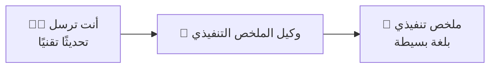

# الوحدة 0 - المقدمة

⏱️ ~10 دقائق

> [!WARNING]
> **المعاينة والقيود:** [الوكلاء المستضافون](https://learn.microsoft.com/azure/foundry/agents/concepts/hosted-agents) هم حالياً في **المعاينة العامة** - غير موصى باستخدامهم للعبء الإنتاجي. يرجى مراعاة ما يلي:
> - **المناطق المدعومة محدودة** - تحقق من [توفر المناطق](https://learn.microsoft.com/azure/foundry/agents/concepts/hosted-agents#region-availability) قبل إنشاء الموارد. إذا اخترت منطقة غير مدعومة، سيفشل النشر.
> - حزمة `azure-ai-agentserver-agentframework` هي إصدار ما قبل الإصدار - قد تتغير واجهات برمجة التطبيقات بين الإصدارات.
> - حدود التوسع: الوكلاء المستضافون يدعمون من 0 إلى 5 نسخ (بما في ذلك التوسع إلى الصفر).
> - قد تتغير بعض الميزات المعروضة في هذا الورشة أثناء تقدم الخدمة نحو الإصدار المستقر.

## ما الذي ستبنيه

في هذه الورشة، ستبني وكيل **"اشرح كما لو كنت مسؤولًا تنفيذيًا"** - وكيل ذكاء اصطناعي مستضاف يأخذ التحديثات التقنية المعقدة ويعيد كتابتها كملخصات تنفيذية بلغة إنجليزية بسيطة.

```mermaid
flowchart LR
    A["🧑‍💻 أنت ترسل\nتحديثًا تقنيًا"] --> B["🤖 وكيل الملخص التنفيذي"]
    B --> C["📝 ملخص تنفيذي\nبلغة بسيطة"]
```

**يستخدم الوكيل:**
- **إطار عمل الوكيل من Microsoft** - للمنطق والتركيب الخاص بالوكيل
- **مجموعة Foundry لأداة VS Code** - لتكويد الهيكل، والاختبار محلياً، والنشر
- **نموذج ذكاء اصطناعي** (مثل `gpt-4.1-mini/gpt-5-mini`) - لتوليد الملخصات

بنهاية هذا المختبر، سيكون لديك وكيل يعمل يمكنك اختباره محلياً عبر Agent Inspector، واختياريًا نشره في السحابة.

---

## ما هم الوكلاء المستضافون؟

**الوكيل المستضاف** هو وكيل ذكاء اصطناعي يعمل كخدمة مُدارة في Microsoft Foundry. بدلاً من إدارة البنية التحتية بنفسك، تقوم بحزم كود الوكيل في حاوية ويتولى Foundry التحكم في التوسع والاستضافة والوصول إليه عبر نقطة نهاية HTTP قياسية.

| المفهوم | ماذا يعني |
|---------|--------------|
| **الوكيل** | كود بايثون الخاص بك الذي يستقبل رسالة المستخدم، يستدعي نموذج ذكاء اصطناعي، ويعيد استجابة منظمة |
| **مستضاف** | Foundry يشغل الحاوية الخاصة بك - لا آلات افتراضية، لا Kubernetes، ولا بنية تحتية تحتاج لإدارتها |
| **بروتوكول الاستجابات** | واجهة HTTP قياسية (`POST /responses`) يمكن لأي عميل استدعاءها للتفاعل مع وكيلك |
| **Agent Inspector** | واجهة اختبار محلية (مضمنة في Foundry Toolkit) تتيح لك المحادثة مع وكيلك قبل النشر |

في هذه الورشة، ستنتقل من لا شيء إلى وكيل مستضاف بالكامل - أو تتوقف عند الاختبار المحلي إذا أردت.

---

## اختر مسارك

> ⚠️ **اختر مساراً قبل الاستمرار.** اختيارك يحدد الأدوات التي ستثبتها والوحدات التي تنطبق. يمكنك التبديل من المسار ب → المسار أ لاحقًا إذا حصلت على اشتراك.

<strong>🅰️ المسار أ - سحابة Azure (يتطلب اشتراك Azure)</strong>

| | التفاصيل |
|---|---|
| **لمن هذا؟** | لديك اشتراك Azure نشط ويمكنك إنشاء موارد Foundry |
| **النموذج** | Azure OpenAI عبر Foundry (مثل `gpt-4.1-mini/gpt-5-mini`) |
| **الوحدات المغطاة** | جميع الوحدات (00–07) |
| **النشر في السحابة؟** | ✅ نعم - نشر كامل من البداية للنهاية |

<strong>🅱️ المسار ب - محلي / الطبقة المجانية (لا يحتاج لاشتراك Azure)</strong>

| | التفاصيل |
|---|---|
| **لمن هذا؟** | MVPs، الطلاب، أو أي شخص بدون وصول إلى Azure |
| **النموذج** | **Foundry Local** (مجاني، يعمل على جهازك) |
| **الوحدات المغطاة** | الوحدات 00–04 (تخطي النشر والتحقق من السحابة) |
| **النشر في السحابة؟** | ❌ لا - اختبار محلي فقط عبر Agent Inspector |

---

## جميع المسارات: الأدوات المطلوبة

ثبت كل أداة أدناه. بعد التثبيت، تحقق من عملها عبر تشغيل الأمر الخاص بالتحقق.

| # | الأداة | الإصدار | التثبيت | التحقق (الناتج المتوقع) |
|---|------|---------|---------|---------------------------|
| 1 | **Visual Studio Code** | الأحدث | [code.visualstudio.com](https://code.visualstudio.com/) | يفتح بدون أخطاء |
| 2 | **Python** | 3.12 أو أحدث| [python.org/downloads](https://www.python.org/downloads/) | `python --version` $\rightarrow$ `Python 3.12.x` |
| 3 | **Foundry Toolkit for VS Code** | الأحدث | معرف الإضافة: `ms-windows-ai-studio.windows-ai-studio` | أيقونة Foundry في شريط النشاط |
| 4 | **إضافة Python لـ VS Code** | الأحدث | معرف الإضافة: `ms-python.python` | مثبتة في لوحة الإضافات |

> [!TIP]
> **نصائح احترافية للتثبيت:**
> - **مسار Python (ويندوز):** تحقق دائمًا من اختيار **"إضافة Python إلى PATH"** في الشاشة الأولى من مثبّت Python. بدونه، لن يتم التعرف على `python` في الطرفية.
> - **إصدارات متعددة من Python:** إذا كان لديك Python 3.10 و3.12 مثبتين، استخدم `python3.12 -m venv .venv` لضمان استخدام الإصدار الصحيح في بيئة التطوير الافتراضية الخاصة بك.
> - **Docker WSL 2 (ويندوز):** أثناء تثبيت Docker Desktop، تأكد من اختيار **واجهة WSL 2**. Docker مع Hyper-V أبطأ وقد يسبب مشكلات في بناء حاويات Foundry.
> - **Docker لا يبدأ؟** انتظر 30–60 ثانية بعد تشغيل Docker Desktop. شغّل `docker info` - إذا رأيت "Cannot connect to the Docker daemon"، فـ Docker لا يزال يبدأ.
> - **إضافات VS Code لا تُحمّل؟** بعد تثبيت الإضافات، أعد تحميل النافذة: `Ctrl+Shift+P` → `Developer: Reload Window`.

> **لمستخدمي ويندوز:** تحقق من اختيار **"إضافة Python إلى PATH"** أثناء تثبيت Python.

**التالي:** [01 - الإعداد →](01-setup.md)

---

<!-- CO-OP TRANSLATOR DISCLAIMER START -->
**تنويه**:
تمت ترجمة هذا المستند باستخدام خدمة الترجمة بالذكاء الاصطناعي [Co-op Translator](https://github.com/Azure/co-op-translator). بينما نسعى للدقة، يرجى العلم أن الترجمات الآلية قد تحتوي على أخطاء أو عدم دقة. يجب اعتبار المستند الأصلي بلغته الأصلية المصدر الرسمي والمعتمد. للمعلومات الهامة، يُنصح بالاستعانة بترجمة بشرية محترفة. نحن غير مسؤولين عن أي سوء فهم أو تفسير ناتج عن استخدام هذه الترجمة.
<!-- CO-OP TRANSLATOR DISCLAIMER END -->