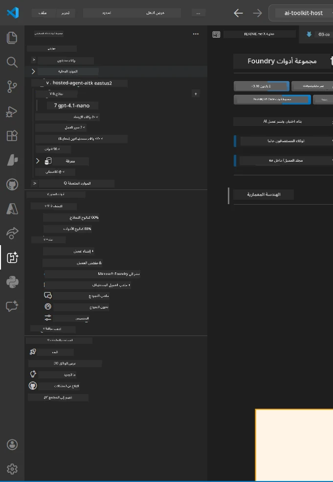
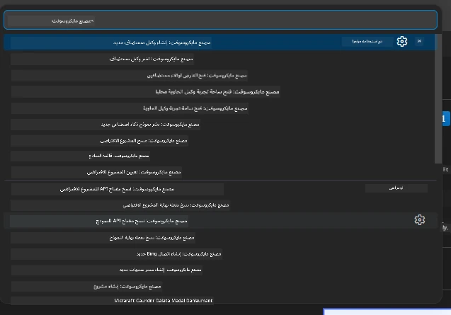

# الوحدة 1 - تثبيت مجموعة أدوات Foundry وامتداد Foundry

تشرح لك هذه الوحدة كيفية تثبيت والتحقق من امتدادات VS Code الرئيسية لهذا الورشة. إذا قمت بتثبيتها سابقًا خلال [الوحدة 0](00-prerequisites.md)، استخدم هذه الوحدة للتحقق من عملها بشكل صحيح.

---

## الخطوة 1: تثبيت امتداد Microsoft Foundry

امتداد **Microsoft Foundry ل VS Code** هو أداتك الرئيسية لإنشاء مشاريع Foundry، نشر النماذج، إنشاء وكلاء مستضافين، والنشر مباشرة من VS Code.

1. افتح VS Code.
2. اضغط على `Ctrl+Shift+X` لفتح لوحة **الامتدادات**.
3. في مربع البحث في الأعلى، اكتب: **Microsoft Foundry**
4. ابحث عن النتيجة بعنوان **Microsoft Foundry for Visual Studio Code**.
   - الناشر: **Microsoft**
   - معرف الامتداد: `TeamsDevApp.vscode-ai-foundry`
5. انقر على زر **تثبيت**.
6. انتظر حتى يكتمل التثبيت (سترى مؤشر تقدم صغير).
7. بعد التثبيت، انظر إلى **شريط النشاط** (شريط الأيقونات العمودي على الجانب الأيسر من VS Code). يجب أن ترى أيقونة **Microsoft Foundry** جديدة (تشبه شكل الماسة/رمز الذكاء الاصطناعي).
8. انقر على أيقونة **Microsoft Foundry** لفتح عرض الشريط الجانبي الخاص بها. يجب أن ترى أقسامًا لـ:
   - **الموارد** (أو المشاريع)
   - **الوكلاء**
   - **النماذج**

> **إذا لم تظهر الأيقونة:** حاول إعادة تحميل VS Code (`Ctrl+Shift+P` → `Developer: Reload Window`).

---

## الخطوة 2: تثبيت امتداد Foundry Toolkit

يوفر امتداد **Foundry Toolkit** [**Agent Inspector**](https://learn.microsoft.com/azure/foundry/agents/how-to/vs-code-agents-workflow-pro-code) - وهو واجهة بصرية لاختبار وتصحيح الوكلاء محليًا - بالإضافة إلى أدوات الحقل، إدارة النماذج، وأدوات التقييم.

1. في لوحة الامتدادات (`Ctrl+Shift+X`)، امسح مربع البحث واكتب: **Foundry Toolkit**
2. ابحث عن **Foundry Toolkit** في النتائج.
   - الناشر: **Microsoft**
   - معرف الامتداد: `ms-windows-ai-studio.windows-ai-studio`
3. انقر على **تثبيت**.
4. بعد التثبيت، تظهر أيقونة **Foundry Toolkit** في شريط النشاط (تشبه رمز روبوت/تألق).
5. انقر على أيقونة **Foundry Toolkit** لفتح عرض الشريط الجانبي الخاص بها. يجب أن ترى شاشة الترحيب الخاصة بـ Foundry Toolkit مع خيارات لـ:
   - **النماذج**
   - **ميدان اللعب**
   - **الوكلاء**

---

## الخطوة 3: التحقق من عمل كلا الامتدادين

### 3.1 التحقق من امتداد Microsoft Foundry

1. انقر على أيقونة **Microsoft Foundry** في شريط النشاط.
2. إذا كنت قد سجلت الدخول إلى Azure (من الوحدة 0)، يجب أن ترى مشاريعك مدرجة تحت **الموارد**.
3. إذا طلب منك تسجيل الدخول، انقر على **تسجيل الدخول** واتبع سير المصادقة.
4. تأكد من أنك ترى الشريط الجانبي بدون أخطاء.

### 3.2 التحقق من امتداد Foundry Toolkit

1. انقر على أيقونة **Foundry Toolkit** في شريط النشاط.
2. تأكد من تحميل شاشة الترحيب أو اللوحة الرئيسية بدون أخطاء.
3. لا تحتاج إلى تهيئة أي شيء بعد - سنستخدم Agent Inspector في [الوحدة 5](05-test-locally.md).

### 3.3 التحقق عبر لوحة الأوامر

1. اضغط على `Ctrl+Shift+P` لفتح لوحة الأوامر.
2. اكتب **"Microsoft Foundry"** - يجب أن ترى أوامر مثل:
   - `Microsoft Foundry: Create a New Hosted Agent`
   - `Microsoft Foundry: Deploy Hosted Agent`
   - `Microsoft Foundry: Open Model Catalog`
3. اضغط على `Escape` لإغلاق لوحة الأوامر.
4. افتح لوحة الأوامر مرة أخرى واكتب **"Foundry Toolkit"** - يجب أن ترى أوامر مثل:
   - `Foundry Toolkit: Open Agent Inspector`

> إذا لم ترَ هذه الأوامر، قد لا تكون الامتدادات مثبتة بشكل صحيح. جرب إلغاء التثبيت ثم إعادة التثبيت.

---

## ماذا تفعل هذه الامتدادات في هذه الورشة

| الامتداد | ما يفعله | متى ستستخدمه |
|-----------|-------------|-------------------|
| **Microsoft Foundry for VS Code** | إنشاء مشاريع Foundry، نشر النماذج، **إنشاء [الوكلاء المستضافين](https://learn.microsoft.com/azure/foundry/agents/concepts/hosted-agents)** (ينشئ تلقائيًا `agent.yaml`, `main.py`, `Dockerfile`, `requirements.txt`)، النشر إلى [Foundry Agent Service](https://learn.microsoft.com/azure/foundry/agents/overview) | الوحدات 2، 3، 6، 7 |
| **Foundry Toolkit** | Agent Inspector للاختبار والتصحيح محليًا، واجهة ميدان اللعب، إدارة النماذج | الوحدات 5، 7 |

> **امتداد Foundry هو الأداة الأهم في هذه الورشة.** فهو يدير دورة الحياة من البداية للنهاية: إنشاء الهيكل → التهيئة → النشر → التحقق. ويكمله Foundry Toolkit بتوفير Agent Inspector البصرية للاختبارات المحلية.

---

### نقطة التحقق

- [ ] أيقونة Microsoft Foundry مرئية في شريط النشاط
- [ ] النقر عليها يفتح الشريط الجانبي بدون أخطاء
- [ ] أيقونة Foundry Toolkit مرئية في شريط النشاط
- [ ] النقر عليها يفتح الشريط الجانبي بدون أخطاء
- [ ] `Ctrl+Shift+P` → كتابة "Microsoft Foundry" تعرض الأوامر المتاحة
- [ ] `Ctrl+Shift+P` → كتابة "Foundry Toolkit" تعرض الأوامر المتاحة

---

**السابق:** [00 - المتطلبات الأساسية](00-prerequisites.md) · **التالي:** [02 - إنشاء مشروع Foundry →](02-create-foundry-project.md)

---

<!-- CO-OP TRANSLATOR DISCLAIMER START -->
**إخلاء مسؤولية**:  
تمت ترجمة هذا المستند باستخدام خدمة الترجمة الآلية [Co-op Translator](https://github.com/Azure/co-op-translator). بينما نسعى لتحقيق الدقة، يرجى العلم أن الترجمات الآلية قد تحتوي على أخطاء أو عدم دقة. يجب اعتبار المستند الأصلي بلغته الأصلية هو المصدر المعتمد. للمعلومات الهامة، يُنصح بالاعتماد على ترجمة بشرية محترفة. نحن غير مسؤولين عن أي سوء فهم أو تفسيرات خاطئة ناتجة عن استخدام هذه الترجمة.
<!-- CO-OP TRANSLATOR DISCLAIMER END -->