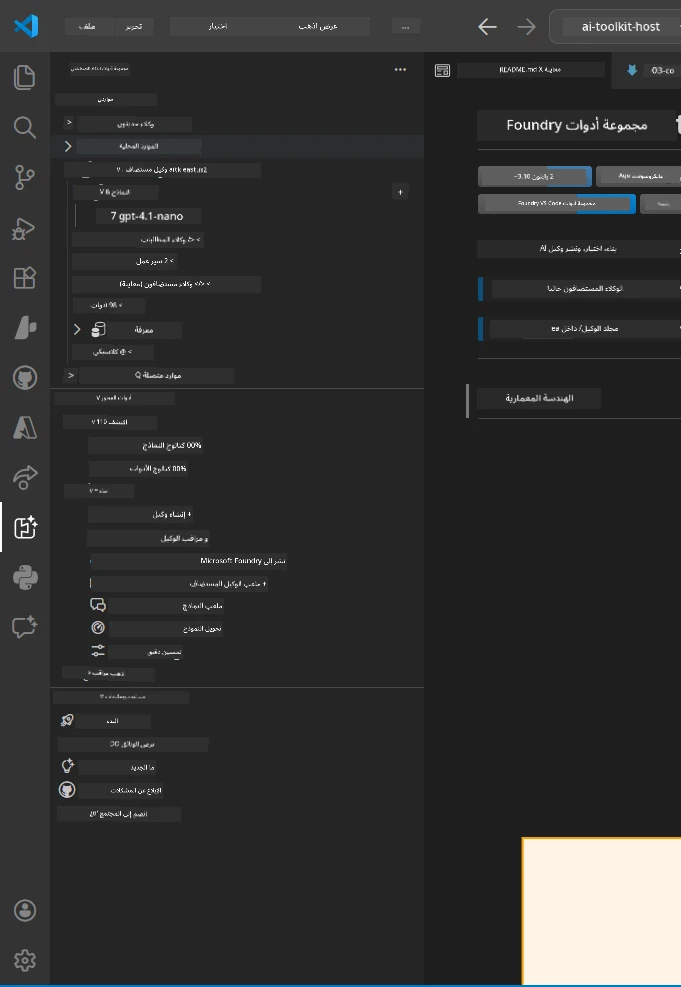
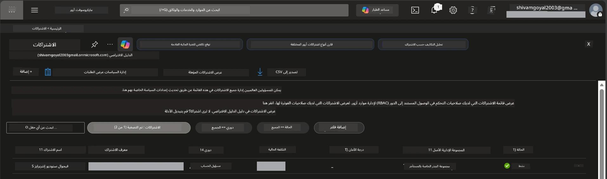
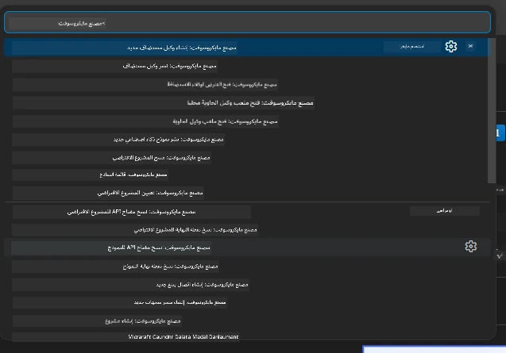
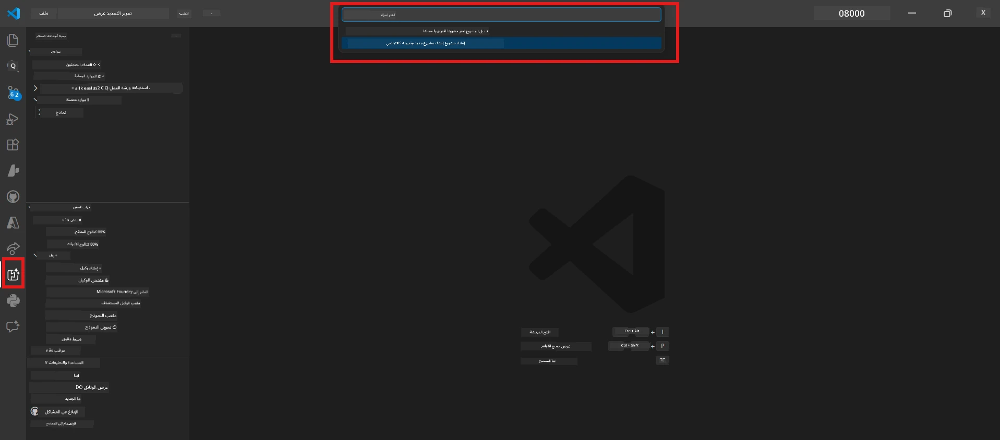
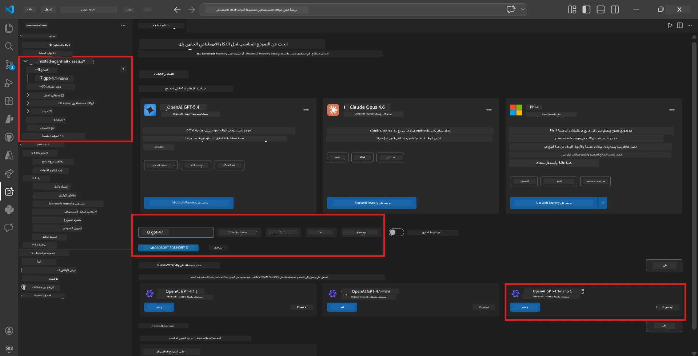
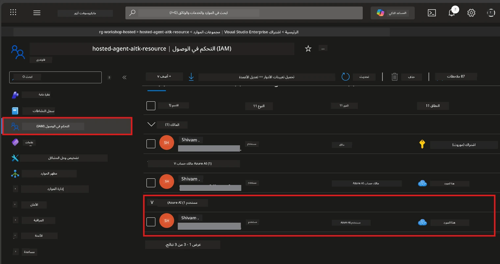

# الإعداد: الإضافة، المشروع والنموذج

⏱️ ~15 دقيقة

في هذه الوحدة، تقوم بتثبيت والتحقق من إضافة Foundry Toolkit، إنشاء (أو الاتصال بـ) مشروع Foundry، ونشر نموذج سيستخدمه عميلك.

## الخطوة 1: تثبيت Foundry Toolkit

**Foundry Toolkit لـ VS Code** هي الإضافة الأساسية لهذه الورشة. توفر إنشاء المشاريع، نشر النماذج، إعداد الوكلاء، الاختبار المحلي (Agent Inspector)، والنشر في السحابة - كلها من VS Code.

1. افتح VS Code ثم اضغط `Ctrl+Shift+X` لفتح لوحة **الإضافات**.
2. ابحث عن **Foundry Toolkit**.
3. قم بتثبيت **Foundry Toolkit for VS Code** (الناشر: Microsoft، معرف: `ms-windows-ai-studio.windows-ai-studio`).
4. بعد التثبيت، يظهر رمز **Foundry Toolkit** في شريط النشاط (الشريط الجانبي الأيسر).

> *ملاحظة: قد يعرض شريط النشاط "AI TOOLKIT" في إصدارات الإضافة الأقدم. الوظيفة متطابقة.*



## الخطوة 2: الإعداد بناءً على وصولك

> **اختر مسارك:** قم بتوسيع القسم أدناه الذي يتطابق مع إعدادك. تحتاج فقط إلى إكمال **مسار واحد**.

<details>
<summary><strong>🅰️ المسار أ - سحابة Azure (يتطلب اشتراك Azure)</strong></summary>

### Azure CLI

1. قم بالتثبيت من [learn.microsoft.com/cli/azure/install-azure-cli](https://learn.microsoft.com/cli/azure/install-azure-cli).
2. تحقق: `az --version` (توقع 2.80.0+).
3. قم بتسجيل الدخول: `az login`

### خيارات المصادقة

يستخدم [إطار عمل Microsoft Agent](https://learn.microsoft.com/agent-framework/overview/) [`DefaultAzureCredential`](https://learn.microsoft.com/azure/developer/python/sdk/authentication/credential-chains#defaultazurecredential-overview) الذي يجرب عدة طرق مصادقة بالتتابع. اختر الطريقة التي تناسب بيئتك:

#### الخيار 1: حسابات VS Code (موصى به للورش)
1. انقر على أيقونة **الحسابات** (شكل شخص) في الزاوية السفلى اليسرى من VS Code.
2. اختر **تسجيل الدخول لاستخدام Microsoft Foundry** (أو **تسجيل الدخول باستخدام Azure**).
3. يفتح المتصفح - سجّل الدخول باستخدام حساب Azure الذي لديه وصول إلى اشتراكك.
4. عد إلى VS Code. يجب أن ترى اسم حسابك في الأسفل على اليسار.

#### الخيار 2: Azure CLI
```bash
az login
az account set --subscription "<your-subscription-id>"
```

#### الخيار 3: Service Principal (للبيئات المؤسسية/CI)
للبيئات المقيدة أو خطوط أنابيب CI/CD، قم بضبط متغيرات البيئة هذه في ملف `.env`:
```env
AZURE_TENANT_ID=<your-tenant-id>
AZURE_CLIENT_ID=<your-client-id>
AZURE_CLIENT_SECRET=<your-client-secret>
```

> **كيفية عمل `DefaultAzureCredential`:** يجرب أولاً متغيرات البيئة، ثم الهوية المدارة، ثم تسجيل الدخول في VS Code، ثم Azure CLI - ويستخدم الطريقة التي تنجح أولًا. انظر [توثيق سلسلة الاعتمادات](https://learn.microsoft.com/azure/developer/python/sdk/authentication/credential-chains#defaultazurecredential-overview).

### Azure Developer CLI (azd)

1. التثبيت: `winget install microsoft.azd` (ويندوز) أو راجع [توثيق التثبيت](https://learn.microsoft.com/azure/developer/azure-developer-cli/install-azd).
2. تحقق: `azd version`
3. تسجيل الدخول: `azd auth login`

### Docker Desktop (اختياري)

Docker مطلوب فقط إذا أردت بناء الحاويات محليًا. تعامل إضافة Foundry مع عمليات البناء تلقائيًا أثناء النشر.

1. التثبيت من [docs.docker.com/get-docker](https://docs.docker.com/get-docker/).
2. تحقق: `docker info`

### اشتراك Azure وصلاحيات RBAC

1. سجل الدخول إلى [portal.azure.com](https://portal.azure.com).
2. انتقل إلى **الاشتراكات** وتأكد من وجود اشتراك واحد على الأقل **نشط**.
3. لاحظ **معرف الاشتراك** الخاص بك - ستحتاجه في الوحدة 01.



#### جدول سيناريوهات RBAC

يتطلب نشر [الوكيل المستضاف](https://learn.microsoft.com/azure/foundry/agents/concepts/hosted-agents) أذونات **إجراءات البيانات** التي لا تشملها الأدوار القياسية في Azure مثل `Owner` و `Contributor`. استخدم الجدول التالي لتحديد الأدوار التي تحتاجها:

| السيناريو | الأدوار المطلوبة | أين تعينها |
|----------|------------------|------------|
| إنشاء مشروع Foundry جديد | **مالك Azure AI** على مورد Foundry | مورد Foundry في بوابة Azure |
| النشر على مشروع قائم (مصادر جديدة) | **مالك Azure AI** + **مساهم** على الاشتراك | الاشتراك + مورد Foundry |
| النشر على مشروع مُعد بالكامل | **قارئ** على الحساب + **مستخدم Azure AI** على المشروع | الحساب + المشروع في بوابة Azure |
| اختبار محلي فقط (بدون نشر) | **مستخدم Azure AI** على المشروع | المشروع في بوابة Azure |

> **نقطة مهمة:** أدوار Azure `Owner` و`Contributor` تغطي أذونات *الإدارة* فقط (عمليات ARM). تحتاج إلى [**مستخدم Azure AI**](https://learn.microsoft.com/azure/foundry/concepts/rbac-foundry#built-in-roles) (أو أعلى) لأذونات *إجراءات البيانات* مثل `agents/write` المطلوبة لإنشاء ونشر الوكلاء.

## الاتصال أو إنشاء مشروع Foundry



1. اضغط `Ctrl+Shift+P` → اكتب **Foundry Toolkit: Create Project** → اختره.
2. اختر **اشتراك Azure** الخاص بك من القائمة المنسدلة.
3. اختر أو أنشئ **مجموعة موارد** (مثلاً، `rg-hosted-agents-workshop`).
4. اختر **منطقة** تدعم الوكلاء المستضافين: `East US`، `West US 2`، أو `Sweden Central`. انظر [توفر المناطق](https://learn.microsoft.com/azure/foundry/agents/concepts/hosted-agents#region-availability).
5. أدخل اسم المشروع (مثلاً، `workshop-agents`).
6. انتظر من 2 إلى 5 دقائق للتهيئة. تظهر إشعار تقدم في VS Code.
7. عند الانتهاء، يظهر مشروعك في الشريط الجانبي لـ **Foundry Toolkit** تحت **MY RESOURCES**.



## نشر نموذج وتعيين صلاحيات RBAC

يحتاج وكيلك المستضاف إلى نموذج ذكاء اصطناعي لتوليد الردود.

#### مصفوفة اختيار النموذج
حسب احتياجاتك، يمكنك اختيار من مستويات نماذج مختلفة:

| النموذج | الأفضل لـ | التكلفة | الملاحظات |
|---------|-----------|---------|------------|
| `gpt-4.1` | ردود عالية الجودة ومفصلة | الأعلى | أفضل النتائج، موصى به للاختبار النهائي |
| `gpt-4.1-mini/gpt-5-mini` | تكرار سريع، تكلفة أقل | أقل | جيد لتطوير الورشة والاختبار السريع |
| `gpt-4.1-nano` | المهام الخفيفة | الأدنى | الأكثر فعالية من حيث التكلفة، ردود أبسط |

1. اضغط `Ctrl+Shift+P` → **Foundry Toolkit: Open Model Catalog** (أو انقر **Model Catalog** في الشريط الجانبي تحت DEVELOPER TOOLS → اكتشف).
2. ابحث عن **gpt-4.1** في الكتالوج.
3. ابحث عن **OpenAI GPT-4.1-mini** (أو `gpt-5-mini` لجودة أفضل) وانقر **نشر**.



4. في إعدادات النشر:
   - **اسم النشر:** اترك الاسم الافتراضي أو أدخل اسمًا مخصصًا. **تذكر هذا الاسم.**
   - **الهدف:** اختر **نشر على Foundry Toolkit** → اختر مشروعك.
5. انقر **نشر** وانتظر 1–3 دقائق.

> **توصية:** استخدم `gpt-4.1-mini/gpt-5-mini` للورشة - سريع، بأسعار معقولة، ويعطي نتائج جيدة.

### دوّن القيم الخاصة بك

بعد النشر، دوّن هذين القيمتين (ستحتاجهما في الوحدة 03):

| القيمة | أين تجدها |
|-------|------------|
| **نقطة نهاية المشروع** | انقر مشروعك في الشريط الجانبي → يعرض العرض التفصيلي الرابط (مثلاً، `https://<account>.services.ai.azure.com/api/projects/<project>`) |
| **اسم نشر النموذج** | وسّع المشروع → **النماذج** → الاسم بجانب النموذج المنشور (مثلاً، `gpt-4.1-mini/gpt-5-mini`) |

### تعيين دور صلاحيات RBAC

> ⚠️ **هذه هي الخطوة التي غالبًا ما تُفوَّت.** بدون الدور الصحيح، سيفشل النشر في الوحدة 05.

#### أي دور أحتاج؟
حسب سيناريو الحالة، تحتاج تراكيب الدور التالية:

| السيناريو | الأدوار المطلوبة | أين تعينها |
|----------|------------------|------------|
| إنشاء مشروع Foundry جديد | **مالك Azure AI** على مورد Foundry | مورد Foundry في بوابة Azure |
| النشر على مشروع قائم (مصادر جديدة) | **مالك Azure AI** + **مساهم** على الاشتراك | الاشتراك + مورد Foundry |
| النشر على مشروع مُعد بالكامل | **قارئ** على الحساب + **مستخدم Azure AI** على المشروع | الحساب + المشروع في بوابة Azure |

**نقطة مهمة:** أدوار Azure `Owner` و`Contributor` تغطي أذونات *الإدارة* فقط. تحتاج **مستخدم Azure AI** (أو أعلى) لأذونات *إجراءات البيانات* مثل `agents/write` اللازمة لإنشاء ونشر الوكلاء.

1. افتح [portal.azure.com](https://portal.azure.com).
2. ابحث عن اسم **مشروع Foundry** الخاص بك → انقر النتيجة من نوع **"Foundry Toolkit project"** (ليس حساب الأب).
3. انقر **التحكم بالوصول (IAM)** في التنقل الأيسر.
4. انقر **+ إضافة** → **إضافة تعيين دور**.
5. **تبويب الدور:** ابحث عن **مستخدم Azure AI**، اختره، ثم انقر **التالي**.
6. **تبويب الأعضاء:** اختر **مستخدم، مجموعة، أو خدمة principal** → انقر **+ اختيار الأعضاء** → ابحث واختر نفسك → انقر **اختيار**.
7. انقر **مراجعة + تعيين** → **مراجعة + تعيين** مرة أخرى.
8. **انتظر 1–2 دقائق** للانتشار.

> **لماذا هذا الدور؟** أدوار Azure `Owner`/`Contributor` تمنح أذونات الإدارة فقط. يمنح دور **مستخدم Azure AI** إجراء بيانات `agents/write` المطلوب لإنشاء ونشر الوكلاء. انظر [توثيق RBAC Foundry](https://learn.microsoft.com/azure/foundry/concepts/rbac-foundry#built-in-roles).



</details>

<details>
<summary><strong>🅱️ المسار ب - محلي / الطبقة المجانية (لا حاجة لاشتراك Azure)</strong></summary>

### Foundry Local

يسمح Foundry Local بتشغيل نماذج الذكاء الاصطناعي على جهازك الخاص - لا حاجة لحساب سحابي. يمكنك الوصول إلى نماذج Foundry Local باستخدام Foundry Toolkit من خلال كتالوج النماذج كما يلي:

1. اذهب إلى إضافة Foundry Toolkit.
2. في تنقل Foundry Toolkit اذهب إلى **أدوات المطور** > واختر **كتالوج النماذج**
3. في النافذة الجديدة، اختر **local** من شريط التنقل.
4. مرر للأسفل إلى **Phi 4 Mini،** وانقر على **زر الإضافة** ستظهر نافذة منبثقة تشير إلى تنزيل النموذج.
5. بمجرد تنزيل النموذج، يمكنك المتابعة إلى الخطوة التالية.

</details>

### ✅ نقطة التحقق


- [ ] `Ctrl+Shift+P` → تعرض "Foundry Toolkit" الأوامر المتاحة
- [ ] إضافة Foundry Toolkit مثبتة ويتم تحميل الشريط الجانبي بدون أخطاء
- [ ] فتح وتشغيل VS Code بشكل صحيح
- [ ] `python --version` تظهر 3.10+
- [ ] رمز Foundry Toolkit ظاهر في شريط نشاط VS Code
- [ ] **المسار أ:** نجاح `az login`، الاشتراك نشط
- [ ] **المسار ب:** تشغيل Foundry Local (`foundry local status`)
- [ ] **المسار أ:** مشروع Foundry ظاهر في الشريط الجانبي، النموذج منشور، دور مستخدم Azure AI معين
- [ ] **المسار ب:** تشغيل Foundry Local مع نموذج
- [ ] لقد دونت **نقطة النهاية** و**اسم نشر النموذج**


**السابق:** [00 - المتطلبات الأساسية](00-prerequisites.md) · **التالي:** [02 - إنشاء وكيل مستضاف →](02-create-hosted-agent.md)

---

<!-- CO-OP TRANSLATOR DISCLAIMER START -->
**تنويه**:
تمت ترجمة هذا المستند باستخدام خدمة الترجمة بالذكاء الاصطناعي [Co-op Translator](https://github.com/Azure/co-op-translator). بينما نسعى للدقة، يرجى العلم أن الترجمات الآلية قد تحتوي على أخطاء أو عدم دقة. يجب اعتبار المستند الأصلي بلغته الأصلية المصدر الرسمي والمعتمد. للمعلومات الهامة، يُنصح بالاستعانة بترجمة بشرية محترفة. نحن غير مسؤولين عن أي سوء فهم أو تفسير ناتج عن استخدام هذه الترجمة.
<!-- CO-OP TRANSLATOR DISCLAIMER END -->