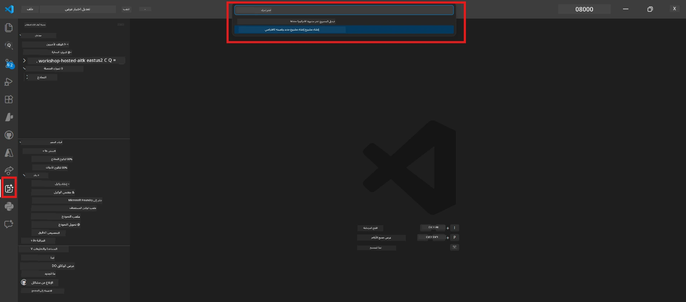
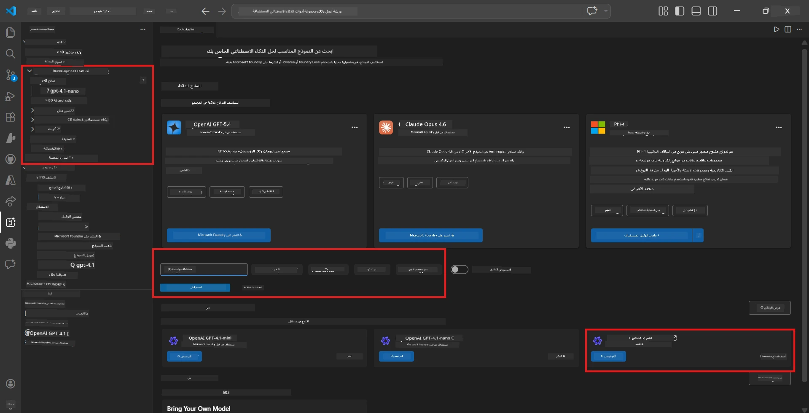
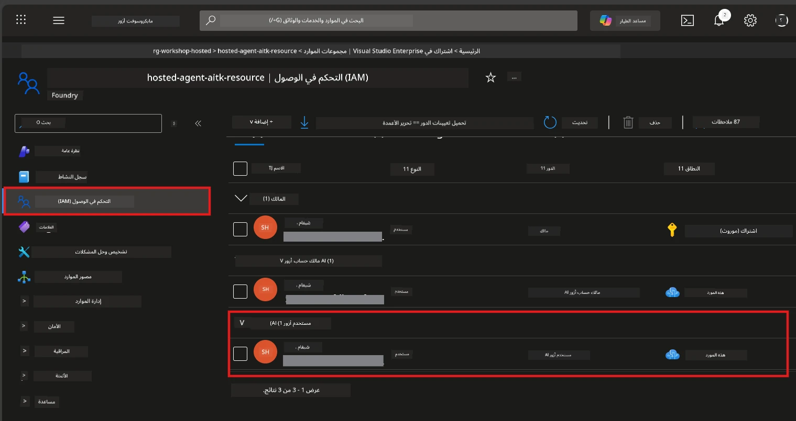

# الوحدة 2 - إنشاء مشروع Foundry ونشر نموذج

في هذه الوحدة، تقوم بإنشاء (أو اختيار) مشروع Microsoft Foundry ونشر نموذج سيستخدمه الوكيل الخاص بك. كل خطوة مكتوبة بشكل صريح - اتبعها بالترتيب.

> إذا كان لديك بالفعل مشروع Foundry مع نموذج منشور، تخطَّ إلى [الوحدة 3](03-create-hosted-agent.md).

---

## الخطوة 1: إنشاء مشروع Foundry من VS Code

ستستخدم امتداد Microsoft Foundry لإنشاء مشروع دون مغادرة VS Code.

1. اضغط `Ctrl+Shift+P` لفتح **لوحة الأوامر**.
2. اكتب: **Microsoft Foundry: Create Project** واخترها.
3. يظهر قائمة منسدلة - اختر **اشتراك Azure** الخاص بك من القائمة.
4. سيُطلب منك اختيار أو إنشاء **مجموعة موارد**:
   - لإنشاء واحدة جديدة: اكتب اسمًا (مثلاً، `rg-hosted-agents-workshop`) واضغط Enter.
   - لاستخدام واحدة موجودة: اخترها من القائمة المنسدلة.
5. اختر **المنطقة**. **مهم:** اختر منطقة تدعم الوكلاء المُستضافين. تحقق من [توفر المنطقة](https://learn.microsoft.com/azure/foundry/agents/concepts/hosted-agents#region-availability) - الخيارات الشائعة هي `East US`، `West US 2`، أو `Sweden Central`.
6. أدخل **اسمًا** لمشروع Foundry (مثلاً، `workshop-agents`).
7. اضغط Enter وانتظر حتى يكتمل الإعداد.

> **يستغرق الإعداد من 2 إلى 5 دقائق.** سترى إشعار تقدم في الزاوية السفلى اليمنى من VS Code. لا تغلق VS Code أثناء الإعداد.

8. عند الانتهاء، سيظهر **شريط Microsoft Foundry الجانبي** مشروعك الجديد تحت **الموارد**.
9. انقر على اسم المشروع لتوسيعه وتأكد من ظهور أقسام مثل **النماذج + نقاط النهاية** و**الوكلاء**.



### بديل: الإنشاء عبر بوابة Foundry

إذا كنت تفضل استخدام المتصفح:

1. افتح [https://ai.azure.com](https://ai.azure.com) وقم بتسجيل الدخول.
2. انقر على **إنشاء مشروع** في الصفحة الرئيسية.
3. أدخل اسم المشروع، اختر الاشتراك، مجموعة الموارد، والمنطقة.
4. انقر على **إنشاء** وانتظر حتى يكتمل الإعداد.
5. بمجرد الإنشاء، عد إلى VS Code - يجب أن يظهر المشروع في الشريط الجانبي لـ Foundry بعد التحديث (انقر على أيقونة التحديث).

---

## الخطوة 2: نشر نموذج

يحتاج [الوكيل المُستضاف](https://learn.microsoft.com/azure/foundry/agents/concepts/hosted-agents) الخاص بك إلى نموذج Azure OpenAI لتوليد الردود. ستقوم [بنشر واحد الآن](https://learn.microsoft.com/azure/ai-foundry/openai/how-to/create-resource#deploy-a-model).

1. اضغط `Ctrl+Shift+P` لفتح **لوحة الأوامر**.
2. اكتب: **Microsoft Foundry: Open [Model Catalog](https://learn.microsoft.com/azure/ai-foundry/openai/concepts/models)** واخترها.
3. يفتح عرض كتالوج النماذج في VS Code. تصفح أو استخدم شريط البحث للعثور على **gpt-4.1**.
4. انقر على بطاقة نموذج **gpt-4.1** (أو `gpt-4.1-mini` إذا كنت تفضل تكلفة أقل).
5. انقر **نشر**.



6. في إعدادات النشر:
   - **اسم النشر**: اترك الاسم الافتراضي (مثلاً، `gpt-4.1`) أو أدخل اسمًا مخصصًا. **تذكر هذا الاسم** - ستحتاجه في الوحدة 4.
   - **الهدف**: اختر **نشر إلى Microsoft Foundry** واختر المشروع الذي أنشأته للتو.
7. انقر **نشر** وانتظر حتى يكتمل النشر (1-3 دقائق).

### اختيار نموذج

| النموذج | الأنسب لـ | التكلفة | ملاحظات |
|--------|------------|---------|---------|
| `gpt-4.1` | ردود عالية الجودة ومفصلة | أعلى | أفضل النتائج، يُوصى به للاختبار النهائي |
| `gpt-4.1-mini` | تطوير سريع وتكلفة أقل | أقل | مناسب لتطوير الورشة والاختبار السريع |
| `gpt-4.1-nano` | المهام الخفيفة | الأدنى | الأكثر توفيرًا، لكنه يقدم ردودًا أبسط |

> **التوصية لهذه الورشة:** استخدم `gpt-4.1-mini` للتطوير والاختبار. إنه سريع ورخيص ويولد نتائج جيدة للتمارين.

### التحقق من نشر النموذج

1. في الشريط الجانبي **Microsoft Foundry**، قم بتوسيع مشروعك.
2. انظر تحت **النماذج + نقاط النهاية** (أو القسم المماثل).
3. يجب أن ترى نموذجك المنشور (مثلاً، `gpt-4.1-mini`) مع حالة **تم بنجاح** أو **نشط**.
4. انقر على نشر النموذج لرؤية تفاصيله.
5. **دوّن** هاتين القيمتين - ستحتاجهما في الوحدة 4:

   | الإعداد | أين تجده | مثال قيمة |
   |---------|----------|-----------|
   | **نقطة نهاية المشروع** | انقر على اسم المشروع في شريط Foundry الجانبي. يظهر عنوان URL للنقطة النهاية في عرض التفاصيل. | `https://<account>.services.ai.azure.com/api/projects/<project>` |
   | **اسم نشر النموذج** | الاسم المعروض بجانب النموذج المنشور. | `gpt-4.1-mini` |

---

## الخطوة 3: تعيين أدوار RBAC المطلوبة

هذه هي **الخطوة الأكثر تفويتًا**. بدون الأدوار الصحيحة، سيفشل النشر في الوحدة 6 بخطأ في الأذونات.

### 3.1 تعيين دور Azure AI User لنفسك

1. افتح متصفحًا واذهب إلى [https://portal.azure.com](https://portal.azure.com).
2. في شريط البحث العلوي، اكتب اسم **مشروع Foundry** الخاص بك وانقر عليه في النتائج.
   - **مهم:** انتقل إلى مورد **المشروع** (النوع: "مشروع Microsoft Foundry")، **ليس** إلى حساب/مورد رئيسي.
3. في التنقل الأيسر للمشروع، انقر على **التحكم بالوصول (IAM)**.
4. انقر زر **+ إضافة** في الأعلى → اختر **إضافة تعيين دور**.
5. في تبويب **الدور**، ابحث عن [**Azure AI User**](https://learn.microsoft.com/azure/foundry/concepts/rbac-foundry#built-in-roles) واختره. انقر **التالي**.
6. في تبويب **الأعضاء**:
   - اختر **مستخدم، مجموعة، أو خدمة رئيسية**.
   - انقر **+ اختيار أعضاء**.
   - ابحث عن اسمك أو بريدك الإلكتروني، اختر نفسك، ثم انقر **اختيار**.
7. انقر **مراجعة + تعيين** → ثم انقر **مراجعة + تعيين** مرة أخرى للتأكيد.



### 3.2 (اختياري) تعيين دور Azure AI Developer

إذا كنت بحاجة لإنشاء موارد إضافية داخل المشروع أو إدارة النشرات برمجيًا:

1. كرر الخطوات أعلاه، لكن في الخطوة 5 اختر **Azure AI Developer** بدلاً من ذلك.
2. قم بالتعيين على مستوى **مورد Foundry (الحساب)**، وليس فقط على مستوى المشروع.

### 3.3 التحقق من تعيينات الدور الخاصة بك

1. في صفحة **التحكم بالوصول (IAM)** للمشروع، انقر على تبويب **تعيينات الدور**.
2. ابحث عن اسمك.
3. يجب أن ترى على الأقل **Azure AI User** مدرجًا لنطاق المشروع.

> **لماذا هذا مهم:** يمنح دور [`Azure AI User`](https://learn.microsoft.com/azure/foundry/concepts/rbac-foundry#built-in-roles) إجراء بيانات `Microsoft.CognitiveServices/accounts/AIServices/agents/write`. بدونه، سترى هذا الخطأ أثناء النشر:
>
> ```
> Error: lacks the required data action 
> Microsoft.CognitiveServices/accounts/AIServices/agents/write 
> to perform POST /api/projects/{projectName}/assistants operation.
> ```
>
> راجع [الوحدة 8 - استكشاف الأخطاء وإصلاحها](08-troubleshooting.md) لمزيد من التفاصيل.

---

### نقطة التحقق

- [ ] يوجد مشروع Foundry ويظهر في شريط Microsoft Foundry الجانبي في VS Code
- [ ] تم نشر نموذج واحد على الأقل (مثل `gpt-4.1-mini`) بحالة **تم بنجاح**
- [ ] دوّنت عنوان URL الخاص بـ **نقطة نهاية المشروع** و**اسم نشر النموذج**
- [ ] لديك دور **Azure AI User** معين على مستوى **المشروع** (تحقق في بوابة Azure → IAM → تعيينات الدور)
- [ ] المشروع في [منطقة مدعومة](https://learn.microsoft.com/azure/foundry/agents/concepts/hosted-agents#region-availability) للوكلاء المُستضافين

---

**السابق:** [01 - تثبيت Foundry Toolkit](01-install-foundry-toolkit.md) · **التالي:** [03 - إنشاء وكيل مستضاف →](03-create-hosted-agent.md)

---

<!-- CO-OP TRANSLATOR DISCLAIMER START -->
**إخلاء المسؤولية**:  
تمت ترجمة هذا المستند باستخدام خدمة الترجمة بالذكاء الاصطناعي [Co-op Translator](https://github.com/Azure/co-op-translator). بينما نسعى للدقة، يرجى العلم أن الترجمات الآلية قد تحتوي على أخطاء أو عدم دقة. يجب اعتبار المستند الأصلي بلغته الأصلية المصدر الموثوق به. بالنسبة للمعلومات الحساسة، يُنصح بالترجمة المهنية البشرية. نحن غير مسؤولين عن أي سوء فهم أو تفسير ناتج عن استخدام هذه الترجمة.
<!-- CO-OP TRANSLATOR DISCLAIMER END -->