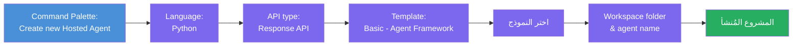
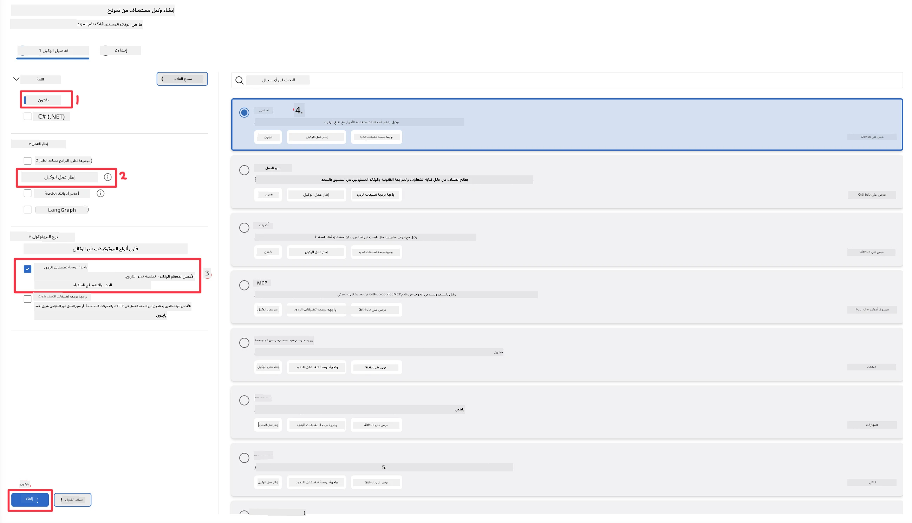
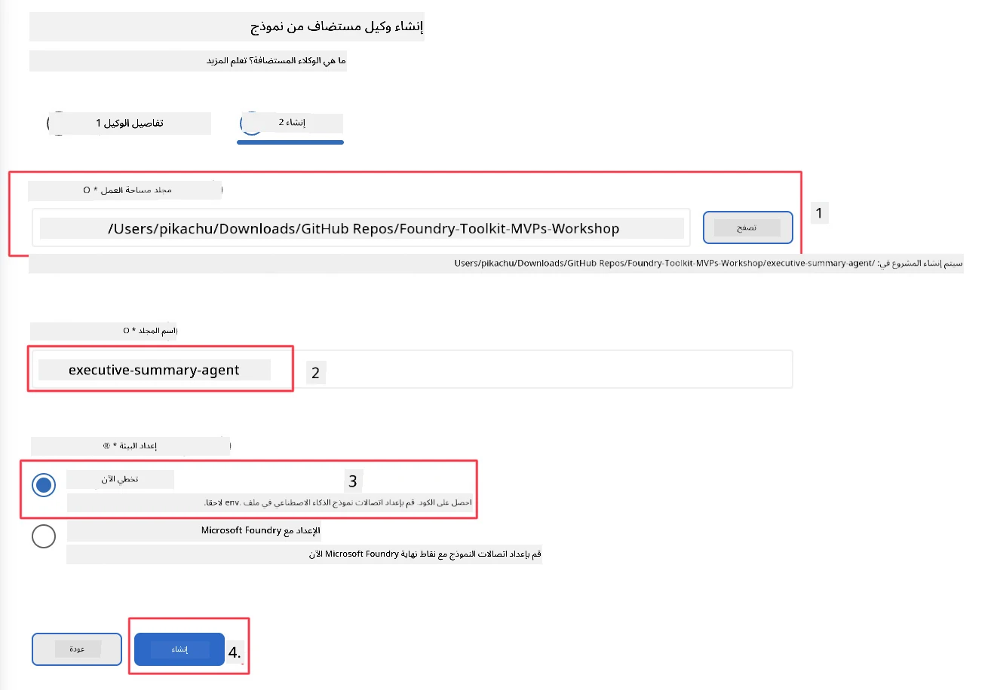

# الوحدة 2 - إنشاء وكيل مستضاف جديد

⏱️ ~5 دقائق

في هذه الوحدة، ستستخدم Foundry Toolkit لـ **تهيئة مشروع وكيل مستضاف**. تقوم التهيئة بإنشاء هيكل المشروع الكامل - `agent.yaml`، `main.py`، `Dockerfile`، `requirements.txt`، وتكوين تصحيح الأخطاء في VS Code - بحيث يمكنك التركيز على تخصيص سلوك الوكيل.

> **المفهوم الأساسي:** مجلد `agent/` في هذا المختبر هو مثال لما يولده Foundry Toolkit. لا تحتاج إلى كتابة هذه الملفات من الصفر.

### سير عمل معالج التهيئة



---

## الخطوة 1: افتح معالج إنشاء الوكيل المستضاف

1. اضغط على `Ctrl+Shift+P` لفتح **لوحة الأوامر**.
2. اكتب: **Foundry Toolkit: Create new Hosted Agent** واختره.

> **بديل: الإنشاء عبر بوابة Foundry**
> إذا كنت تفضل المتصفح، يمكنك إنشاء مشروعك على [https://ai.azure.com](https://ai.azure.com). بمجرد تجهيز المشروع، عد إلى VS Code واستخدم الشريط الجانبي لـ **Foundry Toolkit** للاتصال به.

> **بديل:** انقر على أيقونة **+** بجانب **Hosted Agents (Preview)** في الشريط الجانبي لـ Foundry Toolkit.

## الخطوة 2: اختر الإعدادات



1. في قسم التنقل / الخيارات على اليسار، اختر ما يلي:

| القائمة | التحديد | الملاحظات |
|--------|-----------|-------|
| **اللغة** | Python | تدعم أيضًا C# |
| **الإطار** | Agent Framework | نقطة بداية بسيطة باستخدام Agent Framework SDK |
| **نوع API** | Response API | `POST /responses` - محادثة، مع سجل يديره المنصة |
| **القالب** | Basic | نقطة بداية بسيطة باستخدام Agent Framework SDK |

2. بمجرد التحديد، انقر على **التالي**



3. في النافذة التالية، اختر ما يلي:

| القائمة | التحديد | الملاحظات |
|--------|-----------|-------|
| **مجلد مساحة العمل** | اختر مجلد الهدف | مثلًا `/workspace/Foundry_Toolkit_for_VSCode_Lab/` أو مجلد فرعي داخل هذا المستودع |
| **اسم الوكيل** | أدخل اسمًا | مثلًا `executive-summary-agent` |
| **إعداد البيئة** | تخطى الإعداد الآن |  |

انقر على **إنشاء** لإنشاء وكيلنا. سيتم إنشاء مجلد جديد باسم الوكيل المستضاف.

## الخطوة 3: فحص المشروع المُنشأ

بعد الانتهاء من التهيئة، تحقق من وجود هذه الملفات في المستكشف (`Ctrl+Shift+E`):

```
📂 my-agent/
├── .env                ← Environment variables (placeholders)
├── .vscode/
│   ├── launch.json     ← Debug config (F5 → run + Agent Inspector)
│   └── tasks.json      ← VS Code task definitions
├── agent.yaml          ← Agent definition (kind: hosted)
├── Dockerfile          ← Container config for deployment
├── main.py             ← Agent entry point (your main code)
└── requirements.txt    ← Python dependencies
```

### شرح الملفات الأساسية

| الملف | الغرض |
|------|---------|
| `agent.yaml` | يعلن عن الوكيل كـ `kind: hosted`، يربط متغيرات البيئة، ويُعرّف بروتوكول `/responses` |
| `main.py` | ينشئ `FoundryChatClient` → يلفه في `Agent` مع تعليمات → يخدم عبر `ResponsesHostServer` على المنفذ 8088 |
| `Dockerfile` | يستخدم `python:3.12-slim`، يثبت التبعيات، يفتح المنفذ 8088، يشغّل `main.py` |
| `requirements.txt` | `agent-framework-foundry`، `agent-framework-foundry-hosting`، `mcp`، `debugpy` |

> **مهم:** افتح مجلد الوكيل المُهيأ مباشرةً في VS Code (مجلد `agent/` نفسه) حتى تعمل ملفات `.vscode/launch.json` و `tasks.json` بشكل صحيح عند تصحيح الأخطاء بالضغط على F5.

---

### ✅ نقطة التحقق

- [ ] تم إنشاء المشروع المُهيأ مع كل الملفات المتوقعة
- [ ] يعرض `agent.yaml` القيمة `kind: hosted` و`protocol: responses`
- [ ] `main.py` يستورد `Agent`، `FoundryChatClient`، `ResponsesHostServer`
- [ ] مجلد الوكيل مفتوح في VS Code كجذر مساحة العمل

---

**السابق:** [01 - الإعداد](01-setup.md) · **التالي:** [03 - التكوين والبرمجة →](03-configure-and-code.md)

---

<!-- CO-OP TRANSLATOR DISCLAIMER START -->
**تنويه**:
تمت ترجمة هذا المستند باستخدام خدمة الترجمة بالذكاء الاصطناعي [Co-op Translator](https://github.com/Azure/co-op-translator). بينما نسعى للدقة، يرجى العلم أن الترجمات الآلية قد تحتوي على أخطاء أو عدم دقة. يجب اعتبار المستند الأصلي بلغته الأصلية المصدر الرسمي والمعتمد. للمعلومات الهامة، يُنصح بالاستعانة بترجمة بشرية محترفة. نحن غير مسؤولين عن أي سوء فهم أو تفسير ناتج عن استخدام هذه الترجمة.
<!-- CO-OP TRANSLATOR DISCLAIMER END -->