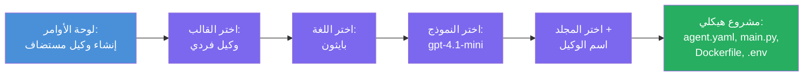

# الوحدة 3 - إنشاء وكيل مستضاف جديد (تم الإنشاء التلقائي بواسطة إضافة Foundry)

في هذه الوحدة، تستخدم إضافة Microsoft Foundry لـ **إنشاء مشروع [وكيل مستضاف](https://learn.microsoft.com/azure/foundry/agents/concepts/hosted-agents) جديد**. حيث تقوم الإضافة بإنشاء هيكل المشروع بالكامل لك - بما في ذلك `agent.yaml` و `main.py` و `Dockerfile` و `requirements.txt` وملف `.env` وتكوين تصحيح أخطاء VS Code. بعد إنشاء الهيكل، تقوم بتخصيص هذه الملفات بإرشادات الوكيل وأدواته وتكوينه.

> **المفهوم الرئيسي:** مجلد `agent/` في هذا المختبر هو مثال لما تقوم إضافة Foundry بإنشائه عندما تقوم بتشغيل أمر الإنشاء هذا. أنت لا تكتب هذه الملفات من الصفر - الإضافة تنشئها، ثم تقوم بتعديلها.

### تدفق معالج الإنشاء


---

## الخطوة 1: افتح معالج إنشاء الوكيل المستضاف

1. اضغط `Ctrl+Shift+P` لفتح **لوحة الأوامر**.
2. اكتب: **Microsoft Foundry: Create a New Hosted Agent** واختره.
3. يفتح معالج إنشاء الوكيل المستضاف.

> **مسار بديل:** يمكنك أيضاً الوصول إلى هذا المعالج من الشريط الجانبي لـ Microsoft Foundry → انقر على أيقونة **+** بجانب **Agents** أو انقر بزر الفأرة الأيمن واختر **Create New Hosted Agent**.

---

## الخطوة 2: اختر القالب الخاص بك

يسألك المعالج لاختيار قالب. سترى خيارات مثل:

| القالب | الوصف | متى تستخدمه |
|----------|-------------|-------------|
| **وكيل مفرد** | وكيل واحد بنموذجه الخاص وتعليماته وأدواته الاختيارية | هذا المختبر (الوحدة 01) |
| **تدفق عمل متعدد الوكلاء** | عدة وكلاء يتعاونون بالتتابع | الوحدة 02 |

1. اختر **وكيل مفرد**.
2. انقر على **التالي** (أو ينتقل الاختيار تلقائياً).

---

## الخطوة 3: اختر لغة البرمجة

1. اختر **Python** (الموصى بها لهذا المختبر).
2. انقر **التالي**.

> **يدعم C# أيضاً** إذا فضلت .NET. هيكل الإنشاء مشابه (يستخدم `Program.cs` بدلاً من `main.py`).

---

## الخطوة 4: اختر النموذج الخاص بك

1. يعرض المعالج النماذج المنشورة في مشروع Foundry الخاص بك (من الوحدة 2).
2. اختر النموذج الذي نشرته - مثلاً **gpt-4.1-mini**.
3. اضغط **التالي**.

> إذا لم ترى أي نماذج، عد إلى [الوحدة 2](02-create-foundry-project.md) وقم بنشر نموذج أولاً.

---

## الخطوة 5: اختر موقع المجلد واسم الوكيل

1. يفتح مربع حوار ملف - اختر **مجلد الهدف** حيث سيتم إنشاء المشروع. لهذا المختبر:
   - إذا بدأت من جديد: اختر أي مجلد (مثلاً `C:\Projects\my-agent`)
   - إذا كنت تعمل ضمن مستودع المختبر: أنشئ مجلداً فرعياً جديداً تحت `workshop/lab01-single-agent/agent/`
2. أدخل اسم **للوكيل المستضاف** (مثلاً `executive-summary-agent` أو `my-first-agent`).
3. انقر **إنشاء** (أو اضغط Enter).

---

## الخطوة 6: انتظر إتمام الإنشاء

1. يفتح VS Code **نافذة جديدة** مع المشروع المنشأ.
2. انتظر عدة ثوانٍ حتى يكتمل تحميل المشروع.
3. يجب أن ترى الملفات التالية في لوحة المستكشف (`Ctrl+Shift+E`):

```
📂 my-first-agent/
├── .env                ← Environment variables (auto-generated with placeholders)
├── .vscode/
│   └── launch.json     ← Debug configuration (F5 to run + Agent Inspector)
├── agent.yaml          ← Agent definition (kind: hosted)
├── Dockerfile          ← Container configuration for deployment
├── main.py             ← Agent entry point (your main code file)
└── requirements.txt    ← Python dependencies
```

> **هذا هو نفس الهيكل الموجود في مجلد `agent/`** في هذا المختبر. تقوم إضافة Foundry بإنشاء هذه الملفات تلقائياً - لا تحتاج إلى إنشائها يدوياً.

> **ملاحظة المختبر:** في مستودع هذا المختبر، مجلد `.vscode/` يقع في **جذر مساحة العمل** (ليس داخل كل مشروع). يحتوي على `launch.json` و `tasks.json` مشتركة مع تكوينين للتصحيح - **"Lab01 - Single Agent"** و **"Lab02 - Multi-Agent"** - كل منها يشير إلى مجلد العمل الصحيح للمختبر. عند الضغط على F5، اختر التكوين المتطابق مع المختبر الذي تعمل عليه من القائمة المنسدلة.

---

## الخطوة 7: افهم كل ملف تم إنشاؤه

خذ لحظة لفحص كل ملف أنشأه المعالج. فهمها مهم للوحدة 4 (التخصيص).

### 7.1 `agent.yaml` - تعريف الوكيل

افتح `agent.yaml`. شكله كما يلي:

```yaml
# yaml-language-server: $schema=https://raw.githubusercontent.com/microsoft/AgentSchema/refs/heads/main/schemas/v1.0/ContainerAgent.yaml

kind: hosted
name: my-first-agent
description: >
  A hosted agent deployed to Microsoft Foundry Agent Service.
metadata:
  authors:
    - Microsoft
  tags:
    - Azure AI AgentServer
    - Microsoft Agent Framework
    - Hosted Agent
protocols:
  - protocol: responses
    version: v1
environment_variables:
  - name: AZURE_AI_PROJECT_ENDPOINT
    value: ${PROJECT_ENDPOINT}
  - name: AZURE_AI_MODEL_DEPLOYMENT_NAME
    value: ${MODEL_DEPLOYMENT_NAME}
dockerfile_path: Dockerfile
resources:
  cpu: '0.25'
  memory: 0.5Gi
```

**الحقول الأساسية:**

| الحقل | الغرض |
|-------|---------|
| `kind: hosted` | يعلن أن هذا وكيل مستضاف (مبني على الحاوية، منشور إلى [خدمة Foundry Agent](https://learn.microsoft.com/azure/foundry/agents/overview)) |
| `protocols: responses v1` | يعرض الوكيل نقطة نهاية HTTP متوافقة مع OpenAI على `/responses` |
| `environment_variables` | يربط قيم `.env` بمتغيرات البيئة في الحاوية وقت النشر |
| `dockerfile_path` | يشير إلى ملف Dockerfile المستخدم لبناء صورة الحاوية |
| `resources` | تخصيص وحدة المعالجة والذاكرة للحاوية (0.25 وحدة CPU، 0.5Gi ذاكرة) |

### 7.2 `main.py` - نقطة دخول الوكيل

افتح `main.py`. هذا هو ملف البايثون الرئيسي حيث يعيش منطق وكيلك. محتويات الهيكل تشمل:

```python
from agent_framework.azure import AzureAIAgentClient
from azure.ai.agentserver.agentframework import from_agent_framework
from azure.identity.aio import DefaultAzureCredential
```

**الاستيرادات الأساسية:**

| الاستيراد | الغرض |
|--------|--------|
| `AzureAIAgentClient` | يتصل بمشروع Foundry الخاص بك ويُنشئ الوكلاء عبر `.as_agent()` |
| [`DefaultAzureCredential`](https://learn.microsoft.com/azure/developer/python/sdk/authentication/credential-chains#defaultazurecredential-overview) | يتولى المصادقة (Azure CLI، تسجيل الدخول في VS Code، الهوية المُدارة، أو الخدمة الأساسية) |
| `from_agent_framework` | يلف الوكيل كخادم HTTP يعرض نقطة النهاية `/responses` |

التدفق الرئيسي هو:
1. انشئ بيانات الاعتماد → انشئ العميل → استدعاء `.as_agent()` للحصول على وكيل (مدير سياق غير متزامن) → لفه كخادم → شغله

### 7.3 `Dockerfile` - صورة الحاوية

```dockerfile
FROM python:3.14-slim

WORKDIR /app

COPY ./ .

RUN pip install --upgrade pip && \
    if [ -f requirements.txt ]; then \
        pip install -r requirements.txt; \
    else \
        echo "No requirements.txt found" >&2; exit 1; \
    fi

EXPOSE 8088

CMD ["python", "main.py"]
```

**تفاصيل مهمة:**
- يستخدم `python:3.14-slim` كصورة أساسية.
- ينسخ جميع ملفات المشروع إلى `/app`.
- يرقّي `pip`، يثبت التبعيات من `requirements.txt`، ويفشل بسرعة إذا كان الملف مفقوداً.
- **يفتح المنفذ 8088** - هذا هو المنفذ المطلوب للوكلاء المستضافين. لا تغيره.
- يبدأ الوكيل باستخدام `python main.py`.

### 7.4 `requirements.txt` - التبعيات

```
agent-framework-azure-ai==1.0.0rc3
agent-framework-core==1.0.0rc3
azure-ai-agentserver-agentframework==1.0.0b16
azure-ai-agentserver-core==1.0.0b16
debugpy
agent-dev-cli
```

| الحزمة | الغرض |
|---------|---------|
| `agent-framework-azure-ai` | دمج Azure AI لإطار عمل الوكيل من مايكروسوفت |
| `agent-framework-core` | النظام الأساسي لبناء الوكلاء (يشمل `python-dotenv`) |
| `azure-ai-agentserver-agentframework` | وقت تشغيل خادم الوكيل المستضاف لخدمة Foundry Agent |
| `azure-ai-agentserver-core` | التجريدات الأساسية لخادم الوكيل |
| `debugpy` | دعم تصحيح الأخطاء في بايثون (يسمح بتصحيح F5 في VS Code) |
| `agent-dev-cli` | CLI تطوير محلي لاختبار الوكلاء (يستخدمه تكوين التصحيح/التشغيل) |

---

## فهم بروتوكول الوكيل

توصل الوكلاء المستضافون عبر بروتوكول **OpenAI Responses API**. عند التشغيل (محليًا أو في السحابة)، يعرض الوكيل نقطة نهاية HTTP واحدة:

```
POST http://localhost:8088/responses
Content-Type: application/json

{
  "input": "Your prompt here",
  "stream": false
}
```

تقوم خدمة Foundry Agent بمناداة هذه النقطة لإرسال مطالبات المستخدم واستقبال ردود الوكيل. هذا هو نفس البروتوكول الذي تستخدمه واجهة برمجة التطبيقات OpenAI، لذا وكيلك متوافق مع أي عميل يتحدث صيغة Responses الخاصة بـ OpenAI.

---

### نقطة التحقق

- [ ] أكمل معالج الإنشاء بنجاح وافتتح **نافذة VS Code جديدة**
- [ ] يمكنك رؤية كل الملفات الخمسة: `agent.yaml`، `main.py`، `Dockerfile`، `requirements.txt`، `.env`
- [ ] ملف `.vscode/launch.json` موجود (يمكنك من تصحيح F5 - في هذا المختبر في جذر مساحة العمل مع تكوينات خاصة بالمعمل)
- [ ] قرأت كل ملف وفهمت غرضه
- [ ] تفهم أن المنفذ `8088` مطلوب وأن نقطة النهاية `/responses` هي البروتوكول

---

**السابق:** [02 - إنشاء مشروع Foundry](02-create-foundry-project.md) · **التالي:** [04 - التكوين والبرمجة →](04-configure-and-code.md)

---

<!-- CO-OP TRANSLATOR DISCLAIMER START -->
**تنويه**:  
تمت ترجمة هذا المستند باستخدام خدمة الترجمة الآلية [Co-op Translator](https://github.com/Azure/co-op-translator). بينما نسعى لتحقيق الدقة، يرجى العلم بأن الترجمات الآلية قد تحتوي على أخطاء أو عدم دقة. يجب اعتبار المستند الأصلي بلغته الأصلية المصدر المعتمد. للمعلومات الحساسة، يُنصح بالاستعانة بترجمة بشرية محترفة. نحن غير مسؤولين عن أي سوء فهم أو تفسير ناتج عن استخدام هذه الترجمة.
<!-- CO-OP TRANSLATOR DISCLAIMER END -->