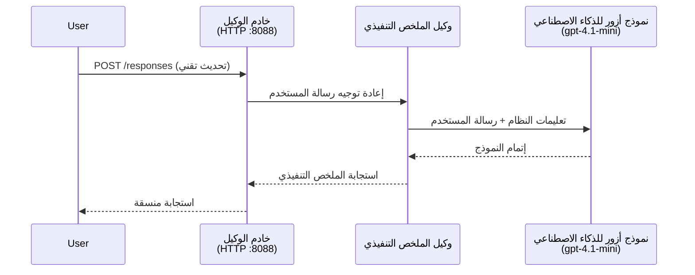
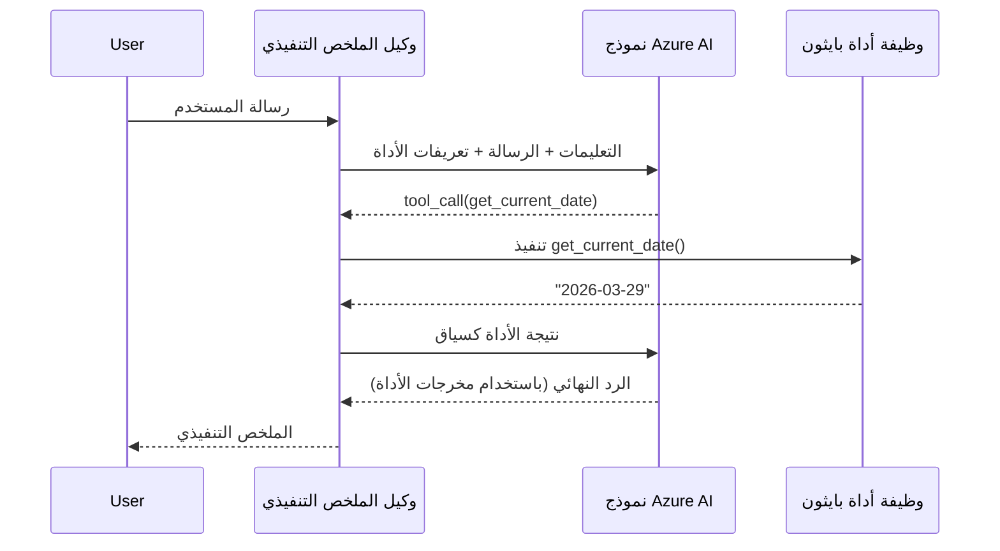

# الوحدة 4 - تكوين التعليمات، البيئة وتثبيت التبعيات

في هذه الوحدة، تقوم بتخصيص ملفات الوكيل التي تم إنشاؤها تلقائيًا من الوحدة 3. هنا تقوم بتحويل الهيكل العام إلى **وكيلك** - من خلال كتابة التعليمات، إعداد متغيرات البيئة، إضافة أدوات اختيارية، وتثبيت التبعيات.

> **تذكير:** قامت إضافة Foundry بإنشاء ملفات مشروعك تلقائيًا. الآن تقوم بتعديلها. انظر مجلد [`agent/`](../../../../../workshop/lab01-single-agent/agent) للحصول على مثال عملي كامل لوكيل مخصص.

---

## كيف تتناسب المكونات معًا

### دورة حياة الطلب (وكيل واحد)


> **مع الأدوات:** إذا كان الوكيل لديه أدوات مسجلة، فقد يرجع النموذج نداء أداة بدلاً من إكمال مباشر. يقوم الإطار بتنفيذ الأداة محليًا، ويعيد النتيجة إلى النموذج، ثم يولد النموذج الاستجابة النهائية.


---

## الخطوة 1: تكوين متغيرات البيئة

أنشأ الهيكل ملف `.env` بقيم نائبة. تحتاج إلى ملء القيم الحقيقية من الوحدة 2.

1. في مشروعك المنشأ تلقائيًا، افتح ملف **`.env`** (يوجد في جذر المشروع).
2. استبدل القيم النائبة بتفاصيل مشروع Foundry الحقيقية الخاصة بك:

   ```env
   PROJECT_ENDPOINT=https://<your-account>.services.ai.azure.com/api/projects/<your-project>
   MODEL_DEPLOYMENT_NAME=gpt-4.1-mini
   ```

3. احفظ الملف.

### أين تجد هذه القيم

| القيمة | كيفية العثور عليها |
|-------|--------------------|
| **نقطة نهاية المشروع** | افتح شريط Microsoft Foundry الجانبي في VS Code → انقر على مشروعك → يتم عرض عنوان URL لنقطة النهاية في عرض التفاصيل. يبدو كالتالي `https://<account-name>.services.ai.azure.com/api/projects/<project-name>` |
| **اسم نشر النموذج** | في شريط Foundry الجانبي، وسّع مشروعك → انظر تحت **النماذج + نقاط النهاية** → الاسم مدرج بجانب النموذج المنشور (مثلًا `gpt-4.1-mini`) |

> **الأمان:** لا تلتزم ملف `.env` في نظام التحكم بالإصدار أبدًا. هو مدرج بالفعل في `.gitignore` بشكل افتراضي. إذا لم يكن، أضفه:
> ```
> .env
> ```

### كيف تتدفق متغيرات البيئة

سلسلة الربط هي: `.env` → `main.py` (يقرأ عبر `os.getenv`) → `agent.yaml` (يربط إلى متغيرات بيئة الحاوية أثناء النشر).

في `main.py`، يقوم الهيكل بقراءة هذه القيم بهذه الطريقة:

```python
PROJECT_ENDPOINT = os.getenv("AZURE_AI_PROJECT_ENDPOINT") or os.getenv("PROJECT_ENDPOINT")
MODEL_DEPLOYMENT_NAME = os.getenv("AZURE_AI_MODEL_DEPLOYMENT_NAME", os.getenv("MODEL_DEPLOYMENT_NAME", "gpt-4.1-mini"))
```

يتم قبول كل من `AZURE_AI_PROJECT_ENDPOINT` و `PROJECT_ENDPOINT` (يستخدم `agent.yaml` بادئة `AZURE_AI_*`).

---

## الخطوة 2: كتابة تعليمات الوكيل

هذه هي أهم خطوة للتخصيص. التعليمات تحدد شخصية وكيلك، سلوكه، تنسيق المخرجات، وقيود الأمان.

1. افتح `main.py` في مشروعك.
2. ابحث عن سلسلة التعليمات (يحتوي الهيكل على واحدة افتراضية/عامة).
3. استبدلها بتعليمات مفصلة ومنظمة.

### ما تتضمنه التعليمات الجيدة

| المكون | الغرض | مثال |
|--------|-------|-------|
| **الدور** | ما هو الوكيل وما يفعله | "أنت وكيل الملخص التنفيذي" |
| **الجمهور** | من هم المستهدفون بالردود | "قادة كبار ذو خلفية تقنية محدودة" |
| **تعريف الإدخال** | نوع التنبيهات التي يتعامل معها | "تقارير الحوادث التقنية، التحديثات التشغيلية" |
| **تنسيق الإخراج** | البنية الدقيقة للردود | "الملخص التنفيذي: - ماذا حدث: ... - تأثير الأعمال: ... - الخطوة التالية: ..." |
| **القواعد** | القيود وشروط الرفض | "لا تضف معلومات تجاوز ما تم تقديمه" |
| **السلامة** | منع سوء الاستخدام والهلاوس | "إذا كان الإدخال غير واضح، اطلب توضيح" |
| **الأمثلة** | أزواج الإدخال/الإخراج لتوجيه السلوك | تضمين 2-3 أمثلة بإدخالات مختلفة |

### مثال: تعليمات وكيل الملخص التنفيذي

إليك التعليمات المستخدمة في ورشة العمل ضمن [`agent/main.py`](../../../../../workshop/lab01-single-agent/agent/main.py):

```python
AGENT_INSTRUCTIONS = """You are an "Explain Like I'm an Executive" agent.

Purpose:
Your job is to translate complex technical or operational information into
clear, concise, and outcome-focused summaries that can be easily understood
by non-technical executives.

Audience:
Senior leaders with limited technical background who care about impact,
risk, and what happens next.

What you must do:
- Rephrase the input so it is understandable to a non-technical audience
- Prioritize clarity, brevity, and outcomes over technical accuracy
- Remove technical jargon, logs, metrics, stack traces, and deep root-cause details
- Translate technical causes into simple cause-and-effect statements
- Explicitly call out business impact
- Always include a clear next step or action
- Maintain a neutral, factual, and calm executive tone
- Do NOT add new facts or speculate beyond the input

Standard Output Structure (always use this wording):

Executive Summary:
- What happened: <plain-language description>
- Business impact: <clear, non-technical impact>
- Next step: <clear action or mitigation>

Rules:
- Keep responses under 100 words
- Do NOT add facts beyond the input
- If input is unclear, ask for clarification
"""
```

4. استبدل سلسلة التعليمات الموجودة في `main.py` بتعليماتك المخصصة.
5. احفظ الملف.

---

## الخطوة 3: (اختياري) إضافة أدوات مخصصة

يمكن للوكلاء المستضافين تنفيذ **دوال بايثون محلية** كـ [أدوات](https://learn.microsoft.com/azure/foundry/agents/concepts/tool-catalog). هذه ميزة رئيسية للوكلاء الذين يعملون بالكود مقارنةً بالوكلاء الذين يعملون بالتنبيهات فقط - يمكن لوكيلك تشغيل أي منطق خادم.

### 3.1 تعريف دالة أداة

أضف دالة أداة إلى `main.py`:

```python
from agent_framework import tool

@tool
def get_current_date() -> str:
    """Returns the current date in YYYY-MM-DD format."""
    from datetime import date
    return str(date.today())
```

يقوم المُزين `@tool` بتحويل دالة بايثون عادية إلى أداة وكيل. تصبح الوثيقة التعريفية وصف الأداة الذي يراه النموذج.

### 3.2 تسجيل الأداة مع الوكيل

عند إنشاء الوكيل عبر مدير السياق `.as_agent()`، مرر الأداة في المعامل `tools`:

```python
async with AzureAIAgentClient(
    project_endpoint=PROJECT_ENDPOINT,
    model_deployment_name=MODEL_DEPLOYMENT_NAME,
    credential=credential,
).as_agent(
    name="my-agent",
    instructions=AGENT_INSTRUCTIONS,
    tools=[get_current_date],
) as agent:
    server = from_agent_framework(agent)
    await server.run_async()
```

### 3.3 كيف تعمل ندائات الأدوات

1. يرسل المستخدم تنبيهًا.
2. يقرر النموذج إذا ما كانت هناك حاجة إلى أداة (بناءً على التنبيه، التعليمات، وأوصاف الأدوات).
3. إذا كانت هناك حاجة لأداة، تستدعي الإطار دالة بايثون الخاصة بك محليًا (داخل الحاوية).
4. تُرسل القيمة المرجعة للأداة إلى النموذج كسياق.
5. يولد النموذج الاستجابة النهائية.

> **الأدوات تنفذ على الخادم** - تعمل داخل حاويتك، وليست في متصفح المستخدم أو النموذج. يعني هذا أنه يمكنك الوصول إلى قواعد البيانات، واجهات برمجة التطبيقات، أنظمة الملفات، أو أي مكتبة بايثون.

---

## الخطوة 4: إنشاء وتفعيل بيئة افتراضية

قبل تثبيت التبعيات، قم بإنشاء بيئة بايثون معزولة.

### 4.1 إنشاء البيئة الافتراضية

افتح طرفية في VS Code (`` Ctrl+` ``) وشغل الأمر:

```powershell
python -m venv .venv
```

ينشئ هذا مجلد `.venv` داخل دليل مشروعك.

### 4.2 تفعيل البيئة الافتراضية

**PowerShell (ويندوز):**

```powershell
.\.venv\Scripts\Activate.ps1
```

**موجه الأوامر (ويندوز):**

```cmd
.venv\Scripts\activate.bat
```

**macOS/Linux (بش):**

```bash
source .venv/bin/activate
```

يفترض أن ترى `(.venv)` تظهر في بداية موجه الطرفية، مما يدل على تفعيل البيئة الافتراضية.

### 4.3 تثبيت التبعيات

مع تفعيل البيئة الافتراضية، قم بتثبيت الحزم المطلوبة:

```powershell
pip install -r requirements.txt
```

يقوم هذا بتثبيت:

| الحزمة | الغرض |
|---------|--------|
| `agent-framework-azure-ai==1.0.0rc3` | تكامل Azure AI لإطار عمل الوكلاء من Microsoft |
| `agent-framework-core==1.0.0rc3` | الإطار الأساسي لتشغيل الوكلاء (يشمل `python-dotenv`) |
| `azure-ai-agentserver-agentframework==1.0.0b16` | وقت تشغيل خادم الوكيل المستضاف لخدمة وكيل Foundry |
| `azure-ai-agentserver-core==1.0.0b16` | التجريدات الأساسية لخادم الوكلاء |
| `debugpy` | تصحيح بايثون (يمكن تصحيح F5 في VS Code) |
| `agent-dev-cli` | أداة CLI محلية لتطوير واختبار الوكلاء |

### 4.4 تحقق من التثبيت

```powershell
pip list | Select-String "agent-framework|agentserver"
```

الناتج المتوقع:
```
agent-framework-azure-ai   1.0.0rc3
agent-framework-core       1.0.0rc3
azure-ai-agentserver-agentframework 1.0.0b16
azure-ai-agentserver-core  1.0.0b16
```

---

## الخطوة 5: التحقق من المصادقة

يستخدم الوكيل [`DefaultAzureCredential`](https://learn.microsoft.com/azure/developer/python/sdk/authentication/credential-chains#defaultazurecredential-overview) الذي يحاول عدة أساليب مصادقة بهذا الترتيب:

1. **متغيرات البيئة** - `AZURE_CLIENT_ID`، `AZURE_TENANT_ID`، `AZURE_CLIENT_SECRET` (الوكيل الخدمي)
2. **Azure CLI** - يلتقط جلسة `az login` الخاصة بك
3. **VS Code** - يستخدم الحساب الذي قمت بتسجيل الدخول به إلى VS Code
4. **Managed Identity** - تُستخدم عند التشغيل في Azure (وقت النشر)

### 5.1 تحقق للتطوير المحلي

يجب أن يعمل واحد على الأقل من هذه الطرق:

**الخيار أ: Azure CLI (موصى به)**

```powershell
az account show --query "{name:name, id:id}" --output table
```

المتوقع: يعرض اسم الاشتراك ومعرفه.

**الخيار ب: تسجيل الدخول إلى VS Code**

1. انظر إلى أسفل يسار VS Code لأيقونة **الحسابات**.
2. إذا رأيت اسم حسابك، فأنت موثق.
3. إذا لم يكن، انقر على الأيقونة → **تسجيل الدخول لاستخدام Microsoft Foundry**.

**الخيار ج: الوكيل الخدمي (لـ CI/CD)**

```powershell
$env:AZURE_TENANT_ID = "<your-tenant-id>"
$env:AZURE_CLIENT_ID = "<your-client-id>"
$env:AZURE_CLIENT_SECRET = "<your-client-secret>"
```

### 5.2 مشكلة مصادقة شائعة

إذا كنت قد سجلت الدخول لأكثر من حساب Azure، تأكد من اختيار الاشتراك الصحيح:

```powershell
az account set --subscription "<your-subscription-id>"
```

---

### نقطة تحقق

- [ ] يحتوي ملف `.env` على قيم صالحة لـ `PROJECT_ENDPOINT` و `MODEL_DEPLOYMENT_NAME` (ليست نائبة)
- [ ] تم تخصيص تعليمات الوكيل في `main.py` - تحدد الدور، الجمهور، تنسيق المخرجات، القواعد، وقيود السلامة
- [ ] (اختياري) تم تعريف الأدوات المخصصة وتسجيلها
- [ ] تم إنشاء البيئة الافتراضية وتفعيلها (`(.venv)` ظاهر في موجه الطرفية)
- [ ] يكتمل `pip install -r requirements.txt` بنجاح دون أخطاء
- [ ] يظهر الأمر `pip list | Select-String "azure-ai-agentserver"` أن الحزمة مثبتة
- [ ] المصادقة صالحة - يعيد `az account show` اشتراكك أو تم تسجيل الدخول إلى VS Code

---

**السابق:** [03 - إنشاء وكيل مستضاف](03-create-hosted-agent.md) · **التالي:** [05 - اختبار محلي →](05-test-locally.md)

---

<!-- CO-OP TRANSLATOR DISCLAIMER START -->
**تنويه**:  
تمت ترجمة هذا المستند باستخدام خدمة الترجمة الآلية [Co-op Translator](https://github.com/Azure/co-op-translator). بينما نسعى لتحقيق الدقة، يرجى العلم أن الترجمات الآلية قد تحتوي على أخطاء أو عدم دقة. يجب اعتبار المستند الأصلي بلغته الأصلية المصدر الموثوق به. للمعلومات الحرجة، يُفضل الاعتماد على ترجمة بشرية محترفة. نحن غير مسؤولين عن أي سوء فهم أو تفسيرات خاطئة تنشأ من استخدام هذه الترجمة.
<!-- CO-OP TRANSLATOR DISCLAIMER END -->