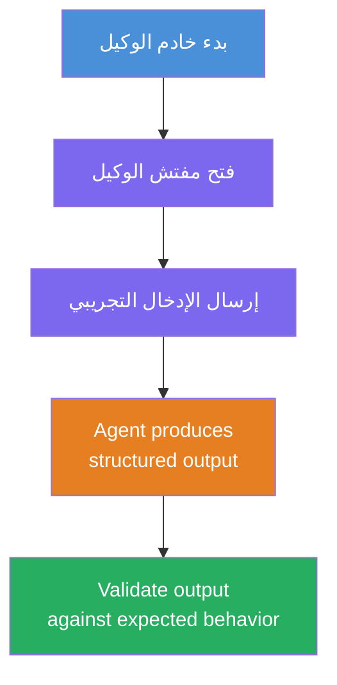
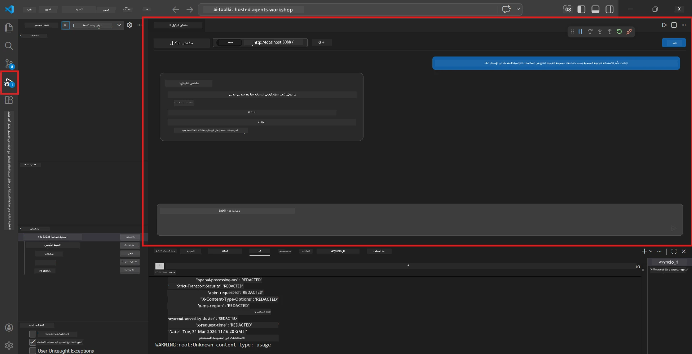
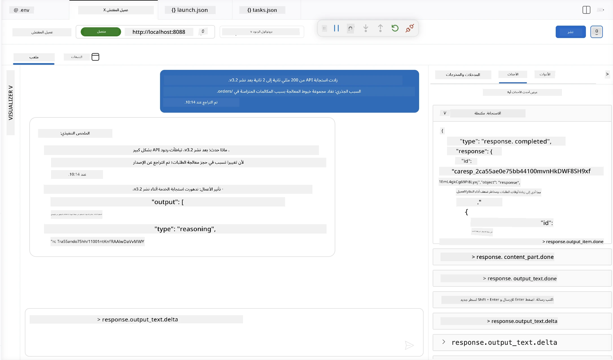

# الوحدة 4 - الاختبار محليًا

⏱️ ~10 دقائق

في هذه الوحدة، تقوم بتشغيل العميل الخاص بك محليًا والتحقق من عمله بشكل صحيح باستخدام **اختبارات وظيفية للسيناريوهات السعيدة**. ستستخدم Agent Inspector (واجهة المستخدم المرئية) أو استدعاءات HTTP مباشرة لتأكيد أن العميل ينتج ردودًا منظمة ودقيقة.

### سير اختبار محلي



---

## الخيار 1: اضغط F5 - التصحيح باستخدام Agent Inspector (مُوصى به)

### بدء المصحح

1. افتح مجلد **executive-summary-agent/** مباشرة في VS Code (`File → Open Folder`).
2. افتح لوحة **التشغيل والتصحيح** (`Ctrl+Shift+D`).
3. اختر **Debug Local Agent Server** من القائمة المنسدلة.
4. اضغط **F5** (أو انقر ▶ بدء التصحيح).

> ⚠️ **مهم جدًا: اختر مفسر بايثون الخاص بك**
> إذا تلقيت "ModuleNotFoundError" أو فشل المصحح في البدء، يجب أن تخبر VS Code باستخدام بيئة العمل الافتراضية الخاصة بك:
  > 1. اضغط `Ctrl+Shift+P` $\rightarrow$ اكتب **Python: Select Interpreter**.
  > 2. اختر المفسر الواقع في مجلد `.venv` الخاص بمشروعك (مثل `.\.venv\Scripts\python.exe` على ويندوز).
  > 3. أعد تشغيل جلسة التصحيح.
> إذا ما زلت تحصل على أخطاء، حدّث ملف `tasks.json` يدويًا كالتالي:
  > 1. افتح ملف `.vscode/tasks.json`
  > 2. انتقل إلى الأمر الموسوم: `Run Agent/Workflow HTTP Server`
  > 3. حدث قيمة الأمر كالتالي: `"value": "${workspaceFolder}/.venv/bin/python",`

### ماذا يحدث

1. يبدأ خادم HTTP على العنوان `http://localhost:8088/responses`.
2. تفتح لوحة **Agent Inspector** تلقائيًا - وهي واجهة دردشة مرئية للاختبار.
3. نقاط التوقف مفعّلة في `main.py`.

راقب الطرفية للآتي:
```
Starting executive summary hosted agent
Executive agent server running on http://localhost:8088
```

> **إذا لم تفتح Agent Inspector:** اضغط `Ctrl+Shift+P` → **Foundry Toolkit: Open Agent Inspector**.



> *قد تعرض الصورة شعار "AI TOOLKIT" الأقدم من إصدار امتداد سابق.*

---

## الخيار 2: الاختبار عبر الطرفية (بديل)

ابدأ العميل في طرفية واحدة، وأرسل الطلبات من طرفية أخرى:

```bash
# الجهاز الطرفي 1: بدء الوكيل
cd executive-summary-agent/
source .venv/bin/activate
python main.py
```

```bash
# المحطة 2: إرسال اختبار (curl)
curl -sS -X POST http://localhost:8088/responses \
  -H "Content-Type: application/json" \
  -d '{"input": "The API latency increased due to thread pool exhaustion caused by sync calls in v3.2.", "stream": false}'
```

---

## اختبارات السيناريوهات: التحقق الوظيفي للسيناريو السعيد

شغّل **جميع السيناريوهات الثلاثة** أدناه. هذه تتحقق من أن وكيلك ينتج مخرجات صحيحة ومنظمة لمدخلات واقعية.



### السيناريو 1: حادث تكنولوجيا المعلومات - ارتفاع تأخر API

**المدخل:**
```
The API latency increased from 200ms to 2s after deploying v3.2.
Root cause: thread pool starvation from synchronous calls in /orders.
Rolled back at 10:14.
```

**السلوك المتوقع:**
- ✅ يتبع هيكل "الملخص التنفيذي" (ماذا حدث / تأثير العمل / الخطوة التالية)
- ✅ لا يحتوي على مصطلحات تقنية (لا "thread pool"، لا "/orders"، لا "v3.2")
- ✅ يوضح بوضوح تأثير العمل (مثلاً، المستخدمون واجهوا تأخيرات)
- ✅ يشمل خطوة تالية (مثلاً، تم نشر الإصلاح، مراقبة قيد التطبيق)

---

### السيناريو 2: مسار بيانات - فشل ETL

**المدخل:**
```
The nightly ETL job failed because the upstream schema changed. APAC dashboards show missing data.
```

**السلوك المتوقع:**
- ✅ يلخص فشل تحديث البيانات بلغة بسيطة
- ✅ يذكر تأثير لوحة بيانات APAC
- ✅ يشمل خطوة تصحيحية لاحقة
- ✅ لا يذكر "ETL" أو "schema" أو مصطلحات تقنية أخرى

---

### السيناريو 3: الأمان - تسرب بيانات الاعتماد

**المدخل:**
```
Static analysis flagged a hardcoded secret in the repository.
The secret may have been exposed in commit history.
```

**السلوك المتوقع:**
- ✅ يصف مشكلة بيانات اعتماد / أمن بلغة ملائمة للإدارة التنفيذية
- ✅ يشير إلى خطر محتمل (وصول غير مصرح به)
- ✅ يحدد خطوات التصحيح (تدوير بيانات الاعتماد، تدقيق)
- ✅ لا يتضمن مصطلحات مثل "static analysis"، "commit history"، أو "hardcoded"

---

## معايير التحقق

لكل سيناريو، تحقق من:

| رقم | المعيار | شرط النجاح |
|---|----------|---------------|
| 1 | **الهيكل** | الرد يستخدم صيغة "الملخص التنفيذي" مع كل النقاط الثلاث |
| 2 | **اللغة البسيطة** | لا توجد مصطلحات تقنية لا يفهمها التنفيذي |
| 3 | **الدقة** | الملخص يعكس المدخلات - لا تفاصيل مختلقة |
| 4 | **الإيجاز** | الرد أقل من 100 كلمة |
| 5 | **الخطوة التالية** | ذكر إجراء واضح أو تخفيف |

---

## نصائح التصحيح

| المشكلة | الحل |
|-------|-----|
| العميل لا يبدأ | تحقق من قيم `.env`، تحقق من تفعيل venv، شغّل `pip install -r requirements.txt` |
| رد فارغ أو عام | راجع التعليمات في `main.py` - تأكد من تحديد تنسيق المخرجات |
| الرد يحتوي مصطلحات فنية | عزز قواعد "إزالة المصطلحات التقنية" في التعليمات |
| Agent Inspector لا يفتح | `Ctrl+Shift+P` → **Foundry Toolkit: Open Agent Inspector** |
| أخطاء نموذج في الطرفية | تحقق من تطابق `AZURE_AI_MODEL_DEPLOYMENT_NAME` بالضبط (حساسية حالة الأحرف) |

---

### ✅ نقطة التحقق

- [ ] العميل يبدأ محليًا بدون أخطاء
- [ ] Agent Inspector يفتح ويظهر واجهة دردشة (إذا استخدمت F5)
- [ ] **السيناريو 1** (حادث تكنولوجيا المعلومات) - ملخص تنفيذي منظم، بدون مصطلحات فنية
- [ ] **السيناريو 2** (مسار بيانات) - ملخص ذي صلة بتأثير العمل
- [ ] **السيناريو 3** (تنبيه أمني) - تواصل مناسب للمخاطر
- [ ] جميع الردود تتبع الهيكل المحدد للمخرجات

> **احفظ ردودك** (انسخها أو خذ لقطات شاشة) - ستقارنها مع نتائج السحابة في الوحدة 06.

---

**السابق:** [03 - الإعداد والبرمجة](03-configure-and-code.md) · **التالي:** [05 - النشر إلى Foundry →](05-deploy-to-foundry.md)

---

<!-- CO-OP TRANSLATOR DISCLAIMER START -->
**تنويه**:
تمت ترجمة هذا المستند باستخدام خدمة الترجمة بالذكاء الاصطناعي [Co-op Translator](https://github.com/Azure/co-op-translator). بينما نسعى للدقة، يرجى العلم أن الترجمات الآلية قد تحتوي على أخطاء أو عدم دقة. يجب اعتبار المستند الأصلي بلغته الأصلية المصدر الرسمي والمعتمد. للمعلومات الهامة، يُنصح بالاستعانة بترجمة بشرية محترفة. نحن غير مسؤولين عن أي سوء فهم أو تفسير ناتج عن استخدام هذه الترجمة.
<!-- CO-OP TRANSLATOR DISCLAIMER END -->