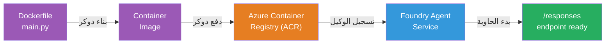
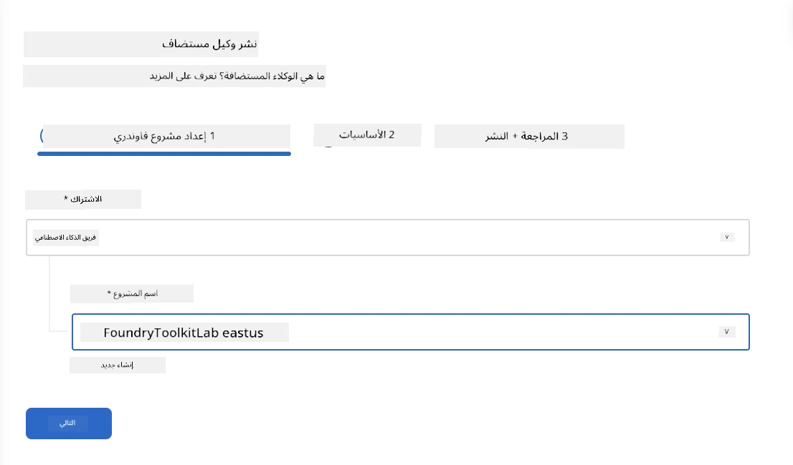
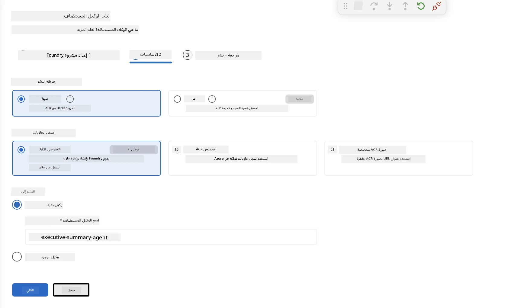
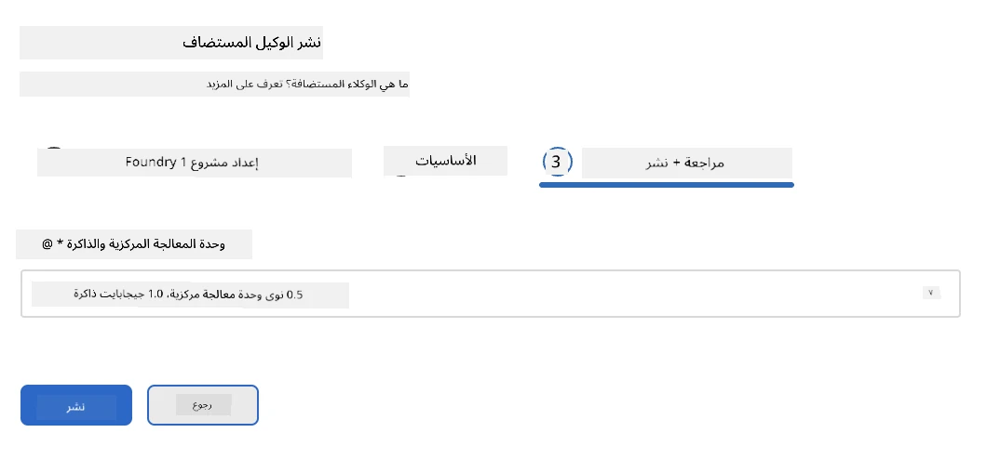
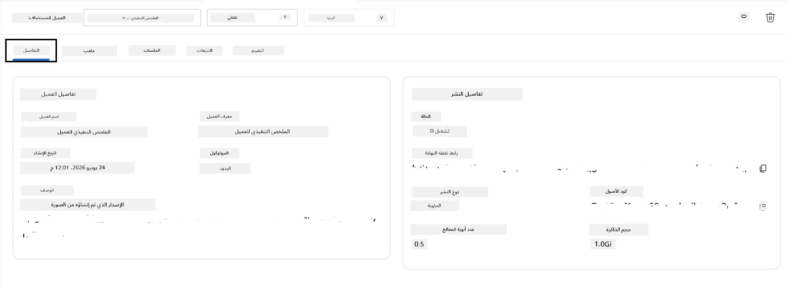

# الوحدة 5 - النشر إلى خدمة وكيل Foundry

⏱️ ~10 دقائق

> ⚠️ **لمستخدمي المسار B:** تتطلب هذه الوحدة اشتراك Foundry. إذا كنت تستخدم Foundry المحلي، تخطى إلى [الوحدة 07 - الملخص](07-summary.md). لقد أكملت بنجاح سير عمل التطوير المحلي!

في هذه الوحدة، تنشر الوكيل الذي تم اختباره محليًا إلى Microsoft Foundry كـ **وكيل مستضاف**. يقوم النشر ببناء صورة حاوية، ويدفعها إلى سجل حاويات Azure، ويشغل الوكيل في البنية التحتية المدارّة من Foundry.

### خط أنابيب النشر

---

## فحص المتطلبات الأساسية

قبل النشر، تحقق من:

- [ ] مرّ الوكيل بجميع السيناريوهات الثلاثة المحلية من [الوحدة 04](04-test-locally.md)
- [ ] لديك دور **Azure AI User** على مستوى المشروع ([الوحدة 01، تعيين RBAC](01-setup.md#deploy-a-model--assign-rbac))
- [ ] أنت مسجّل الدخول في Azure في VS Code (يعرض رمز الحساب اسمك)

---

## الخطوة 1: بدء النشر

### الخيار أ: النشر من Agent Inspector (مُوصى به)

إذا كان Agent Inspector مفتوحًا (من الاختبار):
1. انقر على زر **نشر** في الزاوية العلوية اليمنى (رمز السحابة ↑).

### الخيار ب: النشر من لوحة الأوامر

1. اضغط `Ctrl+Shift+P` → **Foundry Toolkit: Deploy Hosted Agent**.

---

## الخطوة 2: تكوين النشر

يطالبك المعالج بـ:

| الحقل | الاختيار |
|--------|-----------|
| **الاشتراك** | اشتراك Azure الخاص بك |
| **المشروع الهدف** | مشروع Foundry الخاص بك (مثلاً، `workshop-agents`) |

انقر **التالي** لتكوين الوكيل الخاص بك.

| الحقل | الاختيار |
|--------|-----------|
| **طريقة النشر** | حاوية |
| **سجل الحاويات** | **ACR الافتراضي** (يقوم Microsoft Foundry بإنشائه وإدارته لك) |
| **النشر إلى** | وكيل جديد (الاسم، `executive-summary-agent`) |

انقر **التالي** لمراجعة ونشر الوكيل الخاص بك.

| الحقل | الاختيار |
|--------|-----------|
| **وحدة المعالجة المركزية والذاكرة** | **0.25 نواة CPU، 0.5 جيجابايت ذاكرة** (كافية للورشة) |

---

## الخطوة 3: النشر والمراقبة

1. انقر **نشر**.
2. راقب لوحة **الإخراج** (اختر **Microsoft Foundry** من القائمة المنسدلة).
3. يمر النشر بالمراحل التالية:
   - **بناء Docker** - يبني الحاوية من Dockerfile الخاص بك
   - **دفع Docker** - يدفع الصورة إلى ACR (1-3 دقائق في أول نشر)
   - **تسجيل الوكيل** - ينشئ الوكيل المستضاف في Foundry
   - **بدء الحاوية** - يبدأ بهوية مدارّة من النظام

4. عند الانتهاء، يظهر إشعار:
   > **تم نشر my-agent بنجاح.** `عرض السجلات` `تشغيل الوكيل`

5. انقر **تشغيل الوكيل** لفتح ملعب الوكيل.

### قيم حالة النشر

| الحالة | المعنى |
|--------|---------|
| **قيد التشغيل** | الحاوية جاهزة، والوكيل يستجيب |
| **قيد الانتظار** | الحاوية تبدأ - انتظر 30-60 ثانية |
| **فشل** | تحقق من السجلات (انظر استكشاف الأخطاء أدناه) |

---

## أخطاء النشر الشائعة

| الخطأ | السبب الجذري | الحل |
|-------|-----------|-----|
| تم رفض إذن `agents/write` | نقص دور **Azure AI User** على مستوى المشروع | [الوحدة 01، تعيين RBAC](01-setup.md#deploy-a-model--assign-rbac) |
| Docker غير قيد التشغيل | لم يتم تشغيل Docker Desktop | شغّل Docker Desktop → تحقق من `docker info` |
| تفويض ACR | الهوية المدارّة لا يمكنها سحب الصورة | انظر [الوحدة 08 - استكشاف الأخطاء](08-troubleshooting.md) |

---

### ✅ نقطة تحقق

- [ ] انتهى النشر بدون أخطاء
- [ ] يظهر الوكيل تحت **وكلاء مستضافون (معاينة)** في الشريط الجانبي لـ Foundry
- [ ] حالة الحاوية تظهر **قيد التشغيل**
- [ ] تم فتح علامة تبويب ملعب الوكيل تعرض تفاصيل الوكيل وعنوان URL للنقطة النهاية

---

**السابق:** [04 - اختبار محلي](04-test-locally.md) · **التالي:** [06 - التحقق في الملعب →](06-verify-in-playground.md)

---

<!-- CO-OP TRANSLATOR DISCLAIMER START -->
**تنويه**:
تمت ترجمة هذا المستند باستخدام خدمة الترجمة بالذكاء الاصطناعي [Co-op Translator](https://github.com/Azure/co-op-translator). بينما نسعى للدقة، يرجى العلم أن الترجمات الآلية قد تحتوي على أخطاء أو عدم دقة. يجب اعتبار المستند الأصلي بلغته الأصلية المصدر الرسمي والمعتمد. للمعلومات الهامة، يُنصح بالاستعانة بترجمة بشرية محترفة. نحن غير مسؤولين عن أي سوء فهم أو تفسير ناتج عن استخدام هذه الترجمة.
<!-- CO-OP TRANSLATOR DISCLAIMER END -->