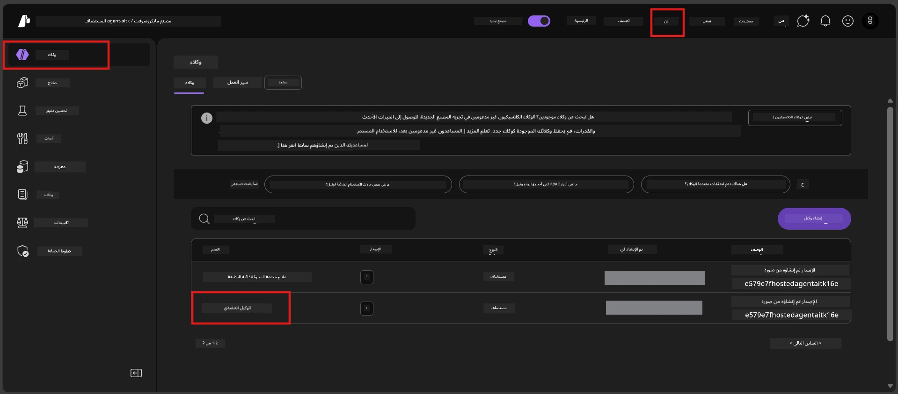

# الوحدة 6 - النشر إلى خدمة وكيل فاوندرى

في هذه الوحدة، تقوم بنشر الوكيل الذي اختبرته محليًا على Microsoft Foundry كـ [**وكيل مستضاف**](https://learn.microsoft.com/azure/foundry/agents/concepts/hosted-agents). عملية النشر تبني صورة حاوية Docker من مشروعك، وتدفعها إلى [سجل الحاويات في أزور (ACR)](https://learn.microsoft.com/azure/container-registry/container-registry-intro)، وتُنشئ نسخة وكيل مستضافة في [خدمة وكيل فاوندرى](https://learn.microsoft.com/azure/foundry/agents/overview).

### خط أنابيب النشر


---

## التحقق من المتطلبات الأساسية

قبل النشر، تحقق من كل عنصر أدناه. التغاضي عن هذه هو السبب الأكثر شيوعًا لفشل النشر.

1. **الوكيل يمر باختبارات الدخان المحلية:**
   - أكملت جميع الاختبارات الأربعة في [الوحدة 5](05-test-locally.md) واستجاب الوكيل بشكل صحيح.

2. **لديك دور [مستخدم أزور AI](https://learn.microsoft.com/azure/foundry/concepts/rbac-foundry#built-in-roles):**
   - تم تعيين هذا في [الوحدة 2، الخطوة 3](02-create-foundry-project.md). إذا لم تكن متأكدًا، تحقق الآن:
   - بوابة أزور → مورد مشروع فاوندرى الخاص بك → **التحكم في الوصول (IAM)** → علامة تبويب **تعيينات الدور** → ابحث عن اسمك → تأكد من وجود **مستخدم أزور AI**.

3. **أنت مسجل الدخول إلى أزور في VS Code:**
   - تحقق من أيقونة الحسابات في أسفل اليسار من VS Code. يجب أن يظهر اسم حسابك.

4. **(اختياري) Docker Desktop قيد التشغيل:**
   - Docker مطلوب فقط إذا طلبت إضافة فاوندرى منك إنشاء بناء محلي. في معظم الحالات، تتعامل الإضافة مع إنشاء الحاويات تلقائيًا أثناء النشر.
   - إذا كان Docker مثبتًا لديك، تحقق من تشغيله: `docker info`

---

## الخطوة 1: بدء النشر

لديك طريقتان للنشر - كلاهما يؤدي إلى نفس النتيجة.

### الخيار أ: النشر من خلال مفتش الوكيل (مُوصى به)

إذا كنت تشغل الوكيل باستخدام المصحح (F5) ومفتش الوكيل مفتوح:

1. انظر إلى **الزاوية اليمنى العليا** من لوحة مفتش الوكيل.
2. انقر على زر **النشر** (أيقونة سحابة مع سهم لأعلى ↑).
3. تفتح معالج النشر.

### الخيار ب: النشر من لوحة الأوامر

1. اضغط `Ctrl+Shift+P` لفتح **لوحة الأوامر**.
2. اكتب: **Microsoft Foundry: Deploy Hosted Agent** واخترها.
3. يفتح معالج النشر.

---

## الخطوة 2: تكوين النشر

يقودك معالج النشر خلال التكوين. املأ كل مطالبة:

### 2.1 اختيار المشروع الهدف

1. يعرض قائمة منسدلة بمشاريع فاوندرى الخاصة بك.
2. اختر المشروع الذي أنشأته في الوحدة 2 (على سبيل المثال، `workshop-agents`).

### 2.2 اختيار ملف حاوية الوكيل

1. سيطلب منك اختيار نقطة دخول الوكيل.
2. اختر **`main.py`** (بايثون) - هذا هو الملف الذي يستخدمه المعالج لتحديد مشروع الوكيل الخاص بك.

### 2.3 تكوين الموارد

| الإعداد | القيمة الموصى بها | الملاحظات |
|---------|------------------|-----------|
| **وحدة المعالجة المركزية (CPU)** | `0.25` | القيمة الافتراضية، كافية للورشة. زدها للأحمال الإنتاجية |
| **الذاكرة** | `0.5Gi` | القيمة الافتراضية، كافية للورشة |

هذه القيم تطابق القيم في `agent.yaml`. يمكنك قبول الإعدادات الافتراضية.

---

## الخطوة 3: التأكيد والنشر

1. يعرض المعالج ملخص النشر يحتوي على:
   - اسم المشروع الهدف
   - اسم الوكيل (من `agent.yaml`)
   - ملف الحاوية والموارد
2. راجع الملخص وانقر على **تأكيد ونشر** (أو **نشر**).
3. راقب التقدم في VS Code.

### ما يحدث أثناء النشر (خطوة بخطوة)

النشر هو عملية متعددة الخطوات. راقب لوحة **الإخراج** في VS Code (اختر "Microsoft Foundry" من القائمة المنسدلة) لتتبع العملية:

1. **بناء Docker** - يقوم VS Code ببناء صورة حاوية Docker من `Dockerfile` الخاص بك. سترى رسائل طبقات Docker:
   ```
   Step 1/6 : FROM python:<version>-slim
   Step 2/6 : WORKDIR /app
   ...
   Successfully built abc123def456
   ```

2. **دفع Docker** - تُدفع الصورة إلى **سجل الحاويات في أزور (ACR)** المرتبط بمشروع فاوندرى الخاص بك. قد يستغرق هذا 1-3 دقائق في أول نشر (حيث أن الصورة الأساسية أكبر من 100 ميجابايت).

3. **تسجيل الوكيل** - تنشئ خدمة وكيل فاوندرى وكيلًا مستضافًا جديدًا (أو نسخة جديدة إذا كان الوكيل موجودًا مسبقًا). تُستخدم بيانات الوكيل من `agent.yaml`.

4. **بدء الحاوية** - تبدأ الحاوية ضمن البنية التحتية المدارة من فاوندرى. تعيين المنصة [هوية مدارّة بواسطة النظام](https://learn.microsoft.com/azure/foundry/agents/concepts/agent-identity) وتعرض نقطة النهاية `/responses`.

> **النشر الأول أبطأ** (بحيث يحتاج Docker لدفع جميع الطبقات). النشرات التالية أسرع لأن Docker يخزن الطبقات غير المتغيرة مؤقتًا.

---

## الخطوة 4: تحقق من حالة النشر

بعد اكتمال أمر النشر:

1. افتح الشريط الجانبي لـ **Microsoft Foundry** بالنقر على أيقونة فاوندرى في شريط النشاط.
2. وسّع قسم **الوكلاء المستضافين (معاينة)** تحت مشروعك.
3. يجب أن ترى اسم وكيلك (مثلاً، `ExecutiveAgent` أو الاسم من `agent.yaml`).
4. **انقر على اسم الوكيل** لتوسيعه.
5. سترى نسخة أو أكثر (مثلاً `v1`).
6. انقر على النسخة لرؤية **تفاصيل الحاوية**.
7. تحقق من حقل **الحالة**:

   | الحالة | المعنى |
   |--------|--------|
   | **مشغّل** أو **جاري التشغيل** | الحاوية تعمل والوكيل جاهز |
   | **قيد الانتظار** | الحاوية قيد التشغيل (انتظر 30-60 ثانية) |
   | **فشل** | الحاوية فشلت في التشغيل (افحص السجلات - انظر استكشاف الأخطاء أدناه) |



> **إذا رأيت "قيد الانتظار" لأكثر من دقيقتين:** قد تكون الحاوية تسحب الصورة الأساسية. انتظر قليلاً. إذا بقيت الحالة قيد الانتظار، تحقق من سجلات الحاوية.

---

## الأخطاء الشائعة في النشر وكيفية إصلاحها

### الخطأ 1: صلاحية مرفوضة - `agents/write`

```
Error: lacks the required data action 
Microsoft.CognitiveServices/accounts/AIServices/agents/write 
to perform POST /api/projects/{projectName}/assistants operation.
```

**السبب الجذري:** ليس لديك دور `Azure AI User` على مستوى **المشروع**.

**خطوات الإصلاح:**

1. افتح [https://portal.azure.com](https://portal.azure.com).
2. في شريط البحث، اكتب اسم مشروع فاوندرى الخاص بك وانقر عليه.
   - **مهم:** تأكد من التنقل إلى مورد **المشروع** (النوع: "مشروع Microsoft Foundry")، وليس إلى حساب/مركز رئيسي.
3. في التنقل الأيسر، انقر على **التحكم في الوصول (IAM)**.
4. انقر على **+ إضافة** → **تعيين دور جديد**.
5. في علامة تبويب **الدور**، ابحث عن [**مستخدم Azure AI**](https://learn.microsoft.com/azure/foundry/concepts/rbac-foundry#built-in-roles) واختره. انقر **التالي**.
6. في علامة تبويب **الأعضاء**، اختر **مستخدم، مجموعة، أو خدمة رئيسية**.
7. انقر على **+ اختيار الأعضاء**، ابحث عن اسمك/بريدك الإلكتروني، اختر نفسك، ثم انقر **اختيار**.
8. انقر على **مراجعة + تعيين** → **مراجعة + تعيين** مرة أخرى.
9. انتظر 1-2 دقيقة ليتم نشر تعيين الدور.
10. **أعد المحاولة بالنشر** من الخطوة 1.

> يجب أن يكون الدور على نطاق **المشروع**، وليس فقط على نطاق الحساب. هذا هو السبب رقم 1 لفشل النشر.

### الخطأ 2: Docker غير قيد التشغيل

```
Error: Docker build failed / Cannot connect to Docker daemon
```

**الإصلاح:**
1. شغّل Docker Desktop (اعثر عليه في قائمة ابدأ أو في علبة النظام).
2. انتظر حتى يظهر "Docker Desktop is running" (30-60 ثانية).
3. تحقق بـ: `docker info` في نافذة الأوامر.
4. **خاص بـ Windows:** تأكد من تمكين خلفية WSL 2 في إعدادات Docker Desktop → **عام** → **استخدام محرك مبني على WSL 2**.
5. أعد محاولة النشر.

### الخطأ 3: تفويض ACR - `AcrPullUnauthorized`

```
Error: AcrPullUnauthorized
```

**السبب الجذري:** هوية المشروع المدارة في فاوندرى لا تمتلك حق سحب الصور من سجل الحاويات.

**الإصلاح:**
1. في بوابة أزور، انتقل إلى **[سجل الحاويات](https://learn.microsoft.com/azure/container-registry/container-registry-intro)** (يوجد في نفس مجموعة الموارد التي بها مشروع فاوندرى).
2. اذهب إلى **التحكم في الوصول (IAM)** → **إضافة** → **تعيين دور جديد**.
3. اختر دور **[AcrPull](https://learn.microsoft.com/azure/container-registry/container-registry-roles)**.
4. تحت الأعضاء، اختر **الهوية المدارة** → اعثر على هوية مشروع فاوندرى المدارّة.
5. **مراجعة + تعيين**.

> يتم إعداد هذا عادةً تلقائيًا بواسطة إضافة فاوندرى. إذا ظهرت لك هذه المشكلة، فقد يعني ذلك أن الإعداد التلقائي قد فشل.

### الخطأ 4: عدم توافق منصة الحاوية (Apple Silicon)

إذا كنت تنشر من جهاز Mac بمعالج Apple Silicon (M1/M2/M3)، يجب بناء الحاوية لـ `linux/amd64`:

```bash
docker build --platform linux/amd64 -t myagent:v1 .
```

> تتعامل إضافة فاوندرى مع هذا تلقائيًا لمعظم المستخدمين.

---

### نقطة تحقق

- [ ] انتهى أمر النشر بدون أخطاء في VS Code
- [ ] ظهر الوكيل تحت **الوكلاء المستضافين (معاينة)** في الشريط الجانبي لفاوندرى
- [ ] نقرت على الوكيل → اخترت نسخة → شاهدت **تفاصيل الحاوية**
- [ ] حالة الحاوية تظهر **مشغّل** أو **جاري التشغيل**
- [ ] (إن حدثت أخطاء) حددت الخطأ، طبقت الإصلاح وأعدت النشر بنجاح

---

**السابق:** [05 - الاختبار محليًا](05-test-locally.md) · **التالي:** [07 - التحقق في الملعب →](07-verify-in-playground.md)

---

<!-- CO-OP TRANSLATOR DISCLAIMER START -->
**تنويه**:  
تم ترجمة هذا المستند باستخدام خدمة الترجمة الآلية [Co-op Translator](https://github.com/Azure/co-op-translator). بينما نسعى لتحقيق الدقة، يرجى العلم بأن الترجمات الآلية قد تحتوي على أخطاء أو عدم دقة. يجب اعتبار المستند الأصلي بلغته الأصلية هو المصدر المعتمد. للمعلومات الهامة، يُنصح بالترجمة البشرية الاحترافية. نحن غير مسؤولين عن أي سوء فهم أو تحريف ينجم عن استخدام هذه الترجمة.
<!-- CO-OP TRANSLATOR DISCLAIMER END -->