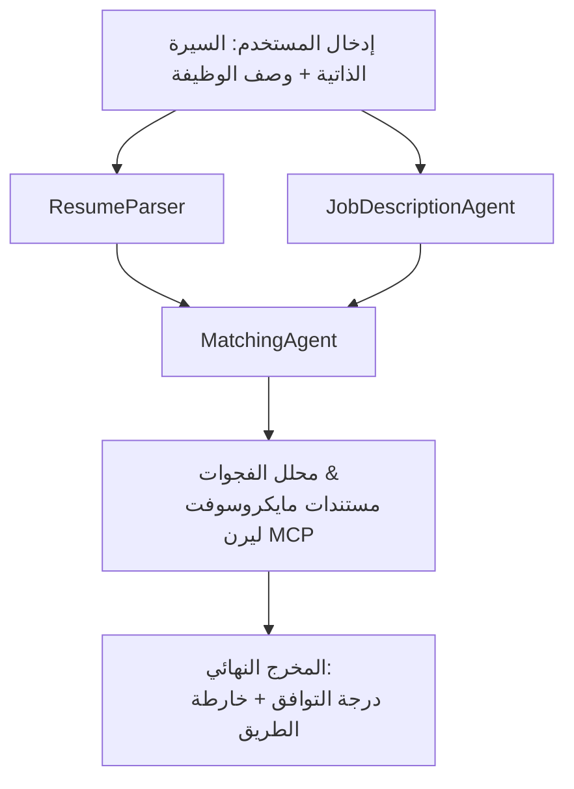

# PersonalCareerCopilot - تقييم السيرة الذاتية مقابل الوظيفة

تدفق عمل متعدد الوكلاء يقوم بتقييم مدى تطابق السيرة الذاتية مع وصف الوظيفة، ثم يقوم بإنشاء خطة تعلم شخصية لسد الفجوات.

---

## الوكلاء

| الوكيل | الدور | الأدوات |
|-------|------|-------|
| **ResumeParser** | يستخرج المهارات المنظمة، الخبرات، الشهادات من نص السيرة الذاتية | - |
| **JobDescriptionAgent** | يستخرج المهارات المطلوبة/المفضلة، الخبرات، الشهادات من وصف الوظيفة | - |
| **MatchingAgent** | يقارن الملف الشخصي مقابل المتطلبات → درجة التطابق (0-100) + المهارات المطابقة/المفقودة | - |
| **GapAnalyzer** | ينشئ خطة تعلم شخصية مع موارد Microsoft Learn | `search_microsoft_learn_for_plan` (MCP) |

## سير العمل


---

## بدء سريع

### 1. إعداد البيئة

```powershell
cd workshop\lab02-multi-agent\PersonalCareerCopilot
python -m venv .venv
.\.venv\Scripts\Activate.ps1          # ويندوز باورشيل
# source .venv/bin/activate            # ماك أو إس / لينكس
pip install -r requirements.txt
```

### 2. تكوين بيانات الاعتماد

انسخ ملف env النموذجي واملأ تفاصيل مشروع Foundry الخاص بك:

```powershell
cp .env.example .env
```

حرر `.env`:

```env
PROJECT_ENDPOINT=https://<your-account>.services.ai.azure.com/api/projects/<your-project>
MODEL_DEPLOYMENT_NAME=gpt-4.1-mini
```

| القيمة | أين تجدها |
|-------|-----------------|
| `PROJECT_ENDPOINT` | شريط جانبي Microsoft Foundry في VS Code → انقر بزر الماوس الأيمن على مشروعك → **نسخ نقطة نهاية المشروع** |
| `MODEL_DEPLOYMENT_NAME` | شريط جانبي Foundry → توسيع المشروع → **النماذج + نقاط النهاية** → اسم النشر |

### 3. التشغيل محلياً

```powershell
python -m debugpy --listen 127.0.0.1:5679 -m agentdev run main.py --verbose --port 8088
```

أو استخدم مهمة VS Code: `Ctrl+Shift+P` → **المهام: تشغيل مهمة** → **تشغيل خادم Lab02 HTTP**.

### 4. الاختبار باستخدام مفحص الوكلاء

افتح مفحص الوكلاء: `Ctrl+Shift+P` → **مجموعة أدوات Foundry: افتح مفحص الوكلاء**.

الصق مطالبة الاختبار هذه:

```
Resume:
Jane Doe
Senior Software Engineer with 5 years of experience in Python, Django, and AWS.
Built microservices handling 10K+ requests/second. Led a team of 4 developers.
Certifications: AWS Solutions Architect Associate.
Education: B.S. Computer Science, State University.

Job Description:
Senior Cloud Engineer at Contoso Ltd.
Required: Python, Azure, Kubernetes, Terraform, CI/CD pipelines.
Preferred: Go, monitoring (Prometheus/Grafana), cost optimization.
Experience: 5+ years in cloud infrastructure.
Certifications: Azure Solutions Architect Expert preferred.
```

**المتوقع:** درجة تطابق (0-100)، المهارات المطابقة/المفقودة، وخارطة تعلم شخصية مع روابط Microsoft Learn.

### 5. النشر في Foundry

`Ctrl+Shift+P` → **Microsoft Foundry: نشر الوكيل المستضاف** → اختر مشروعك → أكد.

---

## بنية المشروع

```
PersonalCareerCopilot/
├── .env.example        ← Template for environment variables
├── .env                ← Your credentials (git-ignored)
├── agent.yaml          ← Hosted agent definition (name, resources, env vars)
├── Dockerfile          ← Container image for Foundry deployment
├── main.py             ← 4-agent workflow (instructions, MCP tool, WorkflowBuilder)
└── requirements.txt    ← Python dependencies
```

## الملفات الأساسية

### `agent.yaml`

يحدد الوكيل المستضاف لـ Foundry Agent Service:
- `kind: hosted` - يعمل كحاوية مُدارة
- `protocols: [responses v1]` - يعرض نقطة نهاية HTTP `/responses`
- `environment_variables` - يتم حقن `PROJECT_ENDPOINT` و `MODEL_DEPLOYMENT_NAME` عند وقت النشر

### `main.py`

يحتوي على:
- **تعليمات الوكيل** - أربع ثوابت `*_INSTRUCTIONS`، لكل وكيل واحدة
- **أداة MCP** - `search_microsoft_learn_for_plan()` تستدعي `https://learn.microsoft.com/api/mcp` عبر HTTP Streamable
- **إنشاء الوكلاء** - مدير السياق `create_agents()` يستخدم `AzureAIAgentClient.as_agent()`
- **مخطط سير العمل** - `create_workflow()` يستخدم `WorkflowBuilder` لربط الوكلاء بأنماط التفرع والتجميع والتسلسل
- **تشغيل الخادم** - `from_agent_framework(agent).run_async()` على المنفذ 8088

### `requirements.txt`

| الحزمة | الإصدار | الغرض |
|---------|---------|---------|
| `agent-framework-azure-ai` | `1.0.0rc3` | تكامل Azure AI لإطار عمل Microsoft Agent Framework |
| `agent-framework-core` | `1.0.0rc3` | وقت التشغيل الأساسي (يشمل WorkflowBuilder) |
| `azure-ai-agentserver-agentframework` | `1.0.0b16` | وقت تشغيل خادم الوكيل المستضاف |
| `azure-ai-agentserver-core` | `1.0.0b16` | تجريدات خادم الوكيل الأساسية |
| `debugpy` | الأحدث | تصحيح بايثون (F5 في VS Code) |
| `agent-dev-cli` | `--pre` | CLI التطوير المحلي + خلفية مفحص الوكلاء |

---

## استكشاف الأخطاء وإصلاحها

| المشكلة | الحل |
|-------|-----|
| `RuntimeError: Missing required environment variable(s)` | أنشئ ملف `.env` يحتوي على `PROJECT_ENDPOINT` و `MODEL_DEPLOYMENT_NAME` |
| `ModuleNotFoundError: No module named 'agent_framework'` | فعّل البيئة الافتراضية و شغّل `pip install -r requirements.txt` |
| لا توجد روابط Microsoft Learn في المخرجات | تحقق من اتصال الإنترنت إلى `https://learn.microsoft.com/api/mcp` |
| بطاقة فجوة واحدة فقط (مختصرة) | تحقق أن `GAP_ANALYZER_INSTRUCTIONS` تتضمن قسم `CRITICAL:` |
| المنفذ 8088 مستخدم | أوقف الخوادم الأخرى: `netstat -ano \| findstr :8088` |

لمزيد من استكشاف الأخطاء، راجع [الوحدة 8 - استكشاف الأخطاء](../docs/08-troubleshooting.md).

---

**الدليل الكامل:** [وثائق Lab 02](../docs/README.md) · **العودة إلى:** [README Lab 02](../README.md) · [الصفحة الرئيسية للورشة](../../../README.md)

---

<!-- CO-OP TRANSLATOR DISCLAIMER START -->
**إخلاء المسؤولية**:  
تمت ترجمة هذا المستند باستخدام خدمة الترجمة الآلية [Co-op Translator](https://github.com/Azure/co-op-translator). بينما نسعى للدقة، يرجى العلم أن الترجمات الآلية قد تحتوي على أخطاء أو عدم دقة. يجب اعتبار المستند الأصلي بلغته الأصلية المصدر الموثوق. للمعلومات الحرجة، يُوصى بالترجمة المهنية البشرية. نحن غير مسؤولين عن أي سوء فهم أو تفسير ناتج عن استخدام هذه الترجمة.
<!-- CO-OP TRANSLATOR DISCLAIMER END -->