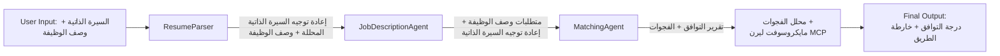

# PersonalCareerCopilot - تقييم توافق السيرة الذاتية مع الوظيفة

تطبيق متعدد الوكلاء يركز على سير العمل يقوم بتقييم مدى تطابق السيرة الذاتية مع وصف الوظيفة، ثم يولد خارطة طريق تعليمية مخصصة لسد الفجوات.

---

## الوكلاء

| الوكيل | الدور | الأدوات |
|-------|------|-------|
| **ResumeParser** | يستخرج المهارات المنظمة، الخبرات، الشهادات من نص السيرة الذاتية | - |
| **JobDescriptionAgent** | يستخرج المهارات المطلوبة/المفضلة، الخبرات، الشهادات من وصف الوظيفة | - |
| **MatchingAgent** | يقارن الملف الشخصي مع المتطلبات → درجة التوافق (0-100) + المهارات المطابقة/المفقودة | - |
| **GapAnalyzer** | يبني خارطة طريق تعليمية مخصصة مع موارد Microsoft Learn | `search_microsoft_learn_for_plan` (MCP) |

## سير العمل


```mermaid
flowchart LR
    UserInput["User Input: السيرة الذاتية + وصف الوظيفة"] --> ResumeParser
    ResumeParser -- "إعادة توجيه السيرة الذاتية المحللة + وصف الوظيفة" --> JobDescriptionAgent
    JobDescriptionAgent -- "متطلبات وصف الوظيفة + إعادة توجيه السيرة الذاتية" --> MatchingAgent
    MatchingAgent -- "تقرير التوافق + الفجوات" --> GapAnalyzerMCP["محلل الفجوات +\nمايكروسوفت ليرن MCP"]
    GapAnalyzerMCP --> FinalOutput["Final Output:\nدرجة التوافق + خارطة الطريق"]
```

---

## بدء سريع

### 1. إعداد البيئة

هذا المجلد هو التطبيق المرجعي لمخطط المختبر 02 المعتمد على سير العمل. يستخدم ملف `main.py` الحالي كتل الطلب الحالية بالإضافة إلى `WorkflowBuilder` لربط الوكلاء الأربعة معًا.

```powershell
cd workshop\lab02-multi-agent\PersonalCareerCopilot
python -m venv .venv
.\.venv\Scripts\Activate.ps1          # ويندوز باورشيل
# source .venv/bin/activate            # ماك أو إس / لينكس
pip install -r requirements.txt
```

### 2. تكوين بيانات الاعتماد

أنشئ ملف `.env` في هذا المجلد:

```powershell
copy .env .env.bak 2>$null; echo $null > .env
```

حرر `.env`:

```env
FOUNDRY_PROJECT_ENDPOINT=https://<your-account>.services.ai.azure.com/api/projects/<your-project>
AZURE_AI_MODEL_DEPLOYMENT_NAME=gpt-4.1-mini
```

| القيمة | مكان العثور عليها |
|-------|------------------|
| `FOUNDRY_PROJECT_ENDPOINT` | شريط أدوات Foundry → انقر يمينًا على مشروعك → **نسخ نقطة نهاية المشروع** |
| `AZURE_AI_MODEL_DEPLOYMENT_NAME` | شريط Foundry → توسيع المشروع → **النماذج + النقاط النهائية** → اسم النشر |

### 3. التشغيل محليًا

```powershell
python -m debugpy --listen 127.0.0.1:5679 main.py --port 8088
```

أو استخدم مهمة VS Code: `Ctrl+Shift+P` → **المهام: تشغيل مهمة** → **تشغيل خادم وكيل HTTP**.

للتصحيح باستخدام F5، استخدم **تصحيح خادم وكيل HTTP المحلي**.

### 4. الاختبار باستخدام Agent Inspector

افتح Agent Inspector: `Ctrl+Shift+P` → **Foundry Toolkit: فتح Agent Inspector**.

الصق هذا الطلب الاختباري:

```
Resume:
Jane Doe
Senior Software Engineer with 5 years of experience in Python, Django, and AWS.
Built microservices handling 10K+ requests/second. Led a team of 4 developers.
Certifications: AWS Solutions Architect Associate.
Education: B.S. Computer Science, State University.

Job Description:
Senior Cloud Engineer at Contoso Ltd.
Required: Python, Azure, Kubernetes, Terraform, CI/CD pipelines.
Preferred: Go, monitoring (Prometheus/Grafana), cost optimization.
Experience: 5+ years in cloud infrastructure.
Certifications: Azure Solutions Architect Expert preferred.
```

**المتوقع:** درجة التوافق (0-100)، المهارات المطابقة/المفقودة، وخارطة طريق تعليمية مخصصة مع روابط Microsoft Learn.

### 5. النشر إلى Foundry

`Ctrl+Shift+P` → **Foundry Toolkit: نشر وكيل مستضاف** → اختر مشروعك → أكد.

---

## هيكل المشروع

```
PersonalCareerCopilot/
├── .env                ← Your credentials (git-ignored)
├── agent.yaml          ← Hosted agent definition (name, resources, env vars)
├── Dockerfile          ← Container image for Foundry deployment
├── main.py             ← 4-agent workflow (instructions, MCP tool, WorkflowBuilder)
└── requirements.txt    ← Python dependencies
```

## الملفات الرئيسية

### `agent.yaml`

يعرّف الوكيل المستضاف لخدمة Foundry Agent:
- `kind: hosted` - يعمل كحاوية مُدارة
- `protocols` - بروتوكول `responses` مع `version: 1.0.0`، يعرض نقطة نهاية HTTP `/responses`
- `environment_variables` - يصرح بـ `AZURE_AI_MODEL_DEPLOYMENT_NAME` هنا؛ يتم حقن `FOUNDRY_PROJECT_ENDPOINT` تلقائيًا عند النشر

### `main.py`

يحتوي على:
- **تعليمات الوكيل** - أربعة ثوابت `*_INSTRUCTIONS`، واحد لكل وكيل
- **أداة MCP** - `search_microsoft_learn_for_plan()` تستدعي `https://learn.microsoft.com/api/mcp` عبر HTTP قابل للبث
- **إنشاء الوكيل** - أربع مثيلات `Agent()` + `AgentExecutor()` تشترك في `FoundryChatClient` واحد
- **مخطط سير العمل** - `WorkflowBuilder` يربط الوكلاء كسلسلة متتابعة: ResumeParser → JD Agent → MatchingAgent → GapAnalyzer
- **بدء الخادم** - `ResponsesHostServer` يعمل على المنفذ 8088

### `requirements.txt`

| الحزمة | الهدف |
|---------|----------|
| `agent-framework-foundry` | وقت تشغيل أساسي: `Agent`, `AgentExecutor`, `WorkflowBuilder`, `@tool`, `FoundryChatClient` |
| `agent-framework-foundry-hosting` | `ResponsesHostServer` + تكامل استضافة Foundry |
| `mcp<2,>=1.24.0` | عميل MCP لـ GapAnalyzer (`streamable_http_client`) |
| `debugpy` | تصحيح بايثون (F5 في VS Code) |

---

## استكشاف الأخطاء وإصلاحها

| المشكلة | الحل |
|-------|-----|
| `KeyError: 'FOUNDRY_PROJECT_ENDPOINT'` أو `KeyError: 'AZURE_AI_MODEL_DEPLOYMENT_NAME'` | أنشئ ملف `.env` مع تعيين كل من `FOUNDRY_PROJECT_ENDPOINT` و `AZURE_AI_MODEL_DEPLOYMENT_NAME` |
| `ModuleNotFoundError: No module named 'agent_framework'` | فعّل البيئة الافتراضية وشغل `pip install -r requirements.txt` |
| لا توجد روابط Microsoft Learn في الناتج | تحقق من اتصال الإنترنت إلى `https://learn.microsoft.com/api/mcp` |
| بطاقة فجوة واحدة فقط (مقصورة) | تحقق من تضمين `GAP_ANALYZER_INSTRUCTIONS` للكتلة `CRITICAL:` |
| المنفذ 8088 مستخدم | أوقف الخوادم الأخرى: `netstat -ano \| findstr :8088` |

للاستكشاف التفصيلي للأخطاء، راجع [الوحدة 8 - استكشاف الأخطاء وإصلاحها](../docs/08-troubleshooting.md).

---

**الدليل الكامل:** [مستندات Lab 02](../docs/README.md) · **العودة إلى:** [README الخاص بالمعمل 02](../README.md) · [الصفحة الرئيسية للورشة](../../../README.md)

---

<!-- CO-OP TRANSLATOR DISCLAIMER START -->
**تنويه**:
تمت ترجمة هذا المستند باستخدام خدمة الترجمة بالذكاء الاصطناعي [Co-op Translator](https://github.com/Azure/co-op-translator). بينما نسعى للدقة، يرجى العلم أن الترجمات الآلية قد تحتوي على أخطاء أو عدم دقة. يجب اعتبار المستند الأصلي بلغته الأصلية المصدر الرسمي والمعتمد. للمعلومات الهامة، يُنصح بالاستعانة بترجمة بشرية محترفة. نحن غير مسؤولين عن أي سوء فهم أو تفسير ناتج عن استخدام هذه الترجمة.
<!-- CO-OP TRANSLATOR DISCLAIMER END -->