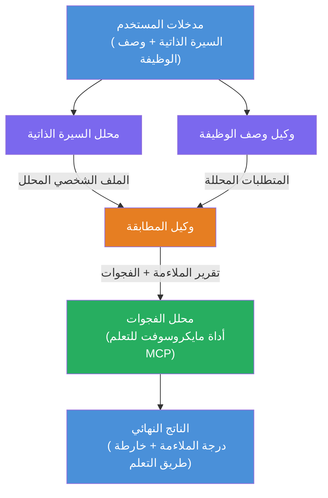

# المختبر 02 - سير عمل متعدد الوكلاء: تقييم السيرة الذاتية → مدى ملاءمة الوظيفة

---

## ما ستبنيه

**مقيّم مدى ملاءمة السيرة الذاتية لوظيفة** - سير عمل متعدد الوكلاء حيث يتعاون أربعة وكلاء متخصصين لتقييم مدى تطابق سيرة المرشح الذاتية مع وصف الوظيفة، ثم إنشاء خارطة تعلم مخصصة لسد الفجوات.

### الوكلاء

| الوكيل | الدور |
|-------|------|
| **محلل السيرة الذاتية** | يستخرج المهارات المنظمة، الخبرة، الشهادات من نص السيرة الذاتية |
| **وكيل وصف الوظيفة** | يستخرج المهارات المطلوبة/المفضلة، الخبرة، الشهادات من وصف الوظيفة |
| **وكيل المطابقة** | يقارن الملف الشخصي مقابل المتطلبات → درجة الملاءمة (0-100) + المهارات المطابقة / المفقودة |
| **محلل الفجوات** | يبني خارطة تعلم مخصصة مع الموارد والجداول الزمنية والمشاريع السريعة الإنجاز |

### تدفق العرض التجريبي

رفع **السيرة الذاتية + وصف الوظيفة** → الحصول على **درجة الملاءمة + المهارات المفقودة** → استلام **خارطة تعلم مخصصة**.

### هندسة سير العمل

> اللون البنفسجي = وكلاء متوازون | اللون البرتقالي = نقطة التجميع | اللون الأخضر = الوكيل النهائي مع الأدوات. راجع [الوحدة 1 - فهم الهندسة](docs/01-understand-multi-agent.md) و [الوحدة 4 - أنماط التنسيق](docs/04-orchestration-patterns.md) للحصول على مخططات تفصيلية وتدفق البيانات.

### المواضيع المشمولة

- إنشاء سير عمل متعدد الوكلاء باستخدام **WorkflowBuilder**
- تحديد أدوار الوكلاء وتدفق التنسيق (متوازٍ + تسلسلي)
- أنماط الاتصال بين الوكلاء
- الاختبار المحلي باستخدام Agent Inspector
- نشر سير العمل متعدد الوكلاء في خدمة Foundry Agent

---

## المتطلبات السابقة

أكمل المختبر 01 أولاً:

- [المختبر 01 - وكيل واحد](../lab01-single-agent/README.md)

---

## ابدأ

راجع تعليمات الإعداد الكاملة، استعراض الكود، وأوامر الاختبار في:

- [وثائق المختبر 2 - المتطلبات السابقة](docs/00-prerequisites.md)
- [وثائق المختبر 2 - مسار التعلم الكامل](docs/README.md)
- [دليل تشغيل PersonalCareerCopilot](PersonalCareerCopilot/README.md)

## أنماط التنسيق (البدائل الوكيلة)

يتضمن المختبر 2 تدفق **متوازي → مجمع → مخطط** الافتراضي، كما تصف الوثائق
أنماط بديلة لتوضيح سلوك وكيل أقوى:

- **توزيع/جمع مع وتيرة إجماع موزونة**
- **مراجعة/انتقاد قبل الخارطة النهائية**
- **موجّه شرطي** (اختيار المسار بناءً على درجة الملاءمة والمهارات المفقودة)

راجع [docs/04-orchestration-patterns.md](docs/04-orchestration-patterns.md).

---

**السابق:** [المختبر 01 - وكيل واحد](../lab01-single-agent/README.md) · **عودة إلى:** [الصفحة الرئيسية للورشة](../../README.md)

---

<!-- CO-OP TRANSLATOR DISCLAIMER START -->
**إخلاء مسؤولية**:  
تم ترجمة هذا المستند باستخدام خدمة الترجمة الآلية [Co-op Translator](https://github.com/Azure/co-op-translator). بينما نسعى لتحقيق الدقة، يرجى العلم بأن الترجمات الآلية قد تحتوي على أخطاء أو عدم دقة. يجب اعتبار المستند الأصلي بلغته الأصلية المصدر الرسمي والموثوق. للمعلومات الهامة، يُنصح بالاعتماد على الترجمة البشرية المهنية. نحن غير مسؤولين عن أي سوء فهم أو تفسير ناتج عن استخدام هذه الترجمة.
<!-- CO-OP TRANSLATOR DISCLAIMER END -->