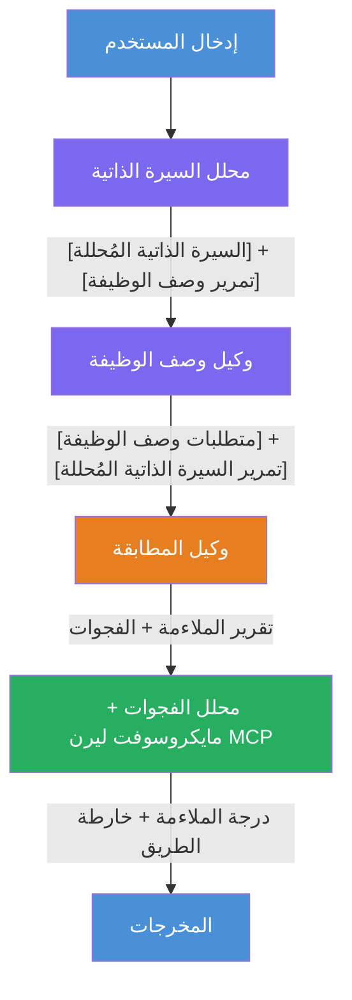

# المختبر 02 - سير عمل متعدد الوكلاء: تقييم السيرة الذاتية إلى ملاءمة الوظيفة

## نظرة عامة

في هذا المختبر العملي، ستقوم ببناء **تطبيق متعدد الوكلاء مرتكز على سير العمل** باستخدام Foundry Toolkit في VS Code ونشره إلى خدمة Microsoft Foundry Agent.

**ما ستبنيه:** تقييم السيرة الذاتية إلى ملاءمة الوظيفة الذي يحلل السيرة الذاتية ووصف الوظيفة، ويقيم مدى التطابق، وينتج خارطة طريق تعلم شخصية باستخدام موارد Microsoft Learn.

---

## الهندسة المعمارية

```mermaid
flowchart TD
    A["إدخال المستخدم"] --> B["محلل السيرة الذاتية"]
    B -->|"[السيرة الذاتية المُحللة] + [تمرير وصف الوظيفة]"| C["وكيل وصف الوظيفة"]
    C -->|"[متطلبات وصف الوظيفة] + [تمرير السيرة الذاتية المُحللة]"| D["وكيل المطابقة"]
    D -->|تقرير الملاءمة + الفجوات| E["محلل الفجوات + مايكروسوفت ليرن MCP"]
    E -->|درجة الملاءمة + خارطة الطريق| F["المخرجات"]

    style A fill:#4A90D9,color:#fff
    style B fill:#7B68EE,color:#fff
    style C fill:#7B68EE,color:#fff
    style D fill:#E67E22,color:#fff
    style E fill:#27AE60,color:#fff
    style F fill:#4A90D9,color:#fff
```

**كيفية العمل:**
1. يقوم المستخدم بلصق السيرة الذاتية ووصف الوظيفة.
2. يقوم **ResumeParser** بتحليل السيرة الذاتية وينسخ وصف الوظيفة حرفيًا إلى قسم `[تمرير وصف الوظيفة]`.
3. يقوم **وAgent وصف الوظيفة** باستخلاص المتطلبات المنظمة من التمرير، ثم يعيد تمرير `[السيرة الذاتية المحللة]` كـ `[تمرير السيرة الذاتية المحللة]`.
4. يقارن **MatchingAgent** بين `[تمرير السيرة الذاتية المحللة]` و`[متطلبات وصف الوظيفة]` وينتج نتيجة الملاءمة.
5. يحول **GapAnalyzer** الفجوات إلى خارطة طريق عملية ويجلب روابط Microsoft Learn الحقيقية عبر MCP.

---

## المتطلبات الأساسية

أكمل المختبر 01 أولاً:

- [المختبر 01 - وكيل واحد](../lab01-single-agent/README.md)

---

## الجزء 1: اقرأ الوحدات بترتيبها

راجع مسار التعلم الكامل في:

- [ملاحظات المختبر 2 - المتطلبات الأساسية](docs/00-prerequisites.md)
- [ملاحظات المختبر 2 - مسار التعلم الكامل](docs/README.md)
- [دليل تشغيل PersonalCareerCopilot](PersonalCareerCopilot/README.md)

---

## الجزء 2: بناء واختبار سير العمل

1. استخدم معالج Foundry Toolkit لإنشاء مشروع مرتكز على سير العمل.
2. انسخ كتل الطلبات ومخطط سير العمل من `PersonalCareerCopilot/main.py` إلى مساحة عملك.
3. شغّل محليًا مع Agent Inspector وتحقق من جميع الوكلاء الأربعة بالإضافة إلى أداة MCP.
4. انشر الوكيل المستضاف إلى Foundry عند نجاح الاختبار المحلي.

---

## أنماط التنسيق

يشمل المختبر 02 تدفق **الانتشار → التجميع → التتابع** الافتراضي، كما تصف الوثائق أنماط تنسيق بديلة للتجريب.

- **الانتشار/التجميع مع إجماع مرجح**
- **مراجعة/تقييم قبل خارطة الطريق النهائية**
- **موجه شرطي** بناءً على درجة الملاءمة والمهارات المفقودة

راجع [docs/04-orchestration-patterns.md](docs/04-orchestration-patterns.md).

---

**السابق:** [المختبر 01 - وكيل واحد](../lab01-single-agent/README.md) · **الرجوع إلى:** [الصفحة الرئيسية للورشة](../../README.md)

---

<!-- CO-OP TRANSLATOR DISCLAIMER START -->
**تنويه**:
تمت ترجمة هذا المستند باستخدام خدمة الترجمة بالذكاء الاصطناعي [Co-op Translator](https://github.com/Azure/co-op-translator). بينما نسعى للدقة، يرجى العلم أن الترجمات الآلية قد تحتوي على أخطاء أو عدم دقة. يجب اعتبار المستند الأصلي بلغته الأصلية المصدر الرسمي والمعتمد. للمعلومات الهامة، يُنصح بالاستعانة بترجمة بشرية محترفة. نحن غير مسؤولين عن أي سوء فهم أو تفسير ناتج عن استخدام هذه الترجمة.
<!-- CO-OP TRANSLATOR DISCLAIMER END -->