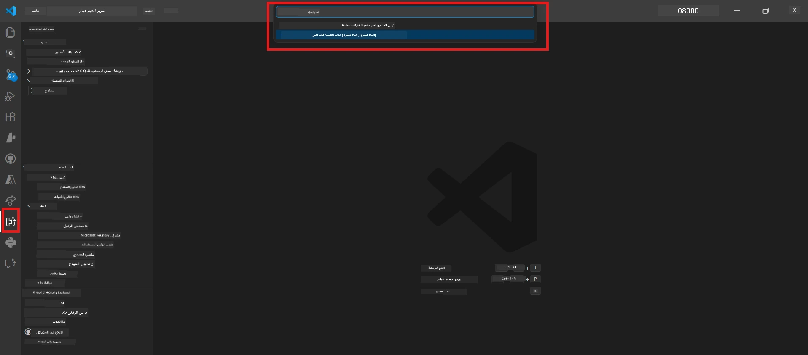

# الوحدة 0 - المتطلبات المسبقة

قبل بدء المختبر 02، تأكد من إكمالك ما يلي. هذا المختبر يبني مباشرة على المختبر 01 - لا تتجاوزه.

---

## 1. أكمل المختبر 01

يفترض المختبر 02 أنك قد قمت بالفعل بـ:

- [x] إكمال جميع الوحدات الثمانية من [المختبر 01 - وكيل واحد](../../lab01-single-agent/README.md)
- [x] نشر وكيل واحد بنجاح إلى خدمة Foundry Agent
- [x] التحقق من عمل الوكيل في كلاً من Agent Inspector المحلي و Foundry Playground

إذا لم تكمل المختبر 01، عد إليه وأكمله الآن: [مستندات المختبر 01](../../lab01-single-agent/docs/00-prerequisites.md)

---

## 2. تحقق من الإعداد الحالي

يجب أن تكون جميع الأدوات من المختبر 01 ما زالت مثبتة وتعمل. قم بتشغيل هذه الفحوصات السريعة:

### 2.1 Azure CLI

```powershell
az account show --query "{name:name, id:id}" --output table
```

المتوقع: يعرض اسم اشتراكك ومعرّفه. إذا فشل ذلك، شغّل [`az login`](https://learn.microsoft.com/cli/azure/authenticate-azure-cli-interactively).

### 2.2 ملحقات VS Code

1. اضغط `Ctrl+Shift+P` → اكتب **"Microsoft Foundry"** → تأكد من ظهور الأوامر (مثل `Microsoft Foundry: Create a New Hosted Agent`).
2. اضغط `Ctrl+Shift+P` → اكتب **"Foundry Toolkit"** → تأكد من ظهور الأوامر (مثل `Foundry Toolkit: Open Agent Inspector`).

### 2.3 مشروع Foundry والنموذج

1. انقر على أيقونة **Microsoft Foundry** في شريط نشاط VS Code.
2. تأكد من إدراج مشروعك (مثل `workshop-agents`).
3. قم بتوسيع المشروع → تحقق من وجود نموذج منشور (مثل `gpt-4.1-mini`) بحالة **Succeeded**.

> **إذا انتهت صلاحية نشر النموذج الخاص بك:** بعض النشرات المجانية تنتهي تلقائيًا. أعد النشر من خلال [كتالوج النماذج](https://learn.microsoft.com/azure/foundry/foundry-models/concepts/models-sold-directly-by-azure) (`Ctrl+Shift+P` → **Microsoft Foundry: Open Model Catalog**).



### 2.4 أدوار RBAC

تحقق من حصولك على دور **Azure AI User** في مشروع Foundry الخاص بك:

1. [بوابة Azure](https://portal.azure.com) → مورد مشروع Foundry الخاص بك → **التحكم بالوصول (IAM)** → تبويب **[تعيينات الدور](https://learn.microsoft.com/azure/foundry/concepts/rbac-foundry)**.
2. ابحث عن اسمك → تأكد من إدراج **[Azure AI User](https://aka.ms/foundry-ext-project-role)**.

---

## 3. فهم مفاهيم الوكلاء المتعددين (جديد للمختبر 02)

يقدم المختبر 02 مفاهيم لم تُغطى في المختبر 01. اقرأ ما يلي قبل المتابعة:

### 3.1 ما هو سير العمل متعدد الوكلاء؟

بدلاً من أن يتولى وكيل واحد كل شيء، يقوم **سير العمل متعدد الوكلاء** بتقسيم العمل عبر عدة وكلاء متخصصين. كل وكيل لديه:

- تعليماته الخاصة (موجه النظام)
- دوره الخاص (ما هو مسؤول عنه)
- أدوات اختيارية (وظائف يمكنه استدعاؤها)

يتواصل الوكلاء من خلال **رسم تنسيقي** يحدد كيف تتدفق البيانات بينهم.

### 3.2 WorkflowBuilder

فئة [`WorkflowBuilder`](https://learn.microsoft.com/agent-framework/workflows/agents-in-workflows) من `agent_framework` هي مكون SDK الذي يربط الوكلاء معًا:

```python
from agent_framework import WorkflowBuilder

workflow = (
    WorkflowBuilder(
        name="MyWorkflow",
        start_executor=agent_a,
        output_executors=[agent_d],
    )
    .add_edge(agent_a, agent_b)
    .add_edge(agent_a, agent_c)
    .add_edge(agent_b, agent_d)
    .add_edge(agent_c, agent_d)
    .build()
)
```

- **`start_executor`** - الوكيل الأول الذي يستقبل إدخال المستخدم
- **`output_executors`** - الوكيل (أو الوكلاء) الذي يصبح مخرجه الرد النهائي
- **`add_edge(source, target)`** - يحدد أن `target` يستقبل مخرج `source`

### 3.3 أدوات MCP (بروتوكول سياق النموذج)

يستخدم المختبر 02 أداة **MCP** التي تستدعي API مايكروسوفت للتعلم لجلب موارد التعليم. [MCP (بروتوكول سياق النموذج)](https://modelcontextprotocol.io/introduction) هو بروتوكول موحد لربط نماذج الذكاء الاصطناعي بمصادر وأدوات بيانات خارجية.

| المصطلح | التعريف |
|------|-----------|
| **خادم MCP** | خدمة تعرض الأدوات/الموارد عبر [بروتوكول MCP](https://learn.microsoft.com/azure/foundry/agents/how-to/tools/model-context-protocol) |
| **عميل MCP** | رمز وكيلك الذي يتصل بخادم MCP ويستدعي أدواته |
| **[Streamable HTTP](https://learn.microsoft.com/agent-framework/agents/tools/hosted-mcp-tools)** | طريقة النقل المستخدمة للتواصل مع خادم MCP |

### 3.4 كيف يختلف المختبر 02 عن المختبر 01

| الجانب | المختبر 01 (وكيل واحد) | المختبر 02 (متعدد الوكلاء) |
|--------|----------------------|---------------------|
| الوكلاء | 1 | 4 (أدوار متخصصة) |
| التنسيق | لا شيء | WorkflowBuilder (متوازي + تسلسلي) |
| الأدوات | دالة `@tool` اختيارية | أداة MCP (استدعاء API خارجي) |
| التعقيد | موجه بسيط → رد | سيرة ذاتية + وصف وظيفة → درجة تناسب → خارطة طريق |
| تدفق السياق | مباشر | تسليم من وكيل لوكيل |

---

## 4. هيكل مستودع ورشة العمل للمختبر 02

تأكد من معرفة مكان ملفات المختبر 02:

```
workshop/
└── lab02-multi-agent/
    ├── README.md                       ← Lab overview
    ├── docs/                           ← You are here
    │   ├── README.md                   ← Learning path index
    │   ├── 00-prerequisites.md         ← This file
    │   ├── 01-understand-multi-agent.md
    │   ├── ...
    │   └── 08-troubleshooting.md
    └── PersonalCareerCopilot/          ← The agent project
        ├── agent.yaml                  ← Agent definition
        ├── main.py                     ← 4-agent workflow code
        ├── Dockerfile                  ← Container configuration
        └── requirements.txt            ← Python dependencies
```

---

### نقطة التحقق

- [ ] المختبر 01 مكتمل بالكامل (جميع الوحدات الثمانية، تم نشر الوكيل والتحقق منه)
- [ ] أمر `az account show` يعرض اشتراكك
- [ ] تم تثبيت ملحقات Microsoft Foundry و Foundry Toolkit وتعمل بشكل جيد
- [ ] مشروع Foundry يحتوي على نموذج منشور (مثل `gpt-4.1-mini`)
- [ ] لديك دور **Azure AI User** في المشروع
- [ ] قرأت قسم مفاهيم الوكلاء المتعددين أعلاه وفهمت WorkflowBuilder و MCP وتنظيم الوكلاء

---

**التالي:** [01 - فهم معماريات الوكلاء المتعددين →](01-understand-multi-agent.md)

---

<!-- CO-OP TRANSLATOR DISCLAIMER START -->
**إخلاء المسؤولية**:
تمت ترجمة هذا المستند باستخدام خدمة الترجمة الآلية [Co-op Translator](https://github.com/Azure/co-op-translator). بينما نسعى لتحقيق الدقة، يُرجى العلم أن الترجمات الآلية قد تحتوي على أخطاء أو عدم دقة. يجب اعتبار المستند الأصلي بلغته الأصلية المصدر الموثوق به. بالنسبة للمعلومات الحيوية، يُنصح بالترجمة الاحترافية البشرية. نحن غير مسؤولين عن أي سوء فهم أو تفسيرات خاطئة تنشأ عن استخدام هذه الترجمة.
<!-- CO-OP TRANSLATOR DISCLAIMER END -->