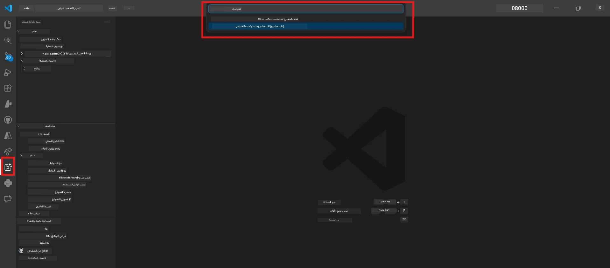

# الوحدة 0 - المقدمة

⏱️ ~10 دقائق

> [!WARNING]
> **المعاينة والقيود:** [الوكلاء المستضافون](https://learn.microsoft.com/azure/foundry/agents/concepts/hosted-agents) في الوقت الحالي في **المعاينة العامة** - غير موصى باستخدامهم في أحمال العمل الإنتاجية. قد تتغير بعض الميزات المعروضة في هذا الورشة مع تقدم الخدمة نحو الإصدار العام.

## ما ستبنيه

في هذا المختبر، تقوم بتوسيع مهارات الوكيل الواحد من المختبر 01 لبناء **تدفق عمل متعدد الوكلاء** - مقيّم الملاءمة للسيرة الذاتية → الوظيفة.

تقوم بلصق **السيرة الذاتية** و **وصف الوظيفة**. يقوم أربعة وكلاء متخصصين بمعالجة الإدخال بالتتابع، ثم يعيدون:
- درجة الملاءمة (من 0 إلى 100 مع تفصيل الدرجات)
- قائمة بالفجوات في المهارات والشهادات
- خارطة طريق تعليمية مخصصة مع روابط حقيقية من Microsoft Learn لكل فجوة

**يستخدم تدفق العمل:**
- **إطار العمل الخاص بميكروسوفت للوكلاء** - `WorkflowBuilder` لتنظيم الخطوط التسلسلية
- **أدوات Foundry لـ VS Code** - لإنشاء الهيكل، والاختبار محلياً، والنشر
- **نموذج ذكاء اصطناعي** (مثلاً `gpt-4.1-mini`) - مستخدم من قبل الوكلاء الأربعة جميعاً
- **خادم Microsoft Learn MCP** - يوفر روابط موارد تعليمية حقيقية لكل فجوة مهارية

---

## اختر مسارك

> ⚠️ **تابع باستخدام نفس المسار الذي استخدمته في المختبر 01.**

<details open>
<summary><strong>🅰️ المسار أ - سحابة Azure (يتطلب اشتراك في Azure)</strong></summary>

| | التفاصيل |
|---|---|
| **لمن هذا؟** | لقد أكملت المختبر 01 باستخدام اشتراك Azure |
| **النموذج** | Azure OpenAI عبر Foundry (مثلاً `gpt-4.1-mini`) |
| **الوحدات المغطاة** | جميع الوحدات (00–09) |
| **نشر للسحابة؟** | ✅ نعم - نشر كامل من البداية إلى النهاية |

</details>

<details open>
<summary><strong>🅱️ المسار ب - Foundry محلي (لا يتطلب اشتراك Azure)</strong></summary>

| | التفاصيل |
|---|---|
| **لمن هذا؟** | لقد أكملت المختبر 01 باستخدام Foundry محلي |
| **النموذج** | Foundry محلي (مجاني، يعمل على جهازك) |
| **الوحدات المغطاة** | الوحدات 00–05 (تخطي 06–07 - النشر والتحقق من السحابة) |
| **نشر للسحابة؟** | ❌ لا - اختبار محلي فقط عبر Agent Inspector |

</details>

---

## التحقق من مختبر 01

يعتمد مختبر 02 بشكل مباشر على مختبر 01. أكمل مختبر 01 أولاً قبل البدء هنا.

لم تقم بإجراء مختبر 01 بعد؟ ابدأ من هنا: [مختبر 01 - المقدمة](../../lab01-single-agent/docs/00-prerequisites.md)

<details open>
<summary><strong>🅰️ المسار أ - سحابة Azure</strong></summary>

```powershell
az account show --query "{name:name, id:id}" --output table
```

إذا فشل هذا، قم بتشغيل `az login`. ثم تحقق في VS Code:

1. `Ctrl+Shift+P` → اكتب **Foundry Toolkit** → تأكد من ظهور الأوامر.
2. انقر على أيقونة **Foundry Toolkit** → سيظهر مشروعك والنموذج المنشور بحالة **ناجح**.



> **RBAC:** لقد عينت **Foundry User** في مختبر 01. إذا كنت بحاجة لإعادة تعيينه، انظر إلى [مختبر 01، الوحدة 1](../../lab01-single-agent/docs/01-setup.md#deploy-a-model--assign-rbac). الدور كان يُسمى سابقًا **Azure AI User** - نفس الصلاحيات.

</details>

<details open>
<summary><strong>🅱️ المسار ب - Foundry محلي</strong></summary>

```powershell
Invoke-WebRequest -Uri "http://localhost:5273/v1/health" -UseBasicParsing | Select-Object StatusCode
```

المتوقع: `StatusCode: 200`. إذا لم يكن، أعد تشغيل Foundry محلي من شريط أدوات Foundry الجانبي.

> يتم تنفيذ جميع الاستنتاجات على جهازك. الاتصال الوحيد الخارجي هو أداة MCP إلى `https://learn.microsoft.com/api/mcp`.

</details>

---

## ما الجديد في مختبر 02

| | مختبر 01 | مختبر 02 |
|--|--------|--------|
| الوكلاء | 1 | 4 (مرتبطون باستخدام WorkflowBuilder) |
| قالب الهيكل | أساسي - إطار العمل الخاص بالوكيل | تدفقات العمل - إطار العمل الخاص بالوكيل |
| الحزمة الجديدة | - | `mcp` |
| التنظيم | وكيل محادثة واحد | خط أنابيب تسلسلي (WorkflowBuilder) |
| الأداة الجديدة | - | `search_microsoft_learn_for_plan` (MCP) |

---

**التالي:** [01 - فهم البنية →](01-understand-multi-agent.md)

---

<!-- CO-OP TRANSLATOR DISCLAIMER START -->
**تنويه**:
تمت ترجمة هذا المستند باستخدام خدمة الترجمة بالذكاء الاصطناعي [Co-op Translator](https://github.com/Azure/co-op-translator). بينما نسعى للدقة، يرجى العلم أن الترجمات الآلية قد تحتوي على أخطاء أو عدم دقة. يجب اعتبار المستند الأصلي بلغته الأصلية المصدر الرسمي والمعتمد. للمعلومات الهامة، يُنصح بالاستعانة بترجمة بشرية محترفة. نحن غير مسؤولين عن أي سوء فهم أو تفسير ناتج عن استخدام هذه الترجمة.
<!-- CO-OP TRANSLATOR DISCLAIMER END -->