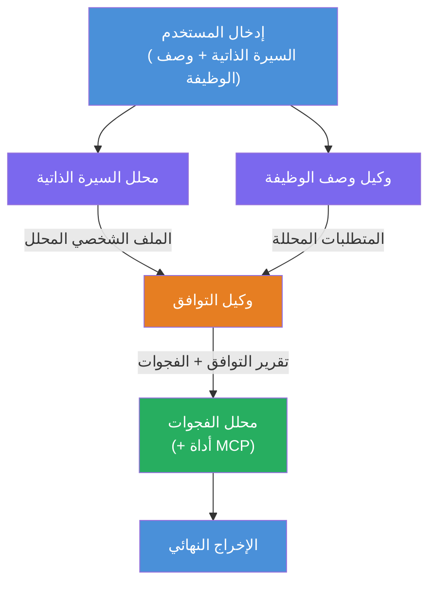
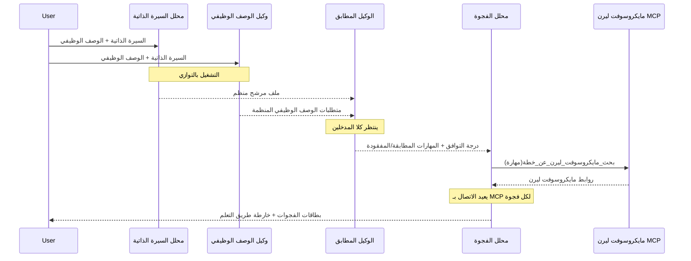
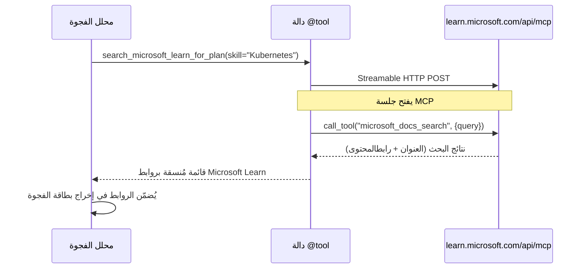

# الوحدة 1 - فهم بنية الوكيل المتعدد

في هذه الوحدة، تتعلم بنية مقيم السيرة الذاتية → تقييم الملاءمة للوظيفة قبل كتابة أي كود. فهم رسم تنظيم الوكلاء، أدوار الوكلاء، وتدفق البيانات أمر حاسم لتصحيح الأخطاء وتوسيع [تدفقات عمل الوكلاء المتعددين](https://learn.microsoft.com/azure/architecture/ai-ml/idea/multiple-agent-workflow-automation).

---

## المشكلة التي تحلها

مطابقة السيرة الذاتية مع وصف الوظيفة تتضمن مهارات متعددة متميزة:

1. **التحليل** - استخراج بيانات منظمة من نص غير منظم (السيرة الذاتية)
2. **التحليل** - استخراج المتطلبات من وصف الوظيفة
3. **المقارنة** - تقييم مدى التطابق بين الاثنين
4. **التخطيط** - بناء خارطة طريق تعليمية لسد الفجوات

وكلاء الواحد الذي يقوم بجميع المهام الأربعة في موجه واحد غالبًا ما ينتج:
- استخراج غير مكتمل (يتسرع في التحليل للوصول إلى التقييم)
- تقييم سطحي (دون تفصيل قائم على الأدلة)
- خرائط طريق عامة (غير مخصصة للفجوات المحددة)

عن طريق تقسيم العملية إلى **أربعة وكلاء متخصصين**، يركّز كل واحد على مهمته بتعليمات مخصصة، مما ينتج مخرجات ذات جودة أعلى في كل مرحلة.

---

## الوكلاء الأربعة

كل وكيل هو وكيل كامل من [Microsoft Foundry](https://learn.microsoft.com/azure/foundry/agents/concepts/hosted-agents) يتم إنشاؤه عبر `AzureAIAgentClient.as_agent()`. يشاركون نفس نشر النموذج لكن لديهم تعليمات مختلفة و(اختياريًا) أدوات مختلفة.

| # | اسم الوكيل | الدور | الإدخال | المخرج |
|---|-----------|------|-------|--------|
| 1 | **ResumeParser** | يستخرج ملف تعريفي منظم من نص السيرة الذاتية | نص السيرة الذاتية الخام (من المستخدم) | الملف التعريفي للمرشح، المهارات التقنية، المهارات الناعمة، الشهادات، خبرة المجال، الإنجازات |
| 2 | **JobDescriptionAgent** | يستخرج المتطلبات المنظمة من وصف الوظيفة | نص وصف الوظيفة الخام (من المستخدم، يُمرر عبر ResumeParser) | نظرة عامة عن الدور، المهارات المطلوبة، المهارات المفضلة، الخبرة، الشهادات، التعليم، المسؤوليات |
| 3 | **MatchingAgent** | يحسب تقييم الملاءمة القائم على الأدلة | مخرجات من ResumeParser + JobDescriptionAgent | درجة الملاءمة (0-100 مع تفصيل)، المهارات المطابقة، المهارات المفقودة، الفجوات |
| 4 | **GapAnalyzer** | يبني خارطة طريق تعليمية شخصية | مخرج من MatchingAgent | بطاقات الفجوات (لكل مهارة)، ترتيب التعلم، الجدول الزمني، الموارد من Microsoft Learn |

---

## رسم التنظيم

تستخدم سير العمل **تفرع متوازٍ** تليه **تجميع متسلسل**:


> **الرمز:** الأرجواني = وكلاء متوازيون، البرتقالي = نقطة تجميع، الأخضر = الوكيل النهائي مع الأدوات

### كيف يتدفق البيانات


1. **يرسل المستخدم** رسالة تحتوي على سيرة ذاتية ووصف وظيفة.
2. **ResumeParser** يستلم الإدخال الكامل من المستخدم ويستخرج ملف تعريفي منظم للمرشح.
3. **JobDescriptionAgent** يستلم إدخال المستخدم بالتوازي ويستخرج المتطلبات المنظمة.
4. **MatchingAgent** يستلم مخرجات من **كل من** ResumeParser وJobDescriptionAgent (الإطار ينتظر اكتمال كليهما قبل تشغيل MatchingAgent).
5. **GapAnalyzer** يستلم مخرج MatchingAgent ويستخدم **أداة Microsoft Learn MCP** لاستدعاء الموارد التعليمية الحقيقية لكل فجوة.
6. **المخرج النهائي** هو استجابة GapAnalyzer، التي تشمل درجة الملاءمة، بطاقات الفجوات، وخارطة طريق تعليمية كاملة.

### لماذا تفرع التوازي مهم

يعمل ResumeParser وJobDescriptionAgent **بالتوازي** لأن لا أحدهما يعتمد على الآخر. هذا:
- يقلل زمن الاستجابة الكلي (كلاهما يعمل في نفس الوقت بدلاً من متسلسل)
- هو تقسيم طبيعي (تحليل السيرة الذاتية مقابل تحليل وصف الوظيفة مهمتان مستقلتان)
- يوضح نمطاً شائعاً في الوكلاء المتعددين: **تفرع → تجميع → تصرف**

---

## WorkflowBuilder في الكود

إليك كيف يتم تعيين الرسم أعلاه إلى دعوات API الخاصة بـ[`WorkflowBuilder`](https://learn.microsoft.com/agent-framework/workflows/agents-in-workflows) في `main.py`:

```python
from agent_framework import WorkflowBuilder

workflow = (
    WorkflowBuilder(
        name="ResumeJobFitEvaluator",
        start_executor=resume_parser,       # أول وكيل يستلم إدخال المستخدم
        output_executors=[gap_analyzer],     # الوكيل النهائي الذي يتم إرجاع مخرجاته
    )
    .add_edge(resume_parser, jd_agent)      # محلل السيرة الذاتية → وكيل وصف الوظيفة
    .add_edge(resume_parser, matching_agent) # محلل السيرة الذاتية → وكيل المطابقة
    .add_edge(jd_agent, matching_agent)      # وكيل وصف الوظيفة → وكيل المطابقة
    .add_edge(matching_agent, gap_analyzer)  # وكيل المطابقة → محلل الفجوات
    .build()
)
```

**فهم الحواف:**

| الحافة | معناه |
|------|--------------|
| `resume_parser → jd_agent` | وكيل وصف الوظيفة يستلم مخرج ResumeParser |
| `resume_parser → matching_agent` | MatchingAgent يستلم مخرج ResumeParser |
| `jd_agent → matching_agent` | MatchingAgent أيضًا يستلم مخرج JD Agent (ينتظر كليهما) |
| `matching_agent → gap_analyzer` | GapAnalyzer يستلم مخرج MatchingAgent |

بما أن `matching_agent` لديه **حافتان واردتان** (`resume_parser` و`jd_agent`)، ينتظر الإطار تلقائيًا اكتمال كلاهما قبل تشغيل MatchingAgent.

---

## أداة MCP

وكيل GapAnalyzer لديه أداة واحدة: `search_microsoft_learn_for_plan`. هذه هي **[أداة MCP](https://learn.microsoft.com/agent-framework/agents/tools/hosted-mcp-tools)** التي تستدعي Microsoft Learn API لجلب الموارد التعليمية المنسقة.

### كيف تعمل

```python
@tool
async def search_microsoft_learn_for_plan(
    skill: str, role: str = "", max_results: int = 5
) -> str:
    """Search Microsoft Learn MCP and return curated official links."""
    # يتصل بـ https://learn.microsoft.com/api/mcp عبر بروتوكول HTTP القابل للتدفق
    # يستدعي أداة 'microsoft_docs_search' على خادم MCP
    # يعيد قائمة منسقة بعناوين URL لـ Microsoft Learn
```

### تدفق استدعاء MCP


1. يقرر GapAnalyzer أنه يحتاج إلى موارد تعليمية لمهارة (مثل "Kubernetes")
2. الإطار يستدعي `search_microsoft_learn_for_plan(skill="Kubernetes")`
3. الدالة تفتح اتصال [HTTP قابل للبث](https://learn.microsoft.com/agent-framework/agents/tools/hosted-mcp-tools) إلى `https://learn.microsoft.com/api/mcp`
4. تستدعي أداة `microsoft_docs_search` على [خادم MCP](https://learn.microsoft.com/azure/foundry/agents/how-to/tools/model-context-protocol)
5. يعيد خادم MCP نتائج البحث (العنوان + الرابط)
6. تنسق الدالة النتائج وتعيدها كسلسلة نصية
7. يستخدم GapAnalyzer الروابط المعادة في مخرجات بطاقة الفجوة

### سجلات MCP المتوقعة

عند تشغيل الأداة، سترى سجلات مثل:

```
GET https://learn.microsoft.com/api/mcp → 405 (Method Not Allowed)
POST https://learn.microsoft.com/api/mcp → 200
DELETE https://learn.microsoft.com/api/mcp → 405 (Method Not Allowed)
```

**هذا طبيعي.** يرسل عميل MCP طلبات GET و DELETE أثناء التهيئة - ظهور 405 هو سلوك متوقع. يستخدم استدعاء الأداة الفعلي POST ويعيد 200. القلق فقط إذا فشلت مكالمات POST.

---

## نمط إنشاء الوكيل

كل وكيل يُنشأ باستخدام مدير السياق غير المتزامن **[`AzureAIAgentClient.as_agent()`](https://learn.microsoft.com/python/api/overview/azure/ai-agents-readme)**. هذا هو نمط Foundry SDK لإنشاء وكلاء تُنظف تلقائيًا:

```python
async with (
    get_credential() as credential,
    AzureAIAgentClient(
        project_endpoint=PROJECT_ENDPOINT,
        model_deployment_name=MODEL_DEPLOYMENT_NAME,
        credential=credential,
    ).as_agent(
        name="ResumeParser",
        instructions=RESUME_PARSER_INSTRUCTIONS,
    ) as resume_parser,
    # ... كرر لكل وكيل ...
):
    # جميع الوكلاء الأربعة موجودين هنا
    workflow = create_workflow(resume_parser, jd_agent, matching_agent, gap_analyzer)
```

**نقاط رئيسية:**
- كل وكيل يحصل على مثيل `AzureAIAgentClient` خاص به (SDK يتطلب أن يكون اسم الوكيل مقيدًا بالعميل)
- يشارك كل الوكلاء نفس `credential`، و`PROJECT_ENDPOINT`، و`MODEL_DEPLOYMENT_NAME`
- يضمن كتلة `async with` تنظيف جميع الوكلاء عند إيقاف تشغيل الخادم
- يحصل GapAnalyzer إضافيًا على `tools=[search_microsoft_learn_for_plan]`

---

## بدء تشغيل الخادم

بعد إنشاء الوكلاء وبناء سير العمل، يبدأ الخادم:

```python
from azure.ai.agentserver.agentframework import from_agent_framework

agent = create_workflow(resume_parser, jd_agent, matching_agent, gap_analyzer)
await from_agent_framework(agent).run_async()
```

`from_agent_framework()` يغلف سير العمل كخادم HTTP يعرض نقطة النهاية `/responses` على المنفذ 8088. هذا نفس النمط المستخدم في المختبر 01، لكن "الوكيل" الآن هو كامل [رسم سير العمل](https://learn.microsoft.com/agent-framework/workflows/as-agents).

---

### نقطة التحقق

- [ ] تفهم بنية الوكلاء الأربعة ودور كل وكيل
- [ ] يمكنك تتبع تدفق البيانات: المستخدم → ResumeParser → (متوازي) وكيل وصف الوظيفة + MatchingAgent → GapAnalyzer → المخرج
- [ ] تفهم لماذا ينتظر MatchingAgent كل من ResumeParser ووكيل وصف الوظيفة (حافتان واردتان)
- [ ] تفهم أداة MCP: ما تقوم به، كيف يتم استدعاؤها، وأن سجلات GET 405 طبيعية
- [ ] تفهم نمط `AzureAIAgentClient.as_agent()` ولماذا لكل وكيل مثيل عميل خاص به
- [ ] يمكنك قراءة كود `WorkflowBuilder` وربطه بالرسم البياني المرئي

---

**السابق:** [00 - المتطلبات الأساسية](00-prerequisites.md) · **التالي:** [02 - إعداد مشروع الوكلاء المتعددين →](02-scaffold-multi-agent.md)

---

<!-- CO-OP TRANSLATOR DISCLAIMER START -->
**إخلاء المسؤولية**:  
تمت ترجمة هذا المستند باستخدام خدمة الترجمة الآلية [Co-op Translator](https://github.com/Azure/co-op-translator). بينما نسعى للدقة، يُرجى العلم أن التراجم الآلية قد تحتوي على أخطاء أو عدم دقة. يجب اعتبار النسخة الأصلية للمستند بلغتها الأصلية هي المصدر المعتمد. للمعلومات الحرجة، يُنصح بالاعتماد على الترجمة المهنية البشرية. نحن غير مسؤولين عن أي سوء فهم أو تفسيرات خاطئة قد تنشأ عن استخدام هذه الترجمة.
<!-- CO-OP TRANSLATOR DISCLAIMER END -->