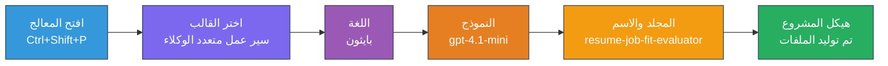
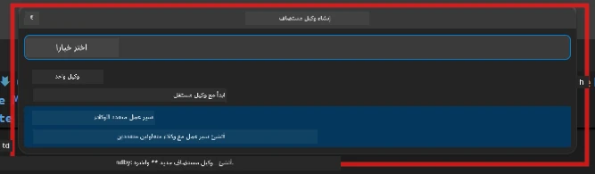

# الوحدة 2 - تهيئة مشروع الوكلاء المتعددين

في هذه الوحدة، تستخدم [امتداد Microsoft Foundry](https://marketplace.visualstudio.com/items?itemName=TeamsDevApp.vscode-ai-foundry) لـ **تهيئة مشروع سير عمل للوكلاء المتعددين**. يقوم الامتداد بإنشاء هيكل المشروع الكامل - `agent.yaml`، `main.py`، `Dockerfile`، `requirements.txt`، `.env`، وتكوين التصحيح. ثم تقوم بتخصيص هذه الملفات في الوحدتين 3 و4.

> **ملاحظة:** مجلد `PersonalCareerCopilot/` في هذا المختبر هو مثال كامل يعمل على مشروع وكلاء متعدد مخصص. يمكنك إما تهيئة مشروع جديد (يوصى به للتعلم) أو دراسة الكود الحالي مباشرة.

---

## الخطوة 1: افتح معالج إنشاء وكيل مستضاف


1. اضغط على `Ctrl+Shift+P` لفتح **لوحة الأوامر**.
2. اكتب: **Microsoft Foundry: Create a New Hosted Agent** وحددها.
3. يفتح معالج إنشاء الوكيل المستضاف.

> **بديل:** انقر على أيقونة **Microsoft Foundry** في شريط النشاط → انقر على أيقونة **+** بجانب **Agents** → **Create New Hosted Agent**.

---

## الخطوة 2: اختر قالب سير عمل الوكلاء المتعددين

يسألك المعالج لاختيار قالب:

| القالب | الوصف | متى تستخدم |
|----------|-------------|-------------|
| وكيل واحد | وكيل واحد مع تعليمات وأدوات اختيارية | المختبر 01 |
| **سير عمل الوكلاء المتعددين** | عدة وكلاء يتعاونون عبر WorkflowBuilder | **هذا المختبر (المختبر 02)** |

1. اختر **سير عمل الوكلاء المتعددين**.
2. اضغط **التالي**.



---

## الخطوة 3: اختر لغة البرمجة

1. اختر **Python**.
2. اضغط **التالي**.

---

## الخطوة 4: اختر نموذجك

1. يعرض المعالج النماذج المنشورة في مشروع Foundry الخاص بك.
2. اختر نفس النموذج الذي استخدمته في المختبر 01 (مثلًا **gpt-4.1-mini**).
3. اضغط **التالي**.

> **نصيحة:** [`gpt-4.1-mini`](https://learn.microsoft.com/azure/foundry/foundry-models/concepts/models-sold-directly-by-azure#gpt-41-series) موصى به للتطوير - سريع ورخيص ويتعامل جيدًا مع سير العمل متعدد الوكلاء. انتقل إلى `gpt-4.1` للنشر النهائي إذا أردت جودة إخراج أعلى.

---

## الخطوة 5: اختر موقع المجلد واسم الوكيل

1. يفتح مربع حوار الملفات. اختر مجلد الهدف:
   - إذا كنت تتبع مستودع الورشة: تنقل إلى `workshop/lab02-multi-agent/` وأنشئ مجلد فرعي جديد
   - إذا بدأت من جديد: اختر أي مجلد
2. أدخل **اسم** للوكيل المستضاف (مثلًا `resume-job-fit-evaluator`).
3. اضغط **إنشاء**.

---

## الخطوة 6: انتظر إكمال التهيئة

1. يفتح VS Code نافذة جديدة (أو تحدث النافذة الحالية) مع المشروع المهيأ.
2. يجب أن ترى هيكل الملفات كالتالي:

```
resume-job-fit-evaluator/
├── .env                ← Environment variables (placeholders)
├── .vscode/
│   └── launch.json     ← Debug configuration
├── agent.yaml          ← Agent definition (kind: hosted)
├── Dockerfile          ← Container configuration
├── main.py             ← Multi-agent workflow code (scaffold)
└── requirements.txt    ← Python dependencies
```

> **ملاحظة ورشة العمل:** في مستودع الورشة، مجلد `.vscode/` يكون في **جذر مساحة العمل** مع ملفات `launch.json` و `tasks.json` المشتركة. تتضمن التهيئات التصحيحية للمختبر 01 والمختبر 02. عند الضغط على F5، اختر **"Lab02 - Multi-Agent"** من القائمة.

---

## الخطوة 7: فهم الملفات المهيأة (خصوصيات الوكلاء المتعددين)

يختلف التهيئة الخاصة بالوكلاء المتعددين عن تهيئة الوكيل الواحد بعدة طرق رئيسية:

### 7.1 `agent.yaml` - تعريف الوكيل

```yaml
kind: hosted
name: resume-job-fit-evaluator
description: >
  A multi-agent workflow that evaluates resume-to-job fit.
metadata:
  authors:
    - Microsoft
  tags:
    - Multi-Agent Workflow
    - Resume Evaluator
protocols:
  - protocol: responses
    version: v1
environment_variables:
  - name: PROJECT_ENDPOINT
    value: ${PROJECT_ENDPOINT}
  - name: MODEL_DEPLOYMENT_NAME
    value: ${MODEL_DEPLOYMENT_NAME}
```

**الفرق الرئيسي عن المختبر 01:** قد تتضمن قسم `environment_variables` متغيرات إضافية لنقاط نهاية MCP أو تكوين أدوات أخرى. يعكس `name` و`description` استخدام الحالة متعدد الوكلاء.

### 7.2 `main.py` - كود سير عمل الوكلاء المتعددين

تتضمن التهيئة:
- **سلاسل تعليمات متعددة لكل وكيل** (ثابت واحد لكل وكيل)
- **متصرفي سياق متعددة [`AzureAIAgentClient.as_agent()`](https://learn.microsoft.com/python/api/overview/azure/ai-agents-readme)** (واحد لكل وكيل)
- **[`WorkflowBuilder`](https://learn.microsoft.com/agent-framework/workflows/agents-in-workflows)** لربط الوكلاء معًا
- **`from_agent_framework()`** لخدمة سير العمل كنقطة نهاية HTTP

```python
from agent_framework import WorkflowBuilder, tool
from agent_framework.azure import AzureAIAgentClient
from azure.ai.agentserver.agentframework import from_agent_framework
```

الاستيراد الإضافي [`WorkflowBuilder`](https://learn.microsoft.com/agent-framework/workflows/agents-in-workflows) جديد مقارنة بالمختبر 01.

### 7.3 `requirements.txt` - تبعيات إضافية

يستخدم مشروع الوكلاء المتعددين نفس الحزم الأساسية للمختبر 01، بالإضافة إلى أي حزم متعلقة بـ MCP:

```
agent-framework-azure-ai==1.0.0rc3
agent-framework-core==1.0.0rc3
azure-ai-agentserver-agentframework==1.0.0b16
azure-ai-agentserver-core==1.0.0b16
debugpy
agent-dev-cli --pre
```

> **ملاحظة مهمة عن الإصدار:** حزمة `agent-dev-cli` تتطلب علم `--pre` في `requirements.txt` لتثبيت أحدث إصدار معاينة. هذا مطلوب لتوافق Agent Inspector مع `agent-framework-core==1.0.0rc3`. راجع [الوحدة 8 - استكشاف الأخطاء](08-troubleshooting.md) لتفاصيل الإصدار.

| الحزمة | الإصدار | الغرض |
|---------|---------|---------|
| [`agent-framework-azure-ai`](https://learn.microsoft.com/agent-framework/overview/) | `1.0.0rc3` | تكامل Azure AI لـ [Microsoft Agent Framework](https://github.com/microsoft/agent-framework) |
| [`agent-framework-core`](https://learn.microsoft.com/agent-framework/overview/) | `1.0.0rc3` | بيئة التشغيل الأساسية (تشمل WorkflowBuilder) |
| `azure-ai-agentserver-agentframework` | `1.0.0b16` | بيئة تشغيل خادم الوكيل المستضاف |
| `azure-ai-agentserver-core` | `1.0.0b16` | تجريدات أساسية لخادم الوكيل |
| `debugpy` | أحدث إصدار | تصحيح بايثون (F5 في VS Code) |
| `agent-dev-cli` | `--pre` | CLI التطوير المحلي + خلفية Agent Inspector |

### 7.4 `Dockerfile` - نفس المختبر 01

ملف Dockerfile مطابق لملف المختبر 01 - ينسخ الملفات، يثبت التبعيات من `requirements.txt`، يعرض المنفذ 8088، ويشغل `python main.py`.

```dockerfile
FROM python:3.14-slim
WORKDIR /app
COPY ./ .
RUN pip install --upgrade pip && \
    if [ -f requirements.txt ]; then \
        pip install -r requirements.txt; \
    else \
      echo "No requirements.txt found" >&2; exit 1; \
    fi
EXPOSE 8088
CMD ["python", "main.py"]
```

---

### نقطة التحقق

- [ ] تم إكمال معالج التهيئة → الهيكل الجديد للمشروع ظاهر
- [ ] يمكنك رؤية جميع الملفات: `agent.yaml`، `main.py`، `Dockerfile`، `requirements.txt`، `.env`
- [ ] `main.py` تتضمن استيراد `WorkflowBuilder` (يؤكد اختيار قالب وكلاء متعددين)
- [ ] `requirements.txt` تشمل كل من `agent-framework-core` و `agent-framework-azure-ai`
- [ ] تفهم كيف يختلف هيكل الوكلاء المتعددين عن هيكل الوكيل الواحد (عدة وكلاء، WorkflowBuilder، أدوات MCP)

---

**السابق:** [01 - فهم بنية الوكلاء المتعددين](01-understand-multi-agent.md) · **التالي:** [03 - تهيئة الوكلاء والبيئة →](03-configure-agents.md)

---

<!-- CO-OP TRANSLATOR DISCLAIMER START -->
**إخلاء مسؤولية**:  
تم ترجمة هذا المستند باستخدام خدمة الترجمة الآلية [Co-op Translator](https://github.com/Azure/co-op-translator). بينما نسعى لتحقيق الدقة، يرجى العلم أن الترجمات الآلية قد تحتوي على أخطاء أو عدم دقة. يجب اعتبار المستند الأصلي بلغته الأصلية هو المصدر الموثوق. بالنسبة للمعلومات المهمة، يُنصح بالاستعانة بالترجمة البشرية المهنية. نحن غير مسؤولين عن أي سوء فهم أو تفسير ناتج عن استخدام هذه الترجمة.
<!-- CO-OP TRANSLATOR DISCLAIMER END -->