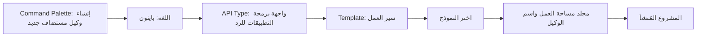
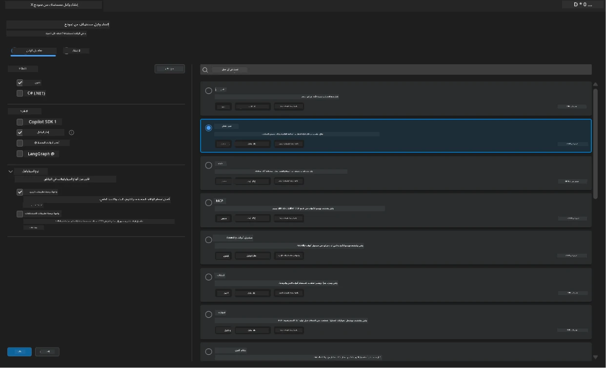
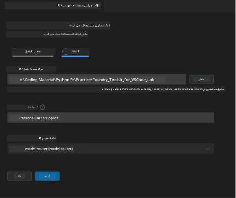

# الوحدة 2 - إنشاء هيكل مشروع متعدد الوكلاء

⏱️ ~5 دقائق

في هذه الوحدة، تستخدم [Foundry Toolkit لـ VS Code](https://aka.ms/foundrytk) لـ **إنشاء هيكل مشروع متعدد الوكلاء**. يقوم المعالج بإنشاء الملفات `agent.yaml`, `main.py`, `Dockerfile`, `requirements.txt`, `.env`، وتكوين تصحيح الأخطاء لـ VS Code - حتى تتمكن من التركيز على توصيل سير العمل بأربعة وكلاء في الوحدة 3.

> **المفهوم الرئيسي:** الهيكل هو نموذج عمل بوكيل واحد. تقوم باستبدال منطق العنصر النائب بـ `WorkflowBuilder` في الوحدة 3. لا تحتاج إلى كتابة أساسيات المشروع من الصفر.

> **التطبيق المرجعي:** [`PersonalCareerCopilot/`](../../../../../workshop/lab02-multi-agent/PersonalCareerCopilot) هو مثال عملي كامل. استخدمه لمقارنة عملك أثناء التقدم.

### تدفق معالج إنشاء الهيكل


```mermaid
flowchart LR
    A[Command Palette: إنشاء وكيل مستضاف جديد] --> B[اللغة: بايثون]
    B --> C[API Type: واجهة برمجة التطبيقات للرد]
    C --> D[Template: سير العمل]
    D --> E[اختر النموذج]
    E --> F[مجلد مساحة العمل واسم الوكيل]
    F --> G[المشروع المُنشأ]
```

---

## الخطوة 1: افتح معالج إنشاء وكيل مستضاف

1. اضغط `Ctrl+Shift+P` لفتح **لوحة الأوامر**.
2. اكتب: **Foundry Toolkit: Create a New Hosted Agent** واختره.
3. يفتح المعالج على علامة التبويب **تفاصيل الوكيل**.

> **بديل:** انقر على أيقونة **Foundry Toolkit** في شريط النشاط → انقر على أيقونة **+** بجانب **الوكلاء المستضافين** → **إنشاء وكيل مستضاف جديد**.

---

## الخطوة 2: اختر الإعدادات



1. في قسم التنقل/الخيارات الأيسر اختر التالي:

| القائمة | الاختيار | ملاحظات |
|--------|-----------|-------|
| **اللغة** | Python | .NET (#C) مدعومة أيضًا |
| **الإطار** | Agent Framework | يوفر `Agent`, `AgentExecutor`, `WorkflowBuilder` |
| **نوع API** | Response API | `POST /responses` - التاريخ المدار من المنصة، دعم البث |
| **القالب** | **Workflows** | يعالج الطلبات عبر عدة وكلاء متتالية |

2. بعد الاختيار، انقر على **التالي**



3. في النافذة التالية، اختر التالي:

| القائمة | الاختيار | ملاحظات |
|--------|-----------|-------|
| **مجلد مساحة العمل** | تصفح إلى المجلد الهدف | مثلا `workshop/lab02-multi-agent/` في هذا المستودع |
| **اسم الوكيل** | `PersonalCareerCopilot` | هذا يصبح اسم مجلد المشروع |
| **نشر النموذج** | اختر النموذج المنشور الخاص بك | مثلا `gpt-4.1-mini` من المختبر 01 |

4. انقر على **إنشاء** لإنشاء هيكل المشروع. يقوم VS Code بإنشاء الملفات وفتح المجلد.

> **نصيحة:** [`gpt-4.1-mini`](https://learn.microsoft.com/azure/foundry/foundry-models/concepts/models-sold-directly-by-azure#gpt-41-series) يوازن جيدًا بين السرعة والجودة لتطوير متعدد الوكلاء.

---

## الخطوة 3: تفقد المشروع المنشأ

بعد الانتهاء من إنشاء الهيكل، تأكد من وجود هذه الملفات في المستكشف (`Ctrl+Shift+E`):

```
📂 <your-agent-name>/
├── .azdignore          ← Files excluded from Azure Developer CLI deployments
├── .dockerignore       ← Files excluded from Docker builds
├── .env                ← Environment variables (placeholders - fill in Module 3)
├── .vscode/
│   ├── launch.json     ← Debug config (F5 → run + Agent Inspector)
│   └── tasks.json      ← VS Code task definitions
├── agent.yaml          ← Agent definition (kind: hosted, protocol: responses)
├── Dockerfile          ← Container config for deployment
├── main.py             ← Stub agent entry point (replace with WorkflowBuilder in Module 3)
└── requirements.txt    ← Python dependencies
```

> **مهم:** افتح هذا المجلد المنشأ مباشرة في VS Code حتى تطبق ملفات `.vscode/launch.json` و `tasks.json` بشكل صحيح عند تصحيح الأخطاء بالضغط على F5.

### شرح الملفات الرئيسية

| الملف | الغرض |
|------|---------|
| `agent.yaml` | يعلن `kind: hosted`، يربط متغيرات البيئة، يعرف بروتوكول `/responses` |
| `main.py` | نموذج مبدئي: `FoundryChatClient` → `Agent` → `ResponsesHostServer`. تستبدله بـ 4 وكلاء + `WorkflowBuilder` في الوحدة 3 |
| `Dockerfile` | `python:3.12-slim`, يثبت `requirements.txt`, يفتح المنفذ 8088، يشغل `python main.py` |
| `requirements.txt` | `agent-framework-foundry`, `agent-framework-foundry-hosting`, `mcp<2,>=1.24.0`, `debugpy` |

> **مرجع:** انظر إلى [`PersonalCareerCopilot/agent.yaml`](../../../../../workshop/lab02-multi-agent/PersonalCareerCopilot/agent.yaml) و [`PersonalCareerCopilot/requirements.txt`](../../../../../workshop/lab02-multi-agent/PersonalCareerCopilot/requirements.txt) للمحتوى الكامل المنشأ.

---

### ✅ نقطة تحقق

- [ ] تم الانتهاء من معالج إنشاء الهيكل - مجلد المشروع الجديد ظاهر في المستكشف
- [ ] جميع الملفات المتوقعة موجودة: `agent.yaml`, `main.py`, `Dockerfile`, `requirements.txt`, `.env`
- [ ] في `agent.yaml` يظهر `kind: hosted` و `protocol: responses`
- [ ] في `main.py` تستورد `Agent`, `FoundryChatClient`, `ResponsesHostServer`
- [ ] المجلد المنشأ مفتوح كجذر مساحة عمل VS Code
- [ ] تفهم أن `main.py` هو نموذج مبدئي - يضاف `WorkflowBuilder` في الوحدة 3

---

**السابق:** [01 - فهم بنية متعدد الوكلاء](01-understand-multi-agent.md) · **التالي:** [03 - تكوين الوكلاء والبيئة →](03-configure-agents.md)

---

<!-- CO-OP TRANSLATOR DISCLAIMER START -->
**تنويه**:
تمت ترجمة هذا المستند باستخدام خدمة الترجمة بالذكاء الاصطناعي [Co-op Translator](https://github.com/Azure/co-op-translator). بينما نسعى للدقة، يرجى العلم أن الترجمات الآلية قد تحتوي على أخطاء أو عدم دقة. يجب اعتبار المستند الأصلي بلغته الأصلية المصدر الرسمي والمعتمد. للمعلومات الهامة، يُنصح بالاستعانة بترجمة بشرية محترفة. نحن غير مسؤولين عن أي سوء فهم أو تفسير ناتج عن استخدام هذه الترجمة.
<!-- CO-OP TRANSLATOR DISCLAIMER END -->