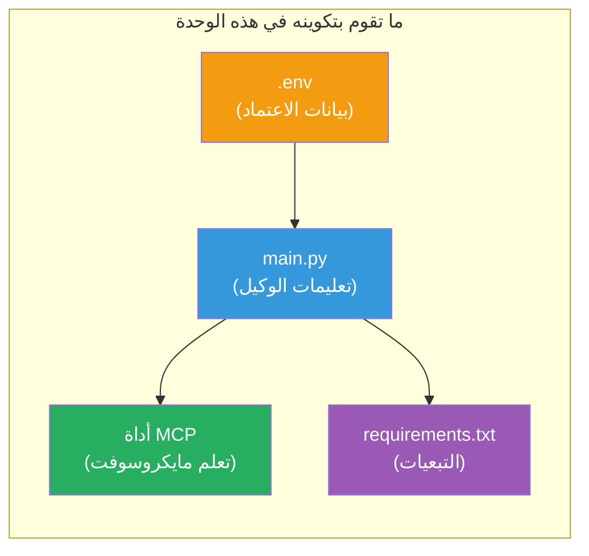

# الوحدة 3 - تكوين الوكلاء، أداة MCP والبيئة

في هذه الوحدة، تقوم بتخصيص مشروع الوكلاء المتعددين المُنشأ. ستكتب التعليمات لجميع الوكلاء الأربعة، تضبط أداة MCP لـ Microsoft Learn، تُكوّن متغيرات البيئة، وتثبت التبعيات.


> **مرجع:** الكود العامل الكامل موجود في [`PersonalCareerCopilot/main.py`](../../../../../workshop/lab02-multi-agent/PersonalCareerCopilot/main.py). استخدمه كمرجع أثناء بناء مشروعك الخاص.

---

## الخطوة 1: تكوين متغيرات البيئة

1. افتح ملف **`.env`** في جذر مشروعك.
2. املأ تفاصيل مشروع Foundry الخاص بك:

   ```env
   PROJECT_ENDPOINT=https://<your-account>.services.ai.azure.com/api/projects/<your-project>
   MODEL_DEPLOYMENT_NAME=gpt-4.1-mini
   ```

3. احفظ الملف.

### أين تجد هذه القيم

| القيمة | كيفية إيجادها |
|-------|---------------|
| **نقطة النهاية للمشروع** | شريط جانبي Microsoft Foundry → انقر على مشروعك → عنوان نقطة النهاية في عرض التفاصيل |
| **اسم نشر النموذج** | شريط Foundry الجانبي → توسيع المشروع → **النماذج + نقاط النهاية** → الاسم بجانب النموذج المنشور |

> **الأمان:** لا تقم أبداً بإضافة `.env` إلى نظام التحكم في الإصدارات. أضفه إلى `.gitignore` إذا لم يكن موجوداً.

### تعيين متغيرات البيئة

يقرأ ملف `main.py` الخاص بالوكلاء المتعددين أسماء متغيرات البيئة القياسية والخاصة بالورشة:

```python
PROJECT_ENDPOINT = os.getenv("AZURE_AI_PROJECT_ENDPOINT") or os.getenv("PROJECT_ENDPOINT")
MODEL_DEPLOYMENT_NAME = os.getenv(
    "AZURE_AI_MODEL_DEPLOYMENT_NAME",
    os.getenv("MODEL_DEPLOYMENT_NAME", "gpt-4.1-mini"),
)
MICROSOFT_LEARN_MCP_ENDPOINT = os.getenv(
    "MICROSOFT_LEARN_MCP_ENDPOINT", "https://learn.microsoft.com/api/mcp"
)
```

يحتوي نقطة نهاية MCP على قيمة افتراضية معقولة - لست بحاجة لضبطها في `.env` إلا إذا أردت تجاوزها.

---

## الخطوة 2: كتابة تعليمات الوكيل

هذه هي الخطوة الأكثر أهمية. يحتاج كل وكيل إلى تعليمات مصاغة بعناية تحدد دوره، صيغة الإخراج، والقواعد. افتح `main.py` وأنشئ (أو عدل) ثوابت التعليمات.

### 2.1 وكيل محلل السيرة الذاتية

```python
RESUME_PARSER_INSTRUCTIONS = """\
You are the Resume Parser.
Extract resume text into a compact, structured profile for downstream matching.

Output exactly these sections:
1) Candidate Profile
2) Technical Skills (grouped categories)
3) Soft Skills
4) Certifications & Awards
5) Domain Experience
6) Notable Achievements

Rules:
- Use only explicit or strongly implied evidence.
- Do not invent skills, titles, or experience.
- Keep concise bullets; no long paragraphs.
- If input is not a resume, return a short warning and request resume text.
"""
```

**لماذا هذه الأقسام؟** يحتاج وكيل المطابقة إلى بيانات منظمة للتقييم. الأقسام المتناسقة تجعل تمرير المعلومات بين الوكلاء موثوقاً.

### 2.2 وكيل وصف الوظيفة

```python
JOB_DESCRIPTION_INSTRUCTIONS = """\
You are the Job Description Analyst.
Extract a structured requirement profile from a JD.

Output exactly these sections:
1) Role Overview
2) Required Skills
3) Preferred Skills
4) Experience Required
5) Certifications Required
6) Education
7) Domain / Industry
8) Key Responsibilities

Rules:
- Keep required vs preferred clearly separated.
- Only use what the JD states; do not invent hidden requirements.
- Flag vague requirements briefly.
- If input is not a JD, return a short warning and request JD text.
"""
```

**لماذا فصل المهارات المطلوبة عن المفضلة؟** يستخدم وكيل المطابقة أوزان مختلفة لكل منهما (المهارات المطلوبة = 40 نقطة، المهارات المفضلة = 10 نقاط).

### 2.3 وكيل المطابقة

```python
MATCHING_AGENT_INSTRUCTIONS = """\
You are the Matching Agent.
Compare parsed resume output vs JD output and produce an evidence-based fit report.

Scoring (100 total):
- Required Skills 40
- Experience 25
- Certifications 15
- Preferred Skills 10
- Domain Alignment 10

Output exactly these sections:
1) Fit Score (with breakdown math)
2) Matched Skills
3) Missing Skills
4) Partially Matched
5) Experience Alignment
6) Certification Gaps
7) Overall Assessment

Rules:
- Be objective and evidence-only.
- Keep partial vs missing separate.
- Keep Missing Skills precise; it feeds roadmap planning.
"""
```

**لماذا التقييم الصريح؟** يجعل التقييم القابل لإعادة الإنتاج من الممكن مقارنة النتائج وتصحيح الأخطاء. مقياس 100 نقطة سهل الفهم للمستخدمين النهائيين.

### 2.4 وكيل محلل الفجوات

```python
GAP_ANALYZER_INSTRUCTIONS = """\
You are the Gap Analyzer and Roadmap Planner.
Create a practical upskilling plan from the matching report.

Microsoft Learn MCP usage (required):
- For EVERY High and Medium priority gap, call tool `search_microsoft_learn_for_plan`.
- Use returned Learn links in Suggested Resources.
- Prefer Microsoft Learn for free resources.

CRITICAL: You MUST produce a SEPARATE detailed gap card for EVERY skill listed in
the Missing Skills and Certification Gaps sections of the matching report. Do NOT
skip or combine gaps. Do NOT summarize multiple gaps into one card.

Output format:
1) Personalized Learning Roadmap for [Role Title]
2) One DETAILED card per gap (produce ALL cards, not just the first):
   - Skill
   - Priority (High/Medium/Low)
   - Current Level
   - Target Level
   - Suggested Resources (include Learn URL from tool results)
   - Estimated Time
   - Quick Win Project
3) Recommended Learning Order (numbered list)
4) Timeline Summary (week-by-week)
5) Motivational Note

Rules:
- Produce every gap card before writing the summary sections.
- Keep it specific, realistic, and actionable.
- Tailor to candidate's existing stack.
- If fit >= 80, focus on polish/interview readiness.
- If fit < 40, be honest and provide a staged path.
"""
```

**لماذا التأكيد على كلمة "حرج"?** بدون تعليمات صريحة لإنتاج جميع بطاقات الفجوات، يميل النموذج لإنشاء بطاقة أو بطاقتين فقط وتلخيص الباقي. كتلة "حَرِج" تمنع هذا التلخيص.

---

## الخطوة 3: تعريف أداة MCP

يستخدم محلل الفجوات أداة تستدعي [خادم MCP في Microsoft Learn](https://learn.microsoft.com/azure/foundry/agents/how-to/tools/model-context-protocol). أضف هذا إلى `main.py`:

```python
import json
from agent_framework import tool
from mcp.client.session import ClientSession
from mcp.client.streamable_http import streamable_http_client

@tool
async def search_microsoft_learn_for_plan(
    skill: str, role: str = "", max_results: int = 5
) -> str:
    """Search Microsoft Learn MCP and return curated official links for roadmap planning."""
    query = " ".join(part for part in [skill, role, "learning path module"] if part).strip()
    query = query or "job skills learning path"

    try:
        async with streamable_http_client(MICROSOFT_LEARN_MCP_ENDPOINT) as (
            read_stream, write_stream, _,
        ):
            async with ClientSession(read_stream, write_stream) as session:
                await session.initialize()
                result = await session.call_tool(
                    "microsoft_docs_search", {"query": query}
                )

        if not result.content:
            return (
                "No results returned from Microsoft Learn MCP. "
                "Fallback: https://learn.microsoft.com/training/support/catalog-api"
            )

        payload_text = getattr(result.content[0], "text", "")
        data = json.loads(payload_text) if payload_text else {}
        items = data.get("results", [])[:max(1, min(max_results, 10))]

        if not items:
            return f"No direct Microsoft Learn results found for '{skill}'."

        lines = [f"Microsoft Learn resources for '{skill}':"]
        for i, item in enumerate(items, start=1):
            title = item.get("title") or item.get("url") or "Microsoft Learn Resource"
            url = item.get("url") or item.get("link") or ""
            lines.append(f"{i}. {title} - {url}".rstrip(" -"))
        return "\n".join(lines)
    except Exception as ex:
        return (
            f"Microsoft Learn MCP lookup unavailable. Reason: {ex}. "
            "Fallbacks: https://learn.microsoft.com/api/mcp"
        )
```

### كيف تعمل الأداة

| الخطوة | ماذا يحدث |
|------|-------------|
| 1 | يقرر محلل الفجوات أنه يحتاج موارد لمهارة (مثلاً: "Kubernetes") |
| 2 | الإطار يستدعي `search_microsoft_learn_for_plan(skill="Kubernetes")` |
| 3 | الدالة تفتح اتصال [Streamable HTTP](https://learn.microsoft.com/agent-framework/agents/tools/hosted-mcp-tools) إلى `https://learn.microsoft.com/api/mcp` |
| 4 | تستدعي `microsoft_docs_search` على [خادم MCP](https://learn.microsoft.com/azure/foundry/agents/how-to/tools/model-context-protocol) |
| 5 | يعيد خادم MCP نتائج البحث (العنوان + الرابط) |
| 6 | تنسق الدالة النتائج كقائمة مرقمة |
| 7 | يُدمج محلل الفجوات عناوين URL في بطاقة الفجوة |

### تبعيات MCP

تُضمّن مكتبات عميل MCP بشكل عرضي عبر [`agent-framework-core`](https://learn.microsoft.com/agent-framework/overview/). لست بحاجة لإضافتها إلى `requirements.txt` بشكل منفصل. إذا واجهت أخطاء استيراد، تحقق من:

```powershell
pip list | Select-String "mcp"
```

المطلوب: حزمة `mcp` مثبّتة (الإصدار 1.x أو أحدث).

---

## الخطوة 4: توصيل الوكلاء وتدفق العمل

### 4.1 إنشاء الوكلاء باستخدام مديري السياق

```python
from contextlib import asynccontextmanager

@asynccontextmanager
async def create_agents():
    async with (
        get_credential() as credential,
        AzureAIAgentClient(
            project_endpoint=PROJECT_ENDPOINT,
            model_deployment_name=MODEL_DEPLOYMENT_NAME,
            credential=credential,
        ).as_agent(
            name="ResumeParser",
            instructions=RESUME_PARSER_INSTRUCTIONS,
        ) as resume_parser,
        AzureAIAgentClient(
            project_endpoint=PROJECT_ENDPOINT,
            model_deployment_name=MODEL_DEPLOYMENT_NAME,
            credential=credential,
        ).as_agent(
            name="JobDescriptionAgent",
            instructions=JOB_DESCRIPTION_INSTRUCTIONS,
        ) as jd_agent,
        AzureAIAgentClient(
            project_endpoint=PROJECT_ENDPOINT,
            model_deployment_name=MODEL_DEPLOYMENT_NAME,
            credential=credential,
        ).as_agent(
            name="MatchingAgent",
            instructions=MATCHING_AGENT_INSTRUCTIONS,
        ) as matching_agent,
        AzureAIAgentClient(
            project_endpoint=PROJECT_ENDPOINT,
            model_deployment_name=MODEL_DEPLOYMENT_NAME,
            credential=credential,
        ).as_agent(
            name="GapAnalyzer",
            instructions=GAP_ANALYZER_INSTRUCTIONS,
            tools=[search_microsoft_learn_for_plan],
        ) as gap_analyzer,
    ):
        yield resume_parser, jd_agent, matching_agent, gap_analyzer
```

**نقاط رئيسية:**
- لكل وكيل نسخته **الخاصة** من `AzureAIAgentClient`
- فقط محلل الفجوات يحصل على `tools=[search_microsoft_learn_for_plan]`
- تعيد `get_credential()` [`ManagedIdentityCredential`](https://learn.microsoft.com/python/api/overview/azure/identity-readme#managed-identity-support) في Azure، و [`DefaultAzureCredential`](https://learn.microsoft.com/azure/developer/python/sdk/authentication/credential-chains#defaultazurecredential-overview) محلياً

### 4.2 بناء رسم تدفق العمل

```python
def create_workflow(resume_parser, jd_agent, matching_agent, gap_analyzer):
    workflow = (
        WorkflowBuilder(
            name="ResumeJobFitEvaluator",
            start_executor=resume_parser,
            output_executors=[gap_analyzer],
        )
        .add_edge(resume_parser, jd_agent)
        .add_edge(resume_parser, matching_agent)
        .add_edge(jd_agent, matching_agent)
        .add_edge(matching_agent, gap_analyzer)
        .build()
    )
    return workflow.as_agent()
```

> راجع [Workflows as Agents](https://learn.microsoft.com/agent-framework/workflows/as-agents) لفهم نمط `.as_agent()`.

### 4.3 بدء الخادم

```python
async def main() -> None:
    validate_configuration()
    async with create_agents() as (resume_parser, jd_agent, matching_agent, gap_analyzer):
        agent = create_workflow(resume_parser, jd_agent, matching_agent, gap_analyzer)
        from azure.ai.agentserver.agentframework import from_agent_framework
        await from_agent_framework(agent).run_async()

if __name__ == "__main__":
    asyncio.run(main())
```

---

## الخطوة 5: إنشاء وتفعيل البيئة الافتراضية

### 5.1 إنشاء البيئة

```powershell
cd workshop\lab02-multi-agent\PersonalCareerCopilot
python -m venv .venv
```

### 5.2 تفعيلها

**PowerShell (ويندوز):**
```powershell
.\.venv\Scripts\Activate.ps1
```

**macOS/Linux:**
```bash
source .venv/bin/activate
```

### 5.3 تثبيت التبعيات

```powershell
pip install -r requirements.txt
```

> **ملاحظة:** يضمن سطر `agent-dev-cli --pre` في `requirements.txt` تثبيت أحدث نسخة تجريبية. هذا ضروري للتوافق مع `agent-framework-core==1.0.0rc3`.

### 5.4 التحقق من التثبيت

```powershell
pip list | Select-String "agent-framework|agentserver|agent-dev"
```

المخرجات المتوقعة:
```
agent-dev-cli                  0.0.1b260316
agent-framework-azure-ai       1.0.0rc3
agent-framework-core            1.0.0rc3
azure-ai-agentserver-agentframework 1.0.0b16
azure-ai-agentserver-core      1.0.0b16
```

> **إذا عرض `agent-dev-cli` نسخة أقدم** (مثلاً `0.0.1b260119`)، سيفشل Agent Inspector بأخطاء 403/404. حدثه عبر: `pip install agent-dev-cli --pre --upgrade`

---

## الخطوة 6: التحقق من المصادقة

شغّل نفس فحص المصادقة من المختبر 01:

```powershell
az account show --query "{name:name, id:id}" --output table
```

إذا فشل هذا، شغّل [`az login`](https://learn.microsoft.com/cli/azure/authenticate-azure-cli-interactively).

في تدفقات العمل متعددة الوكلاء، يشارك جميع الوكلاء الأربعة نفس بيانات الاعتماد. إذا نجحت المصادقة لوكيل واحد، فهي تعمل للجميع.

---

### نقطة التحقق

- [ ] `.env` يحتوي على قيم صالحة لـ `PROJECT_ENDPOINT` و `MODEL_DEPLOYMENT_NAME`
- [ ] تم تعريف جميع ثوابت تعليمات الوكلاء الأربعة في `main.py` (ResumeParser, JD Agent, MatchingAgent, GapAnalyzer)
- [ ] تم تعريف أداة MCP `search_microsoft_learn_for_plan` وتسجيلها مع GapAnalyzer
- [ ] `create_agents()` ينشئ الوكلاء الأربعة كلٌ على حدة مع نسخ منفصلة من `AzureAIAgentClient`
- [ ] `create_workflow()` يبني الرسم الصحيح باستخدام `WorkflowBuilder`
- [ ] تم إنشاء وتفعيل البيئة الافتراضية (`(.venv)` ظاهر)
- [ ] `pip install -r requirements.txt` يكتمل بدون أخطاء
- [ ] يظهر `pip list` جميع الحزم المتوقعة بالإصدارات الصحيحة (rc3 / b16)
- [ ] يعرض `az account show` اشتراكك

---

**السابق:** [02 - Scaffold Multi-Agent Project](02-scaffold-multi-agent.md) · **التالي:** [04 - Orchestration Patterns →](04-orchestration-patterns.md)

---

<!-- CO-OP TRANSLATOR DISCLAIMER START -->
**إخلاء المسؤولية**:  
تمت ترقية هذا المستند باستخدام خدمة الترجمة الآلية [Co-op Translator](https://github.com/Azure/co-op-translator). بينما نسعى لضمان الدقة، يرجى العلم أن الترجمات الآلية قد تحتوي على أخطاء أو عدم دقة. يجب اعتبار المستند الأصلي بلغته الأصلية المصدر الموثوق به. للمعلومات الهامة، يُنصح بالاستعانة بترجمة بشرية محترفة. نحن غير مسؤولين عن أي سوء فهم أو تفسيرات خاطئة ناتجة عن استخدام هذه الترجمة.
<!-- CO-OP TRANSLATOR DISCLAIMER END -->