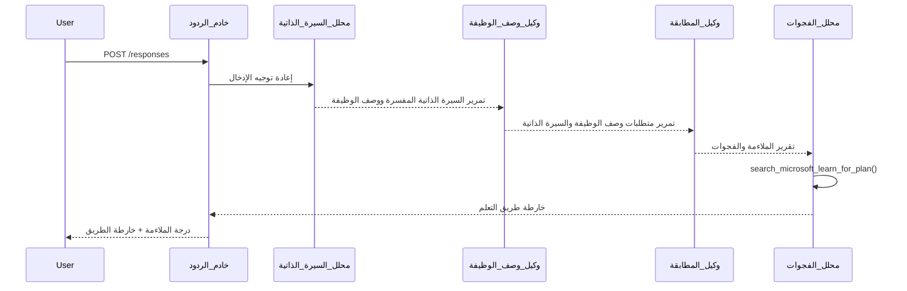

# الوحدة 3 - تكوين التعليمات، البيئة وتثبيت التبعيات

⏱️ ~15 دقيقة

في هذه الوحدة، تقوم بتحويل النموذج الأولي المُؤسس إلى سير عمل **خاص بك** متعدد العملاء - عن طريق تعيين متغيرات البيئة، وكتابة تعليمات العملاء، وإضافة أداة MCP، وربط رسم سير العمل، وتثبيت التبعيات.

> **مرجع:** الكود الكامل العامل موجود في [`PersonalCareerCopilot/main.py`](../../../../../workshop/lab02-multi-agent/PersonalCareerCopilot/main.py). استخدمه كمرجع أثناء بناء رسم سير عملك وكتل التعليمات.

---

## كيف تتكامل الوكلاء الأربعة معًا


```mermaid
sequenceDiagram
    participant User
    participant Server as خادم_الردود
    participant RP as محلل_السيرة_الذاتية
    participant JD as وكيل_وصف_الوظيفة
    participant MA as وكيل_المطابقة
    participant GA as محلل_الفجوات

    User->>Server: POST /responses
    Server->>RP: إعادة توجيه الإدخال
    RP-->>JD: تمرير السيرة الذاتية المفسرة ووصف الوظيفة
    JD-->>MA: تمرير متطلبات وصف الوظيفة والسيرة الذاتية
    MA-->>GA: تقرير الملاءمة والفجوات
    GA->>GA: search_microsoft_learn_for_plan()
    GA-->>Server: خارطة طريق التعلم
    Server-->>User: درجة الملاءمة + خارطة الطريق
```

---

## الخطوة 1: تكوين متغيرات البيئة

1. افتح ملف **`.env`** في جذر مشروعك (تم إنشاؤه بواسطة معالج الإنشاء).
2. استبدل العناصر النائبة بالقيم الفعلية الخاصة بك من المعمل 01.

<details open>
<summary><strong>🅰️ المسار أ - اشتراك فاوندري</strong></summary>

```env
FOUNDRY_PROJECT_ENDPOINT=https://<your-account>.services.ai.azure.com/api/projects/<your-project>
AZURE_AI_MODEL_DEPLOYMENT_NAME=gpt-4.1-mini
```

> **مكان العثور على القيم:** انظر [المعمل 01، الوحدة 1](../../lab01-single-agent/docs/01-setup.md#deploy-a-model--assign-rbac).

</details>

<details open>
<summary><strong>🅱️ المسار ب - فاوندري محلي</strong></summary>

```env
FOUNDRY_PROJECT_ENDPOINT=http://localhost:5273/v1
AZURE_AI_MODEL_DEPLOYMENT_NAME=phi-4-mini
```

> يتم تشغيل جميع الاستنتاجات على جهازك - لا تغادر أي بيانات جهازك. نفذ الأمر `foundry model list` لتأكيد الاسم المستعار الدقيق للنموذج. الطلب الوحيد الخارجي هو استدعاء أداة MCP إلى `https://learn.microsoft.com/api/mcp`.

> **مكان العثور على القيم:** انظر [المعمل 01، الوحدة 1 - المسار المحلي](../../lab01-single-agent/docs/01-setup.md#step-2-set-up-based-on-your-access).

</details>

> **الأمان:** لا تُدرج ملف `.env` في نظام التحكم بالإصدار أبدًا. يجب أن يكون موجودًا بالفعل في `.gitignore`.

---

## الخطوة 2: كتابة تعليمات العميل

تحدد التعليمات دور كل وكيل، وتنسيق المخرجات، والقواعد. افتح `main.py` وقم بتعريف (أو استبدال) ثوابت التعليمات الأربعة - النصوص الكاملة موجودة في [`PersonalCareerCopilot/main.py`](../../../../../workshop/lab02-multi-agent/PersonalCareerCopilot/main.py).

### 2.1 `RESUME_PARSER_INSTRUCTIONS`
تقوم بتحليل السيرة الذاتية إلى ملف تعريف مرشح منظم **وأيضًا** تنسخ وصف الوظيفة حرفيًا إلى `[JOB DESCRIPTION PASS-THROUGH]`. يجب أن تظهر الأقسام الموسومة في الإخراج.

> **لماذا النسخ المار؟** مع `context_mode="last_agent"`، ResumeParser هو الوكيل **الوحيد** الذي يرى رسالة المستخدم الأصلية. إذا لم ينسخ الوصف الوظيفي للأمام، فلن تراه الوكلاء اللاحقون.

### 2.2 `JOB_DESCRIPTION_INSTRUCTIONS`
يقرأ `[PARSED RESUME]` و`[JOB DESCRIPTION PASS-THROUGH]` من مخرجات ResumeParser. يُخرج `[JD REQUIREMENTS]` (المتطلبات المنظمة) و `[PARSED RESUME PASS-THROUGH]` (نسخة السيرة الذاتية حرفيًا لوكيل المطابقة).

### 2.3 `MATCHING_AGENT_INSTRUCTIONS`
يقرأ `[JD REQUIREMENTS]` و `[PARSED RESUME PASS-THROUGH]`. ينتج تقرير ملاءمة مع نقاط (0–100) مع تحليل الحساب، المهارات المطابقة، المهارات المفقودة، وتوافق الخبرة.

### 2.4 `GAP_ANALYZER_INSTRUCTIONS`
يقرأ تقرير الملاءمة. لكل مهارة مفقودة، يستدعي `search_microsoft_learn_for_plan` لجلب موارد التعلم من Microsoft Learn. ينتج بطاقة فجوة مفصلة لكل مهارة بالإضافة إلى خارطة طريق تعلم أسبوعية.

---

## الخطوة 3: إضافة أداة MCP

يستدعي GapAnalyzer خادم [Microsoft Learn MCP](https://learn.microsoft.com/azure/foundry/agents/how-to/tools/model-context-protocol) لجلب موارد تعلم فعلية لكل فجوة مهارية. الدالة الكاملة `search_microsoft_learn_for_plan` موجودة في [`PersonalCareerCopilot/main.py`](../../../../../workshop/lab02-multi-agent/PersonalCareerCopilot/main.py).

سجّل الأداة على GapAnalyzer عند إنشاء الوكيل:

```python
gap_analyzer = Agent(
    client=client,
    instructions=GAP_ANALYZER_INSTRUCTIONS,
    name="GapAnalyzer",
    tools=[search_microsoft_learn_for_plan],
)
```

> انظر [`PersonalCareerCopilot/main.py`](../../../../../workshop/lab02-multi-agent/PersonalCareerCopilot/main.py) لرسم بياني كامل `WorkflowBuilder` مع `FoundryChatClient`، `AgentExecutor`، وجميع استدعاءات `add_edge()`.

---

## الخطوة 4: إنشاء بيئة افتراضية وتثبيت التبعيات

> ⚠️ **لا تتخطَّ هذه الخطوة.** بدون تثبيت التبعيات، ستفشل عملية تصحيح الأخطاء عبر F5.

### 4.1 إنشاء البيئة الافتراضية

```powershell
python -m venv .venv
```

### 4.2 تفعيلها

| نظام التشغيل | الأمر |
|----|---------|
| **ويندوز (PowerShell)** | `.\.venv\Scripts\Activate.ps1` |
| **ويندوز (CMD)** | `.venv\Scripts\activate.bat` |
| **ماك/لينكس** | `source .venv/bin/activate` |

يجب أن ترى `(.venv)` في موجه الطرفية الخاص بك.

### 4.3 تثبيت التبعيات

```powershell
pip install -r requirements.txt
```

### 4.4 التحقق

```powershell
pip list | Select-String "agent-framework|mcp|debugpy"
```

المتوقع: يجب أن تكون موجودة `agent-framework-foundry`، `agent-framework-foundry-hosting`، `mcp`، و`debugpy`.

---

## الخطوة 5: التحقق من المصادقة

<details open>
<summary><strong>🅰️ المسار أ - بيانات اعتماد أزور</strong></summary>

```powershell
az account show --query "{name:name, id:id}" --output table
```

إذا فشل هذا، نفذ [`az login`](https://learn.microsoft.com/cli/azure/authenticate-azure-cli-interactively).

يتشارك الوكلاء الأربعة في `FoundryChatClient` واحد و `DefaultAzureCredential` واحد. إذا نجحت المصادقة لوكيل واحد، تنجح للجميع.

</details>

<details open>
<summary><strong>🅱️ المسار ب - فاوندري محلي</strong></summary>

لا يلزم مصادقة للاختبار المحلي.

</details>

---

### ✅ نقطة التحقق

> لا **تتابع** إلى الوحدة 04 حتى: **(1)** يظهر `(.venv)` في موجه الأوامر و**(2)** ينفذ `pip install -r requirements.txt` بنجاح.

- [ ] ملف `.env` يحتوي على نقطة نهاية واسم نشر نموذج صالح (ليس عناصر نائبة)
- [ ] تم تعريف جميع ثوابت تعليمات الوكلاء الأربعة في `main.py` (ResumeParser، JD Agent، MatchingAgent، GapAnalyzer)
- [ ] أداة MCP `search_microsoft_learn_for_plan` تم تعريفها وتسجيلها على GapAnalyzer
- [ ] تم إنشاء كائنات `FoundryChatClient` + 4 `Agent` + 4 `AgentExecutor` في `main()`
- [ ] يبني `WorkflowBuilder` الرسم البياني التتابعي الصحيح مع جميع استدعاءات `add_edge()`
- [ ] تم إنشاء البيئة الافتراضية وتفعيلها (`(.venv)` ظاهر في الموجه)
- [ ] تم تنفيذ `pip install -r requirements.txt` بدون أخطاء
- [ ] **المسار أ:** ينجح الأمر `az account show` أو يعرض أيقونة حسابات VS Code حسابًا مسجلاً

---

**السابق:** [02 - إنشاء مشروع متعدد العملاء](02-scaffold-multi-agent.md) · **التالي:** [04 - أنماط التنسيق →](04-orchestration-patterns.md)

---

<!-- CO-OP TRANSLATOR DISCLAIMER START -->
**تنويه**:
تمت ترجمة هذا المستند باستخدام خدمة الترجمة بالذكاء الاصطناعي [Co-op Translator](https://github.com/Azure/co-op-translator). بينما نسعى للدقة، يرجى العلم أن الترجمات الآلية قد تحتوي على أخطاء أو عدم دقة. يجب اعتبار المستند الأصلي بلغته الأصلية المصدر الرسمي والمعتمد. للمعلومات الهامة، يُنصح بالاستعانة بترجمة بشرية محترفة. نحن غير مسؤولين عن أي سوء فهم أو تفسير ناتج عن استخدام هذه الترجمة.
<!-- CO-OP TRANSLATOR DISCLAIMER END -->