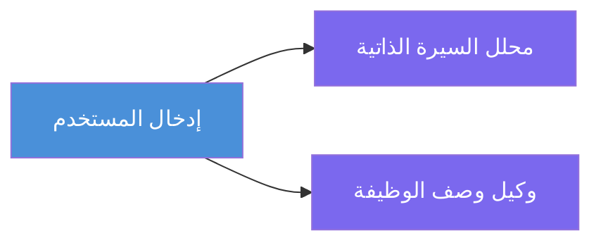
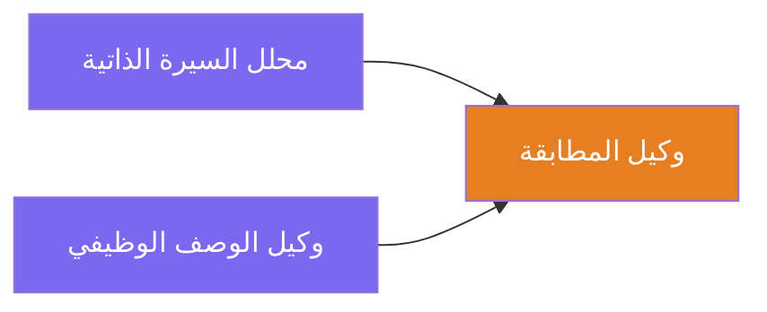
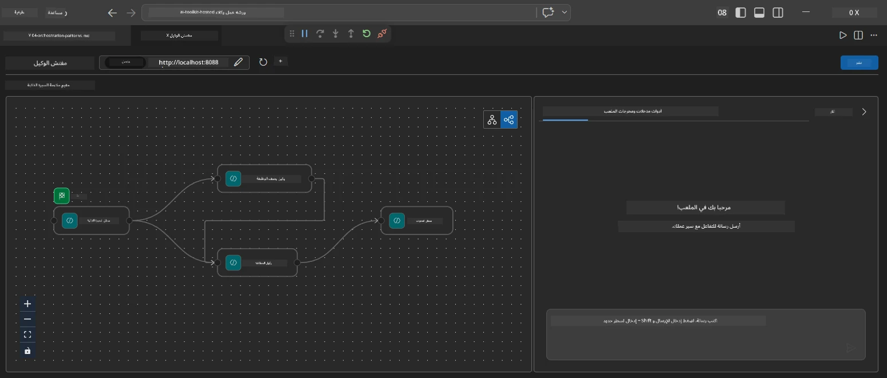
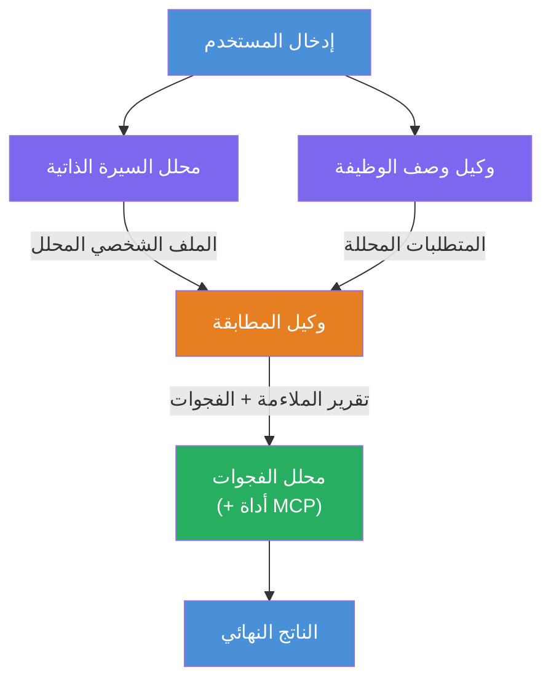
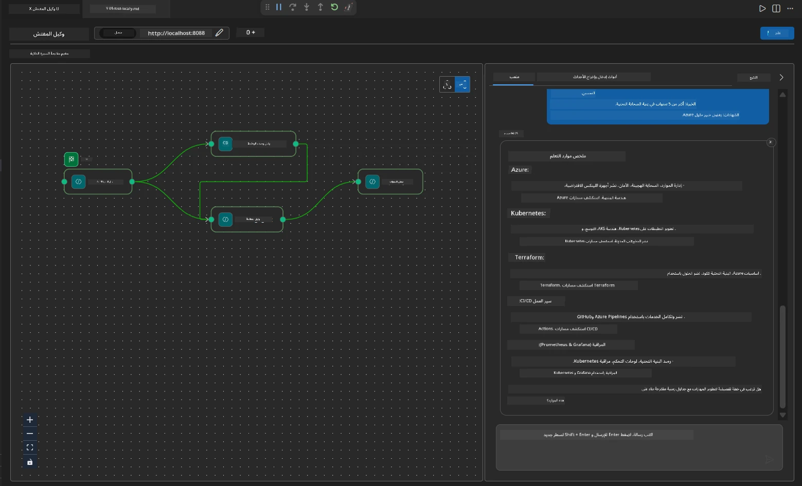

# الوحدة 4 - أنماط التنسيق

في هذه الوحدة، تستكشف أنماط التنسيق المستخدمة في مقيّم ملاءمة الوظيفة للسيرة الذاتية وتتعلم كيفية قراءة وتعديل وتوسيع رسم سير العمل البياني. فهم هذه الأنماط ضروري لتصحيح مشكلات تدفق البيانات وبناء [سير عمل متعدد الوكلاء](https://learn.microsoft.com/agent-framework/workflows/) خاص بك.

---

## النمط 1: التفرع (التقسيم المتوازي)

النمط الأول في سير العمل هو **التفرع** - يُرسل إدخال واحد إلى عدة وكلاء في نفس الوقت.


في الكود، يحدث هذا لأن `resume_parser` هو `start_executor` - يستلم رسالة المستخدم أولاً. ثم، نظرًا لأن كل من `jd_agent` و `matching_agent` لديهما حواف من `resume_parser`، تقوم الإطار بتوجيه خرج `resume_parser` إلى كلا الوكيلين:

```python
.add_edge(resume_parser, jd_agent)         # مخرجات ResumeParser → وكيل JD
.add_edge(resume_parser, matching_agent)   # مخرجات ResumeParser → وكيل المطابقة
```

**لماذا يعمل هذا:** يقوم ResumeParser وJD Agent بمعالجة جوانب مختلفة من نفس الإدخال. تشغيلهما بالتوازي يقلل من الكمون الكلي مقارنة بتشغيلهما بالتسلسل.

### متى تستخدم التفرع

| حالة الاستخدام | مثال |
|----------|---------|
| مهمات فرعية مستقلة | تحليل السيرة الذاتية مقابل تحليل وصف الوظيفة |
| التكرار / التصويت | يحلل وكيلان نفس البيانات، والوكيل الثالث يختار أفضل إجابة |
| إخراج متعدد الصيغ | ينتج وكيل نصًا، والآخر ينتج JSON منظم |

---

## النمط 2: التجميع (الاندماج)

النمط الثاني هو **التجميع** - يتم جمع مخرجات عدة وكلاء وإرسالها إلى وكيل واحد لاحق.


في الكود:

```python
.add_edge(resume_parser, matching_agent)   # مخرجات محلل السيرة الذاتية → وكيل المطابقة
.add_edge(jd_agent, matching_agent)        # مخرجات وكيل الوصف الوظيفي → وكيل المطابقة
```

**السلوك الأساسي:** عندما يكون لدى وكيل **حدود واردة اثنين أو أكثر**، ينتظر الإطار تلقائيًا **جميع** الوكلاء السابقين لإكمال عملهم قبل تشغيل الوكيل اللاحق. لا يبدأ MatchingAgent حتى ينتهي كل من ResumeParser و JD Agent.

### ما يستقبله MatchingAgent

يقوم الإطار بربط مخرجات كل الوكلاء السابقين معًا. يبدو الإدخال لـ MatchingAgent على النحو التالي:

```
[ResumeParser output]
---
Candidate Profile:
  Name: Jane Doe
  Technical Skills: Python, Azure, Kubernetes, ...
  ...

[JobDescriptionAgent output]
---
Role Overview: Senior Cloud Engineer
Required Skills: Python, Azure, Terraform, ...
...
```

> **ملاحظة:** تنسيق الربط الدقيق يعتمد على نسخة الإطار. ينبغي كتابة تعليمات الوكيل للتعامل مع المخرجات المهيكلة وغير المهيكلة على حد سواء.



---

## النمط 3: السلسلة التسلسلية

النمط الثالث هو **السلسلة التسلسلية** - يمر خرج وكيل مباشرة إلى الوكيل التالي.


في الكود:

```python
.add_edge(matching_agent, gap_analyzer)    # مخرجات MatchingAgent → GapAnalyzer
```

هذا هو أبسط النمط. يستقبل GapAnalyzer درجة ملاءمة MatchingAgent، والمهارات المطابقة / المفقودة، والفجوات. ثم يستدعي [أداة MCP](https://learn.microsoft.com/azure/foundry/agents/how-to/tools/model-context-protocol) لكل فجوة لجلب موارد Microsoft Learn.

---

## الرسم البياني الكامل

الجمع بين الأنماط الثلاثة ينتج سير العمل الكامل:


### الجدول الزمني للتنفيذ

```mermaid
gantt
    title الجدول الزمني لتنفيذ الوكيل
    dateFormat X
    axisFormat %s

    section متوازي
    Resume Parser       :rp, 0, 3
    JD Agent            :jd, 0, 2

    section متسلسل
    Matching Agent      :ma, 3, 5
    Gap Analyzer        :ga, 5, 9
```


> الوقت الإجمالي على الساعة الحائطية هو تقريبًا `max(ResumeParser, JD Agent) + MatchingAgent + GapAnalyzer`. عادةً ما يكون GapAnalyzer الأبطأ لأنه يقوم بالعديد من استدعاءات أداة MCP (استدعاء واحد لكل فجوة).

---

## قراءة كود WorkflowBuilder

إليك دالة `create_workflow()` الكاملة من `main.py` مع التعليقات:

```python
def create_workflow(resume_parser, jd_agent, matching_agent, gap_analyzer):
    workflow = (
        WorkflowBuilder(
            name="ResumeJobFitEvaluator",

            # الوكيل الأول الذي يتلقى مدخلات المستخدم
            start_executor=resume_parser,

            # الوكيل(الوكلاء) الذي يصبح مخرجه هو الاستجابة النهائية
            output_executors=[gap_analyzer],
        )
        # التفرع: يذهب مخرج ResumeParser إلى كل من وكيل JD ووكيل MatchingAgent
        .add_edge(resume_parser, jd_agent)
        .add_edge(resume_parser, matching_agent)

        # الدمج: ينتظر وكيل MatchingAgent كل من ResumeParser ووكيل JD
        .add_edge(jd_agent, matching_agent)

        # تتابعي: مخرج وكيل MatchingAgent يغذي GapAnalyzer
        .add_edge(matching_agent, gap_analyzer)

        .build()
    )
    return workflow.as_agent()
```

### جدول ملخص الحواف

| # | الحافة | النمط | التأثير |
|---|------|---------|--------|
| 1 | `resume_parser → jd_agent` | التفرع | يتلقى JD Agent خرج ResumeParser (بالإضافة إلى الإدخال الأصلي للمستخدم) |
| 2 | `resume_parser → matching_agent` | التفرع | يتلقى MatchingAgent خرج ResumeParser |
| 3 | `jd_agent → matching_agent` | التجميع | يتلقى MatchingAgent أيضًا خرج JD Agent (ينتظر كلاهما) |
| 4 | `matching_agent → gap_analyzer` | تسلسلي | يتلقى GapAnalyzer تقرير الملاءمة + قائمة الفجوات |

---

## تعديل الرسم البياني

### إضافة وكيل جديد

لإضافة وكيل خامس (مثل **InterviewPrepAgent** الذي يولد أسئلة مقابلة استنادًا إلى تحليل الفجوات):

```python
# 1. تعريف التعليمات
INTERVIEW_PREP_INSTRUCTIONS = """\
You are the Interview Prep Agent.
Given a gap analysis and fit report, generate 10 targeted interview questions
the candidate should prepare for.
"""

# 2. إنشاء الوكيل (داخل كتلة async with)
AzureAIAgentClient(
    project_endpoint=PROJECT_ENDPOINT,
    model_deployment_name=MODEL_DEPLOYMENT_NAME,
    credential=credential,
).as_agent(
    name="InterviewPrepAgent",
    instructions=INTERVIEW_PREP_INSTRUCTIONS,
) as interview_prep,

# 3. إضافة الحواف في create_workflow()
.add_edge(matching_agent, interview_prep)   # يستقبل تقرير التلاؤم
.add_edge(gap_analyzer, interview_prep)     # كما يستقبل بطاقات الفجوة

# 4. تحديث output_executors
output_executors=[interview_prep],  # الآن الوكيل النهائي
```

### تغيير ترتيب التنفيذ

لتشغيل JD Agent **بعد** ResumeParser (التسلسل بدلاً من التوازي):

```python
# إزالة: .add_edge(resume_parser, jd_agent)  ← موجودة بالفعل، احتفظ بها
# إزالة التوازي الضمني بعدم جعل jd_agent يتلقى مدخلات المستخدم مباشرة
# يرسل start_executor إلى resume_parser أولاً، ويحصل jd_agent على
# مخرجات resume_parser عبر الحافة. هذا يجعلهم متسلسلين.
```

> **مهم:** `start_executor` هو الوكيل الوحيد الذي يتلقى إدخال المستخدم الخام. جميع الوكلاء الآخرين يتلقون المخرجات من حوافهم السابقة. إذا أردت أن يتلقى وكيل إدخال المستخدم الخام أيضًا، يجب أن يكون لديه حافة من `start_executor`.

---

## أخطاء الرسم البياني الشائعة

| الخطأ | العرض | الإصلاح |
|---------|---------|-----|
| حافة مفقودة إلى `output_executors` | يعمل الوكيل لكن الإخراج فارغ | تأكد من وجود مسار من `start_executor` إلى كل وكيل في `output_executors` |
| اعتماد دائري | حلقة لا نهائية أو نفاد المهلة | تحقق من عدم قيام أي وكيل بإعادة تغذية وكيل سابق |
| وكيل في `output_executors` بدون حافة واردة | إخراج فارغ | أضف على الأقل `add_edge(source, that_agent)` |
| عدة `output_executors` بدون تجميع | الإخراج يحتوي على استجابة وكيل واحد فقط | استخدم وكيل إخراج واحد يجمّع، أو اقبل عدة إخراجات |
| مفقود `start_executor` | `ValueError` أثناء البناء | حدد دائمًا `start_executor` في `WorkflowBuilder()` |

---

## تصحيح الأخطاء في الرسم البياني

### استخدام Agent Inspector

1. ابدأ الوكيل محليًا (F5 أو الطرفية - راجع [الوحدة 5](05-test-locally.md)).
2. افتح Agent Inspector (`Ctrl+Shift+P` → **Foundry Toolkit: Open Agent Inspector**).
3. أرسل رسالة اختبار.
4. في لوحة استجابة المفتش، ابحث عن **الإخراج المتدفق** - يعرض مساهمة كل وكيل بالتسلسل.



### استخدام التسجيل

أضف تسجيل الدخول إلى `main.py` لتتبع تدفق البيانات:

```python
import logging
logger = logging.getLogger("resume-job-fit")

# في create_workflow()، بعد البناء:
logger.info("Workflow graph built with edges: RP→JD, RP→MA, JD→MA, MA→GA")
```

تُظهر سجلات الخادم ترتيب تنفيذ الوكلاء واستدعاءات أداة MCP:

```
INFO:resume-job-fit:Starting Resume -> Job Fit Evaluator HTTP server...
INFO:resume-job-fit:Server running on http://localhost:8088
INFO:agent_framework:Executing agent: ResumeParser
INFO:agent_framework:Executing agent: JobDescriptionAgent
INFO:agent_framework:Waiting for upstream agents: ResumeParser, JobDescriptionAgent
INFO:agent_framework:Executing agent: MatchingAgent
INFO:agent_framework:Executing agent: GapAnalyzer
INFO:agent_framework:Tool call: search_microsoft_learn_for_plan(skill="Kubernetes")
POST https://learn.microsoft.com/api/mcp → 200
INFO:agent_framework:Tool call: search_microsoft_learn_for_plan(skill="Terraform")
POST https://learn.microsoft.com/api/mcp → 200
```

---

### نقطة تحقق

- [ ] يمكنك تحديد الأنماط الثلاثة في التنسيق: التفرع، التجميع، والسلسلة التسلسلية
- [ ] تفهم أن الوكلاء الذين لديهم عدة حواف واردة ينتظرون إكمال جميع الوكلاء السابقين
- [ ] يمكنك قراءة كود `WorkflowBuilder` وربط كل استدعاء `add_edge()` بالرسم البياني المرئي
- [ ] تفهم جدول تنفيذ الوكلاء: الوكلاء المتوازيون يعملون أولاً، ثم التجميع، ثم التسلسل
- [ ] تعرف كيفية إضافة وكيل جديد إلى الرسم البياني (تعريف التعليمات، إنشاء الوكيل، إضافة الحواف، تحديث الإخراج)
- [ ] يمكنك تحديد الأخطاء الشائعة في الرسم البياني وأعراضها

---

**السابق:** [03 - تكوين الوكلاء والبيئة](03-configure-agents.md) · **التالي:** [05 - الاختبار محليًا →](05-test-locally.md)

---

<!-- CO-OP TRANSLATOR DISCLAIMER START -->
**إخلاء المسؤولية**:  
تمت ترجمة هذا المستند باستخدام خدمة الترجمة الآلية [Co-op Translator](https://github.com/Azure/co-op-translator). بينما نسعى لتحقيق الدقة، يرجى العلم بأن الترجمات الآلية قد تحتوي على أخطاء أو عدم دقة. يجب اعتبار الوثيقة الأصلية بلغتها الأصلية المصدر الرسمي والمعتمد. للمعلومات الهامة، يُنصح بالاستعانة بترجمة بشرية محترفة. نحن غير مسؤولين عن أي سوء فهم أو تفسير ناتج عن استخدام هذه الترجمة.
<!-- CO-OP TRANSLATOR DISCLAIMER END -->