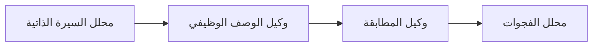
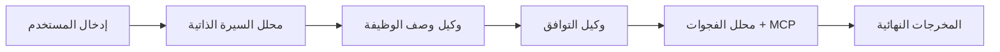

# الوحدة 4 - أنماط التنسيق

⏱️ ~10 دقائق

في هذه الوحدة، تستكشف أنماط التنسيق المستخدمة في مقيم ملاءمة الوظيفة للسيرة الذاتية وتتعلّم كيفية قراءة وتعديل وتمديد مخطط سير العمل. فهم هذه الأنماط ضروري لتصحيح مشكلات تدفق البيانات وبناء [سير عمل متعدد الوكلاء](https://learn.microsoft.com/agent-framework/workflows/) خاص بك.

---

## النمط 1: التسلسل المتسلسل

النمط الأساسي في سير العمل هو **السلسلة المتسلسلة** - حيث يمر مخرج كل وكيل مباشرة إلى التالية.


```mermaid
flowchart LR
    RP[محلل السيرة الذاتية] --> JD[وكيل الوصف الوظيفي]
    JD --> MA[وكيل المطابقة]
    MA --> GA[محلل الفجوات]
```

في الشيفرة، كل استدعاء `add_edge()` ينشئ خطوة واحدة في السلسلة:

```python
.add_edge(resume_executor, jd_executor)       # إخراج محلل السيرة الذاتية → وكيل الوصف الوظيفي
.add_edge(jd_executor, matching_executor)     # إخراج وكيل الوصف الوظيفي → وكيل المطابقة
.add_edge(matching_executor, gap_executor)    # إخراج وكيل المطابقة → محلل الفجوات
```

> **لماذا تسلسلي وليس توزيع/تجميع؟** يستخدم `WorkflowBuilder` **دلالات OR** للحواف الواردة: حيث يطلق منفذ التشغيل الأسفل فور إكمال **أي** سلف. إذا كان `matching_executor` يحتوي على حافتين واردتين (من `resume_executor` و `jd_executor`)، فسيتفعّل مرتين - مرة عند انتهاء ResumeParser ومرة أخرى عند انتهاء JD Agent - مما يسبب تشغيل GapAnalyzer مرتين أيضاً وظهور النتيجة مرتين. تتجنّب السلسلة المتسلسلة هذه المشكلة تمامًا.

## النمط 2: تمرير المحتوى

لأن `context_mode="last_agent"` يعني أن كل منفذ تشغيل يرى فقط **مخرجات السلف المباشر**، يجب على الوكلاء في السلسلة المتسلسلة تمرير أي بيانات يحتاجها الوكلاء اللاحقون بشكل صريح.

في هذا سير العمل:
- **ResumeParser** ينسخ وصف الوظيفة كما هو في `[JOB DESCRIPTION PASS-THROUGH]` (حتى يتمكن وكيل الوصف الوظيفي من إيجاده).
- **JD Agent** ينسخ `[PARSED RESUME]` كما هو في `[PARSED RESUME PASS-THROUGH]` (حتى يستطيع MatchingAgent مقارنة كلا الملفين الشخصيين).

```
ResumeParser output
└─ [PARSED RESUME]               ← extracted by JD Agent
└─ [JOB DESCRIPTION PASS-THROUGH] ← extracted by JD Agent

JD Agent output
└─ [JD REQUIREMENTS]             ← extracted by MatchingAgent
└─ [PARSED RESUME PASS-THROUGH]  ← extracted by MatchingAgent
```

يجب نسخ كل جزء من التمرير **كما هو** - تلخيصه أو إعادة صياغته يكسر الوكيل التالي الذي يعتمد عليه.

---

## المخطط الكامل

دمج أنماط السلسلة المتسلسلة وتمرير المحتوى ينتج سير العمل الكامل:


```mermaid
flowchart LR
    U[إدخال المستخدم] --> RP[محلل السيرة الذاتية]
    RP --> JD[وكيل وصف الوظيفة]
    JD --> MA[وكيل التوافق]
    MA --> GA[محلل الفجوات + MCP]
    GA --> O[المخرجات النهائية]
```

يعرض Agent Inspector نفس هيكل المخطط هذا عندما يعمل الوكيل محليًا. راجع [الوحدة 5 - الاختبار محليًا](05-test-locally.md) لصور للشاشة.

---

## قراءة كود WorkflowBuilder

الدالة الكاملة `create_workflow()` موجودة في [`PersonalCareerCopilot/main.py`](../../../../../workshop/lab02-multi-agent/PersonalCareerCopilot/main.py). استدعاءات الثلاث `add_edge()` تبني خط الأنابيب المتسلسل:

| # | الحافة | التأثير |
|---|------|--------|
| 1 | `resume_executor → jd_executor` | يستقبل وكيل الوصف الوظيفي `[PARSED RESUME]` + `[JOB DESCRIPTION PASS-THROUGH]` |
| 2 | `jd_executor → matching_executor` | يتلقى MatchingAgent `[JD REQUIREMENTS]` + `[PARSED RESUME PASS-THROUGH]` |
| 3 | `matching_executor → gap_executor` | يستقبل GapAnalyzer تقرير الملاءمة + قائمة الفجوات |

---

## تعديل المخطط

### إضافة وكيل جديد

لإضافة وكيل خامس (مثلاً، **InterviewPrepAgent** بعد GapAnalyzer):

1. تعريف ثابت `INTERVIEW_PREP_INSTRUCTIONS`.
2. إنشاء كائنات `Agent` + `AgentExecutor` (بنفس نمط الأربعة الموجودين).
3. إضافة `.add_edge(gap_executor, interview_exec)` في `WorkflowBuilder`.
4. تحديث `output_executors=[interview_exec]`.

> **مهم:** `start_executor` هو الوكيل الوحيد الذي يستقبل إدخال المستخدم الخام. جميع الوكلاء الآخرين يتلقون مخرجات من الحافة العلوية لهم.

---

## أخطاء المخطط الشائعة

| الخطأ | العلامة | التصحيح |
|---------|---------|-----|
| حافة مفقودة إلى `output_executors` | يعمل الوكيل ولكن الإخراج فارغ | تأكد من وجود مسار من `start_executor` إلى كل وكيل في `output_executors` |
| تبعية دائرية | حلقة لانهائية أو مهلة | تحقق من عدم تغذية أي وكيل لوكيل أعلاه |
| وكيل في `output_executors` بدون حافة واردة | إخراج فارغ | أضف على الأقل `add_edge(source, that_agent)` واحد |
| تعدد `output_executors` بدون تجميع | الإخراج يحتوي على استجابة وكيل واحد فقط | استخدم وكيل إخراج واحد يجمع أو تقبل مخرجات متعددة |
| عدم وجود `start_executor` | `ValueError` أثناء البناء | حدد دائمًا `start_executor` في `WorkflowBuilder()` |

---

## تصحيح أخطاء المخطط

### استخدام Agent Inspector

1. شغل الوكيل محليًا باستخدام F5.
2. افتح Agent Inspector (`Ctrl+Shift+P` → **Foundry Toolkit: Open Agent Inspector**).
3. أرسل رسالة تجريبية.
4. في لوحة استجابة المفتش، ابحث عن **الإخراج المتدفق** - حيث يظهر مساهمة كل وكيل بالتسلسل.


### استخدام التسجيل

أضف تسجيلًا إلى `main.py` لتتبع تدفق البيانات:

```python
import logging
logger = logging.getLogger("resume-job-fit")

# في الدالة main()، بعد بناء سير العمل:
logger.info("Workflow graph built with edges: RP→JD, JD→MA, MA→GA")
```

تعرض سجلات الخادم ترتيب تنفيذ الوكلاء واستدعاءات أدوات MCP:

```
INFO:agent_framework:Executing agent: ResumeParser
INFO:agent_framework:Executing agent: JobDescriptionAgent
INFO:agent_framework:Executing agent: MatchingAgent
INFO:agent_framework:Executing agent: GapAnalyzer
INFO:agent_framework:Tool call: search_microsoft_learn_for_plan(skill="Kubernetes")
POST https://learn.microsoft.com/api/mcp → 200
INFO:agent_framework:Tool call: search_microsoft_learn_for_plan(skill="Terraform")
POST https://learn.microsoft.com/api/mcp → 200
```

---

### نقطة تحقق

- [ ] يمكنك تحديد نمطين للتنسيق في سير العمل: السلسلة المتسلسلة وتمريرة المحتوى
- [ ] تفهم لماذا يتطلب `context_mode="last_agent"` تمرير بيانات صريح بين الوكلاء
- [ ] يمكنك قراءة كود `WorkflowBuilder` وربط كل استدعاء `add_edge()` بالمخطط المرئي
- [ ] تعرف كيف تضيف وكيلًا جديدًا إلى نهاية خط الأنابيب
- [ ] يمكنك تحديد أخطاء المخطط الشائعة وعلاماتها

---

**السابق:** [03 - تكوين الوكلاء والبيئة](03-configure-agents.md) · **التالي:** [05 - الاختبار محليًا →](05-test-locally.md)

---

<!-- CO-OP TRANSLATOR DISCLAIMER START -->
**تنويه**:
تمت ترجمة هذا المستند باستخدام خدمة الترجمة بالذكاء الاصطناعي [Co-op Translator](https://github.com/Azure/co-op-translator). بينما نسعى للدقة، يرجى العلم أن الترجمات الآلية قد تحتوي على أخطاء أو عدم دقة. يجب اعتبار المستند الأصلي بلغته الأصلية المصدر الرسمي والمعتمد. للمعلومات الهامة، يُنصح بالاستعانة بترجمة بشرية محترفة. نحن غير مسؤولين عن أي سوء فهم أو تفسير ناتج عن استخدام هذه الترجمة.
<!-- CO-OP TRANSLATOR DISCLAIMER END -->