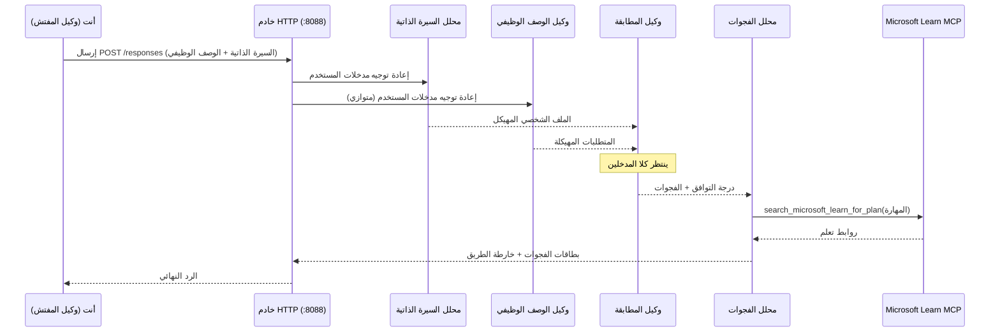
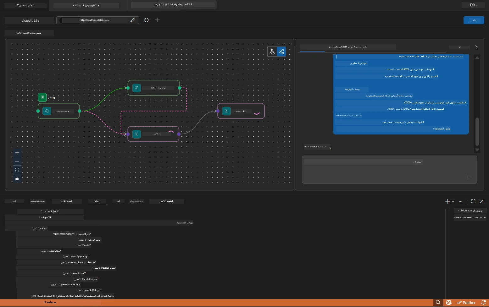

# الوحدة 5 - الاختبار محليًا (الوكلاء المتعددون)

في هذه الوحدة، تقوم بتشغيل سير العمل متعدد الوكلاء محليًا، وتختبره باستخدام Agent Inspector، وتتحقق من أن جميع الوكلاء الأربعة وأداة MCP تعمل بشكل صحيح قبل النشر على Foundry.

### ماذا يحدث أثناء اختبار محلي


---

## الخطوة 1: بدء خادم الوكيل

### الخيار أ: استخدام مهمة VS Code (مستحسن)

1. اضغط `Ctrl+Shift+P` → اكتب **Tasks: Run Task** → اختر **Run Lab02 HTTP Server**.
2. تبدأ المهمة الخادم مع debugpy متصل على المنفذ `5679` والوكيل على المنفذ `8088`.
3. انتظر حتى يظهر الإخراج:

```
INFO:resume-job-fit:Starting Resume -> Job Fit Evaluator HTTP server...
INFO:resume-job-fit:Server running on http://localhost:8088
```

### الخيار ب: استخدام الطرفية يدويًا

```powershell
cd workshop\lab02-multi-agent\PersonalCareerCopilot
```

تفعيل البيئة الافتراضية:

**PowerShell (ويندوز):**
```powershell
.\.venv\Scripts\Activate.ps1
```

**macOS/Linux:**
```bash
source .venv/bin/activate
```

بدء الخادم:

```powershell
python -m debugpy --listen 127.0.0.1:5679 -m agentdev run main.py --verbose --port 8088
```

### الخيار ج: استخدام F5 (وضع التصحيح)

1. اضغط `F5` أو انتقل إلى **Run and Debug** (`Ctrl+Shift+D`).
2. اختر تكوين الإطلاق **Lab02 - Multi-Agent** من القائمة المنسدلة.
3. يبدأ الخادم مع دعم كامل لنقاط التوقف.

> **نصيحة:** يتيح لك وضع التصحيح تعيين نقاط توقف داخل `search_microsoft_learn_for_plan()` لفحص استجابات MCP، أو داخل سلاسل تعليمات الوكيل لرؤية ما يتلقاه كل وكيل.

---

## الخطوة 2: فتح Agent Inspector

1. اضغط `Ctrl+Shift+P` → اكتب **Foundry Toolkit: Open Agent Inspector**.
2. يفتح Agent Inspector في تبويب المتصفح على `http://localhost:5679`.
3. يجب أن ترى واجهة الوكيل جاهزة لتلقي الرسائل.

> **إذا لم يفتح Agent Inspector:** تأكد من بدء الخادم بالكامل (يتم عرض سجل "Server running"). إذا كان المنفذ 5679 مستخدمًا، انظر [الوحدة 8 - استكشاف الأخطاء وإصلاحها](08-troubleshooting.md).

---

## الخطوة 3: تشغيل اختبارات التحقق السريع

شغّل هذه الاختبارات الثلاثة بالترتيب. كل اختبار يتحقق تدريجيًا من جزء أكبر من سير العمل.

### اختبار 1: السيرة الذاتية الأساسية + وصف الوظيفة

الصق التالي في Agent Inspector:

```
Resume:
Jane Doe
Senior Software Engineer with 5 years of experience in Python, Django, and AWS.
Built microservices handling 10K+ requests/second. Led a team of 4 developers.
Certifications: AWS Solutions Architect Associate.
Education: B.S. Computer Science, State University.

Job Description:
Senior Cloud Engineer at Contoso Ltd.
Required: Python, Azure, Kubernetes, Terraform, CI/CD pipelines.
Preferred: Go, monitoring (Prometheus/Grafana), cost optimization.
Experience: 5+ years in cloud infrastructure.
Certifications: Azure Solutions Architect Expert preferred.
```

**هيكل الإخراج المتوقع:**

يجب أن تحتوي الاستجابة على مخرجات من جميع الوكلاء الأربعة بالتتابع:

1. **مخرجات محلل السيرة الذاتية** - ملف مرشح منظم مع المهارات مجمعة حسب الفئة
2. **مخرجات وكيل وصف الوظيفة** - متطلبات منظمة مع فصل المهارات المطلوبة والمفضلة
3. **مخرجات وكيل المطابقة** - درجة التوافق (0-100) مع التحليل التفصيلي، المهارات المطابقة، المهارات الناقصة، الفجوات
4. **مخرجات محلل الفجوات** - بطاقات فجوة فردية لكل مهارة ناقصة، كل منها مع روابط Microsoft Learn



### ما يجب التحقق منه في اختبار 1

| التحقق | المتوقع | تم؟ |
|-------|----------|-------|
| الاستجابة تحتوي على درجة التوافق | رقم بين 0-100 مع التحليل التفصيلي | |
| تم سرد المهارات المطابقة | Python، CI/CD (جزئي)، إلخ | |
| تم سرد المهارات الناقصة | Azure، Kubernetes، Terraform، إلخ | |
| توجد بطاقات فجوة لكل مهارة ناقصة | بطاقة واحدة لكل مهارة | |
| روابط Microsoft Learn موجودة | روابط حقيقية `learn.microsoft.com` | |
| لا توجد رسائل خطأ في الاستجابة | إخراج منظم ونظيف | |

### اختبار 2: التحقق من تنفيذ أداة MCP

أثناء تشغيل اختبار 1، تحقق من **طرفية الخادم** لسجلات MCP:

```
GET https://learn.microsoft.com/api/mcp → 405 (Method Not Allowed)
POST https://learn.microsoft.com/api/mcp → 200
DELETE https://learn.microsoft.com/api/mcp → 405 (Method Not Allowed)
```

| سجل الإدخال | المعنى | متوقع؟ |
|-----------|---------|-----------|
| `GET ... → 405` | يختبر عميل MCP باستخدام GET أثناء التهيئة | نعم - طبيعي |
| `POST ... → 200` | استدعاء الأداة الفعلي لخادم Microsoft Learn MCP | نعم - هذا هو الاستدعاء الحقيقي |
| `DELETE ... → 405` | يختبر عميل MCP باستخدام DELETE أثناء التنظيف | نعم - طبيعي |
| `POST ... → 4xx/5xx` | فشل استدعاء الأداة | لا - انظر [استكشاف الأخطاء وإصلاحها](08-troubleshooting.md) |

> **نقطة أساسية:** تعد سطور `GET 405` و`DELETE 405` سلوكًا **متوقعًا**. فقط اقلق إذا أعادت استدعاءات `POST` رموز حالة غير 200.

### اختبار 3: حالة الطرف - مرشح عالي التوافق

الصق سيرة ذاتية تطابق وصف الوظيفة عن كثب للتحقق من أن GapAnalyzer يتعامل مع سيناريوهات التوافق العالي:

```
Resume:
Alex Chen
Senior Cloud Engineer with 7 years of experience.
Skills: Python, Azure (AKS, Functions, DevOps), Kubernetes, Terraform, CI/CD (GitHub Actions, Azure Pipelines), Go, Prometheus, Grafana, cost optimization.
Certifications: Azure Solutions Architect Expert, Azure DevOps Engineer Expert.
Led infrastructure migration to Azure for 3 enterprise clients.
Education: M.S. Computer Science, Tech University.

Job Description:
Senior Cloud Engineer at Contoso Ltd.
Required: Python, Azure, Kubernetes, Terraform, CI/CD pipelines.
Preferred: Go, monitoring (Prometheus/Grafana), cost optimization.
Experience: 5+ years in cloud infrastructure.
Certifications: Azure Solutions Architect Expert preferred.
```

**السلوك المتوقع:**
- يجب أن تكون درجة التوافق **80+** (معظم المهارات مطابقة)
- يجب أن تركز بطاقات الفجوة على التلميع / الاستعداد للمقابلة بدلًا من التعلم الأساسي
- تقول تعليمات GapAnalyzer: "إذا كانت نسبة التوافق >= 80، ركز على التلميع / الاستعداد للمقابلة"

---

## الخطوة 4: التحقق من اكتمال الإخراج

بعد تشغيل الاختبارات، تحقق من أن الإخراج يلبي هذه المعايير:

### قائمة فحص هيكل الإخراج

| القسم | الوكيل | موجود؟ |
|---------|-------|----------|
| ملف المرشح | محلل السيرة الذاتية | |
| المهارات التقنية (مجموعة) | محلل السيرة الذاتية | |
| نظرة عامة على الدور | وكيل وصف الوظيفة | |
| المهارات المطلوبة مقابل المفضلة | وكيل وصف الوظيفة | |
| درجة التوافق مع التحليل التفصيلي | وكيل المطابقة | |
| المهارات المطابقة / الناقصة / الجزئية | وكيل المطابقة | |
| بطاقة فجوة لكل مهارة ناقصة | محلل الفجوات | |
| روابط Microsoft Learn في بطاقات الفجوة | محلل الفجوات (MCP) | |
| ترتيب التعلم (مرقم) | محلل الفجوات | |
| ملخص الجدول الزمني | محلل الفجوات | |

### القضايا الشائعة في هذه المرحلة

| المشكلة | السبب | الحل |
|-------|-------|-----|
| بطاقة فجوة واحدة فقط (الباقي مختصر) | تعليمات GapAnalyzer تفتقد فقرة CRITICAL | أضف فقرة `CRITICAL:` إلى `GAP_ANALYZER_INSTRUCTIONS` - انظر [الوحدة 3](03-configure-agents.md) |
| لا توجد روابط Microsoft Learn | نقطة نهاية MCP غير قابلة للوصول | تحقق من اتصال الإنترنت. تأكد من أن `MICROSOFT_LEARN_MCP_ENDPOINT` في `.env` هو `https://learn.microsoft.com/api/mcp` |
| استجابة فارغة | `PROJECT_ENDPOINT` أو `MODEL_DEPLOYMENT_NAME` غير محددة | تحقق من قيم ملف `.env`. شغل `echo $env:PROJECT_ENDPOINT` في الطرفية |
| درجة التوافق صفر أو مفقودة | لم يستلم MatchingAgent بيانات من الأعلى | تحقق من وجود `add_edge(resume_parser, matching_agent)` و `add_edge(jd_agent, matching_agent)` في `create_workflow()` |
| الوكيل يبدأ ثم يخرج فورًا | خطأ استيراد أو تبعية مفقودة | شغل `pip install -r requirements.txt` مجددًا. تحقق من الطرفية للحصول على تتبع الأخطاء |
| خطأ `validate_configuration` | متغيرات env مفقودة | أنشئ `.env` مع `PROJECT_ENDPOINT=<your-endpoint>` و `MODEL_DEPLOYMENT_NAME=<your-model>` |

---

## الخطوة 5: الاختبار باستخدام بياناتك الخاصة (اختياري)

حاول لصق سيرتك الذاتية ووصف وظيفة حقيقي. هذا يساعد في التحقق من:

- أن الوكلاء يتعاملون مع تنسيقات سير ذاتية مختلفة (زمني، وظيفي، هجين)
- أن وكيل وصف الوظيفة يتعامل مع أنماط وصف وظيفي مختلفة (نقاط، فقرات، منظم)
- أن أداة MCP تعيد موارد مناسبة للمهارات الحقيقية
- أن بطاقات الفجوة مخصصة لخلفيتك الخاصة

> **ملاحظة الخصوصية:** عند الاختبار محليًا، تبقى بياناتك على جهازك وترسل فقط إلى نشر Azure OpenAI الخاص بك. لا يتم تسجيلها أو تخزينها بواسطة بنية العمل. استخدم أسماء وهمية إذا رغبت (مثلاً، "Jane Doe" بدلًا من اسمك الحقيقي).

---

### نقطة التحقق

- [ ] تم بدء الخادم بنجاح على المنفذ `8088` (السجل يظهر "Server running")
- [ ] افتُتح Agent Inspector واتصل بالوكيل
- [ ] اختبار 1: استجابة كاملة مع درجة التوافق، المهارات المطابقة / الناقصة، بطاقات الفجوة، وروابط Microsoft Learn
- [ ] اختبار 2: سجلات MCP تظهر `POST ... → 200` (نجاح استدعاءات الأداة)
- [ ] اختبار 3: مرشح عالي التوافق يحصل على درجة 80+ مع توصيات مركزة على التلميع
- [ ] جميع بطاقات الفجوة موجودة (واحدة لكل مهارة ناقصة، بدون اختصار)
- [ ] لا أخطاء أو تتبع أخطاء في طرفية الخادم

---

**السابق:** [04 - أنماط التنسيق](04-orchestration-patterns.md) · **التالي:** [06 - النشر إلى Foundry →](06-deploy-to-foundry.md)

---

<!-- CO-OP TRANSLATOR DISCLAIMER START -->
**إخلاء المسؤولية**:  
تمت ترجمة هذا المستند باستخدام خدمة الترجمة بالذكاء الاصطناعي [Co-op Translator](https://github.com/Azure/co-op-translator). بينما نسعى لتحقيق الدقة، يرجى العلم أن الترجمات الآلية قد تحتوي على أخطاء أو عدم دقة. ينبغي اعتبار المستند الأصلي بلغته الأصلية المصدر الموثوق. للمعلومات الحساسة، يُنصح بالترجمة المهنية من قبل الإنسان. نحن غير مسؤولين عن أي سوء فهم أو تفسيرات خاطئة ناتجة عن استخدام هذه الترجمة.
<!-- CO-OP TRANSLATOR DISCLAIMER END -->