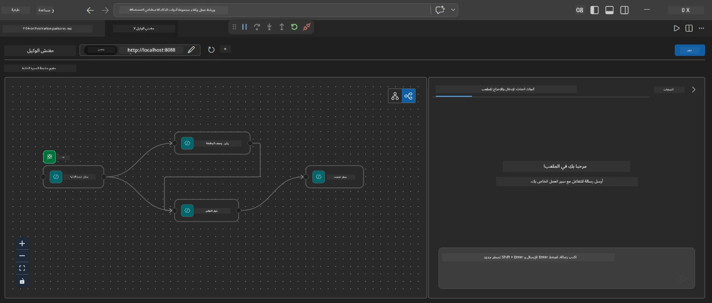
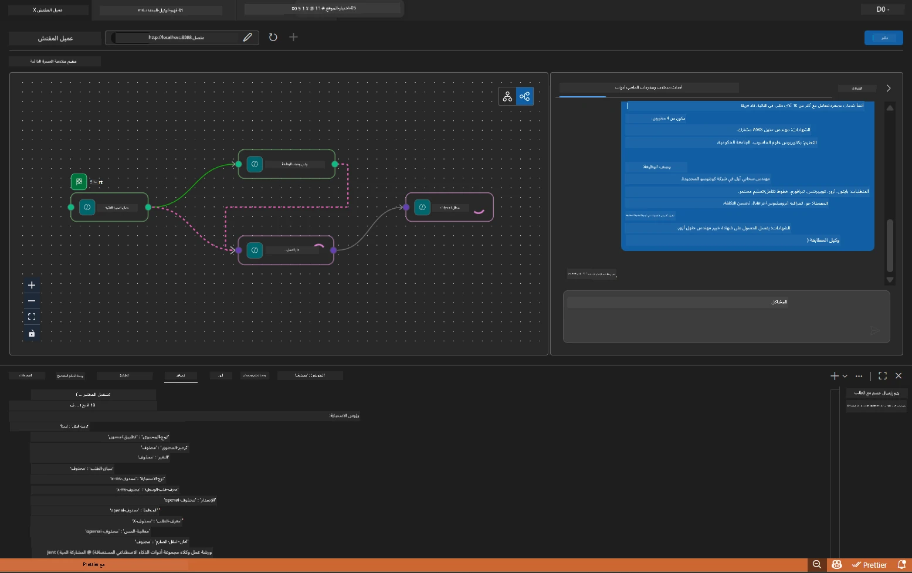
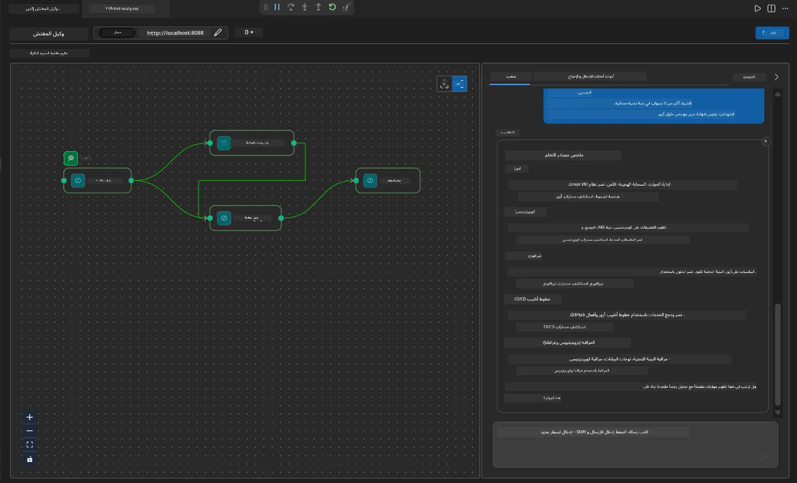

# الوحدة 5 - الاختبار محليًا

⏱️ ~15 دقيقة

في هذه الوحدة، تقوم بتشغيل سير العمل متعدد الوكلاء محليًا، تختبره باستخدام Agent Inspector، وتتأكد من عمل جميع الوكلاء الأربعة وأداة MCP بشكل صحيح قبل النشر.

---

## الخطوة 1: بدء خادم الوكيل

### الخيار أ: استخدام مهمة VS Code (موصى به)

1. افتح `workshop/lab02-multi-agent/PersonalCareerCopilot/` كمجلد VS Code الخاص بك.
2. اضغط `Ctrl+Shift+P` → اكتب **Tasks: Run Task** → اختر **Run Agent HTTP Server**.
3. تبدأ المهمة الخادم مع إرفاق debugpy على المنفذ `5679` والوكيل على المنفذ `8088`.
4. انتظر حتى يظهر الإخراج:

```
INFO:resume-job-fit:Starting Resume -> Job Fit Evaluator HTTP server...
INFO:resume-job-fit:Server running on http://localhost:8088
```

### الخيار ب: استخدام F5 (وضع التصحيح)

1. اضغط `F5` → اختر **Debug Local Agent HTTP Server**.
2. يبدأ الخادم بدعم نقاط التوقف الكامل - مفيد لفحص ردود MCP أو مخرجات الوكيل.

---

## الخطوة 2: فتح Agent Inspector

1. اضغط `Ctrl+Shift+P` → اكتب **Foundry Toolkit: Open Agent Inspector**.
2. يفتح Agent Inspector كلوحة في VS Code متصلة بـ `http://localhost:8088`.
3. يجب أن ترى واجهة الوكيل جاهزة لاستقبال الرسائل.



> **إذا لم يفتح Agent Inspector:** تأكد من بدء تشغيل الخادم بالكامل (ترى سجل "Server running"). إذا كان المنفذ 5679 مشغولاً، انظر [الوحدة 8 - استكشاف الأخطاء وإصلاحها](08-troubleshooting.md).

---

## الخطوة 2ب: (اختياري) فتح أداة تصور سير العمل

تتضمن Foundry Toolkit أداة **Workflow Visualizer** في الوقت الحقيقي التي تعرض كيف يتفاعل الوكلاء أثناء تنفيذ الرسم البياني. هذا مفيد بشكل خاص لتصحيح أخطاء متعدد الوكلاء.

1. اضغط `Ctrl+Shift+P` → اكتب **Foundry Toolkit: Open Visualizer for Hosted Agents**.
2. تفتح تبويب جديد في VS Code يعرض الرسم البياني للتنفيذ المباشر.
3. عند إرسال الرسائل في Agent Inspector، يحدث المرئي تلقائيًا - العقد الخضراء تدل على الوكلاء المكتملين، والحواف المتحركة تظهر تدفق البيانات بينهم.

> **تعارض المنفذ:** إذا كان منفذ الأداة قيد الاستخدام بالفعل، غيّره في إعدادات VS Code → **الإضافات** → **Microsoft Foundry Configuration** → **Hosted Agents: Visualizer Port**.

---

## الخطوة 3: تشغيل اختبارات سريعة

قم بتشغيل هذه الاختبارات الثلاثة بالترتيب. كل منها يختبر جزءًا أكبر من سير العمل.

### الاختبار 1: السيرة الذاتية الأساسية + وصف الوظيفة

الصق التالي في Agent Inspector:

```
Resume:
Jane Doe
Senior Software Engineer with 5 years of experience in Python, Django, and AWS.
Built microservices handling 10K+ requests/second. Led a team of 4 developers.
Certifications: AWS Solutions Architect Associate.
Education: B.S. Computer Science, State University.

Job Description:
Senior Cloud Engineer at Contoso Ltd.
Required: Python, Azure, Kubernetes, Terraform, CI/CD pipelines.
Preferred: Go, monitoring (Prometheus/Grafana), cost optimization.
Experience: 5+ years in cloud infrastructure.
Certifications: Azure Solutions Architect Expert preferred.
```

**هيكل الإخراج المتوقع:**

يجب أن يحتوي الرد على الناتج من جميع الوكلاء الأربعة بالتسلسل:

1. **ناتج محلل السيرة الذاتية** - قسمان معلمان: `[PARSED RESUME]` (ملف المرشح مع المهارات المجمعة) و `[JOB DESCRIPTION PASS-THROUGH]` (نص وصف الوظيفة حرفيًا الذي يزود وكيل وصف الوظيفة)
2. **ناتج وكيل وصف الوظيفة** - متطلبات منظمة مع فصل المهارات المطلوبة مقابل المهارات المفضلة
3. **ناتج وكيل التوفيق** - درجة الملاءمة (0-100) مع تفصيل، المهارات المطابقة، المهارات المفقودة، الفجوات
4. **ناتج محلل الفجوات** - بطاقات فجوة فردية لكل مهارة مفقودة، كل بطاقة مرتبطة بروابط مايكروسوفت ليرن





### ما يجب التحقق منه في الاختبار 1

| تحقق | المتوقع | ناجح؟ |
|-------|----------|-------|
| يحتوي الرد على درجة ملاءمة | رقم بين 0-100 مع تفصيل | |
| قائمة المهارات المطابقة موجودة | Python، CI/CD (جزئيًا)، إلخ | |
| قائمة المهارات المفقودة موجودة | Azure، Kubernetes، Terraform، إلخ | |
| بطاقات الفجوات موجودة لكل مهارة مفقودة | بطاقة واحدة لكل مهارة | |
| روابط Microsoft Learn موجودة | روابط حقيقية من `learn.microsoft.com` | |
| لا رسائل خطأ في الرد | إخراج منظم نظيف | |

### الاختبار 2: حالة حافة - مرشح عالي الملاءمة

الصق سيرة ذاتية تطابق وصف الوظيفة عن كثب للتحقق من أن GapAnalyzer يتعامل مع سيناريوهات الملاءمة العالية:

```
Resume:
Alex Chen
Senior Cloud Engineer with 7 years of experience.
Skills: Python, Azure (AKS, Functions, DevOps), Kubernetes, Terraform, CI/CD (GitHub Actions, Azure Pipelines), Go, Prometheus, Grafana, cost optimization.
Certifications: Azure Solutions Architect Expert, Azure DevOps Engineer Expert.
Led infrastructure migration to Azure for 3 enterprise clients.
Education: M.S. Computer Science, Tech University.

Job Description:
Senior Cloud Engineer at Contoso Ltd.
Required: Python, Azure, Kubernetes, Terraform, CI/CD pipelines.
Preferred: Go, monitoring (Prometheus/Grafana), cost optimization.
Experience: 5+ years in cloud infrastructure.
Certifications: Azure Solutions Architect Expert preferred.
```

**السلوك المتوقع:**
- يجب أن تكون درجة الملاءمة **80+** (معظم المهارات مطابقة)
- يجب أن تركز بطاقات الفجوات على التدقيق/الاستعداد للمقابلة بدلًا من التعلم الأساسي
- تعليمات GapAnalyzer تقول: "إذا كانت الملاءمة >= 80، ركز على التدقيق/الاستعداد للمقابلة"

---

## الخطوة 4: اختبار ببياناتك الخاصة (اختياري)

جرّب لصق سيرتك الذاتية الخاصة ووصف وظيفة حقيقي. هذا يساعد في التحقق من:

- يتعامل الوكلاء مع تنسيقات السيرة الذاتية المختلفة (زمني، وظيفي، مختلط)
- يتعامل وكيل وصف الوظيفة مع أنماط وصف الوظيفة المختلفة (نقاط، فقرات، هيكلية)
- تُعيد أداة MCP الموارد ذات الصلة للمهارات الحقيقية
- بطاقات الفجوات مخصصة لخلفيتك الخاصة

> **الخصوصية - المسار أ (Foundry السحابي):** يتم إرسال نص السيرة الذاتية ووصف الوظيفة إلى نشر Azure OpenAI الخاص بك للاستدلال. لا يتم تسجيلها أو تخزينها بواسطة بنية الورشة. استخدم أسماء وهمية (مثل "جين دو") إذا فضلت ذلك.
>
> **الخصوصية - المسار ب (Foundry المحلي):** تعمل كل الاستدلالات الخاصة بالوكلاء الأربعة بالكامل على جهازك. نص سيرتك الذاتية ووصف الوظيفة **لا يغادر جهازك أبدًا**. الاتصال الوحيد الصادر هو أداة MCP التي تجلب الموارد من `https://learn.microsoft.com/api/mcp`؛ هذا الطلب يحتوي فقط على اسم المهارة، وليس بياناتك الشخصية.

---

### نقطة تحقق

- [ ] تم بدء الخادم بنجاح على المنفذ `8088` (السجل يظهر "Server running")
- [ ] تم فتح Agent Inspector والاتصال بالوكيل
- [ ] الاختبار 1: رد كامل مع درجة الملاءمة، المهارات المطابقة/المفقودة، بطاقات الفجوات، وروابط Microsoft Learn
- [ ] الاختبار 2: مرشح عالي الملاءمة يحصل على درجة 80+ مع توصيات تركز على التدقيق
- [ ] جميع بطاقات الفجوات موجودة (واحدة لكل مهارة مفقودة، بدون اقتطاع)
- [ ] لا أخطاء أو تتبع مكدس في طرفية الخادم

---

**السابق:** [04 - Orchestration Patterns](04-orchestration-patterns.md) · **التالي:** [06 - Deploy to Foundry →](06-deploy-to-foundry.md)

---

<!-- CO-OP TRANSLATOR DISCLAIMER START -->
**تنويه**:
تمت ترجمة هذا المستند باستخدام خدمة الترجمة بالذكاء الاصطناعي [Co-op Translator](https://github.com/Azure/co-op-translator). بينما نسعى للدقة، يرجى العلم أن الترجمات الآلية قد تحتوي على أخطاء أو عدم دقة. يجب اعتبار المستند الأصلي بلغته الأصلية المصدر الرسمي والمعتمد. للمعلومات الهامة، يُنصح بالاستعانة بترجمة بشرية محترفة. نحن غير مسؤولين عن أي سوء فهم أو تفسير ناتج عن استخدام هذه الترجمة.
<!-- CO-OP TRANSLATOR DISCLAIMER END -->