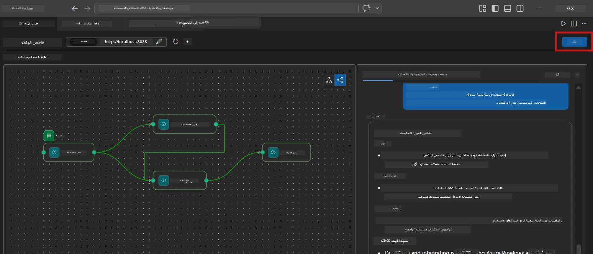
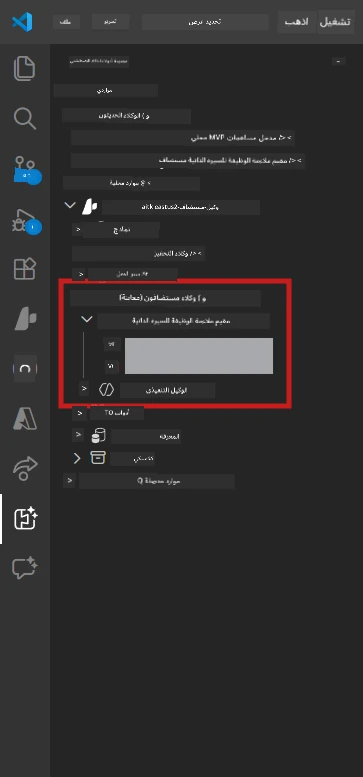

# الوحدة 6 - النشر إلى خدمة وكلاء Foundry

في هذه الوحدة، تقوم بنشر سير العمل متعدد الوكلاء الذي تم اختباره محليًا إلى [Microsoft Foundry](https://learn.microsoft.com/azure/foundry/agents/concepts/hosted-agents) كـ **وكيل مستضاف**. تبني عملية النشر صورة حاوية Docker، وتدفعها إلى [سجل حاويات Azure (ACR)](https://learn.microsoft.com/azure/container-registry/container-registry-intro)، وتنشئ نسخة من الوكيل المستضاف في [خدمة وكلاء Foundry](https://learn.microsoft.com/azure/foundry/agents/how-to/publish-agent).

> **الفرق الرئيسي عن المختبر 01:** عملية النشر متطابقة. تعتبر Foundry سير العمل متعدد الوكلاء لديك كوكيل مستضاف واحد - التعقيد يكون داخل الحاوية، ولكن سطح النشر هو نفس نقطة النهاية `/responses`.

---

## التحقق من المتطلبات الأساسية

قبل النشر، تحقق من كل عنصر أدناه:

1. **الوكيل يجتاز اختبارات التدخين المحلية:**
   - أكملت جميع الاختبارات الثلاثة في [الوحدة 5](05-test-locally.md) وأنتج سير العمل مخرجات كاملة مع بطاقات الفجوة وروابط Microsoft Learn.

2. **لديك دور [Azure AI User](https://learn.microsoft.com/azure/foundry/concepts/rbac-foundry):**
   - تم التعيين في [المختبر 01، الوحدة 2](../../lab01-single-agent/docs/02-create-foundry-project.md). تحقق:
   - بوابة [Azure Portal](https://portal.azure.com) → مورد مشروع Foundry الخاص بك → **التحكم في الوصول (IAM)** → **تعيينات الأدوار** → تأكد من إدراج **[Azure AI User](https://aka.ms/foundry-ext-project-role)** لحسابك.

3. **أنت مسجل الدخول في Azure في VS Code:**
   - تحقق من أيقونة الحسابات في أسفل يسار VS Code. يجب أن يظهر اسم حسابك.

4. **يحتوي ملف `agent.yaml` على القيم الصحيحة:**
   - افتح `PersonalCareerCopilot/agent.yaml` وتحقق من:
     ```yaml
     environment_variables:
       - name: PROJECT_ENDPOINT
         value: ${PROJECT_ENDPOINT}
       - name: MODEL_DEPLOYMENT_NAME
         value: ${MODEL_DEPLOYMENT_NAME}
     ```
   - يجب أن تطابق هذه متغيرات البيئة التي يقرأها `main.py`.

5. **يحتوي ملف `requirements.txt` على الإصدارات الصحيحة:**
   ```
   agent-framework-azure-ai==1.0.0rc3
   agent-framework-core==1.0.0rc3
   azure-ai-agentserver-agentframework==1.0.0b16
   azure-ai-agentserver-core==1.0.0b16
   debugpy
   agent-dev-cli --pre
   ```

---

## الخطوة 1: بدء النشر

### الخيار أ: النشر من خلال Agent Inspector (موصى به)

إذا كان الوكيل يعمل عبر F5 مع فتح Agent Inspector:

1. انظر إلى **الزاوية العلوية اليمنى** من لوحة Agent Inspector.
2. انقر على زر **النشر** (رمز سحابة مع سهم لأعلى ↑).
3. يفتح معالج النشر.



### الخيار ب: النشر من لوحة الأوامر

1. اضغط `Ctrl+Shift+P` لفتح **لوحة الأوامر**.
2. اكتب: **Microsoft Foundry: Deploy Hosted Agent** واختره.
3. يفتح معالج النشر.

---

## الخطوة 2: تكوين النشر

### 2.1 اختر المشروع المستهدف

1. يظهر قائمة منسدلة تحتوي على مشاريع Foundry الخاصة بك.
2. اختر المشروع الذي استخدمته طوال الورشة (مثلاً، `workshop-agents`).

### 2.2 اختر ملف وكيل الحاوية

1. سيُطلب منك اختيار نقطة دخول الوكيل.
2. انتقل إلى `workshop/lab02-multi-agent/PersonalCareerCopilot/` واختر **`main.py`**.

### 2.3 تكوين الموارد

| الإعداد | القيمة الموصى بها | ملاحظات |
|---------|------------------|-------|
| **CPU** | `0.25` | الافتراضي. لا تحتاج سير العمل متعدد الوكلاء إلى المزيد من CPU لأن استدعاءات النموذج تعتمد على الإدخال/الإخراج |
| **الذاكرة** | `0.5Gi` | الافتراضي. زد إلى `1Gi` إذا أضفت أدوات معالجة بيانات كبيرة |

---

## الخطوة 3: التأكيد والنشر

1. يعرض المعالج ملخصًا للنشر.
2. راجع وانقر **تأكيد ونشر**.
3. راقب التقدم في VS Code.

### ما يحدث أثناء النشر

راقب لوحة **الإخراج** في VS Code (اختر "Microsoft Foundry" من القائمة المنسدلة):


1. **بناء Docker** - يبني الحاوية من `Dockerfile` الخاص بك:
   ```
   Step 1/6 : FROM python:3.14-slim
   Step 2/6 : WORKDIR /app
   ...
   Successfully built abc123def456
   ```

2. **دفع Docker** - يدفع الصورة إلى ACR (من 1-3 دقائق في النشر الأول).

3. **تسجيل الوكيل** - تنشئ Foundry وكيلًا مستضافًا باستخدام بيانات `agent.yaml`. اسم الوكيل هو `resume-job-fit-evaluator`.

4. **تشغيل الحاوية** - تبدأ الحاوية في بنية Foundry المدارة مع هوية مُدارة من النظام.

> **النشر الأول أبطأ** (Docker يدفع كل الطبقات). تعيد النشرات اللاحقة استخدام الطبقات المخزنة مؤقتًا وتكون أسرع.

### ملاحظات خاصة بسير العمل متعدد الوكلاء

- **جميع الوكلاء الأربعة داخل حاوية واحدة.** ترى Foundry وكيلًا مستضافًا واحدًا. يعمل رسم WorkflowBuilder داخليًا.
- **مكالمات MCP تخرج إلى الخارج.** تحتاج الحاوية إلى الوصول إلى الإنترنت للوصول إلى `https://learn.microsoft.com/api/mcp`. توفر Foundry هذه ميزة بشكل افتراضي.
- **[الهوية المُدارة](https://learn.microsoft.com/python/api/overview/azure/identity-readme#managed-identity-support).** في البيئة المستضافة، تعيد `get_credential()` في `main.py` `ManagedIdentityCredential()` (لأن `MSI_ENDPOINT` مُعين). هذا تلقائي.

---

## الخطوة 4: تحقق من حالة النشر

1. افتح شريط جانبي **Microsoft Foundry** (انقر على أيقونة Foundry في شريط النشاط).
2. وسّع **الوكلاء المستضافين (معاينة)** تحت مشروعك.
3. ابحث عن **resume-job-fit-evaluator** (أو اسم وكيلك).
4. انقر على اسم الوكيل → وسّع الإصدارات (مثلاً، `v1`).
5. انقر على الإصدار → تحقق من **تفاصيل الحاوية** → **الحالة**:



| الحالة | المعنى |
|--------|---------|
| **بدء التشغيل** / **يعمل** | الحاوية تعمل، الوكيل جاهز |
| **قيد الانتظار** | الحاوية تبدأ (انتظر 30-60 ثانية) |
| **فشل** | فشلت الحاوية في البدء (تحقق من السجلات - انظر أدناه) |

> **بدء تشغيل متعدد الوكلاء يستغرق وقتًا أطول** من وكيل واحد لأن الحاوية تنشئ 4 مثيلات للوكيل عند البدء. "قيد الانتظار" حتى دقيقتين أمر طبيعي.

---

## أخطاء النشر الشائعة والحلول

### الخطأ 1: تم رفض الإذن - `agents/write`

```
Error: lacks the required data action 
Microsoft.CognitiveServices/accounts/AIServices/agents/write
```

**الحل:** عيّن دور **[Azure AI User](https://learn.microsoft.com/azure/foundry/concepts/rbac-foundry)** على مستوى **المشروع**. راجع [الوحدة 8 - استكشاف الأخطاء وإصلاحها](08-troubleshooting.md) للحصول على تعليمات مفصلة.

### الخطأ 2: Docker غير قيد التشغيل

```
Error: Docker build failed / Cannot connect to Docker daemon
```

**الحل:**
1. شغّل Docker Desktop.
2. انتظر حتى تظهر رسالة "Docker Desktop قيد التشغيل".
3. تحقق: `docker info`
4. **ويندوز:** تأكد من تمكين الخلفية WSL 2 في إعدادات Docker Desktop.
5. أعد المحاولة.

### الخطأ 3: فشل pip install أثناء بناء Docker

```
Error: Could not find a version that satisfies the requirement agent-dev-cli
```

**الحل:** يتم التعامل مع العلامة `--pre` في `requirements.txt` بشكل مختلف داخل Docker. تأكد من أن `requirements.txt` يحتوي على:
```
agent-dev-cli --pre
```

إذا استمر فشل Docker، أنشئ `pip.conf` أو مرر `--pre` كوسيط للبناء. راجع [الوحدة 8](08-troubleshooting.md).

### الخطأ 4: فشل أداة MCP في الوكيل المستضاف

إذا توقف Gap Analyzer عن إنتاج روابط Microsoft Learn بعد النشر:

**السبب الجذري:** قد تحظر سياسة الشبكة HTTPS الصادرة من الحاوية.

**الحل:**
1. عادة لا تكون هذه مشكلة في تكوين Foundry الافتراضي.
2. إذا حدثت، تحقق مما إذا كان الشبكة الافتراضية لمشروع Foundry تحتوي على NSG يمنع HTTPS الصادر.
3. تحتوي أداة MCP على عناوين URL احتياطية مضمنة، لذا سيظل الوكيل ينتج المخرجات (بدون روابط مباشرة).

---

### نقطة التحقق

- [ ] تم إكمال أمر النشر بدون أخطاء في VS Code
- [ ] يظهر الوكيل تحت **الوكلاء المستضافين (معاينة)** في شريط Foundry الجانبي
- [ ] اسم الوكيل هو `resume-job-fit-evaluator` (أو الاسم الذي اخترته)
- [ ] حالة الحاوية تظهر **بدء التشغيل** أو **يعمل**
- [ ] (إذا وجدت أخطاء) قمت بتحديد الخطأ، وتطبيق الحل، وأعدت النشر بنجاح

---

**السابق:** [05 - اختبار محليًا](05-test-locally.md) · **التالي:** [07 - التحقق في ساحة اللعب →](07-verify-in-playground.md)

---

<!-- CO-OP TRANSLATOR DISCLAIMER START -->
**إخلاء المسؤولية**:  
تمت ترجمة هذا المستند باستخدام خدمة الترجمة الآلية [Co-op Translator](https://github.com/Azure/co-op-translator). بينما نسعى لتحقيق الدقة، يرجى العلم أن الترجمات الآلية قد تحتوي على أخطاء أو عدم دقة. يجب اعتبار المستند الأصلي بلغته الأصلية المصدر المعتمد. بالنسبة للمعلومات الحساسة، يُنصح بالترجمة الاحترافية من قبل بشر. نحن غير مسؤولين عن أي سوء فهم أو تفسيرات خاطئة ناتجة عن استخدام هذه الترجمة.
<!-- CO-OP TRANSLATOR DISCLAIMER END -->