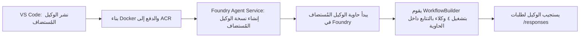
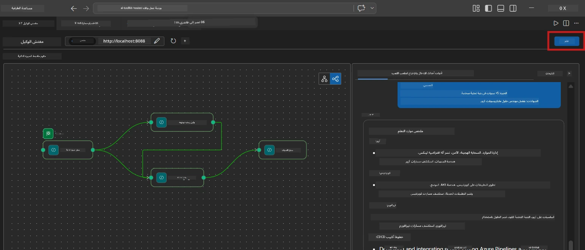
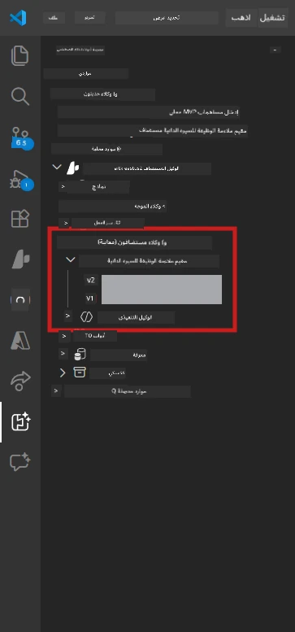

# الوحدة ٦ - النشر إلى خدمة وكيل فاوندري

⏱️ ~١٠ دقائق

في هذه الوحدة، تقوم بنشر سير العمل متعدد الوكلاء الذي اختبرته محليًا إلى [Microsoft Foundry](https://learn.microsoft.com/azure/foundry/agents/concepts/hosted-agents) كـ **وكيل مستضاف**. عملية النشر تقوم ببناء صورة حاوية Docker، ثم تدفعها إلى [سجل الحاويات في Azure (ACR)](https://learn.microsoft.com/azure/container-registry/container-registry-intro)، وتنشئ نسخة وكيل مستضاف في [خدمة وكيل فاوندري](https://learn.microsoft.com/azure/foundry/agents/how-to/publish-agent).

> **الفرق الرئيسي عن المختبر 01:** عملية النشر هي نفسها. فاوندري يعامل سير العمل متعدد الوكلاء كوكيل مستضاف واحد - التعقيد داخل الحاوية، لكن نقطة النشر هي نفس نقطة النهاية `/responses`.

### خط أنابيب النشر


```mermaid
flowchart LR
    A[VS Code: نشر الوكيل المُستضاف] --> B[بناء Docker والدفع إلى ACR]
    B --> C[Foundry Agent Service: إنشاء نسخة الوكيل المُستضاف]
    C --> D[يبدأ حاوية الوكيل المُستضاف في Foundry]
    D --> E[يقوم WorkflowBuilder بتشغيل ٤ وكلاء بالتتابع داخل الحاوية]
    E --> F[يستجيب الوكيل لطلبات /responses]
```

---

## التحقق من المتطلبات الأساسية

قبل النشر، تحقق من كل بند أدناه:

1. **الوكيل يجتاز اختبارات التدخين المحلية:**
   - لقد أنهيت كل الاختبارات الثلاثة في [الوحدة 5](05-test-locally.md) وقد أنتج سير العمل مخرجات كاملة مع بطاقات الفجوة وروابط Microsoft Learn.

2. **لديك دور [مستخدم فاوندري](https://learn.microsoft.com/azure/foundry/concepts/rbac-foundry)** (للنشر، تحتاج على الأقل إلى دور **مدير مشروع فاوندري** على مستوى المشروع):

   > **ملاحظة:** تم إعادة تسمية أدوار التحكم في الوصول لـ فاوندري مؤخرًا - **مستخدم فاوندري**، **مالك فاوندري**، و**مدير مشروع فاوندري** كانت تُعرف سابقًا بـ Azure AI User, Azure AI Owner, وAzure AI Project Manager على التوالي. معرفات الأدوار والصلاحيات لم تتغير.

   - تحقق في [بوابة Azure](https://portal.azure.com) → مورد **المشروع** الخاص بك في فاوندري → **التحكم في الوصول (IAM)** → **تعيينات الأدوار** → التأكد من أن **مستخدم فاوندري** (أو أعلى) مدرج لحسابك.

3. **أنت مسجل دخول إلى Azure في VS Code:**
   - تحقق من أيقونة الحسابات في أسفل اليسار من VS Code. يجب أن يكون اسم حسابك مرئيًا.

4. **ملف `agent.yaml` يحتوي على القيم الصحيحة:**
   - افتح `PersonalCareerCopilot/agent.yaml` وتحقق مما يلي:
     ```yaml
     environment_variables:
       - name: AZURE_AI_MODEL_DEPLOYMENT_NAME
         value: ${AZURE_AI_MODEL_DEPLOYMENT_NAME}
     ```
   - `FOUNDRY_PROJECT_ENDPOINT` **غير مدرجة** هنا - فاوندري يضيفها وقت التشغيل. الوحيد المطلوب هو إعلان `AZURE_AI_MODEL_DEPLOYMENT_NAME`.

5. **ملف `requirements.txt` به الإصدارات الصحيحة:**
   ```
   agent-framework-foundry
   agent-framework-foundry-hosting
   mcp<2,>=1.24.0
   debugpy
   ```

---

## الخطوة ١: بدء النشر

### الخيار أ: النشر من خلال Agent Inspector (مستحسن)

إذا كان الوكيل يعمل عبر F5 وAgent Inspector مفتوح:

١. انظر إلى **الزاوية العلوية اليمنى** من لوحة Agent Inspector.
٢. اضغط على زر **نشر** (أيقونة السحابة مع سهم للأعلى ↑).
٣. ستفتح معالج النشر.



### الخيار ب: النشر من Command Palette

١. اضغط `Ctrl+Shift+P` لفتح **Command Palette**.
٢. اكتب: **Foundry Toolkit: Deploy Hosted Agent** واختره.
٣. ستفتح معالج النشر.

---

## الخطوة ٢: تهيئة النشر

### ٢.١ اختيار المشروع الهدف

١. قائمة منسدلة تعرض مشاريع فاوندري الخاصة بك.
٢. اختر المشروع الذي استخدمته خلال الورشة (مثلًا `workshop-agents`).

### ٢.٢ اختيار ملف وكيل الحاوية

١. سيُطلب منك اختيار نقطة دخول الوكيل.
٢. توجه إلى `workshop/lab02-multi-agent/PersonalCareerCopilot/` واختر **`main.py`**.

### ٢.٣ تكوين الموارد

| الإعداد | القيمة الموصى بها | ملاحظات |
|---------|------------------|---------|
| **طريقة النشر** | **حاوية** (مستحسن) أو **كود** | الحاوية تبني صورة دُكر؛ الكود يرفع المصدر كملف ZIP (معاينة) |
| **سجل الحاويات** | **ACR الافتراضي** | فاوندري ينشئ ويدير لك سجل |
| **وحدة المعالجة المركزيّة** | `0.25` | القيم الافتراضية. سير العمل متعدد الوكلاء لا يحتاج لوحدة معالجة أكثر لأن نداءات النموذج تعتمد على الإدخال/الإخراج |
| **الذاكرة** | `0.5Gi` | القيمة الافتراضية. زدها إلى `1Gi` إذا أضفت أدوات معالجة بيانات كبيرة |

---

## الخطوة ٣: التأكيد والنشر

١. يعرض المعالج ملخص النشر.
٢. راجع واضغط على **تأكيد ونشر**.
٣. تابع التقدم في VS Code.

### ماذا يحدث أثناء النشر

راقب لوحة **Output** في VS Code (اختر من القائمة المنسدلة "Microsoft Foundry"):

١. **بناء دُكر** - يبني الحاوية من `Dockerfile` الخاص بك
   ```
   Step 1/6 : FROM python:3.12-slim
   Step 2/6 : WORKDIR /app
   ...
   Successfully built abc123def456
   ```

٢. **دفع دُكر** - يدفع الصورة إلى ACR (١-٣ دقائق في أول نشر).

٣. **تسجيل الوكيل** - فاوندري ينشئ وكيلًا مستضافًا باستخدام بيانات `agent.yaml`. اسم الوكيل هو `resume-job-fit-evaluator`.

٤. **بدء الحاوية** - الحاوية تبدأ في بنية فاوندري المدارة مع هوية مدارة من النظام.

> **النشر الأول أبطأ** (دُكر يدفع كل الطبقات). عمليات النشر التالية تعيد استخدام الطبقات المؤقتة وتكون أسرع.

### ملاحظات خاصة متعدد الوكلاء

- **كل الوكلاء الأربعة داخل حاوية واحدة.** فاوندري يرى وكيلًا مستضافًا واحدًا. تدير مخططات WorkflowBuilder داخليًا.
- **نداءات MCP تخرج إلى الخارج.** الحاوية تحتاج إنترنت للوصول إلى `https://learn.microsoft.com/api/mcp`. توفر بنية فاوندري المدار هذا تلقائيًا.
- **[الهوية المدارة](https://learn.microsoft.com/azure/foundry/agents/concepts/agent-identity).** فاوندري ينشئ تلقائيًا **هوية Entra مخصصة لكل وكيل** عند وقت النشر. في البيئة المستضافة، `DefaultAzureCredential` يحل تلقائيًا إلى هوية هذا الوكيل - لا حاجة لإعداد الهوية المدارة يدويًا.

---

## الخطوة ٤: التحقق من حالة النشر

١. افتح الشريط الجانبي **Microsoft Foundry** (اضغط على أيقونة فاوندري في شريط النشاط).
٢. وسع **Hosted Agents (Preview)** ضمن مشروعك.
٣. ابحث عن **resume-job-fit-evaluator** (أو اسم وكيلك).
٤. اضغط على اسم الوكيل → وسع الإصدارات (مثلًا `v1`).
٥. اضغط على الإصدار → تحقق من **تفاصيل الحاوية** → **الحالة**:



| الحالة | المعنى |
|--------|---------|
| **نشط** | الوكيل يعمل وجاهز لاستقبال الطلبات |
| **جارٍ الإنشاء** | الحاوية تبدأ (انتظر ٣٠-٦٠ ثانية) |
| **فشل** | فشل في بدء الحاوية (راجع السجلات أدناه) |

> **ملاحظة:** الشريط الجانبي لـ VS Code قد يعرض تسميات مثل "تشغيل" أو "بدأ" بينما حالة واجهة برمجة التطبيقات الأساسية تستخدم `active`/`creating`. العرضان يشيران لنفس الحالة.

> **تشغيل متعدد الوكلاء يستغرق وقتًا أطول** من الوكيل الواحد لأن الحاوية تنشئ ٤ مثيلات وكلاء عند التشغيل. وجود حالة `creating` حتى دقيقتين أمر طبيعي.

---

## أخطاء شائعة في النشر وطرق الإصلاح

### الخطأ ١: تم رفض الإذن - `agents/write`

```
Error: lacks the required data action 
Microsoft.CognitiveServices/accounts/AIServices/agents/write
```

**الإصلاح:** عيّن دور **[مستخدم فاوندري](https://learn.microsoft.com/azure/foundry/concepts/rbac-foundry)** (كان يسمى سابقًا **Azure AI User**) على مستوى **المشروع**. اطلع على [الوحدة ٨ - استكشاف الأخطاء](08-troubleshooting.md) لتعليمات خطوة بخطوة.

### الخطأ ٢: دُكر غير شغال

```
Error: Docker build failed / Cannot connect to Docker daemon
```

**الإصلاح:**
١. شغل Docker Desktop.
٢. انتظر حتى تظهر "Docker Desktop is running".
٣. تحقق: `docker info`
٤. **ويندوز:** تأكد من تفعيل backend WSL 2 في إعدادات Docker Desktop.
٥. أعد المحاولة.

### الخطأ ٣: فشل pip install أثناء بناء دُكر

```
Error: Could not find a version that satisfies the requirement agent-framework-foundry
```

**الإصلاح:** تحقق أن ملف `requirements.txt` مطابق لـ:
```
agent-framework-foundry
agent-framework-foundry-hosting
mcp<2,>=1.24.0
debugpy
```

إذا استمرت المشكلة، قد يكون شبكة دُكر تحجب PyPI. تحقق من إعدادات الوكيل في `docker info`.

### الخطأ ٤: فشل أداة MCP في الوكيل المستضاف

إذا توقف Gap Analyzer عن إنتاج روابط Microsoft Learn بعد النشر:

**السبب:** قد تحجب سياسة الشبكة HTTPS الصادرة من الحاوية.

**الإصلاح:**
١. عادة ليس هناك مشكلة في إعدادات فاوندري الافتراضية.
٢. إذا حدث، تحقق مما إذا كانت الشبكة الافتراضية لمشروع فاوندري بها NSG يحجب HTTPS الصادر.
٣. أداة MCP بها روابط بديلة مدمجة، لذا الوكيل سيستمر في إنتاج المخرجات (بدون روابط حية).

---

### نقطة التحقق

- [ ] أمر النشر اكتمل بدون أخطاء في VS Code
- [ ] الوكيل يظهر تحت **Hosted Agents (Preview)** في الشريط الجانبي لـ فاوندري
- [ ] اسم الوكيل هو `resume-job-fit-evaluator` (أو اسمك المختار)
- [ ] حالة الحاوية تظهر **بدأ** أو **تشغيل**
- [ ] (إذا ظهرت أخطاء) حددت الخطأ، طبقت الإصلاح، وأعدت النشر بنجاح

---

**السابق:** [05 - الاختبار محليًا](05-test-locally.md) · **التالي:** [07 - التحقق في الملعب →](07-verify-in-playground.md)

---

<!-- CO-OP TRANSLATOR DISCLAIMER START -->
**تنويه**:
تمت ترجمة هذا المستند باستخدام خدمة الترجمة بالذكاء الاصطناعي [Co-op Translator](https://github.com/Azure/co-op-translator). بينما نسعى للدقة، يرجى العلم أن الترجمات الآلية قد تحتوي على أخطاء أو عدم دقة. يجب اعتبار المستند الأصلي بلغته الأصلية المصدر الرسمي والمعتمد. للمعلومات الهامة، يُنصح بالاستعانة بترجمة بشرية محترفة. نحن غير مسؤولين عن أي سوء فهم أو تفسير ناتج عن استخدام هذه الترجمة.
<!-- CO-OP TRANSLATOR DISCLAIMER END -->