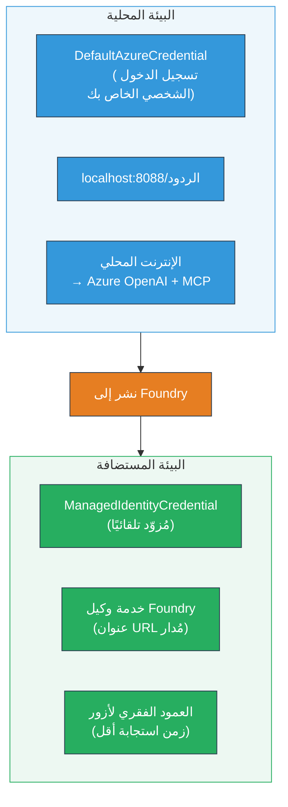

# الوحدة 7 - التحقق في ساحة اللعب

في هذه الوحدة، تختبر سير العمل متعدد العملاء الذي قمت بنشره في كل من **VS Code** و**[بوابة Foundry](https://ai.azure.com)**، مؤكداً أن الوكيل يتصرف بشكل مطابق للاختبار المحلي.

---

## لماذا نتحقق بعد النشر؟

عمل سير العمل متعدد العملاء بشكل مثالي محلياً، فلماذا نختبر مرة أخرى؟ البيئة المستضافة تختلف بعدة طرق:


| الاختلاف | محلي | مستضاف |
|-----------|-------|--------|
| **الهوية** | [`DefaultAzureCredential`](https://learn.microsoft.com/azure/developer/python/sdk/authentication/credential-chains#defaultazurecredential-overview) (تسجيل الدخول الشخصي الخاص بك) | [`ManagedIdentityCredential`](https://learn.microsoft.com/python/api/overview/azure/identity-readme#managed-identity-support) (مزود تلقائياً) |
| **نقطة النهاية** | `http://localhost:8088/responses` | نقطة النهاية لـ[خدمة Foundry Agent](https://learn.microsoft.com/azure/foundry/agents/concepts/hosted-agents) (رابط مُدار) |
| **الشبكة** | الجهاز المحلي → Azure OpenAI + MCP الصادر | ظهر Azure (كمون أقل بين الخدمات) |
| **اتصال MCP** | الإنترنت المحلي → `learn.microsoft.com/api/mcp` | صادر من الحاوية → `learn.microsoft.com/api/mcp` |

إذا كان أي متغير بيئة مهيأ بشكل غير صحيح، أو اختلفت أدوار الوصول (RBAC)، أو تم حظر الصادر من MCP، ستكتشف ذلك هنا.

---

## الخيار أ: الاختبار في ساحة لعب VS Code (موصى به أولاً)

يتضمن [امتداد Foundry](https://marketplace.visualstudio.com/items?itemName=TeamsDevApp.vscode-ai-foundry) ساحة لعب مدمجة تسمح لك بالدردشة مع الوكيل المنشور دون مغادرة VS Code.

### الخطوة 1: الانتقال إلى وكيلك المستضاف

1. اضغط على أيقونة **Microsoft Foundry** في **شريط الأنشطة** في VS Code (الشريط الجانبي الأيسر) لفتح لوحة Foundry.
2. قم بتوسيع المشروع المتصل لديك (مثل `workshop-agents`).
3. قم بتوسيع **وكلاء مستضيفون (معاينة)**.
4. يجب أن ترى اسم وكيلك (مثل `resume-job-fit-evaluator`).

### الخطوة 2: اختيار نسخة

1. انقر على اسم الوكيل لتوسيع إصداراته.
2. اضغط على النسخة التي نشرتها (مثل `v1`).
3. تفتح لوحة التفاصيل التي تعرض تفاصيل الحاوية.
4. تحقق من أن الحالة هي **بدأت** أو **تشغيل**.

### الخطوة 3: فتح ساحة اللعب

1. في لوحة التفاصيل، اضغط زر **Playground** (أو انقر بزر الماوس الأيمن على النسخة → **فتح في ساحة اللعب**).
2. تفتح واجهة الدردشة في تبويب VS Code.

### الخطوة 4: تشغيل اختبارات التدخين

استخدم نفس الاختبارات الثلاثة من [الوحدة 5](05-test-locally.md). اكتب كل رسالة في مربع إدخال ساحة اللعب واضغط **إرسال** (أو **Enter**).

#### الاختبار 1 - السيرة الذاتية الكاملة + وصف الوظيفة (التدفق القياسي)

الصق موجه السيرة الذاتية الكاملة + وصف الوظيفة من الوحدة 5، الاختبار 1 (Jane Doe + مهندس سحابة أول في Contoso Ltd).

**المتوقع:**
- درجة الملاءمة مع تفصيل الحساب (مقياس من 100 نقطة)
- قسم المهارات المتطابقة
- قسم المهارات الناقصة
- **بطاقة فجوة واحدة لكل مهارة ناقصة** مع روابط Microsoft Learn
- خارطة طريق التعلم مع الجدول الزمني

#### الاختبار 2 - اختبار قصير سريع (إدخال محدود)

```
RESUME: 3 years Python developer, knows Django and PostgreSQL, no cloud experience.

JOB: Cloud DevOps Engineer requiring AWS, Kubernetes, Terraform, CI/CD. 5 years needed.
```

**المتوقع:**
- درجة ملاءمة أقل (< 40)
- تقييم صادق مع مسار تعلم متدرج
- بطاقات فجوة متعددة (AWS، Kubernetes، Terraform، CI/CD، فجوة خبرة)

#### الاختبار 3 - مرشح ملائم عالي

```
RESUME:
10 years Azure Cloud Architect. AZ-305 certified. Expert in AKS, Terraform, Azure DevOps, 
Azure Functions, Helm, Prometheus, Grafana, Python, Go. Led platform team of 8.

JOB:
Senior Cloud Engineer. Required: AKS, Terraform, Azure DevOps, Python. Preferred: Helm, Go.
5+ years experience. AZ-305 preferred.
```

**المتوقع:**
- درجة ملاءمة عالية (≥ 80)
- التركيز على الاستعداد للمقابلة والصقل
- عدد قليل أو لا يوجد بطاقات فجوة
- جدول زمني قصير يركز على التحضير

### الخطوة 5: المقارنة مع النتائج المحلية

افتح ملاحظاتك أو تبويب المتصفح من الوحدة 5 حيث حفظت الردود المحلية. لكل اختبار:

- هل يحتوي الرد على **بنفس الهيكل** (درجة الملاءمة، بطاقات الفجوة، خارطة الطريق)؟
- هل يتبع **نفس قواعد التقييم** (تفصيل مقياس الـ 100 نقطة)؟
- هل ما زالت **روابط Microsoft Learn موجودة في بطاقات الفجوة**؟
- هل هناك **بطاقة فجوة واحدة لكل مهارة ناقصة** (غير مقتصرة)؟

> **الاختلافات الطفيفة في الصياغة طبيعية** - النموذج غير حتمي. ركز على الهيكل، اتساق التقييم، واستخدام أدوات MCP.

---

## الخيار ب: الاختبار في بوابة Foundry

توفر [بوابة Foundry](https://ai.azure.com) ساحة لعب ويب مفيدة للمشاركة مع الزملاء أو أصحاب المصلحة.

### الخطوة 1: فتح بوابة Foundry

1. افتح متصفحك وانتقل إلى [https://ai.azure.com](https://ai.azure.com).
2. سجل الدخول بنفس حساب Azure الذي استخدمته طوال ورشة العمل.

### الخطوة 2: التنقل إلى مشروعك

1. في الصفحة الرئيسية، ابحث عن **المشاريع الحديثة** في الشريط الجانبي الأيسر.
2. انقر على اسم مشروعك (مثل `workshop-agents`).
3. إذا لم تره، انقر **جميع المشاريع** وابحث عنه.

### الخطوة 3: العثور على الوكيل المنشور

1. في التنقل الأيسر للمشروع، اضغط **بناء** → **الوكلاء** (أو ابحث عن قسم **الوكلاء**).
2. يجب أن ترى قائمة الوكلاء. اعثر على الوكيل المنشور لديك (مثل `resume-job-fit-evaluator`).
3. انقر على اسم الوكيل لفتح صفحة تفاصيله.

### الخطوة 4: فتح ساحة اللعب

1. في صفحة تفاصيل الوكيل، انظر إلى شريط الأدوات العلوي.
2. اضغط **فتح في ساحة اللعب** (أو **تجربة في ساحة اللعب**).
3. تفتح واجهة الدردشة.

### الخطوة 5: تشغيل نفس اختبارات التدخين

كرر جميع الاختبارات الثلاثة من قسم ساحة لعب VS Code أعلاه. قارِن كل رد مع النتائج المحلية (الوحدة 5) ونتائج ساحة لعب VS Code (الخيار أ أعلاه).

---

## التحقق الخاص بسير العمل متعدد العملاء

إلى جانب الصحة الأساسية، تحقق من هذه السلوكيات الخاصة بسير العمل متعدد العملاء:

### تنفيذ أداة MCP

| الفحص | كيفية التحقق | شرط النجاح |
|-------|---------------|----------------|
| نجاح استدعاءات MCP | بطاقات الفجوة تحتوي على روابط `learn.microsoft.com` | روابط حقيقية، ليست رسائل بديلة |
| استدعاءات MCP متعددة | كل فجوة ذات أولوية عالية/متوسطة تتضمن موارد | ليست فقط بطاقة الفجوة الأولى |
| آلية الاسترداد لـ MCP تعمل | إذا كانت الروابط مفقودة، تحقق من نص الاسترداد | الوكيل ينتج بطاقات فجوة (مع أو بدون روابط) |

### تنسيق الوكلاء

| الفحص | كيفية التحقق | شرط النجاح |
|-------|---------------|----------------|
| تشغيل جميع الوكلاء الأربعة | المخرجات تحتوي على درجة ملاءمة وبطاقات فجوة | الدرجة من MatchingAgent، البطاقات من GapAnalyzer |
| التفرع المتوازي | زمن الاستجابة معقول (< دقيقتين) | إذا زاد عن 3 دقائق، قد لا يكون التنفيذ موازياً |
| سلامة تدفق البيانات | بطاقات الفجوة تشير إلى المهارات من تقرير المطابقة | لا مهارات متخيَّلة غير موجودة في وصف الوظيفة |

---

## معيار التحقق

استخدم هذا المعيار لتقييم سلوك سير العمل متعدد العملاء المستضاف:

| # | المعيار | شرط النجاح | النجاح؟ |
|---|----------|---------------|-------|
| 1 | **الصحة الوظيفية** | الوكيل يرد على السيرة الذاتية + وصف الوظيفة بدرجة ملاءمة وتحليل فجوة | |
| 2 | **اتساق التقييم** | استخدام مقياس 100 نقطة مع تفصيل الحساب | |
| 3 | **اكتمال بطاقات الفجوة** | بطاقة واحدة لكل مهارة ناقصة (غير مقتصرة أو مجمعة) | |
| 4 | **تكامل أداة MCP** | بطاقات الفجوة تحتوي على روابط حقيقية لـ Microsoft Learn | |
| 5 | **اتساق الهيكل** | نفس هيكل المخرجات بين التشغيل المحلي والمستضاف | |
| 6 | **زمن الاستجابة** | الوكيل المستضاف يرد خلال دقيقتين للتقييم الكامل | |
| 7 | **عدم وجود أخطاء** | لا أخطاء HTTP 500 أو انتهاء مهلة أو ردود فارغة | |

> "نجاح" يعني تحقيق جميع المعايير السبعة لجميع اختبارات التدخين الثلاثة في إحدى ساحات اللعب (في VS Code أو البوابة).

---

## استكشاف أخطاء ساحة اللعب وإصلاحها

| العرض | السبب المحتمل | الإصلاح |
|---------|-------------|-----|
| لا يتم تحميل ساحة اللعب | حالة الحاوية ليست "بدأت" | عد إلى [الوحدة 6](06-deploy-to-foundry.md)، تحقق من حالة النشر. انتظر إذا كانت "قيد الانتظار" |
| الوكيل يرجع رد فارغ | عدم تطابق اسم نشر النموذج | تحقق من `agent.yaml` → `environment_variables` → `MODEL_DEPLOYMENT_NAME` يطابق النموذج المنشور |
| الوكيل يرجع رسالة خطأ | فقدان إذن [RBAC](https://learn.microsoft.com/azure/foundry/concepts/rbac-foundry) | امنح **[مستخدم Azure AI](https://aka.ms/foundry-ext-project-role)** على مستوى المشروع |
| لا توجد روابط Microsoft Learn في بطاقات الفجوة | تم حظر الصادر من MCP أو خادم MCP غير متاح | تحقق ما إذا كانت الحاوية تصل إلى `learn.microsoft.com`. انظر [الوحدة 8](08-troubleshooting.md) |
| توجد بطاقة فجوة واحدة فقط (مقتصرة) | تعليمات GapAnalyzer تفتقد قسم "حرج" | راجع [الوحدة 3، الخطوة 2.4](03-configure-agents.md) |
| درجة الملاءمة مختلفة كثيراً عن المحلية | نشر نموذج أو تعليمات مختلفة | قارن متغيرات البيئة في `agent.yaml` مع `.env` المحلية. قم بإعادة النشر إذا لزم الأمر |
| "الوكيل غير موجود" في البوابة | النشر لا يزال يتوزع أو فشل | انتظر دقيقتين، حدّث الصفحة. إذا استمر الغياب، أعد النشر من [الوحدة 6](06-deploy-to-foundry.md) |

---

### نقطة التحقق

- [ ] اختبرت الوكيل في ساحة لعب VS Code - اجتاز جميع اختبارات التدخين الثلاثة
- [ ] اختبرت الوكيل في ساحة لعب [بوابة Foundry](https://ai.azure.com) - اجتاز جميع اختبارات التدخين الثلاثة
- [ ] الردود متسقة هيكلياً مع الاختبار المحلي (درجة الملاءمة، بطاقات الفجوة، خارطة الطريق)
- [ ] روابط Microsoft Learn موجودة في بطاقات الفجوة (أداة MCP تعمل في البيئة المستضافة)
- [ ] بطاقة فجوة واحدة لكل مهارة ناقصة (بدون اقتصار)
- [ ] لا أخطاء أو انتهاء مهلة أثناء الاختبار
- [ ] أتممت معيار التحقق (السبعة معايير جميعها ناجحة)

---

**السابق:** [06 - النشر إلى Foundry](06-deploy-to-foundry.md) · **التالي:** [08 - استكشاف الأخطاء وإصلاحها →](08-troubleshooting.md)

---

<!-- CO-OP TRANSLATOR DISCLAIMER START -->
**تنويه**:
تمت ترجمة هذا المستند باستخدام خدمة الترجمة بالذكاء الاصطناعي [Co-op Translator](https://github.com/Azure/co-op-translator). بينما نسعى لتحقيق الدقة، يرجى العلم أن الترجمات الآلية قد تحتوي على أخطاء أو عدم دقة. ينبغي اعتبار الوثيقة الأصلية بلغتها الأصلية هي المصدر الموثوق به. لترجمة المعلومات الحساسة، يُنصح بالاستعانة بترجمة بشرية محترفة. نحن غير مسؤولين عن أي سوء فهم أو تفسير ناتج عن استخدام هذه الترجمة.
<!-- CO-OP TRANSLATOR DISCLAIMER END -->