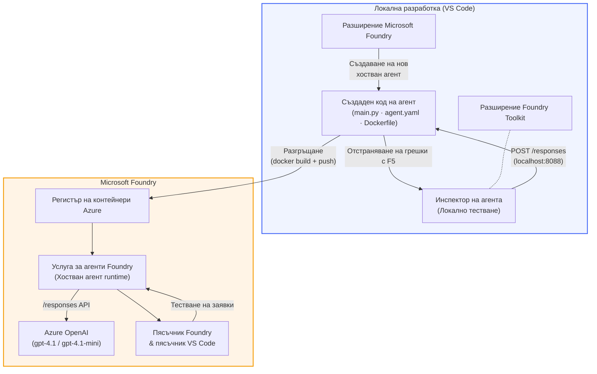

# Foundry Toolkit + Foundry Hosted Agents Workshop

[](https://www.python.org/)
[](https://github.com/microsoft/agents)
[](https://learn.microsoft.com/azure/ai-foundry/agents/concepts/hosted-agents/)
[](https://ai.azure.com/)
[](https://learn.microsoft.com/azure/ai-services/openai/)
[](https://learn.microsoft.com/cli/azure/install-azure-cli)
[](https://learn.microsoft.com/azure/developer/azure-developer-cli/install-azd)
[](https://www.docker.com/)
[](https://marketplace.visualstudio.com/items?itemName=ms-windows-ai-studio.windows-ai-studio)
[](LICENSE)

Създайте, тествайте и разгръщайте AI агенти към **Microsoft Foundry Agent Service** като **Hosted Agents** - изцяло от VS Code с помощта на **Microsoft Foundry extension** и **Foundry Toolkit**.

> **Hosted Agents в момента са в предварителен преглед.** Поддържаните региони са ограничени - вижте [достъпност на регионите](https://learn.microsoft.com/azure/foundry/agents/concepts/hosted-agents#region-availability).

> Папката `agent/` във всяка лаборатория се **генерира автоматично** от Foundry разширението - след това персонализирате кода, тествате локално и разгръщате.

<!-- CO-OP TRANSLATOR LANGUAGES TABLE START -->
[Arabic](../ar/README.md) | [Bengali](../bn/README.md) | [Bulgarian](./README.md) | [Burmese (Myanmar)](../my/README.md) | [Chinese (Simplified)](../zh-CN/README.md) | [Chinese (Traditional, Hong Kong)](../zh-HK/README.md) | [Chinese (Traditional, Macau)](../zh-MO/README.md) | [Chinese (Traditional, Taiwan)](../zh-TW/README.md) | [Croatian](../hr/README.md) | [Czech](../cs/README.md) | [Danish](../da/README.md) | [Dutch](../nl/README.md) | [Estonian](../et/README.md) | [Finnish](../fi/README.md) | [French](../fr/README.md) | [German](../de/README.md) | [Greek](../el/README.md) | [Hebrew](../he/README.md) | [Hindi](../hi/README.md) | [Hungarian](../hu/README.md) | [Indonesian](../id/README.md) | [Italian](../it/README.md) | [Japanese](../ja/README.md) | [Kannada](../kn/README.md) | [Khmer](../km/README.md) | [Korean](../ko/README.md) | [Lithuanian](../lt/README.md) | [Malay](../ms/README.md) | [Malayalam](../ml/README.md) | [Marathi](../mr/README.md) | [Nepali](../ne/README.md) | [Nigerian Pidgin](../pcm/README.md) | [Norwegian](../no/README.md) | [Persian (Farsi)](../fa/README.md) | [Polish](../pl/README.md) | [Portuguese (Brazil)](../pt-BR/README.md) | [Portuguese (Portugal)](../pt-PT/README.md) | [Punjabi (Gurmukhi)](../pa/README.md) | [Romanian](../ro/README.md) | [Russian](../ru/README.md) | [Serbian (Cyrillic)](../sr/README.md) | [Slovak](../sk/README.md) | [Slovenian](../sl/README.md) | [Spanish](../es/README.md) | [Swahili](../sw/README.md) | [Swedish](../sv/README.md) | [Tagalog (Filipino)](../tl/README.md) | [Tamil](../ta/README.md) | [Telugu](../te/README.md) | [Thai](../th/README.md) | [Turkish](../tr/README.md) | [Ukrainian](../uk/README.md) | [Urdu](../ur/README.md) | [Vietnamese](../vi/README.md)

> **Предпочитате да клонирате локално?**
>
> Това хранилище включва над 50 езикови превода, което значително увеличава размера на изтеглянето. За да клонирате без преводи, използвайте sparse checkout:
>
> **Bash / macOS / Linux:**
> ```bash
> git clone --filter=blob:none --sparse https://github.com/microsoft-foundry/Foundry_Toolkit_for_VSCode_Lab.git
> cd Foundry_Toolkit_for_VSCode_Lab
> git sparse-checkout set --no-cone '/*' '!translations' '!translated_images'
> ```
>
> **CMD (Windows):**
> ```cmd
> git clone --filter=blob:none --sparse https://github.com/microsoft-foundry/Foundry_Toolkit_for_VSCode_Lab.git
> cd Foundry_Toolkit_for_VSCode_Lab
> git sparse-checkout set --no-cone "/*" "!translations" "!translated_images"
> ```
>
> Това ви дава всичко необходимо, за да завършите курса с много по-бързо изтегляне.
<!-- CO-OP TRANSLATOR LANGUAGES TABLE END -->

---

## Архитектура


**Поток:** Foundry extension генерира основната рамка на агента → вие персонализирате кода и инструкциите → тествате локално с Agent Inspector → разгърщате в Foundry (Docker образ качен в ACR) → проверявате в Playground.

---

## Какво ще изградите

| Лаборатория | Описание | Статус |
|-----|-------------|--------|
| **Лаб 01 - Единичен агент** | Изградете агента **"Обясни ми като на ръководител"**, тествайте го локално и го разгърнете в Foundry | ✅ Налична |
| **Лаб 02 - Многоагентен работен процес** | Изградете **"Резюме → Оценител на подходящост за работа"** - 4 агента работят заедно, за да оценят резюмето и да генерират учебен път | ✅ Налична |

---

## Запознайте се с агента за ръководители

В този уъркшоп ще изградите агента **"Обясни ми като на ръководител"** - AI агент, който превежда заплетения технически жаргон в спокойни, готови за бордова зала резюмета. Защото честно казано, никой в управлението не иска да чуе за "прекомерна употреба на thread pool, причинена от синхронни повиквания във версия v3.2."

Аз създадох този агент след твърде много ситуации, в които перфектно подготвеният ми пост-оперативен анализ получаваше отговор: *"Така... сайтът паднал ли е или не?"*

### Как работи

Въвеждате му техническо обновление. Той връща резюме за ръководството - три точки, без жаргон, без стек траси, без екзистенциална тревога. Само **какво се случи**, **бизнес ефект** и **следваща стъпка**.

### Вижте го в действие

**Вие казвате:**
> "Закъснението на API се увеличи поради изчерпване на thread pool, причинено от синхронни повиквания, въведени във v3.2."

**Агентът отговаря:**

> **Резюме за ръководството:**
> - **Какво се случи:** След последното пускане системата забави.
> - **Бизнес ефект:** Някои потребители изпитаха забавяне при използване на услугата.
> - **Следваща стъпка:** Промяната е отменена и се подготвя корекция преди повторно разгръщане.

### Защо този агент?

Това е изключително прост агент с една единствена цел - перфектен за да научите работния процес с hosted агенти от началото до края без да се загубите в сложни вериги от инструменти. И честно казано? Всеки инженеринг екип би могъл да използва такъв.

---

## Структура на уъркшопа

```
📂 Foundry_Toolkit_for_VSCode_Lab/
├── 📄 README.md                      ← You are here
├── 📂 ExecutiveAgent/                ← Standalone hosted agent project
│   ├── agent.yaml
│   ├── Dockerfile
│   ├── main.py
│   └── requirements.txt
└── 📂 workshop/
    ├── 📂 lab01-single-agent/        ← Full lab: docs + agent code
    │   ├── README.md                 ← Hands-on lab instructions
    │   ├── 📂 docs/                  ← Step-by-step tutorial modules
    │   │   ├── 00-prerequisites.md
    │   │   ├── 01-install-foundry-toolkit.md
    │   │   ├── 02-create-foundry-project.md
    │   │   ├── 03-create-hosted-agent.md
    │   │   ├── 04-configure-and-code.md
    │   │   ├── 05-test-locally.md
    │   │   ├── 06-deploy-to-foundry.md
    │   │   ├── 07-verify-in-playground.md
    │   │   └── 08-troubleshooting.md
    │   └── 📂 agent/                 ← Reference solution (auto-scaffolded by Foundry extension)
    │       ├── agent.yaml
    │       ├── Dockerfile
    │       ├── main.py
    │       └── requirements.txt
    └── 📂 lab02-multi-agent/         ← Resume → Job Fit Evaluator
        ├── README.md                 ← Hands-on lab instructions (end-to-end)
        ├── 📂 docs/                  ← Step-by-step tutorial modules
        │   ├── 00-prerequisites.md
        │   ├── 01-understand-multi-agent.md
        │   ├── 02-scaffold-multi-agent.md
        │   ├── 03-configure-agents.md
        │   ├── 04-orchestration-patterns.md
        │   ├── 05-test-locally.md
        │   ├── 06-deploy-to-foundry.md
        │   ├── 07-verify-in-playground.md
        │   └── 08-troubleshooting.md
        └── 📂 PersonalCareerCopilot/ ← Reference solution (multi-agent workflow)
            ├── agent.yaml
            ├── Dockerfile
            ├── main.py
            └── requirements.txt
```

> **Забележка:** Папката `agent/` във всяка лаборатория е генерирана от **Microsoft Foundry extension** чрез команда `Microsoft Foundry: Create a New Hosted Agent` от Command Palette. След това файловете се персонализират с инструкциите, инструментите и конфигурацията на агента. Лаб 01 ще ви преведе през създаването на това от нулата.

---

## Започване

### 1. Клонирайте хранилището

```bash
git clone https://github.com/microsoft-foundry/Foundry_Toolkit_for_VSCode_Lab.git
cd Foundry_Toolkit_for_VSCode_Lab
```

### 2. Настройте виртуална среда за Python

```bash
python -m venv venv
```

Активирайте я:

- **Windows (PowerShell):**
  ```powershell
  .\venv\Scripts\Activate.ps1
  ```
- **macOS / Linux:**
  ```bash
  source venv/bin/activate
  ```

### 3. Инсталирайте зависимостите

```bash
pip install -r workshop/lab01-single-agent/agent/requirements.txt
```

### 4. Конфигурирайте променливите на средата

Копирайте примерния `.env` файл в папката на агента и попълнете вашите стойности:

```bash
cp workshop/lab01-single-agent/agent/.env.example workshop/lab01-single-agent/agent/.env
```

Редактирайте `workshop/lab01-single-agent/agent/.env`:

```env
AZURE_AI_PROJECT_ENDPOINT=https://<your-account>.services.ai.azure.com/api/projects/<your-project>
MODEL_DEPLOYMENT_NAME=<your-model-deployment-name>
```

### 5. Следвайте лабораториите в уъркшопа

Всяка лаборатория е самостоятелна с отделни модули. Започнете с **Лаб 01**, за да научите основите, след това продължете с **Лаб 02** за многоагентни работни процеси.

#### Лаб 01 - Единичен агент ([пълни инструкции](workshop/lab01-single-agent/README.md))

| # | Модул | Връзка |
|---|--------|------|
| 1 | Прочетете предпоставките | [00-prerequisites.md](workshop/lab01-single-agent/docs/00-prerequisites.md) |
| 2 | Инсталирайте Foundry Toolkit & Foundry extension | [01-install-foundry-toolkit.md](workshop/lab01-single-agent/docs/01-install-foundry-toolkit.md) |
| 3 | Създайте Foundry проект | [02-create-foundry-project.md](workshop/lab01-single-agent/docs/02-create-foundry-project.md) |
| 4 | Създайте hosted агент | [03-create-hosted-agent.md](workshop/lab01-single-agent/docs/03-create-hosted-agent.md) |
| 5 | Конфигурирайте инструкции и среда | [04-configure-and-code.md](workshop/lab01-single-agent/docs/04-configure-and-code.md) |
| 6 | Тествайте локално | [05-test-locally.md](workshop/lab01-single-agent/docs/05-test-locally.md) |
| 7 | Разгърнете в Foundry | [06-deploy-to-foundry.md](workshop/lab01-single-agent/docs/06-deploy-to-foundry.md) |
| 8 | Провете в playground | [07-verify-in-playground.md](workshop/lab01-single-agent/docs/07-verify-in-playground.md) |
| 9 | Отстраняване на проблеми | [08-troubleshooting.md](workshop/lab01-single-agent/docs/08-troubleshooting.md) |

#### Лаб 02 - Многоагентен работен процес ([пълни инструкции](workshop/lab02-multi-agent/README.md))

| # | Модул | Връзка |
|---|--------|------|
| 1 | Предпоставки (Лаб 02) | [00-prerequisites.md](workshop/lab02-multi-agent/docs/00-prerequisites.md) |
| 2 | Разберете архитектурата на многоагентната система | [01-understand-multi-agent.md](workshop/lab02-multi-agent/docs/01-understand-multi-agent.md) |
| 3 | Създайте основна рамка за многоагентен проект | [02-scaffold-multi-agent.md](workshop/lab02-multi-agent/docs/02-scaffold-multi-agent.md) |
| 4 | Конфигурирайте агентите и средата | [03-configure-agents.md](workshop/lab02-multi-agent/docs/03-configure-agents.md) |
| 5 | Оркестрационни модели | [04-orchestration-patterns.md](workshop/lab02-multi-agent/docs/04-orchestration-patterns.md) |
| 6 | Тествайте локално (многоагентно) | [05-test-locally.md](workshop/lab02-multi-agent/docs/05-test-locally.md) |
| 7 | Разгръщане в Foundry | [06-deploy-to-foundry.md](workshop/lab02-multi-agent/docs/06-deploy-to-foundry.md) |
| 8 | Проверка в playground | [07-verify-in-playground.md](workshop/lab02-multi-agent/docs/07-verify-in-playground.md) |
| 9 | Отстраняване на проблеми (мулти-агент) | [08-troubleshooting.md](workshop/lab02-multi-agent/docs/08-troubleshooting.md) |

---

## Поддържащ

<table>
<tr>
    <td align="center"><a href="https://github.com/ShivamGoyal03">
        <br />
        <sub><b>Шивам Гоял</b></sub>
    </a><br />
    </td>
</tr>
</table>

---

## Необходими разрешения (бърза справка)

| Сценарий | Необходими роли |
|----------|---------------|
| Създаване на нов проект в Foundry | **Azure AI Owner** върху Foundry ресурс |
| Разгръщане в съществуващ проект (нови ресурси) | **Azure AI Owner** + **Contributor** върху абонамент |
| Разгръщане в напълно конфигуриран проект | **Reader** върху акаунт + **Azure AI User** върху проект |

> **Важно:** Ролите Azure `Owner` и `Contributor` включват само *управленски* разрешения, а не *развойни* (операции с данни). Необходим ви е **Azure AI User** или **Azure AI Owner** за създаване и разгръщане на агенти.

---

## Препратки

- [Бърз старт: Разгърнете първия си хостван агент (VS Code)](https://learn.microsoft.com/azure/foundry/agents/quickstarts/quickstart-hosted-agent)
- [Какво представляват хостваните агенти?](https://learn.microsoft.com/azure/foundry/agents/concepts/hosted-agents)
- [Създаване на работни потоци за хостван агент във VS Code](https://learn.microsoft.com/azure/foundry/agents/how-to/vs-code-agents-workflow-pro-code)
- [Разгръщане на хостван агент](https://learn.microsoft.com/azure/foundry/agents/how-to/deploy-hosted-agent)
- [RBAC за Microsoft Foundry](https://learn.microsoft.com/azure/foundry/concepts/rbac-foundry)
- [Пример за агент за преглед на архитектура](https://github.com/Azure-Samples/agent-architecture-review-sample) - Хостван агент от реалния свят с инструменти MCP, диаграми Excalidraw и двойно разгръщане

---

## Лиценз

[MIT](../../LICENSE)

---

<!-- CO-OP TRANSLATOR DISCLAIMER START -->
**Отказ от отговорност**:  
Този документ е преведен с помощта на AI преводаческа услуга [Co-op Translator](https://github.com/Azure/co-op-translator). Въпреки че се стремим към точност, моля, имайте предвид, че автоматизираните преводи могат да съдържат грешки или неточности. Оригиналният документ на неговия език трябва да се счита за авторитетен източник. За критична информация се препоръчва професионален човешки превод. Ние не носим отговорност за каквито и да е недоразумения или неправилни тълкувания, произтичащи от използването на този превод.
<!-- CO-OP TRANSLATOR DISCLAIMER END -->