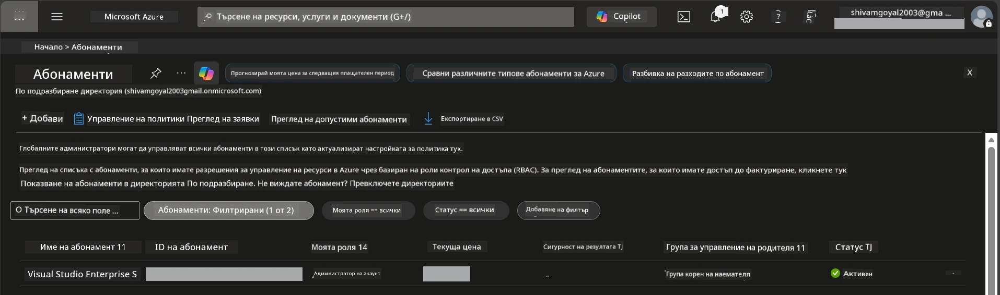

# Модул 0 - Предварителни условия

Преди да започнете работилницата, уверете се, че разполагате с необходимите инструменти, достъп и готова среда. Следвайте всяка стъпка по-долу - не прескачайте напред.

---

## 1. Акаунт и абонамент в Azure

### 1.1 Създайте или потвърдете своя Azure абонамент

1. Отворете браузър и посетете [https://azure.microsoft.com/free/](https://azure.microsoft.com/free/).
2. Ако нямате Azure акаунт, кликнете **Започнете безплатно** и следвайте процеса на регистрация. Ще ви трябва Microsoft акаунт (или създайте такъв) и кредитна карта за потвърждение на самоличността.
3. Ако вече имате акаунт, влезте в [https://portal.azure.com](https://portal.azure.com).
4. В портала кликнете върху плочката **Абонаменти** в лявото меню (или потърсете "Абонаменти" в горната лента за търсене).
5. Потвърдете, че виждате поне един **Активен** абонамент. Запишете **Идентификатора на абонамента** - ще ви трябва по-късно.



### 1.2 Разберете необходимите RBAC роли

Разгръщането на [Hosted Agent](https://learn.microsoft.com/azure/foundry/agents/concepts/hosted-agents) изисква разрешения за **data action**, които стандартните роли на Azure `Owner` и `Contributor` **не** включват. Ще ви трябва една от тези [комбинации от роли](https://learn.microsoft.com/azure/foundry/concepts/rbac-foundry#built-in-roles):

| Сценарий | Изисквани роли | Къде да ги зададете |
|----------|----------------|---------------------|
| Създаване на нов Foundry проект | **Azure AI Owner** върху Foundry ресурс | Foundry ресурс в Azure портала |
| Разгръщане на съществуващ проект (нови ресурси) | **Azure AI Owner** + **Contributor** върху абонамента | Абонамент + Foundry ресурс |
| Разгръщане на напълно конфигуриран проект | **Reader** върху акаунта + **Azure AI User** върху проекта | Акаунт + Проект в Azure портала |

> **Ключов момент:** Ролите `Owner` и `Contributor` в Azure покриват само *управленски* разрешения (операции ARM). За *data actions* като `agents/write`, които са необходими за създаване и разгръщане на агенти, ви трябва [**Azure AI User**](https://learn.microsoft.com/azure/foundry/concepts/rbac-foundry#built-in-roles) (или по-висока) роля. Ще зададете тези роли в [Модул 2](02-create-foundry-project.md).

---

## 2. Инсталирайте локални инструменти

Инсталирайте всеки от инструментите по-долу. След инсталация, потвърдете, че работи, като изпълните проверяващите команди.

### 2.1 Visual Studio Code

1. Отидете на [https://code.visualstudio.com/](https://code.visualstudio.com/).
2. Изтеглете инсталатора за вашата операционна система (Windows/macOS/Linux).
3. Стартирайте инсталатора с подразбиращите се настройки.
4. Отворете VS Code, за да се уверите, че се стартира.

### 2.2 Python 3.10+

1. Отидете на [https://www.python.org/downloads/](https://www.python.org/downloads/).
2. Изтеглете Python версия 3.10 или по-нова (препоръчва се 3.12+).
3. **Windows:** По време на инсталацията отметнете **"Add Python to PATH"** на първия екран.
4. Отворете терминал и проверете:

   ```powershell
   python --version
   ```

   Очакван резултат: `Python 3.10.x` или по-нова версия.

### 2.3 Azure CLI

1. Отидете на [https://learn.microsoft.com/cli/azure/install-azure-cli](https://learn.microsoft.com/cli/azure/install-azure-cli).
2. Следвайте инструкциите за инсталация според вашата ОС.
3. Проверете:

   ```powershell
   az --version
   ```

   Очакван резултат: `azure-cli 2.80.0` или по-нова версия.

4. Влезте в акаунта:

   ```powershell
   az login
   ```

### 2.4 Azure Developer CLI (azd)

1. Отидете на [https://learn.microsoft.com/azure/developer/azure-developer-cli/install-azd](https://learn.microsoft.com/azure/developer/azure-developer-cli/install-azd).
2. Следвайте инструкциите за инсталация за вашата ОС. За Windows:

   ```powershell
   winget install microsoft.azd
   ```

3. Проверете:

   ```powershell
   azd version
   ```

   Очакван резултат: `azd version 1.x.x` или по-нова версия.

4. Влезте в акаунта:

   ```powershell
   azd auth login
   ```

### 2.5 Docker Desktop (по избор)

Docker е необходим само ако искате да изграждате и тествате контейнерни образи локално преди разгръщане. Разширението Foundry автоматично управлява изграждането на контейнери по време на разгръщането.

1. Отидете на [https://docs.docker.com/get-docker/](https://docs.docker.com/get-docker/).
2. Изтеглете и инсталирайте Docker Desktop за вашата ОС.
3. **Windows:** Уверете се, че по време на инсталацията е избран бекенд WSL 2.
4. Стартирайте Docker Desktop и изчакайте иконата в системния трей да показва **„Docker Desktop е активен“**.
5. Отворете терминал и проверете:

   ```powershell
   docker info
   ```

   Това трябва да изведе информация за Docker без грешки. Ако видите съобщение `Cannot connect to the Docker daemon`, изчакайте още няколко секунди докато Docker се стартира напълно.

---

## 3. Инсталирайте разширенията за VS Code

Необходими са ви три разширения. Инсталирайте ги **преди** началото на работилницата.

### 3.1 Microsoft Foundry за VS Code

1. Отворете VS Code.
2. Натиснете `Ctrl+Shift+X`, за да отворите панела с разширения.
3. В полето за търсене напишете **"Microsoft Foundry"**.
4. Намерете **Microsoft Foundry for Visual Studio Code** (издател: Microsoft, ID: `TeamsDevApp.vscode-ai-foundry`).
5. Кликнете **Инсталирай**.
6. След инсталацията би трябвало да видите иконата на **Microsoft Foundry** в лентата с активност (лявата странична лента).

### 3.2 Foundry Toolkit

1. В панела с разширения (`Ctrl+Shift+X`) потърсете **"Foundry Toolkit"**.
2. Намерете **Foundry Toolkit** (издател: Microsoft, ID: `ms-windows-ai-studio.windows-ai-studio`).
3. Кликнете **Инсталирай**.
4. Иконата на **Foundry Toolkit** трябва да се появи в лентата с активност.

### 3.3 Python

1. В панела с разширения потърсете **"Python"**.
2. Намерете **Python** (издател: Microsoft, ID: `ms-python.python`).
3. Кликнете **Инсталирай**.

---

## 4. Вход в Azure през VS Code

[Microsoft Agent Framework](https://learn.microsoft.com/agent-framework/overview/) използва [`DefaultAzureCredential`](https://learn.microsoft.com/azure/developer/python/sdk/authentication/credential-chains#defaultazurecredential-overview) за удостоверяване. Трябва да сте влезли в Azure в VS Code.

### 4.1 Вход през VS Code

1. Погледнете в долния ляв ъгъл на VS Code и кликнете върху иконата **Акаунти** (силует на човек).
2. Кликнете **Вход за ползване на Microsoft Foundry** (или **Вход с Azure**).
3. Ще се отвори прозорец на браузъра - влезте с Azure акаунта, който има достъп до вашия абонамент.
4. Върнете се в VS Code. Трябва да видите името на акаунта си в долния ляв ъгъл.

### 4.2 (По избор) Вход чрез Azure CLI

Ако сте инсталирали Azure CLI и предпочитате удостоверяване чрез CLI:

```powershell
az login
```

Това ще отвори браузър за вход. След като влезете, задайте правилния абонамент:

```powershell
az account set --subscription "<your-subscription-id>"
```

Проверете:

```powershell
az account show --query "{name:name, id:id, state:state}" --output table
```

Трябва да видите името, ID и статус = `Enabled` на абонамента си.

### 4.3 (Алтернативно) Аутентикация с Service principal

За CI/CD или споделени среди задайте съответните променливи на средата:

```powershell
$env:AZURE_TENANT_ID = "<your-tenant-id>"
$env:AZURE_CLIENT_ID = "<your-client-id>"
$env:AZURE_CLIENT_SECRET = "<your-client-secret>"
```

---

## 5. Ограничения в предварителния преглед

Преди да продължите, имайте предвид текущите ограничения:

- [**Hosted Agents**](https://learn.microsoft.com/azure/foundry/agents/concepts/hosted-agents) в момента са в **публичен предварителен преглед** - не се препоръчват за продукционни натоварвания.
- **Поддържаните региони са ограничени** - проверете [достъпността на регионите](https://learn.microsoft.com/azure/foundry/agents/concepts/hosted-agents#region-availability) преди да създавате ресурси. Ако изберете регион, който не се поддържа, разгръщането ще се провали.
- Пакетът `azure-ai-agentserver-agentframework` е в предварителна версия (`1.0.0b16`) - API-тата може да се променят.
- Ограничения за мащабиране: hosted agents поддържат 0-5 копия (включително скалиране до нула).

---

## 6. Контролен списък преди стартиране

Преминете през всеки елемент по-долу. Ако някоя стъпка се провали, върнете се и я поправете преди да продължите.

- [ ] VS Code се отваря без грешки
- [ ] Python 3.10+ е в PATH (`python --version` показва `3.10.x` или по-нова версия)
- [ ] Azure CLI е инсталиран (`az --version` показва `2.80.0` или по-нова версия)
- [ ] Azure Developer CLI е инсталиран (`azd version` показва информация за версията)
- [ ] Разширението Microsoft Foundry е инсталирано (иконата се вижда в лентата с активност)
- [ ] Разширението Foundry Toolkit е инсталирано (иконата се вижда в лентата с активност)
- [ ] Разширението Python е инсталирано
- [ ] Вие сте влезли в Azure във VS Code (проверете иконата Accounts, долен ляв ъгъл)
- [ ] `az account show` показва вашия абонамент
- [ ] (По избор) Docker Desktop работи (`docker info` показва системна информация без грешки)

### Контролна точка

Отворете лентата с активност на VS Code и потвърдете, че виждате както **Foundry Toolkit**, така и **Microsoft Foundry** изгледи в страничната лента. Кликнете върху всяка, за да проверите дали се зареждат без грешки.

---

**Следващо:** [01 - Инсталиране на Foundry Toolkit & Foundry Extension →](01-install-foundry-toolkit.md)

---

<!-- CO-OP TRANSLATOR DISCLAIMER START -->
**Отказ от отговорност**:  
Този документ е преведен с помощта на AI преводаческа услуга [Co-op Translator](https://github.com/Azure/co-op-translator). Въпреки че се стремим към точност, моля, имайте предвид, че автоматизираните преводи могат да съдържат грешки или неточности. Оригиналният документ на неговия роден език трябва да се счита за авторитетен източник. За критична информация се препоръчва професионален човешки превод. Не носим отговорност за никакви недоразумения или неправилни тълкувания, възникнали от използването на този превод.
<!-- CO-OP TRANSLATOR DISCLAIMER END -->