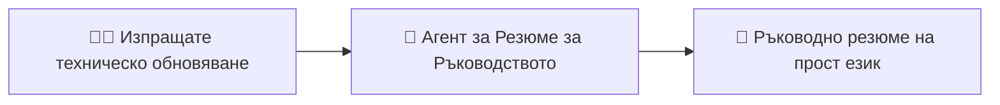

# Модул 0 - Въведение

⏱️ ~10 мин

> [!WARNING]
> **Преглед и ограничения:** [Хоствани агенти](https://learn.microsoft.com/azure/foundry/agents/concepts/hosted-agents) в момента са в **публичен преглед** - не са препоръчителни за продукционни натоварвания. Внимавайте със следното:
> - **Поддържаните региони са ограничени** - проверете [наличност на региони](https://learn.microsoft.com/azure/foundry/agents/concepts/hosted-agents#region-availability), преди да създавате ресурси. Ако изберете неподдържан регион, разгръщането ще се провали.
> - Пакетът `azure-ai-agentserver-agentframework` е предварително издание - API може да се променят между версиите.
> - Ограничения в мащабирането: хостваните агенти поддържат 0–5 реплики (включително мащабиране до нула).
> - Някои функции, показани в този работен семинар, може да се променят с развитието на услугата към GA.

## Какво ще изградите

В този работен семинар ще изградите агент "**Обясни ми като на ръководител**" - хостван AI агент, който взима сложни технически актуализации и ги пренаписва като прости резюмета на разбираем английски, подходящи за ръководене.

```mermaid
flowchart LR
    A["🧑‍💻 Изпращате техническо обновяване"] --> B["🤖 Агент за Резюме за Ръководството"]
    B --> C["📝 Ръководно резюме на прост език"]
```

**Агентът използва:**
- **Microsoft Agent Framework** - за логика и структура на агента
- **Foundry Toolkit за VS Code** - за скелетиране, локално тестване и разгръщане
- **AI модел** (напр., `gpt-4.1-mini/gpt-5-mini`) - за генериране на резюметата

В края на тази лаборатория ще разполагате с работещ агент, който можете да тествате локално чрез Agent Inspector и по избор да разположите в облака.

---

## Какво са хоствани агенти?

**Хостван агент** е AI агент, който работи като управлявана услуга в Microsoft Foundry. Вместо да управлявате собствената инфраструктура, пакетите кода на вашия агент в контейнер, а Foundry управлява мащабирането, хостването и експонирането му чрез стандартен HTTP крайна точка.

| Концепция | Какво означава |
|---------|--------------|
| **Агент** | Вашият Python код, който получава съобщение от потребител, извиква AI модел и връща структуриран отговор |
| **Хостван** | Foundry изпълнява вашия контейнер вместо вас – без виртуални машини, без Kubernetes, без нужда от управление на инфраструктура |
| **Протокол за отговори** | Стандартен HTTP API (`POST /responses`), който всеки клиент може да използва за взаимодействие с вашия агент |
| **Agent Inspector** | Локален интерфейс за тестване (вграден във Foundry Toolkit), който позволява да чатите с агента преди разгръщане |

В този работен семинар ще преминете от нула до напълно хостван агент - или можете да спрете на локалното тестване, ако предпочитате.

---

## Изберете своя път

> ⚠️ **Изберете един път преди да продължите.** Вашият избор определя кои инструменти да инсталирате и кои модули са приложими. Можете по-късно да превключите от Път Б → Път А ако получите абонамент.

<strong>🅰️ Път А - Облак на Azure (изисква абонамент за Azure)</strong>

| | Детайли |
|---|---|
| **За кого е?** | Имаме активен абонамент за Azure и можем да създаваме Foundry ресурси |
| **Модел** | Azure OpenAI чрез Foundry (напр., `gpt-4.1-mini/gpt-5-mini`) |
| **Обхванати модули** | Всички модули (00–07) |
| **Разгръщане в облака?** | ✅ Да - пълно разгръщане от край до край |

<strong>🅱️ Път Б - Локално / безплатен план (не е нужен абонамент за Azure)</strong>

| | Детайли |
|---|---|
| **За кого е?** | MVP-та, студенти или всеки без достъп до Azure |
| **Модел** | **Foundry Local** (безплатен, работи на вашето устройство) |
| **Обхванати модули** | Модули 00–04 (без разгръщане и проверка в облака) |
| **Разгръщане в облака?** | ❌ Не - само локално тестване чрез Agent Inspector |

---

## Всички пътища: Необходими инструменти

Инсталирайте всеки инструмент по-долу. След инсталиране, проверете работата му като изпълните командата за проверка.

| # | Инструмент | Версия | Инсталиране | Проверка (Очакван изход) |
|---|------|---------|---------|---------------------------|
| 1 | **Visual Studio Code** | Последна | [code.visualstudio.com](https://code.visualstudio.com/) | Отваря се без грешки |
| 2 | **Python** | 3.12 или по-нова | [python.org/downloads](https://www.python.org/downloads/) | `python --version` $\rightarrow$ `Python 3.12.x` |
| 3 | **Foundry Toolkit за VS Code** | Последна | Extension ID: `ms-windows-ai-studio.windows-ai-studio` | Икона Foundry в лентата с дейности |
| 4 | **Python разширение за VS Code** | Последна | Extension ID: `ms-python.python` | Инсталирано в панела Разширения |

> [!TIP]
> **Съвети за инсталиране:**
> - **ПЪТЯТ на Python (Windows):** Винаги отметнете **"Add Python to PATH"** в първия екран на инсталатора на Python. Без това `python` няма да бъде разпознат в терминала ви.
> - **Множество версии на Python:** Ако имате инсталирани Python 3.10 и 3.12, използвайте `python3.12 -m venv .venv`, за да гарантирате, че правилната версия се ползва за виртуалната среда.
> - **Docker WSL 2 (Windows):** При инсталация на Docker Desktop, уверете се, че е избран **WSL 2 backend**. Docker с Hyper-V е по-бавен и може да причини проблеми с изграждането на Foundry контейнери.
> - **Docker не се стартира?** Изчакайте 30–60 секунди след стартирането на Docker Desktop. Изпълнете `docker info` - ако виждате "Cannot connect to the Docker daemon," Docker все още се инициализира.
> - **Разширенията на VS Code не се зареждат?** След инсталиране на разширенията, презаредете прозореца: `Ctrl+Shift+P` → `Developer: Reload Window`.

> **Потребители на Windows:** Отметнете **"Add Python to PATH"** при инсталацията на Python.

**Следващо:** [01 - Настройка →](01-setup.md)

---

<!-- CO-OP TRANSLATOR DISCLAIMER START -->
**Отказ от отговорност**:
Този документ е преведен с помощта на AI преводачески услуга [Co-op Translator](https://github.com/Azure/co-op-translator). Въпреки че се стремим към точност, моля имайте предвид, че автоматизираните преводи могат да съдържат грешки или неточности. Оригиналният документ на неговия роден език трябва да се счита за авторитетен източник. За критична информация се препоръчва професионален човешки превод. Ние не носим отговорност за каквито и да е недоразумения или неправилни тълкувания, произтичащи от използването на този превод.
<!-- CO-OP TRANSLATOR DISCLAIMER END -->