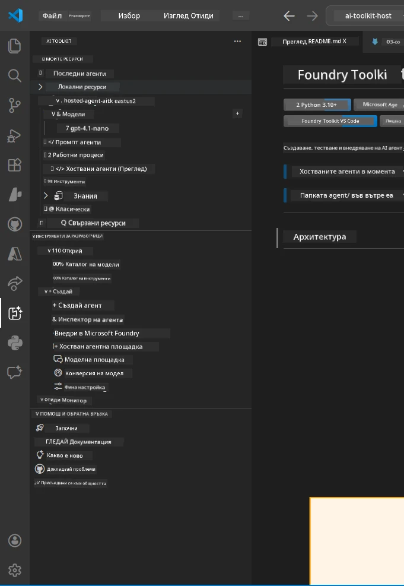
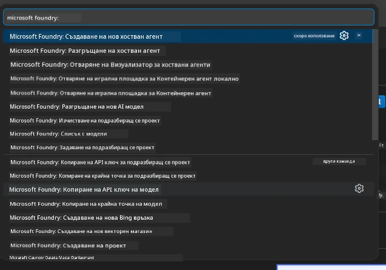

# Module 1 - Инсталиране на Foundry Toolkit и Foundry Extension

Този модул ви превежда през инсталирането и проверката на двата ключови разширения за VS Code за този уъркшоп. Ако вече сте ги инсталирали по време на [Module 0](00-prerequisites.md), използвайте този модул, за да проверите дали работят правилно.

---

## Стъпка 1: Инсталиране на Microsoft Foundry Extension

Разширението **Microsoft Foundry for VS Code** е основният ви инструмент за създаване на Foundry проекти, разгръщане на модели, изграждане на хоствани агенти и директно разгръщане от VS Code.

1. Отворете VS Code.
2. Натиснете `Ctrl+Shift+X`, за да отворите панела **Extensions**.
3. В полето за търсене в горната част въведете: **Microsoft Foundry**
4. Потърсете резултат със заглавие **Microsoft Foundry for Visual Studio Code**.
   - Издател: **Microsoft**
   - Extension ID: `TeamsDevApp.vscode-ai-foundry`
5. Кликнете бутона **Install**.
6. Изчакайте инсталацията да завърши (ще видите малък индикатор за прогрес).
7. След инсталацията погледнете **Activity Bar** (вертикалната икона лента вляво на VS Code). Трябва да видите нова икона **Microsoft Foundry** (изглежда като диамант/AI икона).
8. Кликнете на иконата **Microsoft Foundry**, за да отворите страничния й изглед. Трябва да видите секции за:
   - **Resources** (или Проекти)
   - **Agents**
   - **Models**

> **Ако иконата не се появява:** Опитайте да презаредите VS Code (`Ctrl+Shift+P` → `Developer: Reload Window`).

---

## Стъпка 2: Инсталиране на Foundry Toolkit Extension

Разширението **Foundry Toolkit** предоставя [**Agent Inspector**](https://learn.microsoft.com/azure/foundry/agents/how-to/vs-code-agents-workflow-pro-code) - визуален интерфейс за локално тестване и отстраняване на грешки на агенти - плюс playground, управление на модели и инструменти за оценка.

1. В панела Extensions (`Ctrl+Shift+X`), изчистете полето за търсене и въведете: **Foundry Toolkit**
2. Намерете **Foundry Toolkit** в резултатите.
   - Издател: **Microsoft**
   - Extension ID: `ms-windows-ai-studio.windows-ai-studio`
3. Кликнете **Install**.
4. След инсталация ще се появи иконата на **Foundry Toolkit** в Activity Bar (изглежда като робот/блясък).
5. Кликнете на иконата **Foundry Toolkit**, за да отворите страничния изглед. Трябва да видите началния екран на Foundry Toolkit с опции за:
   - **Models**
   - **Playground**
   - **Agents**

---

## Стъпка 3: Проверете дали и двете разширения работят

### 3.1 Проверка на Microsoft Foundry Extension

1. Кликнете върху иконата **Microsoft Foundry** в Activity Bar.
2. Ако сте влезли в Azure (от Module 0), трябва да видите проектите си под **Resources**.
3. Ако бъдете поканени за вход, кликнете **Sign in** и следвайте потока за автентикация.
4. Потвърдете, че виждате страничния панел без грешки.

### 3.2 Проверка на Foundry Toolkit Extension

1. Кликнете върху иконата **Foundry Toolkit** в Activity Bar.
2. Потвърдете, че началният изглед или главният панел се зареждат без грешки.
3. Все още не е необходимо да конфигурирате нищо - ще използваме Agent Inspector в [Module 5](05-test-locally.md).

### 3.3 Проверка чрез Command Palette

1. Натиснете `Ctrl+Shift+P`, за да отворите Command Palette.
2. Въведете **"Microsoft Foundry"** - трябва да видите команди като:
   - `Microsoft Foundry: Create a New Hosted Agent`
   - `Microsoft Foundry: Deploy Hosted Agent`
   - `Microsoft Foundry: Open Model Catalog`
3. Натиснете `Escape`, за да затворите Command Palette.
4. Отворете Command Palette отново и въведете **"Foundry Toolkit"** - трябва да видите команди като:
   - `Foundry Toolkit: Open Agent Inspector`

> Ако не виждате тези команди, разширенията може да не са инсталирани правилно. Опитайте да ги деинсталирате и инсталирате отново.

---

## Какво правят тези разширения в този уъркшоп

| Разширение | Какво прави | Кога ще го използвате |
|-----------|-------------|----------------------|
| **Microsoft Foundry for VS Code** | Създава Foundry проекти, разгръща модели, **изгражда [хоствани агенти](https://learn.microsoft.com/azure/foundry/agents/concepts/hosted-agents)** (автоматично генерира `agent.yaml`, `main.py`, `Dockerfile`, `requirements.txt`), разгръща към [Foundry Agent Service](https://learn.microsoft.com/azure/foundry/agents/overview) | Модули 2, 3, 6, 7 |
| **Foundry Toolkit** | Agent Inspector за локално тестване/отстраняване на грешки, playground UI, управление на модели | Модули 5, 7 |

> **Foundry разширението е най-важният инструмент в този уъркшоп.** То управлява целия жизнен цикъл: изграждане → конфигуриране → разгръщане → проверка. Foundry Toolkit го допълва, като предоставя визуалния Agent Inspector за локално тестване.

---

### Контролна точка

- [ ] Иконата на Microsoft Foundry е видима в Activity Bar
- [ ] Кликването върху нея отваря страничния панел без грешки
- [ ] Иконата на Foundry Toolkit е видима в Activity Bar
- [ ] Кликването върху нея отваря страничния панел без грешки
- [ ] `Ctrl+Shift+P` → въвеждане на "Microsoft Foundry" показва наличните команди
- [ ] `Ctrl+Shift+P` → въвеждане на "Foundry Toolkit" показва наличните команди

---

**Предишен:** [00 - Prerequisites](00-prerequisites.md) · **Следващ:** [02 - Create Foundry Project →](02-create-foundry-project.md)

---

<!-- CO-OP TRANSLATOR DISCLAIMER START -->
**Отказ от отговорност**:  
Този документ е преведен с помощта на AI преводаческа услуга [Co-op Translator](https://github.com/Azure/co-op-translator). Въпреки че се стремим към точност, моля, имайте предвид, че автоматизираните преводи може да съдържат грешки или неточности. Оригиналният документ на неговия оригинален език трябва да се счита за авторитетен източник. За критична информация се препоръчва професионален човешки превод. Ние не носим отговорност за каквито и да било недоразумения или грешни тълкувания, възникнали от използването на този превод.
<!-- CO-OP TRANSLATOR DISCLAIMER END -->