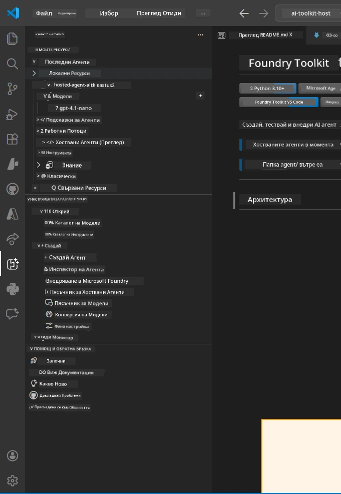
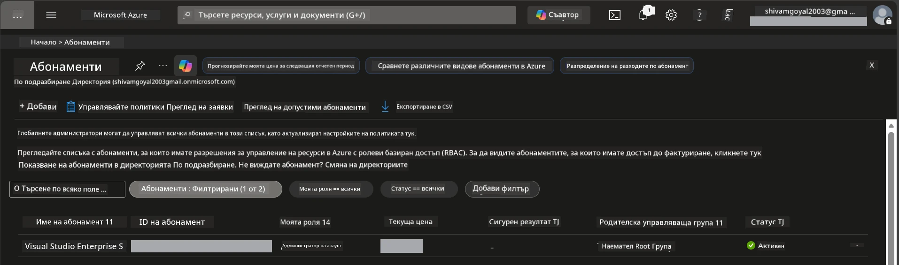
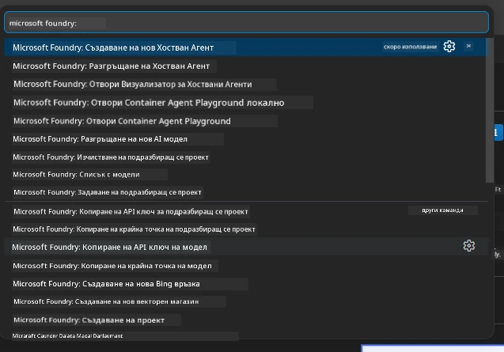
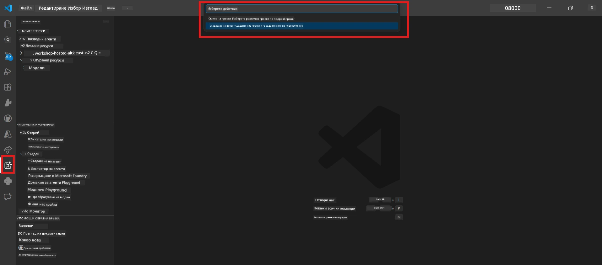
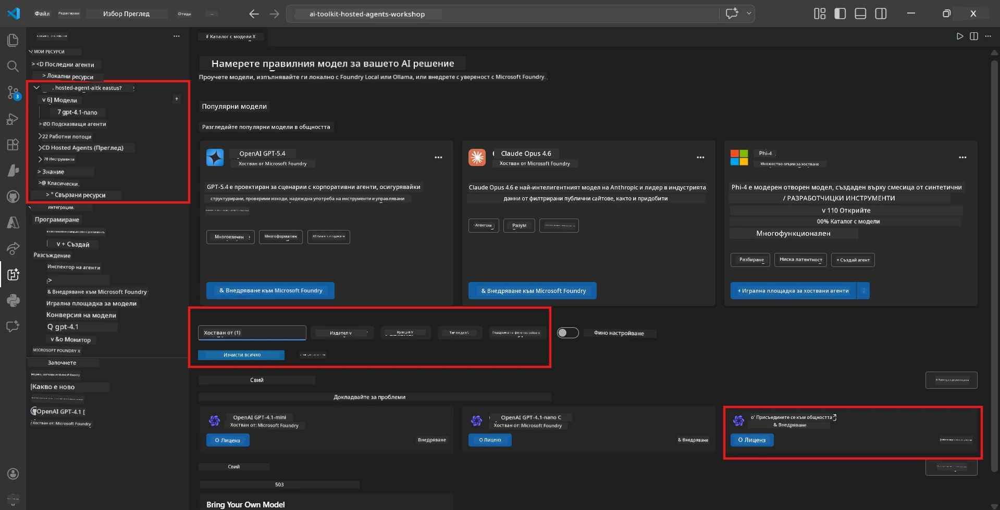
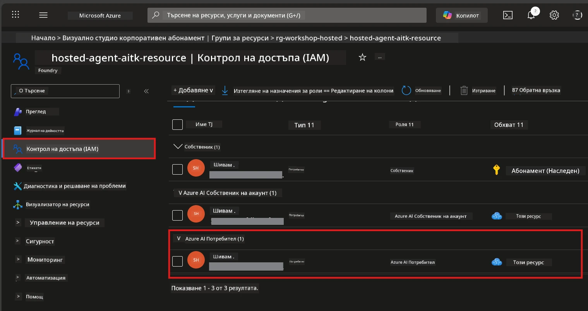

# Настройка: Разширение, Проект и Модел

⏱️ ~15 мин

В този модул инсталирате и проверявате разширението Foundry Toolkit, създавате (или се свързвате с) Foundry проект и разгръщате модел, който вашият агент ще използва.

## Стъпка 1: Инсталирайте Foundry Toolkit

**Foundry Toolkit за VS Code** е основното разширение за този уъркшоп. То предоставя създаване на проекти, разгръщане на модел, създаване на агенти, локално тестване (Agent Inspector) и разгръщане в облак - всичко от VS Code.

1. Отворете VS Code и натиснете `Ctrl+Shift+X`, за да отворите панела **Разширения**.
2. Потърсете **Foundry Toolkit**.
3. Инсталирайте **Foundry Toolkit for VS Code** (Издател: Microsoft, ID: `ms-windows-ai-studio.windows-ai-studio`).
4. След инсталацията иконата на **Foundry Toolkit** се появява в лентата с активности (ляво странично меню).

> *Забележка: В по-стари версии на разширението лентата с активности може да показва "AI TOOLKIT". Функционалността е еднаква.*



## Стъпка 2: Настройка според достъпа ви

> **Изберете своя път:** Разгънете секцията по-долу, която съответства на вашата настройка. Трябва да завършите само **един** път.

<details>
<summary><strong>🅰️ Път A - Облак Azure (изисква Azure абонамент)</strong></summary>

### Azure CLI

1. Инсталирайте от [learn.microsoft.com/cli/azure/install-azure-cli](https://learn.microsoft.com/cli/azure/install-azure-cli).
2. Проверете: `az --version` (очаквайте 2.80.0+).
3. Влезте: `az login`

### Опции за удостоверяване

[Microsoft Agent Framework](https://learn.microsoft.com/agent-framework/overview/) използва [`DefaultAzureCredential`](https://learn.microsoft.com/azure/developer/python/sdk/authentication/credential-chains#defaultazurecredential-overview), който опитва няколко метода за удостоверяване последователно. Изберете този, който пасва на вашата среда:

#### Опция 1: Акаунти във VS Code (препоръчано за уъркшопи)
1. Кликнете върху иконата **Акаунти** (силует на човек) в долния ляв ъгъл на VS Code.
2. Изберете **Влезте, за да ползвате Microsoft Foundry** (или **Влезте с Azure**).
3. Ще се отвори браузър – влезте с Azure акаунт с достъп до абонамента.
4. Върнете се във VS Code. Трябва да видите името на акаунта в долния ляв ъгъл.

#### Опция 2: Azure CLI
```bash
az login
az account set --subscription "<your-subscription-id>"
```

#### Опция 3: Service Principal (за корпоративни/CI среди)
За строго контролирани среди или CI/CD процеси задайте тези променливи на средата в `.env` файла си:
```env
AZURE_TENANT_ID=<your-tenant-id>
AZURE_CLIENT_ID=<your-client-id>
AZURE_CLIENT_SECRET=<your-client-secret>
```

> **Как работи `DefaultAzureCredential`:** Първо проверява променливите на средата, после управлявана идентичност, след това влизане през VS Code, след това Azure CLI – и използва първия успешен метод. Вижте [документация за веригата удостоверяване](https://learn.microsoft.com/azure/developer/python/sdk/authentication/credential-chains#defaultazurecredential-overview).

### Azure Developer CLI (azd)

1. Инсталирайте: `winget install microsoft.azd` (Windows) или вижте [инструкция за инсталация](https://learn.microsoft.com/azure/developer/azure-developer-cli/install-azd).
2. Проверете: `azd version`
3. Влезте: `azd auth login`

### Docker Desktop (по избор)

Docker е нужна само ако искате да изграждате контейнери локално. Разширението Foundry се грижи за изграждането автоматично по време на разгръщането.

1. Инсталирайте от [docs.docker.com/get-docker](https://docs.docker.com/get-docker/).
2. Проверете: `docker info`

### Абонамент в Azure и RBAC

1. Влезте в [portal.azure.com](https://portal.azure.com).
2. Отидете на **Subscriptions** и проверете, че поне един е **Активен**.
3. Запишете своя **Subscription ID** – ще ви трябва в Модул 01.



#### Таблица с RBAC сценарии

Разгръщане на [Hosted Agent](https://learn.microsoft.com/azure/foundry/agents/concepts/hosted-agents) изисква права за **data action**, които стандартните роли Azure `Owner` и `Contributor` НЕ включват. Използвайте таблицата по-долу, за да определите нужните роли:

| Сценарий | Нужни роли | Къде да ги зададете |
|----------|------------|---------------------|
| Създаване на нов Foundry проект | **Azure AI Owner** на Foundry ресурс | Foundry ресурс в Azure Portal |
| Разгръщане в съществуващ проект (нови ресурси) | **Azure AI Owner** + **Contributor** на абонамент | Абонамент + Foundry ресурс |
| Разгръщане в напълно конфигуриран проект | **Reader** на акаунта + **Azure AI User** на проекта | Акаунт + Проект в Azure Portal |
| Само локално тестване (без разгръщане) | **Azure AI User** на проекта | Проект в Azure Portal |

> **Ключова точка:** Ролите Azure `Owner` и `Contributor` покриват само *управленски* права (ARM операции). Трябва ви [**Azure AI User**](https://learn.microsoft.com/azure/foundry/concepts/rbac-foundry#built-in-roles) (или по-висока) за *data actions* като `agents/write`, необходими за създаване и разгръщане на агенти.

## Свържете се или създайте Foundry проект



1. Натиснете `Ctrl+Shift+P` → напишете **Foundry Toolkit: Create Project** → изберете го.
2. Изберете своя **Azure абонамент** от падащото меню.
3. Изберете или създайте **resource group** (например, `rg-hosted-agents-workshop`).
4. Изберете **регион**, който поддържа hosted агенти: `East US`, `West US 2` или `Sweden Central`. Вижте [наличност на региони](https://learn.microsoft.com/azure/foundry/agents/concepts/hosted-agents#region-availability).
5. Въведете име на проекта (например `workshop-agents`).
6. Изчакайте 2–5 минути за осигуряване. В VS Code се показва известие за напредъка.
7. Когато приключи, проектът ви се показва в страничната лента на **Foundry Toolkit** под **MY RESOURCES**.



## Разгръщане на модел & задаване на RBAC

Вашият hosted агент се нуждае от AI модел за генериране на отговори.

#### Матрица за избор на модел
В зависимост от вашите нужди, можете да избирате от различни нива модели:

| Модел | Най-подходящ за | Цена | Бележки |
|-------|-----------------|------|---------|
| `gpt-4.1` | Висококачествени, нюансирани отговори | По-висока | Най-добри резултати, препоръчан за финално тестване |
| `gpt-4.1-mini/gpt-5-mini` | Бързи итерации, по-ниска цена | По-ниска | Добър за разработка на уъркшоп и бързи тестове |
| `gpt-4.1-nano` | Леки задачи | Най-ниска | Най-ефективен от към цена, но с по-прости отговори |

1. Натиснете `Ctrl+Shift+P` → **Foundry Toolkit: Open Model Catalog** (или кликнете **Model Catalog** в страничната лента под DEVELOPER TOOLS → Discover).
2. Потърсете **gpt-4.1** в каталога.
3. Намерете **OpenAI GPT-4.1-mini** (или `gpt-5-mini` за по-добро качество) и кликнете **Deploy**.



4. В конфигурацията за разгръщане:
   - **Име на разгръщане:** Оставете по подразбиране или въведете персонализирано име. **Запомнете това име.**
   - **Цел:** Изберете **Deploy to Foundry Toolkit** → изберете своя проект.
5. Кликнете **Deploy** и изчакайте 1–3 минути.

> **Препоръка:** Използвайте `gpt-4.1-mini/gpt-5-mini` за уъркшопа - бързо, достъпно и с добри резултати.

### Запишете стойностите си

След разгръщането, запишете тези две стойности (ще ви трябват в Модул 03):

| Стойност | Къде да я намерите |
|---------|---------------------|
| **Крайна точка на проекта** | Кликнете върху проекта в страничната лента → детайлен изглед показва URL (например `https://<account>.services.ai.azure.com/api/projects/<project>`) |
| **Име на разгръщане на модел** | Разгънете проекта → **Models** → името до разположения модел (например `gpt-4.1-mini/gpt-5-mini`) |

### Задайте RBAC роля

> ⚠️ **Това е най-често пропусканата стъпка.** Без правилната роля, разгръщането в Модул 05 ще се провали.

#### Коя роля ми трябва?
В зависимост от вашия сценарий, са ви необходими следните комбинации от роли:

| Сценарий | Нужни роли | Къде да ги зададете |
|----------|------------|---------------------|
| Създаване на нов Foundry проект | **Azure AI Owner** на Foundry ресурс | Foundry ресурс в Azure Portal |
| Разгръщане в съществуващ проект (нови ресурси) | **Azure AI Owner** + **Contributor** на абонамент | Абонамент + Foundry ресурс |
| Разгръщане в напълно конфигуриран проект | **Reader** на акаунта + **Azure AI User** на проекта | Акаунт + Проект в Azure Portal |

**Ключова точка:** Ролите Azure `Owner` и `Contributor` покриват само *управленски* права. Нужна ви е ролята **Azure AI User** (или по-висока) за *data actions* като `agents/write`, необходими за създаване и разгръщане на агенти.

1. Отворете [portal.azure.com](https://portal.azure.com).
2. Потърсете името на вашия **Foundry проект** → кликнете резултат със тип **"Foundry Toolkit project"** (НЕ родителския акаунт).
3. Кликнете **Access control (IAM)** в лявото меню.
4. Кликнете **+ Add** → **Add role assignment**.
5. **В раздел Роля:** Потърсете **Azure AI User**, изберете я и кликнете **Next**.
6. **В раздел Членове:** Изберете **User, group, or service principal** → кликнете **+ Select members** → намерете и изберете себе си → кликнете **Select**.
7. Кликнете **Review + assign** → пак **Review + assign**.
8. **Изчакайте 1–2 минути** за разпространение.

> **Защо тази роля?** Ролите Azure `Owner`/`Contributor` дават само управленски права. Ролята **Azure AI User** дава data action `agents/write`, нужна за създаване и разгръщане на агенти. Вижте [Foundry RBAC документация](https://learn.microsoft.com/azure/foundry/concepts/rbac-foundry#built-in-roles).



</details>

<details>
<summary><strong>🅱️ Път B - Локално / безплатен план (не се изисква Azure абонамент)</strong></summary>

### Foundry Local

Foundry Local ви позволява да пускате AI модели на вашия компютър – не е необходим облачен акаунт. Можете да достъпвате моделите на Foundry Local чрез Foundry Toolkit, директно от каталога на моделите, както следва:

1. Отидете на разширението Foundry Toolkit.
2. В навигацията на Foundry Toolkit отидете в **Developer Tools** > и изберете **Model Catalog**.
3. В новия прозорец изберете **local** от навигационната лента.
4. Превъртете надолу до **Phi 4 Mini,** и кликнете бутона **добави**; ще се появи изскачащ прозорец, указващ че моделът се изтегля.
5. След като моделът е изтеглен, можете да продължите към следващата стъпка.

</details>

### ✅ Контролен списък


- [ ] `Ctrl+Shift+P` → "Foundry Toolkit" показва налични команди
- [ ] Разширението Foundry Toolkit е инсталирано и страничната лента се зарежда без грешки
- [ ] VS Code се отваря и работи правилно
- [ ] `python --version` показва 3.10+
- [ ] Иконата на Foundry Toolkit е видима в лентата с активности на VS Code
- [ ] **Път A:** `az login` преминава успешно, абонаментът е активен
- [ ] **Път B:** Foundry Local работи (`foundry local status`)
- [ ] **Път A:** Foundry проектът е видим в страничната лента, моделът е разположен, зададена е роля Azure AI User
- [ ] **Път B:** Foundry Local работи с модел
- [ ] Записали сте вашата **крайна точка** и **име на разгръщане на модел**


**Предишна:** [00 - Изисквания](00-prerequisites.md) · **Следваща:** [02 - Създаване на Hosted Agent →](02-create-hosted-agent.md)

---

<!-- CO-OP TRANSLATOR DISCLAIMER START -->
**Отказ от отговорност**:
Този документ е преведен с помощта на AI преводачески услуга [Co-op Translator](https://github.com/Azure/co-op-translator). Въпреки че се стремим към точност, моля имайте предвид, че автоматизираните преводи могат да съдържат грешки или неточности. Оригиналният документ на неговия роден език трябва да се счита за авторитетен източник. За критична информация се препоръчва професионален човешки превод. Ние не носим отговорност за каквито и да е недоразумения или неправилни тълкувания, произтичащи от използването на този превод.
<!-- CO-OP TRANSLATOR DISCLAIMER END -->