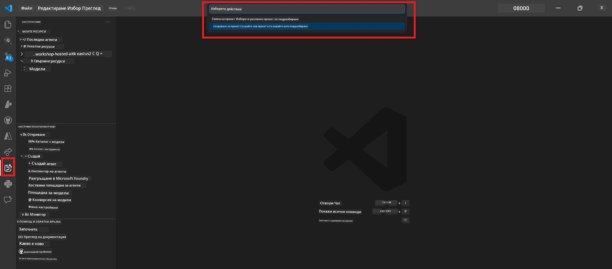
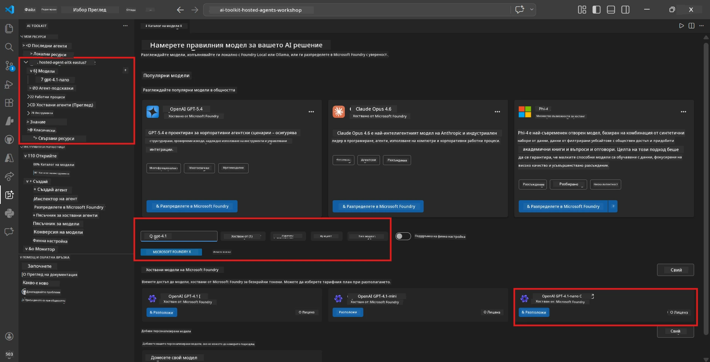
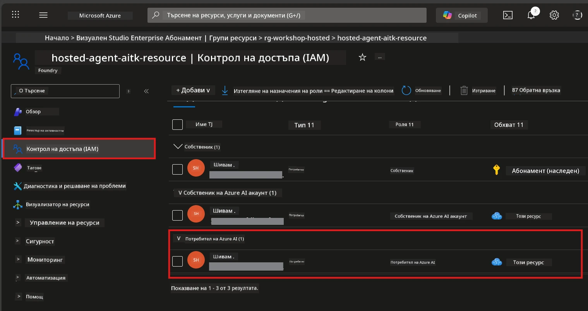

# Модул 2 - Създаване на Foundry проект и разгръщане на модел

В този модул ще създадете (или изберете) Microsoft Foundry проект и ще разположите модел, който вашият агент ще използва. Всеки стъпка е описана изрично - следвайте ги по ред.

> Ако вече имате Foundry проект с разположен модел, преминете към [Модул 3](03-create-hosted-agent.md).

---

## Стъпка 1: Създаване на Foundry проект от VS Code

Ще използвате Microsoft Foundry разширението, за да създадете проект без да излизате от VS Code.

1. Натиснете `Ctrl+Shift+P`, за да отворите **Command Palette**.
2. Въведете: **Microsoft Foundry: Create Project** и го изберете.
3. Ще се появи падащо меню - изберете своя **Azure абонамент** от списъка.
4. Ще бъдете помолени да изберете или създадете **resource group**:
   - За да създадете нова: въведете име (например `rg-hosted-agents-workshop`) и натиснете Enter.
   - За да използвате съществуваща: изберете я от падащото меню.
5. Изберете **регион**. **Важно:** Изберете регион, който поддържа хоствани агенти. Проверете [наличността на регионите](https://learn.microsoft.com/azure/foundry/agents/concepts/hosted-agents#region-availability) - обичайното са `East US`, `West US 2` или `Sweden Central`.
6. Въведете **име** за Foundry проекта (например `workshop-agents`).
7. Натиснете Enter и изчакайте процеса на предоставяне да завърши.

> **Предоставянето отнема 2-5 минути.** Ще видите известие за прогрес в долния десен ъгъл на VS Code. Не затваряйте VS Code по време на предоставяне.

8. След като завърши, страничният панел на **Microsoft Foundry** ще покаже новия проект под **Resources**.
9. Кликнете върху името на проекта, за да го разгънете и потвърдете, че показва секции като **Models + endpoints** и **Agents**.



### Алтернатива: Създаване чрез Foundry портала

Ако предпочитате да използвате браузър:

1. Отворете [https://ai.azure.com](https://ai.azure.com) и се впишете.
2. Кликнете върху **Create project** на началната страница.
3. Въведете име на проект, изберете вашия абонамент, resource group и регион.
4. Кликнете **Create** и изчакайте предоставянето.
5. След като е създаден, върнете се в VS Code - проектът трябва да се появи в страничния панел на Foundry след обновяване (кликнете върху иконата за обновяване).

---

## Стъпка 2: Разгръщане на модел

Вашият [хостиран агент](https://learn.microsoft.com/azure/foundry/agents/concepts/hosted-agents) се нуждае от Azure OpenAI модел за генериране на отговори. Ще [разположите такъв сега](https://learn.microsoft.com/azure/ai-foundry/openai/how-to/create-resource#deploy-a-model).

1. Натиснете `Ctrl+Shift+P`, за да отворите **Command Palette**.
2. Въведете: **Microsoft Foundry: Open [Model Catalog](https://learn.microsoft.com/azure/ai-foundry/openai/concepts/models)** и го изберете.
3. Във VS Code ще се отвори изгледът Model Catalog. Прегледайте или използвайте лентата за търсене, за да намерите **gpt-4.1**.
4. Кликнете върху картата на модела **gpt-4.1** (или `gpt-4.1-mini`, ако предпочитате по-ниска цена).
5. Кликнете върху **Deploy**.


6. В конфигурацията за разгръщане:
   - **Deployment name**: Оставете по подразбиране (напр. `gpt-4.1`) или въведете собствено име. **Запомнете това име** - ще ви е нужно в Модул 4.
   - **Target**: Изберете **Deploy to Microsoft Foundry** и изберете току-що създадения проект.
7. Кликнете **Deploy** и изчакайте разгръщането да завърши (1-3 минути).

### Избор на модел

| Модел | Най-подходящ за | Разходи | Забележки |
|-------|-----------------|---------|-----------|
| `gpt-4.1` | Висококачествени, нюансирани отговори | По-високи | Най-добри резултати, препоръчително за крайно тестване |
| `gpt-4.1-mini` | Бърза итерация, по-ниска цена | По-ниски | Подходящ за разработка и бързо тестване на уъркшопа |
| `gpt-4.1-nano` | Леки задачи | Най-ниски | Най-икономичен, но с по-прости отговори |

> **Препоръка за този уъркшоп:** Използвайте `gpt-4.1-mini` за разработка и тестване. Той е бърз, евтин и дава добри резултати за упражненията.

### Потвърждаване на разгръщането на модела

1. В страничния панел на **Microsoft Foundry** разгънете вашия проект.
2. Проверете под **Models + endpoints** (или подобна секция).
3. Трябва да видите разположения модел (напр. `gpt-4.1-mini`) със статус **Succeeded** или **Active**.
4. Кликнете върху разгръщането на модела, за да видите детайлите.
5. **Запишете** тези две стойности - ще ви трябват в Модул 4:

   | Настройка | Къде да я намерите | Примерна стойност |
   |-----------|--------------------|-------------------|
   | **Project endpoint** | Кликнете върху името на проекта в страничния панел на Foundry. URL адресът на endpoint е показан в изгледа с детайлите. | `https://<account>.services.ai.azure.com/api/projects/<project>` |
   | **Model deployment name** | Името, показано до разположения модел. | `gpt-4.1-mini` |

---

## Стъпка 3: Присвояване на необходими RBAC роли

Това е **най-често пропусканата стъпка**. Без правилните роли, разгръщането в Модул 6 ще се провали със съобщение за липса на разрешения.

### 3.1 Присвояване на ролята Azure AI User на себе си

1. Отворете браузър и отидете на [https://portal.azure.com](https://portal.azure.com).
2. В горната лента за търсене въведете името на вашия **Foundry проект** и кликнете върху него в резултатите.
   - **Важно:** Навигирайте до **ресурса проект** (тип: "Microsoft Foundry project"), **не** до родителския акаунт/хъб ресурс.
3. В лявото меню на проекта кликнете **Access control (IAM)**.
4. Натиснете бутона **+ Add** горе → изберете **Add role assignment**.
5. В таба **Role**, потърсете [**Azure AI User**](https://learn.microsoft.com/azure/foundry/concepts/rbac-foundry#built-in-roles) и го изберете. Кликнете **Next**.
6. В таба **Members**:
   - Изберете **User, group, or service principal**.
   - Кликнете **+ Select members**.
   - Потърсете вашето име или имейл, изберете себе си и натиснете **Select**.
7. Кликнете **Review + assign** → отново кликнете **Review + assign**, за да потвърдите.



### 3.2 (По избор) Присвояване на ролята Azure AI Developer

Ако имате нужда да създавате допълнителни ресурси в проекта или да управлявате разгръщания програмистично:

1. Повторете горните стъпки, но на стъпка 5 изберете **Azure AI Developer**.
2. Присвойте я на ниво **Foundry ресурс (акаунт)**, не само на ниво проект.

### 3.3 Проверете ролите си

1. В страницата **Access control (IAM)** на проекта кликнете таба **Role assignments**.
2. Потърсете името си.
3. Трябва да виждате поне **Azure AI User** за обхвата на проекта.

> **Защо е важно:** Ролята [`Azure AI User`](https://learn.microsoft.com/azure/foundry/concepts/rbac-foundry#built-in-roles) предоставя правото `Microsoft.CognitiveServices/accounts/AIServices/agents/write`. Без нея, при разгръщане ще получите тази грешка:
>
> ```
> Error: lacks the required data action 
> Microsoft.CognitiveServices/accounts/AIServices/agents/write 
> to perform POST /api/projects/{projectName}/assistants operation.
> ```
>
> Вижте [Модул 8 - Отстраняване на проблеми](08-troubleshooting.md) за повече детайли.

---

### Контролна точка

- [ ] Foundry проектът съществува и се вижда в страничния панел Microsoft Foundry във VS Code
- [ ] Разположен е поне един модел (например `gpt-4.1-mini`) със статус **Succeeded**
- [ ] Записали сте URL адреса на **project endpoint** и името на **model deployment**
- [ ] Присвоена ви е ролята **Azure AI User** на ниво **проект** (проверете в Azure Portal → IAM → Role assignments)
- [ ] Проектът се намира в [поддържан регион](https://learn.microsoft.com/azure/foundry/agents/concepts/hosted-agents#region-availability) за хоствани агенти

---

**Предишен:** [01 - Инсталиране на Foundry Toolkit](01-install-foundry-toolkit.md) · **Следващ:** [03 - Създаване на хостиран агент →](03-create-hosted-agent.md)

---

<!-- CO-OP TRANSLATOR DISCLAIMER START -->
**Отказ от отговорност**:  
Този документ е преведен с помощта на AI преводаческа услуга [Co-op Translator](https://github.com/Azure/co-op-translator). Въпреки че се стремим към точност, моля, имайте предвид, че автоматизираните преводи могат да съдържат грешки или неточности. Оригиналният документ на неговия роден език трябва да се счита за авторитетен източник. За критична информация се препоръчва професионален превод от човек. Ние не носим отговорност за всякакви недоразумения или неправилни тълкувания, произтичащи от използването на този превод.
<!-- CO-OP TRANSLATOR DISCLAIMER END -->