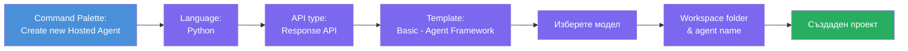
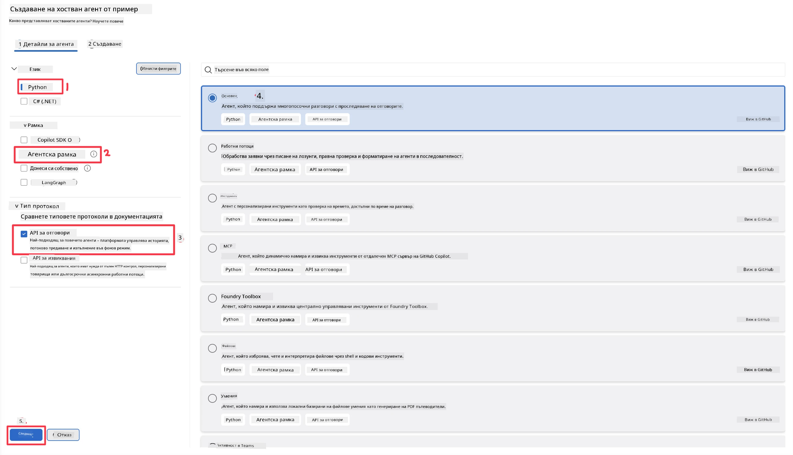
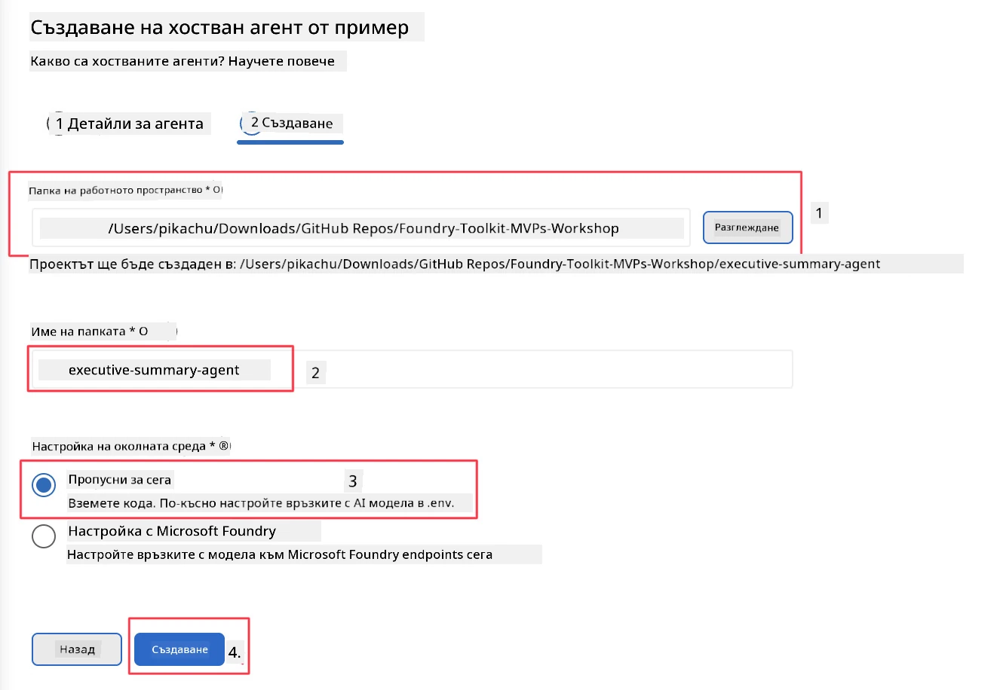

# Модул 2 - Създаване на нов хостван агент

⏱️ ~5 мин

В този модул използвате Foundry Toolkit, за да **генерирате структура за проект на хостван агент**. Генерирането създава пълната структура на проекта - `agent.yaml`, `main.py`, `Dockerfile`, `requirements.txt` и конфигурация за отстраняване на грешки във VS Code - така че да можете да се съсредоточите върху персонализирането на поведението на агента.

> **Ключова концепция:** Папката `agent/` в този урок е пример за това, което генерира Foundry Toolkit. Не пишете тези файлове от нулата.

### Поток на съветника за scaffold



---

## Стъпка 1: Отворете съветника за създаване на хостван агент

1. Натиснете `Ctrl+Shift+P`, за да отворите **Command Palette**.
2. Въведете: **Foundry Toolkit: Create new Hosted Agent** и го изберете.

> **Алтернатива: Създаване чрез Foundry Portal**
> Ако предпочитате браузъра, можете да създадете проекта си на [https://ai.azure.com](https://ai.azure.com). След като проектът се осигури, върнете се във VS Code и използвайте страничната лента на **Foundry Toolkit**, за да се свържете с него.

> **Алтернатива:** Кликнете върху иконата **+** до **Hosted Agents (Preview)** в страничната лента на Foundry Toolkit.

## Стъпка 2: Изберете настройки



1. В секцията за навигация/опции отляво изберете следното:

| Menu | Избор | Бележки |
|--------|-----------|-------|
| **Language** | Python | Поддържа се и C# |
| **Framework** | Agent Framework | Прост начален пункт с използване на Agent Framework SDK |
| **API type** | Response API | `POST /responses` - разговорен, със съхранена от платформата история |
| **Template** | Basic | Прост начален пункт с използване на Agent Framework SDK |

2. След като изберете, кликнете върху **Next**



3. В следващия прозорец изберете следното:

| Menu | Избор | Бележки |
|--------|-----------|-------|
| **Workspace folder** | Изберете целева папка | напр. `/workspace/Foundry_Toolkit_for_VSCode_Lab/` или подпапка в това репо |
| **Agent name** | Въведете име | напр. `executive-summary-agent` |
| **Environment Setup** | пропуснете настройката за сега |  |

Кликнете върху **create**, за да създадете агента. Ще бъде създадена нова папка с името на хоствания агент.

## Стъпка 3: Прегледайте генерирания проект

След приключване на scaffolding, проверете дали виждате тези файлове в Explorer (`Ctrl+Shift+E`):

```
📂 my-agent/
├── .env                ← Environment variables (placeholders)
├── .vscode/
│   ├── launch.json     ← Debug config (F5 → run + Agent Inspector)
│   └── tasks.json      ← VS Code task definitions
├── agent.yaml          ← Agent definition (kind: hosted)
├── Dockerfile          ← Container config for deployment
├── main.py             ← Agent entry point (your main code)
└── requirements.txt    ← Python dependencies
```

### Обяснение на ключови файлове

| Файл | Цел |
|------|---------|
| `agent.yaml` | Декларира агента като `kind: hosted`, картографира променливи на средата, дефинира протокола `/responses` |
| `main.py` | Създава `FoundryChatClient` → обвива го в `Agent` с инструкции → обслужва чрез `ResponsesHostServer` на порт 8088 |
| `Dockerfile` | Използва `python:3.12-slim`, инсталира зависимости, експонира порт 8088, стартира `main.py` |
| `requirements.txt` | `agent-framework-foundry`, `agent-framework-foundry-hosting`, `mcp`, `debugpy` |

> **Важно:** Отворете директно scaffold-натата папка на агента във VS Code (самата папка `agent/`), за да работят правилно файловете `.vscode/launch.json` и `tasks.json` при отстраняване на грешки с F5.

---

### ✅ Проверка

- [ ] Създаден scaffold-нат проект с всички очаквани файлове
- [ ] `agent.yaml` показва `kind: hosted` и `protocol: responses`
- [ ] `main.py` импортира `Agent`, `FoundryChatClient`, `ResponsesHostServer`
- [ ] Папката на агента е отворена във VS Code като корен на работната област

---

**Предишна:** [01 - Настройка](01-setup.md) · **Следваща:** [03 - Конфигуриране и кодиране →](03-configure-and-code.md)

---

<!-- CO-OP TRANSLATOR DISCLAIMER START -->
**Отказ от отговорност**:
Този документ е преведен с помощта на AI преводачески услуга [Co-op Translator](https://github.com/Azure/co-op-translator). Въпреки че се стремим към точност, моля имайте предвид, че автоматизираните преводи могат да съдържат грешки или неточности. Оригиналният документ на неговия роден език трябва да се счита за авторитетен източник. За критична информация се препоръчва професионален човешки превод. Ние не носим отговорност за каквито и да е недоразумения или неправилни тълкувания, произтичащи от използването на този превод.
<!-- CO-OP TRANSLATOR DISCLAIMER END -->