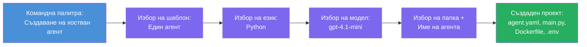

# Модул 3 - Създаване на нов хостван агент (автоматично генериран от Foundry разширението)

В този модул използвате Microsoft Foundry разширението, за да **генерирате нов [хостван агент](https://learn.microsoft.com/azure/foundry/agents/concepts/hosted-agents) проект**. Разширението създава цялата структура на проекта за вас - включително `agent.yaml`, `main.py`, `Dockerfile`, `requirements.txt`, `.env` файл и конфигурация за дебъгване във VS Code. След генерирането персонализирате тези файлове с инструкциите, инструментите и конфигурацията на вашия агент.

> **Основна концепция:** Папката `agent/` в тази лаборатория е пример за това, което генерира Foundry разширението, когато изпълните тази команда за генериране. Не пишете тези файлове ръчно - разширението ги създава, а вие ги модифицирате.

### Последователност на генератора


---

## Стъпка 1: Отворете съветника за създаване на хостван агент

1. Натиснете `Ctrl+Shift+P`, за да отворите **Command Palette**.
2. Въведете: **Microsoft Foundry: Create a New Hosted Agent** и го изберете.
3. Отваря се съветникът за създаване на хостван агент.

> **Алтернативен начин:** Можете също да достъпите този съветник от страничната лента на Microsoft Foundry → кликнете на иконата **+** до **Agents** или десен клик и изберете **Create New Hosted Agent**.

---

## Стъпка 2: Изберете шаблона

Съветникът ви подканва да изберете шаблон. Ще видите опции като:

| Шаблон | Описание | Кога се използва |
|----------|-------------|-------------|
| **Single Agent** | Един агент с собствен модел, инструкции и опционални инструменти | Тази работна сесия (Лаб 01) |
| **Multi-Agent Workflow** | Няколко агента, които работят съвместно по ред | Лаб 02 |

1. Изберете **Single Agent**.
2. Натиснете **Next** (или изборът продължава автоматично).

---

## Стъпка 3: Изберете програмния език

1. Изберете **Python** (препоръчително за тази работна сесия).
2. Натиснете **Next**.

> **Поддържа се и C#**, ако предпочитате .NET. Структурата на генератора е сходна (използва `Program.cs` вместо `main.py`).

---

## Стъпка 4: Изберете вашия модел

1. Съветникът показва моделите, разположени във вашия Foundry проект (от Модул 2).
2. Изберете модела, който разположихте - например, **gpt-4.1-mini**.
3. Натиснете **Next**.

> Ако не виждате модели, върнете се към [Модул 2](02-create-foundry-project.md) и първо разположете един.

---

## Стъпка 5: Изберете място за папка и име на агента

1. Отваря се диалог за избор на файл - изберете **целевата папка**, където ще се създаде проектът. За тази работна сесия:
   - Ако започвате на чисто: изберете произволна папка (например `C:\Projects\my-agent`)
   - Ако работите в репото на работната сесия: създайте нова подпапка под `workshop/lab01-single-agent/agent/`
2. Въведете **име** за хоствания агент (например `executive-summary-agent` или `my-first-agent`).
3. Натиснете **Create** (или Enter).

---

## Стъпка 6: Изчакайте скелетът да се генерира

1. VS Code отваря **нов прозорец** с генерирания проект.
2. Изчакайте няколко секунди проектът да се зареди напълно.
3. Трябва да видите следните файлове в панела Explorer (`Ctrl+Shift+E`):

```
📂 my-first-agent/
├── .env                ← Environment variables (auto-generated with placeholders)
├── .vscode/
│   └── launch.json     ← Debug configuration (F5 to run + Agent Inspector)
├── agent.yaml          ← Agent definition (kind: hosted)
├── Dockerfile          ← Container configuration for deployment
├── main.py             ← Agent entry point (your main code file)
└── requirements.txt    ← Python dependencies
```

> **Това е същата структура като в папката `agent/`** в тази лаборатория. Foundry разширението генерира тези файлове автоматично - не е нужно да ги създавате ръчно.

> **Забележка за работната сесия:** В това репо `.vscode/` папката е в **корена на работното пространство** (не във всяка една проекта). Съдържа споделен `launch.json` и `tasks.json` с две конфигурации за дебъгване - **"Lab01 - Single Agent"** и **"Lab02 - Multi-Agent"** - като всяка сочи към правилната директория на съответния лаб. Когато натискате F5, изберете конфигурацията, съответстваща на лабораторията, по която работите, от падащото меню.

---

## Стъпка 7: Разберете предназначението на всеки генериран файл

Отделете малко време да разгледате всеки файл, който съветникът е създал. Разбирането им е важно за Модул 4 (персонализация).

### 7.1 `agent.yaml` - Дефиниция на агента

Отворете `agent.yaml`. Изглежда така:

```yaml
# yaml-language-server: $schema=https://raw.githubusercontent.com/microsoft/AgentSchema/refs/heads/main/schemas/v1.0/ContainerAgent.yaml

kind: hosted
name: my-first-agent
description: >
  A hosted agent deployed to Microsoft Foundry Agent Service.
metadata:
  authors:
    - Microsoft
  tags:
    - Azure AI AgentServer
    - Microsoft Agent Framework
    - Hosted Agent
protocols:
  - protocol: responses
    version: v1
environment_variables:
  - name: AZURE_AI_PROJECT_ENDPOINT
    value: ${PROJECT_ENDPOINT}
  - name: AZURE_AI_MODEL_DEPLOYMENT_NAME
    value: ${MODEL_DEPLOYMENT_NAME}
dockerfile_path: Dockerfile
resources:
  cpu: '0.25'
  memory: 0.5Gi
```

**Основни полета:**

| Поле | Цел |
|-------|---------|
| `kind: hosted` | Декларира, че е хостван агент (базиран на контейнери, разположен в [Foundry Agent Service](https://learn.microsoft.com/azure/foundry/agents/overview)) |
| `protocols: responses v1` | Агентът експонира OpenAI-съвместима HTTP крайна точка `/responses` |
| `environment_variables` | Картира стойностите от `.env` към променливи в контейнера при разполагането |
| `dockerfile_path` | Посочва Dockerfile-а, използван за изграждането на контейнера |
| `resources` | CPU и паметта, отпуснати на контейнера (0.25 CPU, 0.5Gi памет) |

### 7.2 `main.py` - Входна точка на агента

Отворете `main.py`. Това е основният Python файл, в който живее логиката на агента ви. Генераторът включва:

```python
from agent_framework.azure import AzureAIAgentClient
from azure.ai.agentserver.agentframework import from_agent_framework
from azure.identity.aio import DefaultAzureCredential
```

**Основни импорти:**

| Импорт | Цел |
|--------|--------|
| `AzureAIAgentClient` | Свързва се с вашия Foundry проект и създава агенти чрез `.as_agent()` |
| [`DefaultAzureCredential`](https://learn.microsoft.com/azure/developer/python/sdk/authentication/credential-chains#defaultazurecredential-overview) | Управлява автентикацията (Azure CLI, VS Code влизане, управлявана идентичност или service principal) |
| `from_agent_framework` | Опакова агента като HTTP сървър, експониращ `/responses` крайна точка |

Основният поток е:
1. Създава се credential → създава се клиент → извиква се `.as_agent()` за получаване на агент (асинхронен контекст мениджър) → опакова се като сървър → запуска се

### 7.3 `Dockerfile` - Контейнерен образ

```dockerfile
FROM python:3.14-slim

WORKDIR /app

COPY ./ .

RUN pip install --upgrade pip && \
    if [ -f requirements.txt ]; then \
        pip install -r requirements.txt; \
    else \
        echo "No requirements.txt found" >&2; exit 1; \
    fi

EXPOSE 8088

CMD ["python", "main.py"]
```

**Основни характеристики:**
- Използва `python:3.14-slim` като базов образ.
- Копира всички файлове на проекта в `/app`.
- Актуализира `pip`, инсталира зависимости от `requirements.txt`, и прекъсва бързо, ако този файл липсва.
- **Експонира порт 8088** - това е необходимият порт за хостваните агенти. Не го променяйте.
- Стартира агента с `python main.py`.

### 7.4 `requirements.txt` - Зависимости

```
agent-framework-azure-ai==1.0.0rc3
agent-framework-core==1.0.0rc3
azure-ai-agentserver-agentframework==1.0.0b16
azure-ai-agentserver-core==1.0.0b16
debugpy
agent-dev-cli
```

| Пакет | Цел |
|---------|---------|
| `agent-framework-azure-ai` | Интеграция Azure AI за Microsoft Agent Framework |
| `agent-framework-core` | Основен runtime за изграждане на агенти (включва `python-dotenv`) |
| `azure-ai-agentserver-agentframework` | Runtime на сървър за хостван агент за Foundry Agent Service |
| `azure-ai-agentserver-core` | Основни абстракции за agent server |
| `debugpy` | Поддръжка за Python дебъгване (позволява дебъгване с F5 в VS Code) |
| `agent-dev-cli` | Локален CLI за разработка и тестване на агенти (използва се от debug/run конфигурацията) |

---

## Разбиране на протокола на агента

Хостваните агенти комуникират чрез протокола **OpenAI Responses API**. Когато работят (локално или в облака), агентът експонира единна HTTP крайна точка:

```
POST http://localhost:8088/responses
Content-Type: application/json

{
  "input": "Your prompt here",
  "stream": false
}
```

Foundry Agent Service извиква тази крайна точка, за да изпрати потребителски заявки и да получи отговори от агента. Това е същият протокол, който използва OpenAI API, затова вашият агент е съвместим с всеки клиент, който говори OpenAI Responses формат.

---

### Контролна точка

- [ ] Съветникът за генериране се изпълни успешно и се отвори **нов VS Code прозорец**
- [ ] Виждате всички 5 файла: `agent.yaml`, `main.py`, `Dockerfile`, `requirements.txt`, `.env`
- [ ] Файлът `.vscode/launch.json` съществува (позволява дебъгване с F5 - в тази работна сесия е в корена на работното пространство с лаб-специфични конфигурации)
- [ ] Прочели сте всеки файл и разбирате неговото предназначение
- [ ] Разбирате, че порт `8088` е необходим и `/responses` е използваният протокол

---

**Предишен:** [02 - Създаване на Foundry проект](02-create-foundry-project.md) · **Следващ:** [04 - Конфигуриране и писане на код →](04-configure-and-code.md)

---

<!-- CO-OP TRANSLATOR DISCLAIMER START -->
**Отказ от отговорност**:  
Този документ е преведен с помощта на AI преводаческа услуга [Co-op Translator](https://github.com/Azure/co-op-translator). Въпреки че се стремим към точност, моля, имайте предвид, че автоматизираните преводи могат да съдържат грешки или неточности. Оригиналният документ на неговия език трябва да се счита за авторитетен източник. За критична информация се препоръчва професионален човешки превод. Не носим отговорност за каквито и да било недоразумения или неправилни тълкувания, произтичащи от използването на този превод.
<!-- CO-OP TRANSLATOR DISCLAIMER END -->