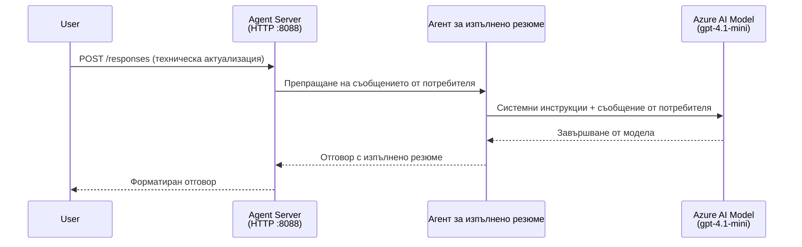
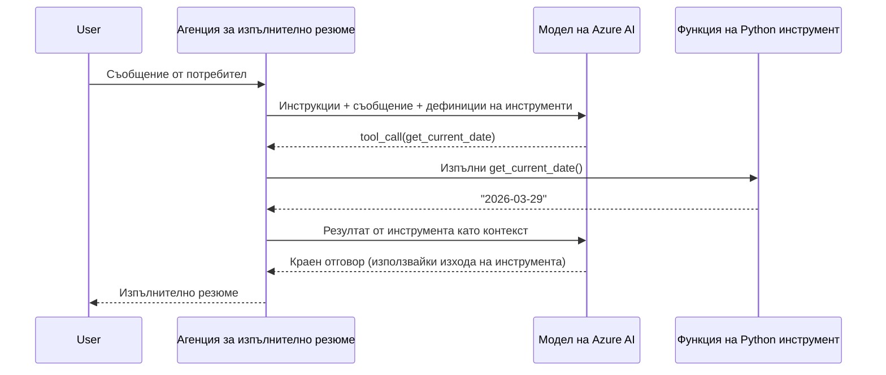

# Модул 4 - Конфигуриране на инструкции, околна среда и инсталиране на зависимости

В този модул персонализирате автоматично генерираните файлове на агента от Модул 3. Тук превръщате общия скеле в **вашия** агент - чрез написване на инструкции, задаване на променливи на околната среда, по избор добавяне на инструменти и инсталиране на зависимости.

> **Напомняне:** Разширението Foundry автоматично генерира вашите проектни файлове. Сега ги модифицирате. Вижте папката [`agent/`](../../../../../workshop/lab01-single-agent/agent) за пълен работещ пример на персонализиран агент.

---

## Как компонентите се свързват

### Животен цикъл на заявка (един агент)


> **С инструменти:** Ако агентът има регистрирани инструменти, моделът може да върне извикване на инструмент вместо директно завършване. Фреймуоркът изпълнява инструмента локално, подава резултата обратно на модела, а моделът след това генерира крайния отговор.


---

## Стъпка 1: Конфигуриране на променливи на околната среда

Скелетът създаде файл `.env` с заместители. Трябва да попълните реалните стойности от Модул 2.

1. В генерирания проект отворете файла **`.env`** (той е в основната папка на проекта).
2. Заменете заместителите с действителните детайли на вашия Foundry проект:

   ```env
   PROJECT_ENDPOINT=https://<your-account>.services.ai.azure.com/api/projects/<your-project>
   MODEL_DEPLOYMENT_NAME=gpt-4.1-mini
   ```

3. Запазете файла.

### Къде да намерите тези стойности

| Стойност | Как да я намерите |
|----------|-------------------|
| **Крайна точка на проекта** | Отворете страничната лента на **Microsoft Foundry** в VS Code → кликнете върху вашия проект → URL адресът на крайната точка се показва в детайлния изглед. Изглежда като `https://<account-name>.services.ai.azure.com/api/projects/<project-name>` |
| **Име на разгръщане на модел** | В страничната лента на Foundry разширете вашия проект → вижте под **Модели + крайни точки** → името е изброено до разположения модел (например `gpt-4.1-mini`) |

> **Сигурност:** Никога не комитвайте файла `.env` в система за контрол на версиите. Той вече е включен по подразбиране в `.gitignore`. Ако не е, добавете го:
> ```
> .env
> ```

### Как преминават променливите на околната среда

Верижната карта е: `.env` → `main.py` (чете чрез `os.getenv`) → `agent.yaml` (свързва с променливи на околната среда в контейнера при разгръщане).

В `main.py` скелетът чете тези стойности по следния начин:

```python
PROJECT_ENDPOINT = os.getenv("AZURE_AI_PROJECT_ENDPOINT") or os.getenv("PROJECT_ENDPOINT")
MODEL_DEPLOYMENT_NAME = os.getenv("AZURE_AI_MODEL_DEPLOYMENT_NAME", os.getenv("MODEL_DEPLOYMENT_NAME", "gpt-4.1-mini"))
```

И двата `AZURE_AI_PROJECT_ENDPOINT` и `PROJECT_ENDPOINT` се приемат (в `agent.yaml` се използва префиксът `AZURE_AI_*`).

---

## Стъпка 2: Напишете инструкции за агента

Това е най-важната стъпка за персонализация. Инструкциите определят личността на вашия агент, поведението му, формата на изхода и ограниченията за безопасност.

1. Отворете `main.py` във вашия проект.
2. Намерете низът с инструкции (скелетът включва подразбиращ се/общ).
3. Заменете го с подробни, структурирани инструкции.

### Какво включват добрите инструкции

| Компонент | Цел | Пример |
|-----------|-----|--------|
| **Роля** | Какъв е агентът и какво прави | „Вие сте агент за изпълнително резюме“ |
| **Аудитория** | За кого са отговорите | „Висши ръководители с ограничени технически познания“ |
| **Дефиниция на входа** | Какъв вид заявки обработва | „Технически отчети за инциденти, оперативни актуализации“ |
| **Формат на изхода** | Точната структура на отговорите | „Изпълнително резюме: - Какво се случи: ... - Влияние върху бизнеса: ... - Следваща стъпка: ...“ |
| **Правила** | Ограничения и условия за отказ | „Не добавяйте информация извън предоставената“ |
| **Безопасност** | Предотвратяване на злоупотреби и халюцинации | „Ако входът е неясен, поискайте уточнение“ |
| **Примери** | Вход/изход двойки за насочване на поведението | Включва 2-3 примера с различни входове |

### Пример: Инструкции за агент за изпълнително резюме

Ето инструкциите, използвани в работната сесия [`agent/main.py`](../../../../../workshop/lab01-single-agent/agent/main.py):

```python
AGENT_INSTRUCTIONS = """You are an "Explain Like I'm an Executive" agent.

Purpose:
Your job is to translate complex technical or operational information into
clear, concise, and outcome-focused summaries that can be easily understood
by non-technical executives.

Audience:
Senior leaders with limited technical background who care about impact,
risk, and what happens next.

What you must do:
- Rephrase the input so it is understandable to a non-technical audience
- Prioritize clarity, brevity, and outcomes over technical accuracy
- Remove technical jargon, logs, metrics, stack traces, and deep root-cause details
- Translate technical causes into simple cause-and-effect statements
- Explicitly call out business impact
- Always include a clear next step or action
- Maintain a neutral, factual, and calm executive tone
- Do NOT add new facts or speculate beyond the input

Standard Output Structure (always use this wording):

Executive Summary:
- What happened: <plain-language description>
- Business impact: <clear, non-technical impact>
- Next step: <clear action or mitigation>

Rules:
- Keep responses under 100 words
- Do NOT add facts beyond the input
- If input is unclear, ask for clarification
"""
```

4. Заменете съществуващия низ с инструкции в `main.py` с вашите персонализирани инструкции.
5. Запазете файла.

---

## Стъпка 3: (По избор) Добавете персонализирани инструменти

Хостваните агенти могат да изпълняват **локални Python функции** като [инструменти](https://learn.microsoft.com/azure/foundry/agents/concepts/tool-catalog). Това е ключово предимство на агенти с кодова база пред агенти само с подсказки - вашият агент може да изпълнява произволна сървърна логика.

### 3.1 Определете функция за инструмент

Добавете функция за инструмент към `main.py`:

```python
from agent_framework import tool

@tool
def get_current_date() -> str:
    """Returns the current date in YYYY-MM-DD format."""
    from datetime import date
    return str(date.today())
```

Декораторът `@tool` превръща стандартна Python функция в инструмент за агента. Документационният низ става описание на инструмента, което моделът вижда.

### 3.2 Регистрирайте инструмента с агента

При създаване на агента чрез контекстния мениджър `.as_agent()`, подайте инструмента в параметъра `tools`:

```python
async with AzureAIAgentClient(
    project_endpoint=PROJECT_ENDPOINT,
    model_deployment_name=MODEL_DEPLOYMENT_NAME,
    credential=credential,
).as_agent(
    name="my-agent",
    instructions=AGENT_INSTRUCTIONS,
    tools=[get_current_date],
) as agent:
    server = from_agent_framework(agent)
    await server.run_async()
```

### 3.3 Как работят извикванията на инструмент

1. Потребителят изпраща подсказка.
2. Моделът решава дали е необходим инструмент (на базата на подсказката, инструкциите и описанията на инструментите).
3. Ако е необходим инструмент, фреймуоркът извиква вашата Python функция локално (вътре в контейнера).
4. Върнатата стойност от инструмента се подава обратно на модела като контекст.
5. Моделът генерира крайния отговор.

> **Инструментите се изпълняват на сървъра** - те се стартират във вашия контейнер, а не в браузъра на потребителя или модела. Това означава, че можете да имате достъп до бази данни, API, файлови системи или всяка Python библиотека.

---

## Стъпка 4: Създайте и активирайте виртуална среда

Преди инсталиране на зависимости създайте изолирана Python среда.

### 4.1 Създайте виртуалната среда

Отворете терминал в VS Code (`` Ctrl+` ``) и изпълнете:

```powershell
python -m venv .venv
```

Това създава папка `.venv` в директорията на вашия проект.

### 4.2 Активирайте виртуалната среда

**PowerShell (Windows):**

```powershell
.\.venv\Scripts\Activate.ps1
```

**Команден ред (Windows):**

```cmd
.venv\Scripts\activate.bat
```

**macOS/Linux (Bash):**

```bash
source .venv/bin/activate
```

Трябва да видите `(.venv)` в началото на терминалния ред, което означава, че виртуалната среда е активна.

### 4.3 Инсталирайте зависимости

С активирана виртуална среда инсталирайте необходимите пакети:

```powershell
pip install -r requirements.txt
```

Това инсталира:

| Пакет | Цел |
|--------|-----|
| `agent-framework-azure-ai==1.0.0rc3` | Интеграция на Azure AI за [Microsoft Agent Framework](https://learn.microsoft.com/agent-framework/overview/) |
| `agent-framework-core==1.0.0rc3` | Основна работна среда за създаване на агенти (включва `python-dotenv`) |
| `azure-ai-agentserver-agentframework==1.0.0b16` | Работна среда на сървъра за хоствани агенти за [Foundry Agent Service](https://learn.microsoft.com/azure/foundry/agents/overview) |
| `azure-ai-agentserver-core==1.0.0b16` | Основни абстракции на сървъра за агенти |
| `debugpy` | Python отстраняване на грешки (активира F5 отстраняване на грешки във VS Code) |
| `agent-dev-cli` | Локален CLI за разработка и тестване на агенти |

### 4.4 Проверете инсталацията

```powershell
pip list | Select-String "agent-framework|agentserver"
```

Очакван изход:
```
agent-framework-azure-ai   1.0.0rc3
agent-framework-core       1.0.0rc3
azure-ai-agentserver-agentframework 1.0.0b16
azure-ai-agentserver-core  1.0.0b16
```

---

## Стъпка 5: Проверете удостоверяването

Агентът използва [`DefaultAzureCredential`](https://learn.microsoft.com/azure/developer/python/sdk/authentication/credential-chains#defaultazurecredential-overview), който опитва няколко метода за удостоверяване в този ред:

1. **Променливи на околната среда** - `AZURE_CLIENT_ID`, `AZURE_TENANT_ID`, `AZURE_CLIENT_SECRET` (служебен принципал)
2. **Azure CLI** - използва текущата `az login` сесия
3. **VS Code** - използва акаунтa, с който сте влезли в VS Code
4. **Managed Identity** - използва се при работа в Azure (по време на разгръщане)

### 5.1 Проверка за локална разработка

Поне един от тези варианти трябва да работи:

**Опция A: Azure CLI (препоръчително)**

```powershell
az account show --query "{name:name, id:id}" --output table
```

Очаква се: Показва името и ID на вашия абонамент.

**Опция B: Вход в VS Code**

1. В долния ляв ъгъл на VS Code вижте иконата за **Акаунти**.
2. Ако виждате името на вашия акаунт, сте удостоверени.
3. Ако не, кликнете иконата → **Sign in to use Microsoft Foundry**.

**Опция C: Служебен принципал (за CI/CD)**

```powershell
$env:AZURE_TENANT_ID = "<your-tenant-id>"
$env:AZURE_CLIENT_ID = "<your-client-id>"
$env:AZURE_CLIENT_SECRET = "<your-client-secret>"
```

### 5.2 Често срещан проблем с удостоверяването

Ако сте влезли с няколко Azure акаунта, уверете се, че правилният абонамент е избран:

```powershell
az account set --subscription "<your-subscription-id>"
```

---

### Контролен списък

- [ ] Файлът `.env` има валидни стойности за `PROJECT_ENDPOINT` и `MODEL_DEPLOYMENT_NAME` (не заместители)
- [ ] Инструкциите на агента са персонализирани в `main.py` - те определят роля, аудитория, формат на изхода, правила и ограничения за безопасност
- [ ] (По избор) Персонализирани инструменти са дефинирани и регистрирани
- [ ] Виртуалната среда е създадена и активирана (`(.venv)` се вижда в терминалния ред)
- [ ] `pip install -r requirements.txt` завършва успешно без грешки
- [ ] `pip list | Select-String "azure-ai-agentserver"` показва, че пакетът е инсталиран
- [ ] Удостоверяването е валидно - `az account show` връща вашия абонамент ИЛИ сте влезли в VS Code

---

**Предишна:** [03 - Create Hosted Agent](03-create-hosted-agent.md) · **Следваща:** [05 - Test Locally →](05-test-locally.md)

---

<!-- CO-OP TRANSLATOR DISCLAIMER START -->
**Отказ от отговорност**:  
Този документ е преведен с помощта на AI преводаческа услуга [Co-op Translator](https://github.com/Azure/co-op-translator). Въпреки че се стремим към точност, имайте предвид, че автоматизираните преводи могат да съдържат грешки или неточности. Оригиналният документ на неговия роден език трябва да се счита за авторитетен източник. За критична информация се препоръчва професионален човешки превод. Ние не носим отговорност за никакви недоразумения или погрешни тълкувания, произтичащи от използването на този превод.
<!-- CO-OP TRANSLATOR DISCLAIMER END -->