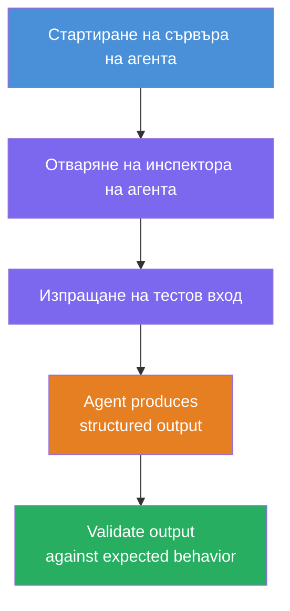
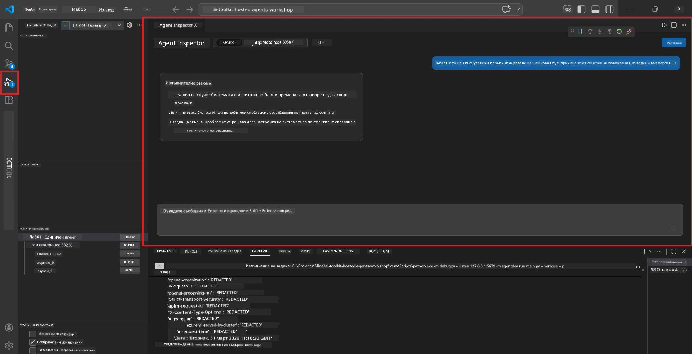
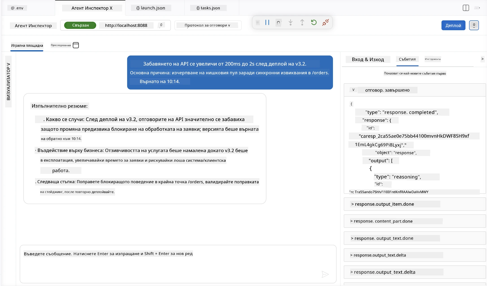

# Модул 4 - Локално тестване

⏱️ ~10 мин

В този модул ще стартирате вашия агент локално и ще проверите дали работи правилно, използвайки **функционални тестове по щастлив път**. Ще използвате Agent Inspector (визуален интерфейс) или директни HTTP заявки, за да потвърдите, че агентът произвежда структурирани и точни отговори.

### Поток на локално тестване



---

## Опция 1: Натиснете F5 - Отстраняване на грешки с Agent Inspector (препоръчително)

### Стартирайте дебъгъра

1. Отворете директорията **executive-summary-agent/** директно във VS Code (`File → Open Folder`).
2. Отворете панела **Run and Debug** (`Ctrl+Shift+D`).
3. Изберете **Debug Local Agent Server** от падащото меню.
4. Натиснете **F5** (или кликнете ▶ Start Debugging).

> ⚠️ **Критично: Изберете вашия Python Interpreter**
> Ако получите "ModuleNotFoundError" или дебъгерът не стартира, трябва да укажете на VS Code да използва вашата виртуална среда:
  > 1. Натиснете `Ctrl+Shift+P` $\rightarrow$ напишете **Python: Select Interpreter**.
  > 2. Изберете интерпретатора, разположен в папката `.venv` на вашия проект (например, `.\.venv\Scripts\python.exe` на Windows).
  > 3. Рестартирайте сесията за дебъг.
> Ако все още имате грешки, ръчно актуализирайте файла `tasks.json` по следния начин:
  > 1. Отидете в файла `.vscode/tasks.json`
  > 2. Намерете командата със заглавие: `Run Agent/Workflow HTTP Server`
  > 3. Актуализирайте стойността на командата така: `"value": "${workspaceFolder}/.venv/bin/python",`

### Какво се случва

1. HTTP сървърът стартира на `http://localhost:8088/responses`.
2. Появява се панелът **Agent Inspector** - визуален чат интерфейс за тестване.
3. В `main.py` са активирани прекъсвания (breakpoints).

Следете Терминала за:
```
Starting executive summary hosted agent
Executive agent server running on http://localhost:8088
```

> **Ако Agent Inspector не се отвори:** Натиснете `Ctrl+Shift+P` → **Foundry Toolkit: Open Agent Inspector**.



> *Екранната снимка може да показва по-стара бранд идентичност 'AI TOOLKIT' от по-ранна версия на разширението.*

---

## Опция 2: Тест през Терминал (алтернатива)

Стартирайте агента в един терминал, изпращайте заявки от друг:

```bash
# Терминал 1: Стартиране на агент
cd executive-summary-agent/
source .venv/bin/activate
python main.py
```

```bash
# Терминал 2: Изпрати тест (curl)
curl -sS -X POST http://localhost:8088/responses \
  -H "Content-Type: application/json" \
  -d '{"input": "The API latency increased due to thread pool exhaustion caused by sync calls in v3.2.", "stream": false}'
```

---

## Тестове на сценарии: Функционална валидация по щастлив път

Изпълнете **всички три** сценария по-долу. Те валидират, че вашият агент произвежда коректен, структуриран изход за реалистични входни данни.



### Сценарий 1: IT инцидент - пик в забавяне на API

**Вход:**
```
The API latency increased from 200ms to 2s after deploying v3.2.
Root cause: thread pool starvation from synchronous calls in /orders.
Rolled back at 10:14.
```

**Очаквано поведение:**
- ✅ Следва структурата "Executive Summary" (Какво се случи / Влияние върху бизнеса / Следваща стъпка)
- ✅ Без технически жаргон (без "thread pool", без "/orders", без "v3.2")
- ✅ Ясно посочено влияние върху бизнеса (например потребителите са изпитали забавяне)
- ✅ Включва следваща стъпка (напр. корекция е внедрена, мониторинг е инсталиран)

---

### Сценарий 2: Данни - неуспех в ETL процеса

**Вход:**
```
The nightly ETL job failed because the upstream schema changed. APAC dashboards show missing data.
```

**Очаквано поведение:**
- ✅ Обобщава повредата в обновяването на данните на разбираем език
- ✅ Споменава засегнатото табло в регион APAC
- ✅ Включва следваща стъпка за корекция
- ✅ НЕ споменава "ETL", "schema" или други технически термини

---

### Сценарий 3: Сигурност - изложени данни за достъп

**Вход:**
```
Static analysis flagged a hardcoded secret in the repository.
The secret may have been exposed in commit history.
```

**Очаквано поведение:**
- ✅ Описва проблем с креденшъли/сигурността на език, подходящ за ръководство
- ✅ Изтъква потенциалния риск (неоторизиран достъп)
- ✅ Посочва действие за корекция (промяна на креденшъли, одит)
- ✅ НЕ съдържа термини като "static analysis", "commit history" или "hardcoded"

---

## Критерии за валидиране

За всеки сценарий проверете:

| # | Критерии | Условие за преминаване |
|---|----------|---------------------|
| 1 | **Структура** | Отговорът използва формат "Executive Summary" с всички три точки |
| 2 | **Обикновен език** | Без технически жаргон, който ръководител не би разбрал |
| 3 | **Точност** | Обобщението отразява входящите данни - без измислени подробности |
| 4 | **Краткост** | Отговорът е под 100 думи |
| 5 | **Следваща стъпка** | Посочено е ясно действие или мерки за смекчаване |

---

## Съвети за отстраняване на грешки

| Проблем | Решение |
|---------|---------|
| Агентът не стартира | Проверете стойностите в `.env`, уверете се, че venv е активиран, изпълнете `pip install -r requirements.txt` |
| Отговорът е празен или общ | Прегледайте инструкциите в `main.py` - уверете се, че е посочен формат за изхода |
| Отговорът съдържа жаргон | Затегнете правилата за "премахване на технически термини" в инструкциите |
| Agent Inspector не се отваря | `Ctrl+Shift+P` → **Foundry Toolkit: Open Agent Inspector** |
| Грешки на модела в Терминала | Проверете дали `AZURE_AI_MODEL_DEPLOYMENT_NAME` съвпада точно (чувствително към малки/големи букви) |

---

### ✅ Контролен списък

- [ ] Агентът стартира локално без грешки
- [ ] Agent Inspector се отваря и показва чат интерфейс (ако използвате F5)
- [ ] **Сценарий 1** (ИТ инцидент) - структуриран Executive Summary, без жаргон
- [ ] **Сценарий 2** (данни) - релевантно обобщение с бизнес въздействие
- [ ] **Сценарий 3** (сигнал за сигурност) - подходяща комуникация на риск
- [ ] Всички отговори следват дефинираната структура на изхода

> **Запазете вашите отговори** (копирайте или направете екранна снимка) - ще ги сравните с резултатите в облака в Модул 06.

---

**Предишен:** [03 - Конфигуриране и писане на код](03-configure-and-code.md) · **Следващ:** [05 - Деплой в Foundry →](05-deploy-to-foundry.md)

---

<!-- CO-OP TRANSLATOR DISCLAIMER START -->
**Отказ от отговорност**:
Този документ е преведен с помощта на AI преводачески услуга [Co-op Translator](https://github.com/Azure/co-op-translator). Въпреки че се стремим към точност, моля имайте предвид, че автоматизираните преводи могат да съдържат грешки или неточности. Оригиналният документ на неговия роден език трябва да се счита за авторитетен източник. За критична информация се препоръчва професионален човешки превод. Ние не носим отговорност за каквито и да е недоразумения или неправилни тълкувания, произтичащи от използването на този превод.
<!-- CO-OP TRANSLATOR DISCLAIMER END -->