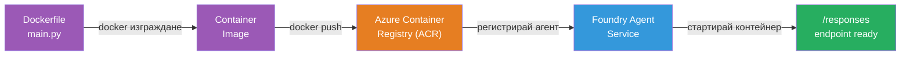
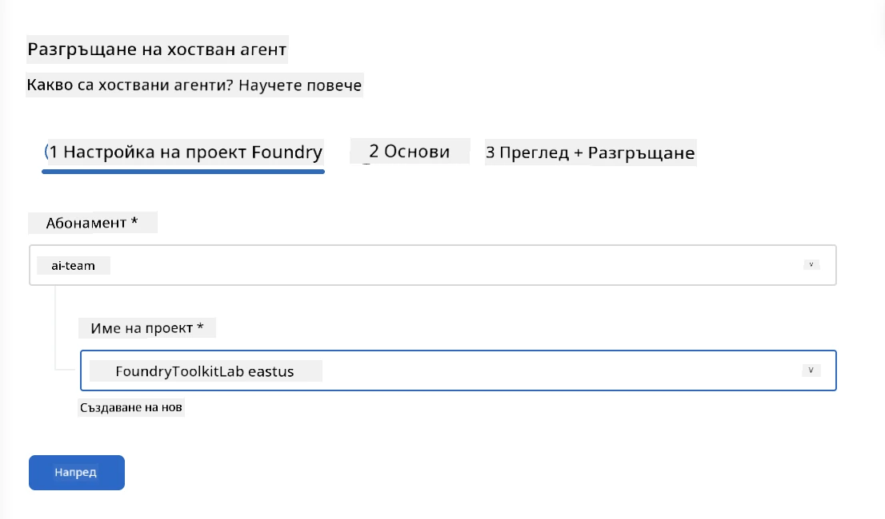
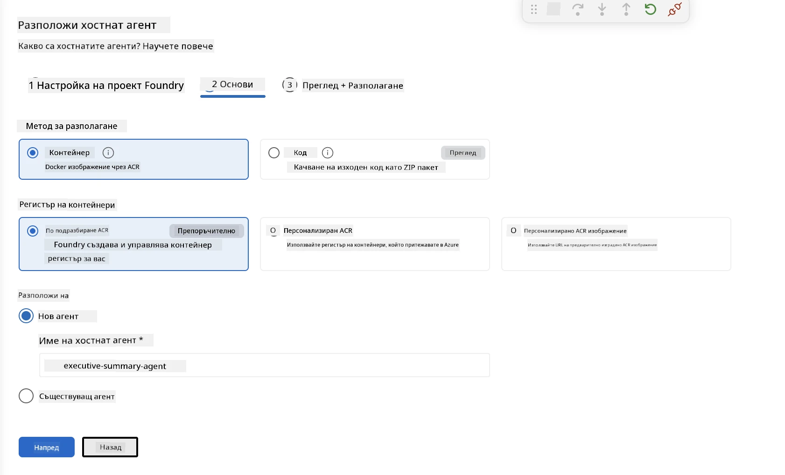
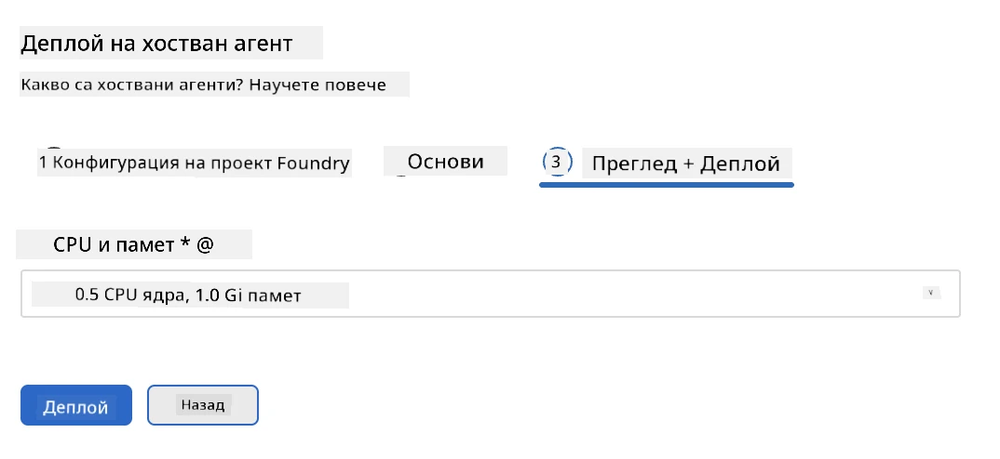
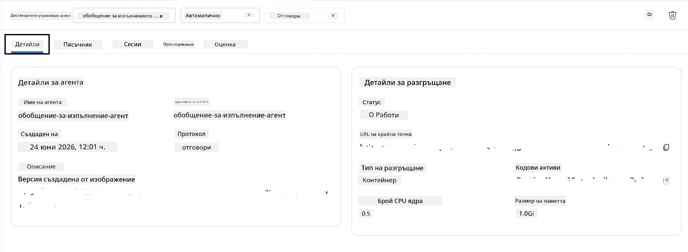

# Модул 5 - Разгръщане в Foundry Agent Service

⏱️ ~10 минути

> ⚠️ **Потребители на Път B:** Този модул изисква абонамент за Foundry. Ако използвате Foundry Local, преминете към [Модул 07 - Обобщение](07-summary.md). Успешно завършихте локалния работен процес за разработка!

В този модул ще разположите вашия локално тестван агент в Microsoft Foundry като **Хостван агент**. Разгръщането създава контейнерно изображение, качва го в Azure Container Registry и стартира агента в управляваната инфраструктура на Foundry.

### Процес на разгръщане

---

## Проверка на предпоставките

Преди да разположите, уверете се, че:

- [ ] Агентът преминава успешно и трите локални сценария от [Модул 04](04-test-locally.md)
- [ ] Имам ролята **Azure AI User** на ниво проект ([Модул 01, Задаване на RBAC](01-setup.md#deploy-a-model--assign-rbac))
- [ ] Влезли сте в Azure във VS Code (иконата Акаунти показва вашето име)

---

## Стъпка 1: Стартиране на разгръщането

### Вариант A: Разгръщане от Agent Inspector (препоръчително)

Ако Agent Inspector е отворен (от тестване):
1. Натиснете бутона **Deploy** в горния десен ъгъл (икона облак ↑).

### Вариант B: Разгръщане от командния палитър

1. Натиснете `Ctrl+Shift+P` → **Foundry Toolkit: Deploy Hosted Agent**.

---

## Стъпка 2: Конфигуриране на разгръщането

Мастърът ще ви попита:

| Въпрос | Избор |
|--------|-----------|
| **Абонамент** | Вашият Azure абонамент |
| **Целеви проект** | Вашият Foundry проект (напр. `workshop-agents`) |

Натиснете **next**, за да конфигурирате вашия агент.

| Въпрос | Избор |
|--------|-----------|
| **Метод на разгръщане** | Контейнер |
| **Репозитория контейнер** | **Стандартен ACR** (Microsoft Foundry създава и управлява такъв за вас) |
| **Разгърни до** | Нов агент (име, `executive-summary-agent`) |

Натиснете **next**, за да прегледате и разположите агента.

| Въпрос | Избор |
|--------|-----------|
| **CPU и памет** | **0.25 CPU ядра, 0.5 Gi памет** (достатъчно за работилница) |

---

## Стъпка 3: Разгръщане и мониторинг

1. Натиснете **Deploy**.
2. Проследявайте панела **Output** (изберете **Microsoft Foundry** от падащото меню).
3. Разгръщането минава през следните етапи:
   - **Docker build** - изгражда контейнер от вашия Dockerfile
   - **Docker push** - качва изображението в ACR (1–3 минути при първо разгръщане)
   - **Регистрация на агент** - създава хостван агент във Foundry
   - **Стартиране на контейнера** - стартира с идентичност, управлявана от системата

4. Когато приключи, се появява уведомление:
   > **my-agent е успешно разположен.** `Виж дневници` `Стартирай агент`

5. Натиснете **Стартирай агент**, за да отворите Agent Playground.

### Стойности на състоянието на разгръщането

| Състояние | Значение |
|--------|---------|
| **Работи** | Контейнерът е готов, агентът отговаря |
| **Изчаква** | Контейнерът стартира - изчакайте 30–60 секунди |
| **Неуспешно** | Проверете дневниците (вижте отстраняване на проблеми по-долу) |

---

## Често срещани грешки при разгръщане

| Грешка | Основна причина | Решение |
|-------|-----------|-----|
| отказан достъп `agents/write` | Липсва ролята **Azure AI User** на ниво проект | [Модул 01, Задаване на RBAC](01-setup.md#deploy-a-model--assign-rbac) |
| Docker не работи | Docker Desktop не е стартиран | Стартирайте Docker Desktop → проверете с `docker info` |
| Удостоверяване в ACR | Управляваната идентичност не може да изтегли изображението | Вижте [Модул 08 - Отстраняване на проблеми](08-troubleshooting.md) |

---

### ✅ Контролен списък

- [ ] Разгръщането завърши без грешки
- [ ] Агентът се появява под **Hosted Agents (Preview)** в страничното меню на Foundry
- [ ] Състоянието на контейнера показва **Работи**
- [ ] Отворена е таба Agent Playground, показваща данни за агента и URL на крайна точка

---

**Предишен:** [04 - Локално тестване](04-test-locally.md) · **Следващ:** [06 - Потвърждение в Playground →](06-verify-in-playground.md)

---

<!-- CO-OP TRANSLATOR DISCLAIMER START -->
**Отказ от отговорност**:
Този документ е преведен с помощта на AI преводачески услуга [Co-op Translator](https://github.com/Azure/co-op-translator). Въпреки че се стремим към точност, моля имайте предвид, че автоматизираните преводи могат да съдържат грешки или неточности. Оригиналният документ на неговия роден език трябва да се счита за авторитетен източник. За критична информация се препоръчва професионален човешки превод. Ние не носим отговорност за каквито и да е недоразумения или неправилни тълкувания, произтичащи от използването на този превод.
<!-- CO-OP TRANSLATOR DISCLAIMER END -->