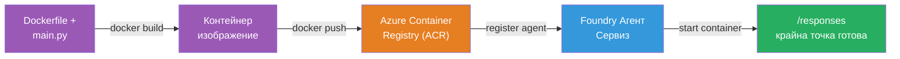
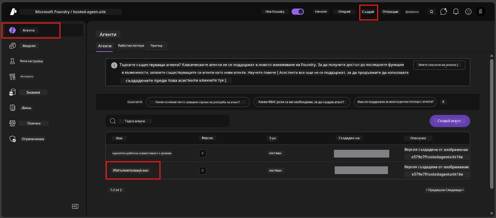

# Модул 6 - Разгръщане в Foundry Agent Service

В този модул разгърнете агента си, тестван локално, в Microsoft Foundry като [**хостиран агент**](https://learn.microsoft.com/azure/foundry/agents/concepts/hosted-agents). Процесът на разгръщане изгражда Docker контейнер изображение от вашия проект, качва го в [Azure Container Registry (ACR)](https://learn.microsoft.com/azure/container-registry/container-registry-intro) и създава версия на хостиран агент в [Foundry Agent Service](https://learn.microsoft.com/azure/foundry/agents/overview).

### Тръбопровод за разгръщане


---

## Проверка на предпоставките

Преди разгръщането проверете всеки от следните елементи. Пропускането им е най-честата причина за неуспехи при разгръщане.

1. **Агентът преминава локалните тестове за базово функциониране:**
   - Изпълнили сте всички 4 теста в [Модул 5](05-test-locally.md) и агентът реагира правилно.

2. **Имате роля [Azure AI User](https://learn.microsoft.com/azure/foundry/concepts/rbac-foundry#built-in-roles):**
   - Тя беше зададена в [Модул 2, Стъпка 3](02-create-foundry-project.md). Ако не сте сигурни, проверете сега:
   - Azure Portal → вашия Foundry **проект** ресурс → **Access control (IAM)** → раздел **Role assignments** → потърсете името си → потвърдете, че е налична ролята **Azure AI User**.

3. **Влезли сте в Azure в VS Code:**
   - Проверете иконата Accounts в долния ляв ъгъл на VS Code. Трябва да виждате името на своя акаунт.

4. **(По избор) Docker Desktop е пуснат:**
   - Docker е нужен само ако Foundry разширението поиска локална компилация. В повечето случаи разширението автоматично се грижи за контейнерното изграждане по време на разгръщането.
   - Ако имате инсталиран Docker, проверете дали работи с командата: `docker info`

---

## Стъпка 1: Стартирайте разгръщането

Имате два начина за разгръщане - и двата водят до един и същ резултат.

### Опция A: Разгръщане от Agent Inspector (препоръчително)

Ако стартирате агента с дебъгер (F5) и Agent Inspector е отворен:

1. Погледнете в **горния десен ъгъл** на панела Agent Inspector.
2. Кликнете бутона **Deploy** (икона на облак със стрелка нагоре ↑).
3. Ще се отвори съветникът за разгръщане.

### Опция B: Разгръщане от Command Palette

1. Натиснете `Ctrl+Shift+P`, за да отворите **Command Palette**.
2. Въведете: **Microsoft Foundry: Deploy Hosted Agent** и го изберете.
3. Ще се отвори съветникът за разгръщане.

---

## Стъпка 2: Конфигуриране на разгръщането

Съветникът за разгръщане ви превежда през конфигурацията. Попълнете всяко запитване:

### 2.1 Избор на целевия проект

1. Появява се падащо меню с вашите Foundry проекти.
2. Изберете проекта, който създадохте в Модул 2 (например `workshop-agents`).

### 2.2 Избор на контейнерния агентски файл

1. Ще бъдете помолени да изберете входната точка на агента.
2. Изберете **`main.py`** (Python) - това е файлът, който съветникът използва, за да идентифицира вашия агентски проект.

### 2.3 Конфигуриране на ресурсите

| Настройка | Препоръчителна стойност | Бележки |
|---------|-------------------------|---------|
| **CPU** | `0.25` | По подразбиране, достатъчно за работилницата. Увеличете за продуктивни натоварвания |
| **Памет** | `0.5Gi` | По подразбиране, достатъчно за работилницата |

Тези стойности съвпадат със зададените в `agent.yaml`. Можете да приемете подразбиращите се стойности.

---

## Стъпка 3: Потвърдете и разположете

1. Съветникът показва обобщение на разгръщането със:
   - Името на целевия проект
   - Името на агента (от `agent.yaml`)
   - Контейнерния файл и ресурсите
2. Прегледайте обобщението и кликнете **Confirm and Deploy** (или **Deploy**).
3. Следете напредъка във VS Code.

### Какво се случва по време на разгръщане (стъпка по стъпка)

Разгръщането е многостепенен процес. Следете панела **Output** на VS Code (изберете "Microsoft Foundry" от падащото меню) за подробности:

1. **Docker build** - VS Code изгражда Docker контейнер изображение от вашия `Dockerfile`. Ще виждате съобщения за слоевете на Docker:
   ```
   Step 1/6 : FROM python:<version>-slim
   Step 2/6 : WORKDIR /app
   ...
   Successfully built abc123def456
   ```

2. **Docker push** - Изображението се качва в **Azure Container Registry (ACR)**, свързан с вашия Foundry проект. Това може да отнеме 1-3 минути при първото разгръщане (базовото изображение е над 100MB).

3. **Регистрация на агента** - Foundry Agent Service създава нов хостиран агент (или нова версия, ако агентът вече съществува). Използва се метаданните от `agent.yaml`.

4. **Стартиране на контейнера** - Контейнерът стартира в управляваната инфраструктура на Foundry. Платформата задава [системно управлявана идентичност](https://learn.microsoft.com/azure/foundry/agents/concepts/agent-identity) и излага крайна точка `/responses`.

> **Първото разгръщане е по-бавно** (Docker трябва да качи всички слоеве). Следващите разгръщания са по-бързи, понеже Docker кешира непроменените слоеве.

---

## Стъпка 4: Проверете състоянието на разгръщането

След като командата за разгръщане приключи:

1. Отворете страничния панел **Microsoft Foundry**, като кликнете иконата на Foundry в лентата с дейности.
2. Разгънете секцията **Hosted Agents (Preview)** под своя проект.
3. Трябва да виждате името на своя агент (например `ExecutiveAgent` или името от `agent.yaml`).
4. **Кликнете върху името на агента**, за да го разгънете.
5. Ще видите една или повече **версии** (например `v1`).
6. Кликнете върху версията, за да видите **Подробности за контейнера**.
7. Проверете полето **Status**:

   | Статус | Значение |
   |--------|----------|
   | **Started** или **Running** | Контейнерът работи и агентът е готов |
   | **Pending** | Контейнерът се стартира (изчакайте 30-60 секунди) |
   | **Failed** | Контейнерът не успя да стартира (проверете логовете - вижте отстраняване на проблеми по-долу) |



> **Ако виждате "Pending" повече от 2 минути:** Контейнерът може да тегли базовото изображение. Изчакайте още малко. Ако остане в режим pending, проверете логовете на контейнера.

---

## Чести грешки при разгръщане и решения

### Грешка 1: Permission denied - `agents/write`

```
Error: lacks the required data action 
Microsoft.CognitiveServices/accounts/AIServices/agents/write 
to perform POST /api/projects/{projectName}/assistants operation.
```

**Основна причина:** Нямате ролята `Azure AI User` на ниво **проект**.

**Стъпки за отстраняване:**

1. Отворете [https://portal.azure.com](https://portal.azure.com).
2. В лентата за търсене въведете името на вашия Foundry **проект** и го изберете.
   - **Критично:** Убедете се, че сте влезли в ресурса **проект** (тип: "Microsoft Foundry project"), а не в родителския акаунт/център.
3. В лявото меню кликнете **Access control (IAM)**.
4. Кликнете **+ Add** → **Add role assignment**.
5. В таба **Role**, потърсете [**Azure AI User**](https://learn.microsoft.com/azure/foundry/concepts/rbac-foundry#built-in-roles) и го изберете. Кликнете **Next**.
6. В таба **Members** изберете **User, group, or service principal**.
7. Кликнете **+ Select members**, потърсете името или имейла си, изберете своя акаунт и натиснете **Select**.
8. Кликнете **Review + assign** → отново **Review + assign**.
9. Изчакайте 1-2 минути за разпространение на ролята.
10. **Опитайте отново разгръщането** от Стъпка 1.

> Ролята трябва да е в обхвата на **проекта**, не само на акаунта. Това е най-честата причина за грешни разгръщания.

### Грешка 2: Docker не работи

```
Error: Docker build failed / Cannot connect to Docker daemon
```

**Решение:**
1. Стартирайте Docker Desktop (от менюто Start или системния трей).
2. Изчакайте да се появи съобщението "Docker Desktop is running" (30-60 секунди).
3. Проверете с: `docker info` в терминал.
4. **За Windows:** Уверете се, че WSL 2 бекендът е активиран в настройките на Docker Desktop → **General** → **Use the WSL 2 based engine**.
5. Опитайте отново да разположите.

### Грешка 3: ACR авторизация - `AcrPullUnauthorized`

```
Error: AcrPullUnauthorized
```

**Основна причина:** Управляваната идентичност на Foundry проекта няма права за теглене от контейнер регистъра.

**Решение:**
1. В Azure Portal отидете до своя **[Container Registry](https://learn.microsoft.com/azure/container-registry/container-registry-intro)** (намира се в същата ресурсна група като Foundry проекта).
2. Отидете в **Access control (IAM)** → **Add** → **Add role assignment**.
3. Изберете ролята **[AcrPull](https://learn.microsoft.com/azure/container-registry/container-registry-roles)**.
4. В раздела Members изберете **Managed identity** → намерете управляваната идентичност на Foundry проекта.
5. Кликнете **Review + assign**.

> Това обикновено се настройва автоматично от разширението Foundry. Ако виждате тази грешка, значи автоматичната настройка е неуспешна.

### Грешка 4: Несъвместимост на платформата за контейнера (Apple Silicon)

Ако разгръщате от Apple Silicon Mac (M1/M2/M3), контейнерът трябва да се компилира за `linux/amd64`:

```bash
docker build --platform linux/amd64 -t myagent:v1 .
```

> Разширението Foundry се грижи автоматично за това при повечето потребители.

---

### Контролен списък

- [ ] Командата за разгръщане завърши без грешки във VS Code
- [ ] Агентът се показва под **Hosted Agents (Preview)** в страничния панел на Foundry
- [ ] Кликнахте върху агента → избрахте версия → видяхте **Подробности за контейнера**
- [ ] Статусът на контейнера показва **Started** или **Running**
- [ ] (Ако има грешки) Идентифицирахте грешката, приложихте корекцията и повторно успешно разположихте

---

**Предходен:** [05 - Тествай локално](05-test-locally.md) · **Следващ:** [07 - Провери в Playground →](07-verify-in-playground.md)

---

<!-- CO-OP TRANSLATOR DISCLAIMER START -->
**Указание**:  
Този документ е преведен с помощта на AI преводаческа услуга [Co-op Translator](https://github.com/Azure/co-op-translator). Въпреки че се стремим към точност, моля, имайте предвид, че автоматизираните преводи могат да съдържат грешки или неточности. Оригиналният документ на неговия оригинален език трябва да се счита за авторитетен източник. За критична информация се препоръчва професионален човешки превод. Ние не носим отговорност за каквито и да е недоразумения или погрешни тълкувания, произтичащи от използването на този превод.
<!-- CO-OP TRANSLATOR DISCLAIMER END -->