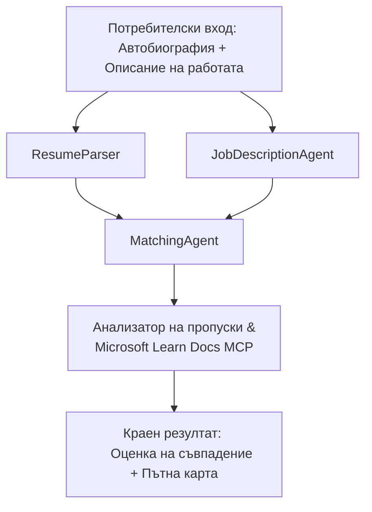

# PersonalCareerCopilot - Резюме → Оценка за пасване към работата

Мултиагентен работен процес, който оценява колко добре резюмето съответства на длъжностна характеристика и след това генерира персонализирана учебна пътна карта за запълване на пропуските.

---

## Агенти

| Агент | Роля | Инструменти |
|-------|------|-------------|
| **ResumeParser** | Извлича структурирани умения, опит, сертификати от текста на резюмето | - |
| **JobDescriptionAgent** | Извлича изисквани/предпочитани умения, опит, сертификати от JD | - |
| **MatchingAgent** | Сравнява профила спрямо изискванията → оценка за пасване (0-100) + намерени/липсващи умения | - |
| **GapAnalyzer** | Създава персонализирана учебна пътна карта с ресурси от Microsoft Learn | `search_microsoft_learn_for_plan` (MCP) |

## Работен процес


---

## Бърз старт

### 1. Настройка на средата

```powershell
cd workshop\lab02-multi-agent\PersonalCareerCopilot
python -m venv .venv
.\.venv\Scripts\Activate.ps1          # Windows PowerShell
# source .venv/bin/activate            # macOS / Linux
pip install -r requirements.txt
```

### 2. Конфигуриране на удостоверения

Копирайте примерния env файл и попълнете детайлите на вашия Foundry проект:

```powershell
cp .env.example .env
```

Редактирайте `.env`:

```env
PROJECT_ENDPOINT=https://<your-account>.services.ai.azure.com/api/projects/<your-project>
MODEL_DEPLOYMENT_NAME=gpt-4.1-mini
```

| Стойност | Къде да я намерите |
|----------|--------------------|
| `PROJECT_ENDPOINT` | Странична лента Microsoft Foundry във VS Code → щракнете с десен бутон върху проекта → **Copy Project Endpoint** |
| `MODEL_DEPLOYMENT_NAME` | Странична лента Foundry → разгънете проекта → **Models + endpoints** → име на разгръщането |

### 3. Стартирайте локално

```powershell
python -m debugpy --listen 127.0.0.1:5679 -m agentdev run main.py --verbose --port 8088
```

Или използвайте VS Code задача: `Ctrl+Shift+P` → **Tasks: Run Task** → **Run Lab02 HTTP Server**.

### 4. Тествайте с Agent Inspector

Отворете Agent Inspector: `Ctrl+Shift+P` → **Foundry Toolkit: Open Agent Inspector**.

Поставете този тестов промпт:

```
Resume:
Jane Doe
Senior Software Engineer with 5 years of experience in Python, Django, and AWS.
Built microservices handling 10K+ requests/second. Led a team of 4 developers.
Certifications: AWS Solutions Architect Associate.
Education: B.S. Computer Science, State University.

Job Description:
Senior Cloud Engineer at Contoso Ltd.
Required: Python, Azure, Kubernetes, Terraform, CI/CD pipelines.
Preferred: Go, monitoring (Prometheus/Grafana), cost optimization.
Experience: 5+ years in cloud infrastructure.
Certifications: Azure Solutions Architect Expert preferred.
```

**Очаквано:** Оценка за пасване (0-100), намерени/липсващи умения и персонализирана учебна пътна карта с URL адреси от Microsoft Learn.

### 5. Разгръщане във Foundry

`Ctrl+Shift+P` → **Microsoft Foundry: Deploy Hosted Agent** → изберете проекта → потвърдете.

---

## Структура на проекта

```
PersonalCareerCopilot/
├── .env.example        ← Template for environment variables
├── .env                ← Your credentials (git-ignored)
├── agent.yaml          ← Hosted agent definition (name, resources, env vars)
├── Dockerfile          ← Container image for Foundry deployment
├── main.py             ← 4-agent workflow (instructions, MCP tool, WorkflowBuilder)
└── requirements.txt    ← Python dependencies
```

## Ключови файлове

### `agent.yaml`

Дефинира хостван агент за Foundry Agent Service:
- `kind: hosted` - изпълнява се като управляван контейнер
- `protocols: [responses v1]` - предоставя HTTP endpoint `/responses`
- `environment_variables` - `PROJECT_ENDPOINT` и `MODEL_DEPLOYMENT_NAME` се инжектират при разгръщане

### `main.py`

Съдържа:
- **Инструкции за агенти** - четири константи `*_INSTRUCTIONS`, по една за всеки агент
- **MCP инструмент** - `search_microsoft_learn_for_plan()` извиква `https://learn.microsoft.com/api/mcp` чрез Streamable HTTP
- **Създаване на агенти** - `create_agents()` като контекстен мениджър с `AzureAIAgentClient.as_agent()`
- **Граф на работния процес** - `create_workflow()` използва `WorkflowBuilder`, за да свърже агентите с fan-out/fan-in/последователност
- **Стартиране на сървър** - `from_agent_framework(agent).run_async()` на порт 8088

### `requirements.txt`

| Пакет | Версия | Цел |
|-------|--------|-----|
| `agent-framework-azure-ai` | `1.0.0rc3` | Интеграция Azure AI за Microsoft Agent Framework |
| `agent-framework-core` | `1.0.0rc3` | Основен runtime (включва WorkflowBuilder) |
| `azure-ai-agentserver-agentframework` | `1.0.0b16` | Runtime за хостван агент сървър |
| `azure-ai-agentserver-core` | `1.0.0b16` | Основни абстракции за агент сървър |
| `debugpy` | latest | Отстраняване на грешки в Python (F5 във VS Code) |
| `agent-dev-cli` | `--pre` | Локален CLI за разработка + бекенд на Agent Inspector |

---

## Отстраняване на проблеми

| Проблем | Решение |
|---------|---------|
| `RuntimeError: Missing required environment variable(s)` | Създайте `.env` с `PROJECT_ENDPOINT` и `MODEL_DEPLOYMENT_NAME` |
| `ModuleNotFoundError: No module named 'agent_framework'` | Активирайте venv и стартирайте `pip install -r requirements.txt` |
| Липсват URL адреси от Microsoft Learn в изхода | Проверете интернет връзката към `https://learn.microsoft.com/api/mcp` |
| Само 1 карта за пропуски (съкратена) | Проверете дали `GAP_ANALYZER_INSTRUCTIONS` съдържа блока `CRITICAL:` |
| Порт 8088 е зает | Затворете други сървъри: `netstat -ano \| findstr :8088` |

За подробности при отстраняване на проблеми вижте [Модул 8 - Отстраняване на проблеми](../docs/08-troubleshooting.md).

---

**Пълно ръководство:** [Lab 02 Docs](../docs/README.md) · **Обратно към:** [Lab 02 README](../README.md) · [Начало на работилницата](../../../README.md)

---

<!-- CO-OP TRANSLATOR DISCLAIMER START -->
**Отказ от отговорност**:  
Този документ е преведен с помощта на AI преводаческа услуга [Co-op Translator](https://github.com/Azure/co-op-translator). Въпреки че се стремим към точност, моля имайте предвид, че автоматизираните преводи могат да съдържат грешки или неточности. Оригиналният документ на неговия роден език трябва да се счита за авторитетен източник. За критична информация се препоръчва професионален човешки превод. Ние не носим отговорност за никакви недоразумения или неправилни тълкувания, произтичащи от използването на този превод.
<!-- CO-OP TRANSLATOR DISCLAIMER END -->