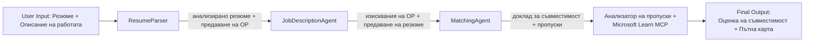

# PersonalCareerCopilot - Оценител на съвместимост между автобиография и работа

Работен процес с множество агенти, който оценява доколко автобиографията съответства на описанието на работата и след това създава персонализирана учебна пътека за запълване на пропуските.

---

## Агенти

| Агент | Роля | Инструменти |
|-------|------|-------|
| **ResumeParser** | Извлича структурирани умения, опит, сертификати от текст на автобиография | - |
| **JobDescriptionAgent** | Извлича изисквани/предпочитани умения, опит, сертификати от JD | - |
| **MatchingAgent** | Сравнява профила със изискванията → оценка за съвместимост (0-100) + съвпадащи/липсващи умения | - |
| **GapAnalyzer** | Създава персонализирана учебна пътека с ресурси от Microsoft Learn | `search_microsoft_learn_for_plan` (MCP) |

## Работен процес


```mermaid
flowchart LR
    UserInput["User Input: Резюме + Описание на работата"] --> ResumeParser
    ResumeParser -- "анализирано резюме + предаване на ОР" --> JobDescriptionAgent
    JobDescriptionAgent -- "изисквания на ОР + предаване на резюме" --> MatchingAgent
    MatchingAgent -- "доклад за съвместимост + пропуски" --> GapAnalyzerMCP["Анализатор на пропуски +\nMicrosoft Learn MCP"]
    GapAnalyzerMCP --> FinalOutput["Final Output:\nОценка на съвместимост + Пътна карта"]
```

---

## Бърз старт

### 1. Настройване на средата

Тази папка е референтната реализация за скелета на лаборатория 02 базиран на работен процес. Файлът `main.py` използва съществуващите блокове с подканващи текстове плюс `WorkflowBuilder` за свързване на четирите агенти заедно.

```powershell
cd workshop\lab02-multi-agent\PersonalCareerCopilot
python -m venv .venv
.\.venv\Scripts\Activate.ps1          # Windows PowerShell
# source .venv/bin/activate            # macOS / Linux
pip install -r requirements.txt
```

### 2. Конфигуриране на креденшъли

Създайте файл `.env` в тази папка:

```powershell
copy .env .env.bak 2>$null; echo $null > .env
```

Редактирайте `.env`:

```env
FOUNDRY_PROJECT_ENDPOINT=https://<your-account>.services.ai.azure.com/api/projects/<your-project>
AZURE_AI_MODEL_DEPLOYMENT_NAME=gpt-4.1-mini
```

| Стойност | Къде да я намерите |
|-------|------------------|
| `FOUNDRY_PROJECT_ENDPOINT` | Sidebar в Foundry Toolkit → десен бутон върху вашия проект → **Copy Project Endpoint** |
| `AZURE_AI_MODEL_DEPLOYMENT_NAME` | Sidebar в Foundry → разгънете проекта → **Models + endpoints** → име на deployment |

### 3. Стартирайте локално

```powershell
python -m debugpy --listen 127.0.0.1:5679 main.py --port 8088
```

Или използвайте задачата на VS Code: `Ctrl+Shift+P` → **Tasks: Run Task** → **Run Agent HTTP Server**.

За дебъгване с F5 използвайте **Debug Local Agent HTTP Server**.

### 4. Тествайте с Agent Inspector

Отворете Agent Inspector: `Ctrl+Shift+P` → **Foundry Toolkit: Open Agent Inspector**.

Поставете този тестов подканващ текст:

```
Resume:
Jane Doe
Senior Software Engineer with 5 years of experience in Python, Django, and AWS.
Built microservices handling 10K+ requests/second. Led a team of 4 developers.
Certifications: AWS Solutions Architect Associate.
Education: B.S. Computer Science, State University.

Job Description:
Senior Cloud Engineer at Contoso Ltd.
Required: Python, Azure, Kubernetes, Terraform, CI/CD pipelines.
Preferred: Go, monitoring (Prometheus/Grafana), cost optimization.
Experience: 5+ years in cloud infrastructure.
Certifications: Azure Solutions Architect Expert preferred.
```

**Очаквано:** Оценка за съвместимост (0-100), съвпадащи/липсващи умения и персонализирана учебна пътека с URL адреси от Microsoft Learn.

### 5. Деплойване във Foundry

`Ctrl+Shift+P` → **Foundry Toolkit: Deploy Hosted Agent** → изберете проекта си → потвърдете.

---

## Структура на проекта

```
PersonalCareerCopilot/
├── .env                ← Your credentials (git-ignored)
├── agent.yaml          ← Hosted agent definition (name, resources, env vars)
├── Dockerfile          ← Container image for Foundry deployment
├── main.py             ← 4-agent workflow (instructions, MCP tool, WorkflowBuilder)
└── requirements.txt    ← Python dependencies
```

## Ключови файлове

### `agent.yaml`

Дефинира хоствания агент за Foundry Agent Service:
- `kind: hosted` - работи като управляван контейнер
- `protocols` - протокол `responses` с `version: 1.0.0`, експонирайки HTTP endpoint `/responses`
- `environment_variables` - тук се декларира `AZURE_AI_MODEL_DEPLOYMENT_NAME`; `FOUNDRY_PROJECT_ENDPOINT` се вгражда автоматично при деплойване

### `main.py`

Съдържа:
- **Инструкции за агентите** - четири константи `*_INSTRUCTIONS`, една за всеки агент
- **Инструмент MCP** - `search_microsoft_learn_for_plan()` извиква `https://learn.microsoft.com/api/mcp` чрез Streamable HTTP
- **Създаване на агенти** - четири инстанции `Agent()` + `AgentExecutor()` споделящи един `FoundryChatClient`
- **Граф на работния процес** - `WorkflowBuilder` свързва агентите като последователна линия: ResumeParser → JD Agent → MatchingAgent → GapAnalyzer
- **Стартиране на сървър** - `ResponsesHostServer` работи на порт 8088

### `requirements.txt`

| Пакет | Цел |
|---------|----------|
| `agent-framework-foundry` | Основна среда за изпълнение: `Agent`, `AgentExecutor`, `WorkflowBuilder`, `@tool`, `FoundryChatClient` |
| `agent-framework-foundry-hosting` | `ResponsesHostServer` + интеграция с Foundry хостинг |
| `mcp<2,>=1.24.0` | MCP клиент за GapAnalyzer (`streamable_http_client`) |
| `debugpy` | Отстраняване на грешки в Python (F5 във VS Code) |

---

## Отстраняване на проблеми

| Проблем | Решение |
|-------|-----|
| `KeyError: 'FOUNDRY_PROJECT_ENDPOINT'` или `KeyError: 'AZURE_AI_MODEL_DEPLOYMENT_NAME'` | Създайте `.env` с настроени и `FOUNDRY_PROJECT_ENDPOINT`, и `AZURE_AI_MODEL_DEPLOYMENT_NAME` |
| `ModuleNotFoundError: No module named 'agent_framework'` | Активирайте venv и стартирайте `pip install -r requirements.txt` |
| Липсват URL адреси от Microsoft Learn в изхода | Проверете връзката с интернет към `https://learn.microsoft.com/api/mcp` |
| Само 1 карта с пропуски (отрязан) | Уверете се, че `GAP_ANALYZER_INSTRUCTIONS` включва блока `CRITICAL:` |
| Порт 8088 е зает | Затворете други сървъри: `netstat -ano \| findstr :8088` |

За подробна информация при отстраняване на проблеми вижте [Модул 8 - Отстраняване на проблеми](../docs/08-troubleshooting.md).

---

**Пълен walkthrough:** [Lab 02 Docs](../docs/README.md) · **Обратно към:** [Lab 02 README](../README.md) · [Начало на workshop](../../../README.md)

---

<!-- CO-OP TRANSLATOR DISCLAIMER START -->
**Отказ от отговорност**:
Този документ е преведен с помощта на AI преводачески услуга [Co-op Translator](https://github.com/Azure/co-op-translator). Въпреки че се стремим към точност, моля имайте предвид, че автоматизираните преводи могат да съдържат грешки или неточности. Оригиналният документ на неговия роден език трябва да се счита за авторитетен източник. За критична информация се препоръчва професионален човешки превод. Ние не носим отговорност за каквито и да е недоразумения или неправилни тълкувания, произтичащи от използването на този превод.
<!-- CO-OP TRANSLATOR DISCLAIMER END -->