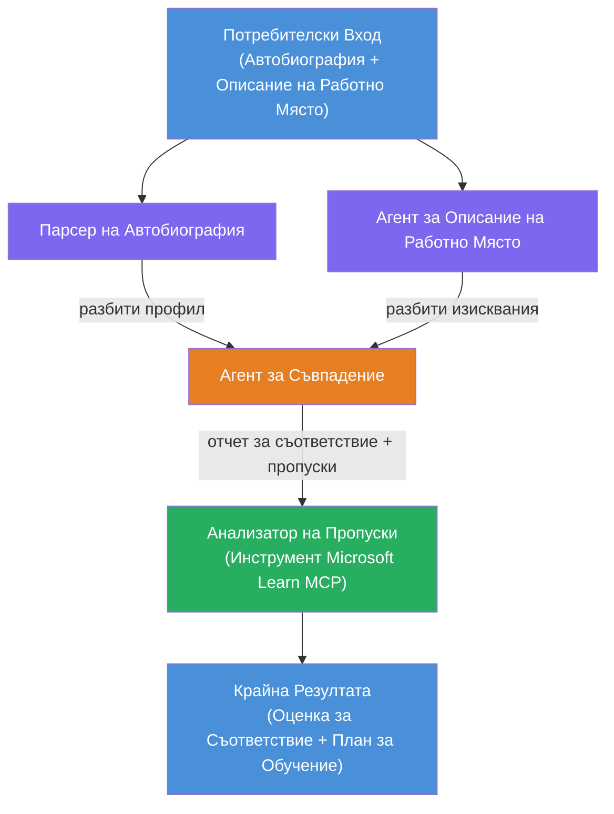

# Лаборатория 02 - Многоагентен работен процес: Оценител на съвместимост между автобиография и работна позиция

---

## Какво ще създадете

**Оценител на съвместимост между автобиография и работна позиция** – многоагентен работен процес, в който четири специализирани агенти си сътрудничат, за да оценят доколко автобиографията на кандидат отговаря на описанието на работната позиция, и след това генерират персонализиран план за обучение за запълване на пропуските.

### Агентите

| Агент | Роля |
|-------|------|
| **Resume Parser** | Извлича структурирани умения, опит, сертификати от текста на автобиографията |
| **Job Description Agent** | Извлича изискваните/предпочитаните умения, опит, сертификати от описанието на работната позиция |
| **Matching Agent** | Сравнява профила с изискванията → оценка на съвместимост (0-100) + съвпадащи/липсващи умения |
| **Gap Analyzer** | Изгражда персонализиран план за обучение с ресурси, срокове и проекти за бързи резултати |

### Демонстрационен ход

Качете **автобиография + описание на работната позиция** → получете **оценка на съвместимост + липсващи умения** → получите **персонализиран план за обучение**.

### Архитектура на работния процес

> Лилаво = паралелни агенти | Оранжево = точка на агрегиране | Зелено = финален агент с инструменти. Вижте [Модул 1 - Разбиране на архитектурата](docs/01-understand-multi-agent.md) и [Модул 4 - Шаблони за оркестрация](docs/04-orchestration-patterns.md) за подробни диаграми и поток на данни.

### Покрити теми

- Създаване на многоагентен работен процес с помощта на **WorkflowBuilder**
- Дефиниране на роли на агентите и оркестрационен поток (паралелен + последователен)
- Патерни за комуникация между агенти
- Локално тестване с Agent Inspector
- Деплойване на многоагентни работни процеси към Foundry Agent Service

---

## Предварителни условия

Първо завършете Лаборатория 01:

- [Лаборатория 01 - Един агент](../lab01-single-agent/README.md)

---

## Започнете

Вижте пълните инструкции за настройка, преглед на кода и команди за тест в:

- [Документи Лаб 2 - Предварителни условия](docs/00-prerequisites.md)
- [Документи Лаб 2 - Пълен учебен път](docs/README.md)
- [Ръководство за изпълнение на PersonalCareerCopilot](PersonalCareerCopilot/README.md)

## Оркестрационни шаблони (агентски алтернативи)

Лаб 2 включва стандартния поток **паралелен → агрегатор → планировчик**, а документацията
описва и алтернативни шаблони за демонстриране на по-силно агентско поведение:

- **Fan-out/Fan-in с претеглен консенсус**
- **Преглед/критика преди финалния план**
- **Условен маршрутизатор** (избор на път въз основа на оценка на съвместимост и липсващи умения)

Вижте [docs/04-orchestration-patterns.md](docs/04-orchestration-patterns.md).

---

**Предишна:** [Лаборатория 01 - Един агент](../lab01-single-agent/README.md) · **Обратно към:** [Начало на работилницата](../../README.md)

---

<!-- CO-OP TRANSLATOR DISCLAIMER START -->
**Отказ от отговорност**:  
Този документ е преведен с помощта на AI преводаческа услуга [Co-op Translator](https://github.com/Azure/co-op-translator). Въпреки че се стремим към точност, моля имайте предвид, че автоматизираните преводи могат да съдържат грешки или неточности. Оригиналният документ на неговия език трябва да се счита за официален източник. За критична информация се препоръчва професионален човешки превод. Ние не носим отговорност за никакви недоразумения или погрешни тълкувания, произтичащи от използването на този превод.
<!-- CO-OP TRANSLATOR DISCLAIMER END -->