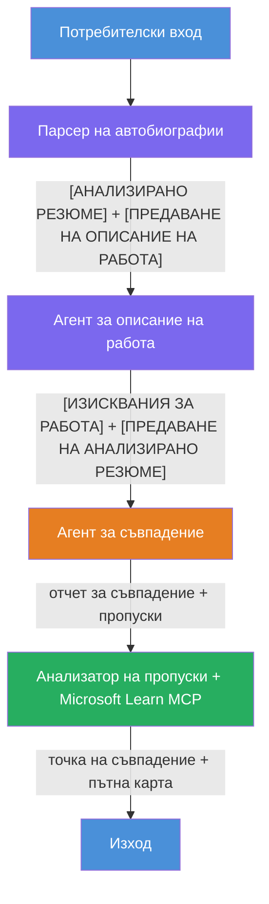

# Лабораторно упражнение 02 - Многoагентен работен процес: Оценител на съвместимост между автобиография и работна позиция

## Преглед

В това практическо упражнение ще изградите **многoагентско приложение, базирано на работен процес**, използвайки Foundry Toolkit във VS Code и ще го разположите в Microsoft Foundry Agent Service.

**Какво ще изградите:** Оценител на съвместимост между автобиография и работна позиция, който анализира автобиография и описание на работата, оценява съвпадението и създава персонализирана учебна пътека с използване на ресурси от Microsoft Learn.

---

## Архитектура

```mermaid
flowchart TD
    A["Потребителски вход"] --> B["Парсер на автобиографии"]
    B -->|"[АНАЛИЗИРАНО РЕЗЮМЕ] + [ПРЕДАВАНЕ НА ОПИСАНИЕ НА РАБОТА]"| C["Агент за описание на работа"]
    C -->|"[ИЗИСКВАНИЯ ЗА РАБОТА] + [ПРЕДАВАНЕ НА АНАЛИЗИРАНО РЕЗЮМЕ]"| D["Агент за съвпадение"]
    D -->|отчет за съвпадение + пропуски| E["Анализатор на пропуски + Microsoft Learn MCP"]
    E -->|точка на съвпадение + пътна карта| F["Изход"]

    style A fill:#4A90D9,color:#fff
    style B fill:#7B68EE,color:#fff
    style C fill:#7B68EE,color:#fff
    style D fill:#E67E22,color:#fff
    style E fill:#27AE60,color:#fff
    style F fill:#4A90D9,color:#fff
```

**Как работи:**
1. Потребителят поставя автобиография и описание на работна позиция.
2. **ResumeParser** анализира автобиографията и копира описанието на работата без промяна в секцията `[JOB DESCRIPTION PASS-THROUGH]`.
3. **JD Agent** извлича структурирани изисквания от описанието и предава `[PARSED RESUME]` като `[PARSED RESUME PASS-THROUGH]`.
4. **MatchingAgent** сравнява `[PARSED RESUME PASS-THROUGH]` с `[JD REQUIREMENTS]` и генерира оценка за съвместимост.
5. **GapAnalyzer** преобразува пропуските в практическа учебна пътека и извлича реални връзки към Microsoft Learn чрез MCP.

---

## Необходими условия

Първо завършете Лабораторно упражнение 01:

- [Лаб 01 - Едностранен агент](../lab01-single-agent/README.md)

---

## Част 1: Прочетете модулите в ред

Вижте пълния учебен път в:

- [Лаб 2 Документи - Необходими условия](docs/00-prerequisites.md)
- [Лаб 2 Документи - Пълен учебен път](docs/README.md)
- [Ръководство за работа с PersonalCareerCopilot](PersonalCareerCopilot/README.md)

---

## Част 2: Изградете и тествайте работния процес

1. Използвайте мастъра на Foundry Toolkit за създаване на каркас на проекта, базиран на работен процес.
2. Копирайте блоковете с подсказки и диаграмата на работния процес от `PersonalCareerCopilot/main.py` във вашето работно пространство.
3. Стартирайте локално с Agent Inspector и проверете всички четири агенти плюс MCP инструмента.
4. Разположете хоствания агент в Foundry след успешно локално тестване.

---

## Организационни модели

Лаб 02 включва стандартния **fan-out → fan-in → последователен** поток, а документите описват и алтернативни организационни модели за експериментиране.

- **Fan-out/Fan-in с претеглен консенсус**
- **Преглед/критика преди финалната учебна пътека**
- **Условен маршрутизатор** базиран на оценката за съвместимост и липсващите умения

Вижте [docs/04-orchestration-patterns.md](docs/04-orchestration-patterns.md).

---

**Предишно:** [Лаб 01 - Едностранен агент](../lab01-single-agent/README.md) · **Обратно към:** [Начало на работилницата](../../README.md)

---

<!-- CO-OP TRANSLATOR DISCLAIMER START -->
**Отказ от отговорност**:
Този документ е преведен с помощта на AI преводачески услуга [Co-op Translator](https://github.com/Azure/co-op-translator). Въпреки че се стремим към точност, моля имайте предвид, че автоматизираните преводи могат да съдържат грешки или неточности. Оригиналният документ на неговия роден език трябва да се счита за авторитетен източник. За критична информация се препоръчва професионален човешки превод. Ние не носим отговорност за каквито и да е недоразумения или неправилни тълкувания, произтичащи от използването на този превод.
<!-- CO-OP TRANSLATOR DISCLAIMER END -->