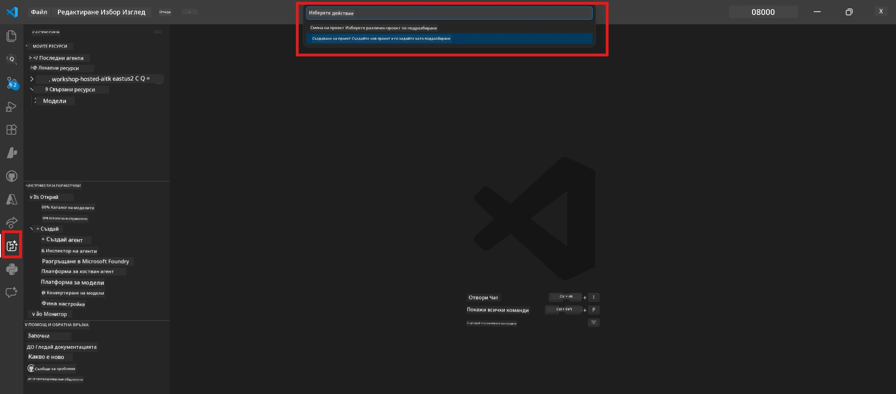

# Module 0 - Изисквания

Преди да започнете Лабораторно упражнение 02, уверете се, че сте изпълнили следното. Това упражнение надгражда директно върху Лабораторно упражнение 01 – не го пропускайте.

---

## 1. Завършете Лабораторно упражнение 01

Лабораторно упражнение 02 предполага, че вече сте:

- [x] Завършили всичките 8 модула на [Лабораторно упражнение 01 - Един агент](../../lab01-single-agent/README.md)
- [x] Успешно сте разположили един агент в Foundry Agent Service
- [x] Проверили сте, че агентът работи както в локалния Agent Inspector, така и в Foundry Playground

Ако не сте завършили Лабораторно упражнение 01, върнете се и го завършете сега: [Лабораторно упражнение 01 Документи](../../lab01-single-agent/docs/00-prerequisites.md)

---

## 2. Проверете съществуващата конфигурация

Всички инструменти от Лабораторно упражнение 01 трябва да са инсталирани и работещи. Изпълнете тези бързи проверки:

### 2.1 Azure CLI

```powershell
az account show --query "{name:name, id:id}" --output table
```

Очаквано: Показва името на вашия абонамент и неговото ID. Ако това не се случи, изпълнете [`az login`](https://learn.microsoft.com/cli/azure/authenticate-azure-cli-interactively).

### 2.2 Разширения за VS Code

1. Натиснете `Ctrl+Shift+P` → напишете **"Microsoft Foundry"** → потвърдете, че виждате команди (например, `Microsoft Foundry: Create a New Hosted Agent`).
2. Натиснете `Ctrl+Shift+P` → напишете **"Foundry Toolkit"** → потвърдете, че виждате команди (например, `Foundry Toolkit: Open Agent Inspector`).

### 2.3 Foundry проект и модел

1. Кликнете върху иконата на **Microsoft Foundry** в лентата с активностите на VS Code.
2. Потвърдете, че вашият проект е изброен (например, `workshop-agents`).
3. Разгърнете проекта → проверете дали има разположен модел (например, `gpt-4.1-mini`) със статус **Succeeded**.

> **Ако разполагането на вашия модел е изтекло:** Някои безплатни разполагания изтичат автоматично. Разположете отново от [Каталог на моделите](https://learn.microsoft.com/azure/foundry/foundry-models/concepts/models-sold-directly-by-azure) (`Ctrl+Shift+P` → **Microsoft Foundry: Open Model Catalog**).



### 2.4 RBAC роли

Проверете дали имате ролята **Azure AI User** в Foundry проекта си:

1. [Azure Portal](https://portal.azure.com) → вашият Foundry **проект** ресурс → **Контрол на достъпа (IAM)** → **[Разпределение на роли](https://learn.microsoft.com/azure/foundry/concepts/rbac-foundry)** таб.
2. Потърсете своето име → потвърдете, че **[Azure AI User](https://aka.ms/foundry-ext-project-role)** е посочена.

---

## 3. Разберете концепциите за мултиагентна работа (нова за Лабораторно упражнение 02)

Лабораторно упражнение 02 въвежда нови концепции, които не са разглеждани в Лабораторно упражнение 01. Прочетете ги преди да продължите:

### 3.1 Какво е мултиагентен работен процес?

Вместо един агент, който обработва всичко, **мултиагентният работен процес** разделя работата между няколко специализирани агента. Всеки агент има:

- Собствени **инструкции** (системно подканяне)
- Собствена **роля** (отговорности)
- Допълнителни **инструменти** (функции, които може да извиква)

Агентите комуникират чрез **оркестрационна графика**, която дефинира как данните се пренасят между тях.

### 3.2 WorkflowBuilder

Класът [`WorkflowBuilder`](https://learn.microsoft.com/agent-framework/workflows/agents-in-workflows) от `agent_framework` е SDK компонентът, който свързва агентите:

```python
from agent_framework import WorkflowBuilder

workflow = (
    WorkflowBuilder(
        name="MyWorkflow",
        start_executor=agent_a,
        output_executors=[agent_d],
    )
    .add_edge(agent_a, agent_b)
    .add_edge(agent_a, agent_c)
    .add_edge(agent_b, agent_d)
    .add_edge(agent_c, agent_d)
    .build()
)
```

- **`start_executor`** - Първият агент, който получава входа от потребителя
- **`output_executors`** - Агент(и), чиито изходи стават крайния отговор
- **`add_edge(source, target)`** - Дефинира, че `target` получава изхода на `source`

### 3.3 MCP (Model Context Protocol) инструменти

Лабораторно упражнение 02 използва **MCP инструмент**, който извиква Microsoft Learn API за извличане на учебни ресурси. [MCP (Model Context Protocol)](https://modelcontextprotocol.io/introduction) е стандартизиран протокол за свързване на AI модели към външни източници на данни и инструменти.

| Термин | Дефиниция |
|------|-----------|
| **MCP сървър** | Услуга, която предоставя инструменти/ресурси през [MCP протокола](https://learn.microsoft.com/azure/foundry/agents/how-to/tools/model-context-protocol) |
| **MCP клиент** | Вашият агентен код, който се свързва към MCP сървър и извиква неговите инструменти |
| **[Streamable HTTP](https://learn.microsoft.com/agent-framework/agents/tools/hosted-mcp-tools)** | Транспортният метод, използван за комуникация със MCP сървъра |

### 3.4 Как Лабораторно упражнение 02 се различава от Лабораторно упражнение 01

| Аспект | Лаб 01 (Един агент) | Лаб 02 (Мултиагент) |
|--------|----------------------|---------------------|
| Агенти | 1 | 4 (специализирани роли) |
| Оркестрация | Липсва | WorkflowBuilder (паралелна + последователна) |
| Инструменти | Опционална `@tool` функция | MCP инструмент (външно API извикване) |
| Сложност | Просто подканяне → отговор | Автобиография + JD → оценка за съвместимост → план |
| Поток на контекст | Директен | Прехвърляне между агенти |

---

## 4. Структура на репозитория за Лабораторно упражнение 02

Уверете се, че знаете къде се намират файловете за Лабораторно упражнение 02:

```
workshop/
└── lab02-multi-agent/
    ├── README.md                       ← Lab overview
    ├── docs/                           ← You are here
    │   ├── README.md                   ← Learning path index
    │   ├── 00-prerequisites.md         ← This file
    │   ├── 01-understand-multi-agent.md
    │   ├── ...
    │   └── 08-troubleshooting.md
    └── PersonalCareerCopilot/          ← The agent project
        ├── agent.yaml                  ← Agent definition
        ├── main.py                     ← 4-agent workflow code
        ├── Dockerfile                  ← Container configuration
        └── requirements.txt            ← Python dependencies
```

---

### Контролна точка

- [ ] Лаб 01 е напълно завършен (всички 8 модула, агент разположен и проверен)
- [ ] `az account show` връща вашия абонамент
- [ ] Разширенията Microsoft Foundry и Foundry Toolkit са инсталирани и работят
- [ ] Проектът в Foundry има разположен модел (например, `gpt-4.1-mini`)
- [ ] Имате ролята **Azure AI User** в проекта
- [ ] Прочели сте секцията за мултиагентните концепции по-горе и разбирате WorkflowBuilder, MCP и оркестрацията на агенти

---

**Напред:** [01 - Разберете мултиагентната архитектура →](01-understand-multi-agent.md)

---

<!-- CO-OP TRANSLATOR DISCLAIMER START -->
**Отказ от отговорност**:  
Този документ е преведен с помощта на AI преводаческия сервиз [Co-op Translator](https://github.com/Azure/co-op-translator). Въпреки че се стремим към точност, моля, имайте предвид, че автоматичните преводи могат да съдържат грешки или неточности. Оригиналният документ на неговия изходен език трябва да се счита за авторитетен източник. За критична информация се препоръчва професионален човешки превод. Не носим отговорност за каквито и да е недоразумения или неправилни тълкувания, произтичащи от използването на този превод.
<!-- CO-OP TRANSLATOR DISCLAIMER END -->