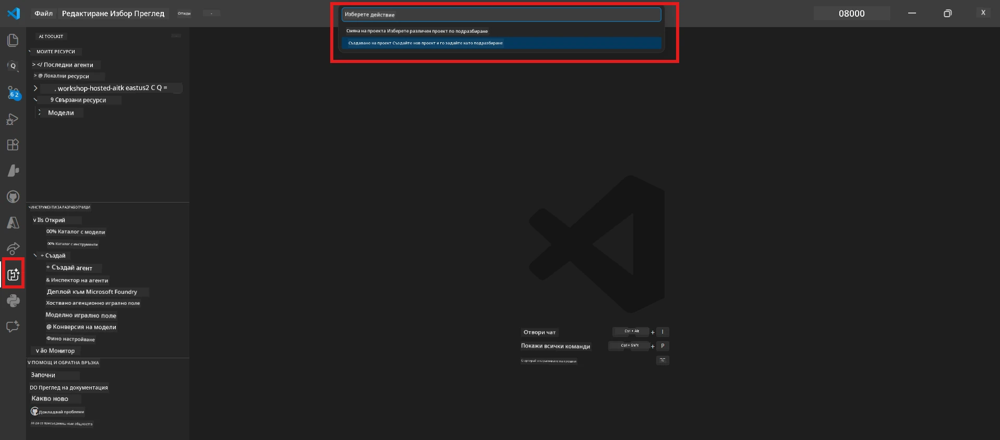

# Модул 0 - Въведение

⏱️ ~10 минути

> [!WARNING]
> **Преглед и ограничения:** [Хоствани агенти](https://learn.microsoft.com/azure/foundry/agents/concepts/hosted-agents) в момента са в **обществен преглед** - не се препоръчват за производствени натоварвания. Някои функции, показани в този урок, може да се променят с напредъка към GA.

## Какво ще изградите

В тази лабораторна работа разширявате уменията на един агент от Лаб 01, за да изградите **многокраен работен поток** - Оценител на съвпадението на автобиографията с работата.

Вмъквате **автобиография** и **описание на работата**. Четири специализирани агенти обработват входа последователно и след това връщат:
- Оценка на съвпадението (0–100 с разбивка на оценките)
- Списък на пропуснати умения и сертификати
- Персонализиран учебен път със реални връзки към Microsoft Learn за всяка пропусната област

**Работният поток използва:**
- **Microsoft Agent Framework** - `WorkflowBuilder` за последователно оркестриране на поточна линия
- **Foundry Toolkit за VS Code** - скелет, локално тестване, разгръщане
- **Модел за изкуствен интелект** (например, `gpt-4.1-mini`) - използван от всички четири агенти
- **Microsoft Learn MCP сървър** - предоставя реални връзки към учебни ресурси за всяка пропусната умение

---

## Изберете своя път

> ⚠️ **Продължете със същия път, който използвахте в Лаб 01.**

<details open>
<summary><strong>🅰️ Път А - Azure облак (изисква абонамент за Azure)</strong></summary>

| | Подробности |
|---|---|
| **За кого е?** | Вие сте завършили Лаб 01 с помощта на абонамент за Azure |
| **Модел** | Azure OpenAI чрез Foundry (напр. `gpt-4.1-mini`) |
| **Обхванати модули** | Всички модули (00–09) |
| **Разгръщане в облака?** | ✅ Да - пълно разгръщане от край до край |

</details>

<details open>
<summary><strong>🅱️ Път Б - Foundry Local (не е необходим абонамент за Azure)</strong></summary>

| | Подробности |
|---|---|
| **За кого е?** | Вие сте завършили Лаб 01, използвайки Foundry Local |
| **Модел** | Foundry Local (безплатен, работи на вашия компютър) |
| **Обхванати модули** | Модули 00–05 (пропуснете 06–07 - разгръщане и потвърждение в облака) |
| **Разгръщане в облака?** | ❌ Не - само локално тестване чрез Agent Inspector |

</details>

---

## Проверка на Лаб 01

Лаб 02 се базира директно на Лаб 01. Първо завършете Лаб 01 преди да започнете тук.

Все още не сте направили Лаб 01? Започнете тук: [Лаб 01 - Въведение](../../lab01-single-agent/docs/00-prerequisites.md)

<details open>
<summary><strong>🅰️ Път А - Azure облак</strong></summary>

```powershell
az account show --query "{name:name, id:id}" --output table
```

Ако това се провали, изпълнете `az login`. След това проверете във VS Code:

1. `Ctrl+Shift+P` → напишете **Foundry Toolkit** → потвърдете, че командите се появяват.
2. Кликнете на иконата **Foundry Toolkit** → вашият проект и разгръщаният модел показват **Succeeded**.



> **RBAC:** Вие сте назначили ролята **Foundry User** в Лаб 01. Ако трябва да я назначите отново, вижте [Лаб 01, Модул 1](../../lab01-single-agent/docs/01-setup.md#deploy-a-model--assign-rbac). Ролята по-рано се е наричала **Azure AI User** - със същите разрешения.

</details>

<details open>
<summary><strong>🅱️ Път Б - Foundry Local</strong></summary>

```powershell
Invoke-WebRequest -Uri "http://localhost:5273/v1/health" -UseBasicParsing | Select-Object StatusCode
```

Очаквано: `StatusCode: 200`. Ако не, рестартирайте Foundry Local от страничната лента на Foundry Toolkit.

> Всички изводи се изпълняват на вашата машина. Единственото изходящо повикване е инструментът MCP към `https://learn.microsoft.com/api/mcp`.

</details>

---

## Какво е новото в Лаб 02

| | Лаб 01 | Лаб 02 |
|--|--------|--------|
| Агенти | 1 | 4 (свързани с WorkflowBuilder) |
| Шаблон за скелет | Основен - Agent Framework | Работни потоци - Agent Framework |
| Нов пакет | - | `mcp` |
| Оркестрация | Един разговорен агент | Последователна поточна линия (WorkflowBuilder) |
| Нов инструмент | - | `search_microsoft_learn_for_plan` (MCP) |

---

**Следващо:** [01 - Разбиране на архитектурата →](01-understand-multi-agent.md)

---

<!-- CO-OP TRANSLATOR DISCLAIMER START -->
**Отказ от отговорност**:
Този документ е преведен с помощта на AI преводачески услуга [Co-op Translator](https://github.com/Azure/co-op-translator). Въпреки че се стремим към точност, моля имайте предвид, че автоматизираните преводи могат да съдържат грешки или неточности. Оригиналният документ на неговия роден език трябва да се счита за авторитетен източник. За критична информация се препоръчва професионален човешки превод. Ние не носим отговорност за каквито и да е недоразумения или неправилни тълкувания, произтичащи от използването на този превод.
<!-- CO-OP TRANSLATOR DISCLAIMER END -->